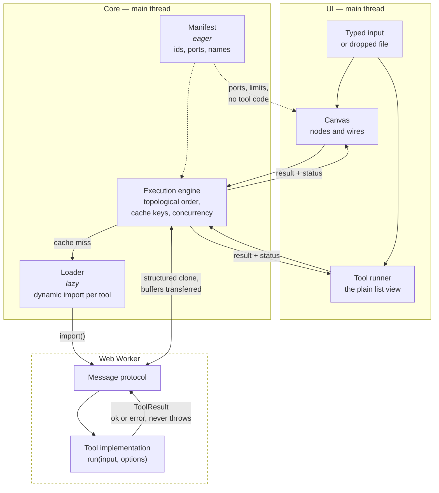
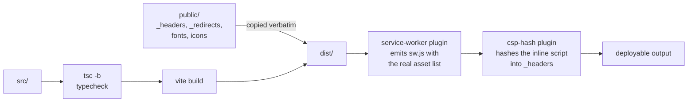

# Architecture

How a value gets from a text box to a result, and why the pieces are split the
way they are.

- [The shape of it](#the-shape-of-it)
- [The registry](#the-registry)
- [The execution engine](#the-execution-engine)
- [The worker boundary](#the-worker-boundary)
- [Incremental caching](#incremental-caching)
- [The canvas](#the-canvas)
- [The node inspector](#the-node-inspector)
- [The tool runner page](#the-tool-runner-page)
- [Between tools](#between-tools)
- [State](#state)
- [Build and deployment](#build-and-deployment)

## The shape of it



Two things are load-bearing in that picture:

1. **The manifest is eager; implementations are not.** The canvas, the search
   box and the port-compatibility checks all need to reason about tools without
   loading a single line of their code.
2. **Nothing crosses the worker boundary as an exception.** A tool returns a
   `ToolResult` describing success or failure. A thrown error is a bug in the
   harness, not a way to report bad input.

## The registry

Two files describe every tool, and a test stops them disagreeing.

[`manifest.ts`](../src/features/registry/manifest.ts) holds the eager half: id,
name, summary, category, keywords, input and output ports, execution strategy,
size limits, and which option keys hold secrets. It is in the initial bundle.

[`loader.ts`](../src/features/registry/loader.ts) maps each id to a dynamic
`import()`. Each tool is therefore its own chunk, fetched when a node is added
or a tool page is opened.

`registry.test.ts` loads every implementation for real and asserts the two
descriptions agree — so a port added to a tool but not to its manifest entry
fails the build rather than producing a node with a missing socket.

### Ports are checked at compile time

A tool's `run` signature is _derived from_ its declared ports:

```ts
// A tool declaring a `bytes` input cannot be implemented with a function
// that expects a string — the type of `run` is computed from `inputs`.
type RunFor<T extends ToolSpec> = (
  input: InputsOf<T>,
  options: OptionsOf<T>,
) => Promise<ToolResult<OutputsOf<T>>>;
```

See [`types.ts`](../src/features/registry/types.ts). The practical effect is
that port compatibility is not a runtime string comparison that someone has to
remember to write — the compiler already refused the mismatch.

## The execution engine

Given a graph, the engine:

1. **Sorts it** into dependency order, rejecting cycles.
2. **Diffs it** against the previous run's cache keys (below).
3. **Runs what changed**, with independent branches executing concurrently up
   to a bound of 4.
4. **Reports per node**, not per graph.

Statuses are deliberately distinct:

| Status            | Means                                                                                                                   |
| ----------------- | ----------------------------------------------------------------------------------------------------------------------- |
| `blocked`         | A required input has neither a wire nor typed text. This is the normal state while you are still wiring, not an error.  |
| `error`           | This node failed. It shows why.                                                                                         |
| `upstream-failed` | Something this node depends on failed. It points back at the node that actually broke, rather than repeating the error. |
| `ok`              | Ran, produced output.                                                                                                   |
| `idle`            | Has not run. Also where a node goes when a run is **cancelled** — see below.                                            |

Runs are bounded at 100 nodes: beyond that the run is refused rather than
wedging the tab.

### What the concurrency bound is actually for

There is **one worker, and one thread behind it**. Four concurrent nodes are
not four cores; they are four messages in one queue. So the bound is not about
parallel CPU at all — raising it would not make a pipeline faster. What it buys
is that the worker's queue is never empty (its next tool's `import()` overlaps
the current tool's work) and that a main-thread tool can run while worker tools
are in flight.

What it costs is memory: every in-flight node's inputs are cloned into the
worker, so a large bound means several multi-megabyte intermediates alive at
once, and a longer wait in the queue for each. Four keeps the pipe full at a
small, bounded footprint. It is a scheduling decision, not a parallelism one,
and the earlier description of it here — "four workers' worth of work" — was
simply wrong.

### A deadline measures a tool's own work

The worker sends `started` between importing a tool and running it, and the
engine restarts that request's deadline when it arrives.

This matters because of the paragraph above: several requests posted together
are a queue, and timing a request from the moment it was _posted_ spent its
deadline on other tools' work. A regex node's 2 second limit, queued behind an
image conversion, reported a timeout for work it had not begun.

The timer armed at post time is not simply cancelled, because a request the
worker never acknowledges at all — the worker wedged before reaching it — still
has to fail rather than hang. The practical guarantee is therefore: **at most
`timeoutMs` waiting, then `timeoutMs` running.**

### One node's timeout, and everything else in flight

A wedged synchronous tool cannot be interrupted from inside. The only remedy is
to destroy the worker and build a new one — and that takes down every _other_
request that happened to be in flight.

Those requests are **replayed onto the fresh worker**, not failed. A tool is a
pure function of its inputs and options, so running it again produces the answer
it would have produced, and reporting a failure on a node the user did nothing
to is the outcome worth avoiding. A base64 node beside a runaway regex used to
sit there for its own full 15 seconds and then report a timeout it never had.

Replay is refused in exactly two cases, both deliberate:

- **The request's buffers were transferred.** They are detached in the sender,
  so a replay would post zero-length views and compute a confident wrong answer
  — worse than the error it was avoiding. In practice nothing in the app
  transfers (see below), so this is a guard rather than a live path.
- **It has already been replayed once.** Otherwise two tools that both wedge
  would loop, rebuilding a worker for the same doomed request forever.

A worker `error` event is treated differently: nothing is replayed. A timeout
tells us exactly which tool misbehaved and that the others were innocent; an
`error` says the worker itself is broken, and a fresh worker built from the same
code would break the same way.

`scripts/cross-browser-check.mjs` drives this in both engines with a real
pattern that really does wedge a real worker. jsdom has no Worker, so the unit
suite can only assert it against a main-thread stand-in.

### Cancellation is not a result

A cancelled node returns to `idle`. It did not fail and it did not run, and
nothing about it is written to the cache.

That last clause is the whole point. A cancellation used to be stored like any
other error, under a key computed from a document that had not changed — so the
next run was a cache **hit**, and the node reported "Cancelled." forever without
ever executing again. Editing the node was the only way out, and nothing on
screen said so.

## The worker boundary

Tools with `strategy: 'worker'` run off the main thread. The protocol is a
small tagged union — request, result, error — and the engine owns a single
shared worker rather than spawning one per run.

Binary payloads are `Uint8Array` or `Blob`, never base64 strings internally.
Base64 is a display format; using it as a transport triples memory and costs a
copy in each direction.

Buffers travel in one direction transferred and in the other copied, and the
asymmetry is the point.

**Outputs are transferred** back from the worker: nothing in there reuses them,
so moving ownership is free. **Inputs are borrowed** — structured cloned — from
every call site in the app, because on a canvas one output feeds several
inputs, and a transferred buffer would be detached by whichever consumer ran
first, leaving the rest with a zero-length view and no error to explain it.
`ownership: 'transfer'` exists for a caller that can prove single consumption;
nothing currently passes it.

A detached buffer produces a zero-length result several steps later, which is a
miserable thing to debug, so the fan-out case is asserted on the actual bytes
rather than on the shape of the result — twelve consumers, past the concurrency
bound, each checked against a known digest.

Where `OffscreenCanvas` is unavailable, image work falls back to the main
thread and produces an identical result. `scripts/cross-browser-check.mjs`
asserts which branch was actually taken, so the fallback cannot rot unnoticed.

## Incremental caching

Each node has a cache key built from:

- its tool id,
- its options,
- its typed input, and
- **for each wire arriving at it: which input port it arrives at, which output
  port it leaves from, and the upstream node's cache key — never its value.**

That last choice is the whole point. Comparing upstream _keys_ is O(1)
whatever the data is, so a 30 MB decoded file never has to be hashed to know
whether it changed. Hashing values would make every run cost a pass over every
intermediate result, which is precisely the work the cache exists to avoid —
the cache would get slower exactly as the data got bigger.

The trade is that a key is an identity, not a fingerprint: two different
routes to the same bytes get different keys and both run. For a graph a person
wired by hand, that is a rounding error.

**The wiring is part of the identity**, and it was not always. The key used to
be the sorted _set_ of upstream keys, which cannot tell apart two graphs that a
person would never confuse:

- Swap the two wires into a `diff` node. The set is unchanged, so the cached
  patch is served for the reversed comparison — a well-formed unified diff with
  its two sides the wrong way round.
- Move a wire from a tool's `output` port to its `data` port. Same upstream
  node, entirely different value; the set is unchanged again, so the previous
  port's answer is served for the new one.

Both produce output that is confident, well formed and stale, which is the
worst failure a cache can have: nobody reports it, because nothing looks wrong.
Order within the key is normalised on the _receiving_ port, so the order edges
happen to sit in the document still cannot change it.

Two things are **not** cached, and both are deliberate:

- **Cancellations.** See the engine section above.
- **Nodes that no longer exist.** The cache is keyed by node id and holds whole
  outputs, so an entry for a deleted node would hold that node's decoded file
  for the life of the tab. Entries are pruned at the start of each run, which is
  the one place that sees both the cache and the graph it belongs to.

Editing one node re-runs that node and its descendants, and nothing else.
Typing is debounced, so a pipeline re-runs once you pause rather than once per
keystroke.

## The canvas

Hand-built — no React Flow — and lazily loaded, so a visitor who only opens
`/tools` never downloads it.

**Coordinates.** The plane is a 0×0 box with a `transform`; the transform _is_
the coordinate system, not a box that contains anything. Two consequences:
`reset.css`'s `svg { max-inline-size: 100% }` collapsed the wire layer to
nothing inside it (100% of zero), and the wire layer needs
`max-inline-size: none` and `overflow: visible` to paint outside its own
viewport.

**Input.** Wheel handling is a single non-passive listener on the canvas root,
batched into `requestAnimationFrame`. It is _not bound at all_ while an overlay
is open — overlays render inside that root, so a bound-and-guarded listener
would still cancel the dialog's own scrolling. The inspector is not an overlay
and is not inside that root; see
[the note on why](#it-is-a-sibling-of-the-canvas-not-a-child-of-it).

A pointerdown on the toolbar or the status readout no longer clears the
selection. Both render inside the canvas root, so a press on either arrived as
"not a node" and threw the selection away as a silent side effect — survivable
while nothing on screen depended on the selection, and not survivable the moment
one of those buttons was the inspector toggle, which deselected the node and
then opened a panel reporting that no node was selected.

**Undo/redo** is a command history, not a stack of snapshots. Each mutation is
a small object holding just enough to do and to undo it. Memory is proportional
to the change rather than to the graph, a drag coalesces into one step — and so
does a run of typing into an option, for [the same reason](#typing-an-option-is-one-undo-step) — and
each entry can describe itself for the live region ("Undid move 3 nodes").
The price is that every command needs a correct inverse, which `graph.test.ts`
checks by applying and reverting each kind and asserting deep equality.

**Accessibility** is structural rather than added: the canvas is a
`role="application"` region so single letters reach it, each node is a
focusable `role="group"` whose accessible name states tool, position,
connection count, status, result summary and selection, and the tab order is
the DOM order, computed spatially. The
[inspector](#the-node-inspector) is a landmark outside that region, so a text
field in it never has to compete with the canvas for a keystroke. See the
[keyboard map](../README.md#the-canvas) in the README and
[the connect flow](#) below.

### Announcements are a log, not a variable

The canvas has one live region, and several independent things announce into
it: the graph store, the pipeline, the viewport. None of them knows about the
others, and none of them can be asked to take turns.

A live region holds one string, so for a long time whichever message arrived
last was the only one anybody heard. That surfaced four separate times — a
connection refusal swallowed by a re-run, a move overwritten by a run summary,
a fit-to-view assertion that was intermittently red — and was patched four
times as four coincidences. It is one problem with two halves, and both halves
have to be fixed or neither is:

1. **Before the DOM.** React batches, so two `announce` calls in one tick
   produced a single render carrying only the second. The first never existed
   as a rendered value, so nothing downstream could have recovered it. Every
   announcement is now appended to a bounded log in the store
   ([`announce.ts`](../src/lib/announce.ts)), and the log is what the region
   reads.
2. **After the DOM.** Replacing the region's text before an assistive
   technology has observed the previous change loses it just as thoroughly.
   [`LiveRegion`](../src/components/LiveRegion/LiveRegion.tsx) drains the log
   one message at a time, each holding the floor for a 200ms floor — long
   enough to be a separate observable change, short enough that a burst of six
   finishes inside a second.

Two details in the region are load-bearing:

- The message is a **keyed child**, not the region's own text. "Nothing to
  undo." pressed twice writes identical text, and identical text is not a DOM
  change and is therefore silent; replacing the child is an addition, which is
  what `aria-live` reacts to.
- A message may name a **channel**, and a queued message is dropped when a
  later queued message shares it. Holding an arrow key announces per repeat,
  and reading all fifteen would leave someone hearing where the node used to be
  for seconds after it stopped. Only messages still _waiting_ are affected;
  anything already spoken stays spoken, and an unchannelled message is never
  superseded.

The pipeline store keeps its own log and the canvas forwards **every** unread
entry into the canvas's log — not just the newest, which was the same
last-writer-wins bug one layer further out.

### Several failures at once

Each failing node shows its own message, beside the thing it is about. On a
graph larger than the viewport that is a message you cannot see, so the readout
carries a **count** — `2 failed` — and nothing else. It is deliberately not a
second copy of the wording: two places that word the same error is two places
to keep in step.

Only real failures are counted. A node that never ran because something
upstream broke did not fail, and counting it would turn one broken node into
"5 failed" and send someone looking for five bugs. The run summary reports the
two separately (`failed` and `skipped`) for the same reason.

## The node inspector

Select a node and one panel shows its **input, its options and its output**.
Before it, the canvas could build a pipeline and run it correctly and show you
none of it — a defect that had been true since the canvas was written, because
data flowing between nodes was tested thoroughly and nobody asked whether a
person could see or control any of it.

It is the **only** place input is entered. Two boxes holding one value is worse
than one extra press: it doubles the surface that has to stay in step, and it
made every node tall enough that you could not see two of them at once, which
is the point of a canvas.

### It is a sibling of the canvas, not a child of it

Every overlay the canvas draws — the palette, the two connect dialogs, the
shortcuts reference — renders inside the canvas root, and the canvas detaches
its wheel, pointer and key listeners for as long as one is open, because those
listeners would otherwise pan the canvas underneath a dialog and swallow the
dialog's own scrolling.

That machinery is right for a dialog and exactly wrong for this panel. A docked
inspector has to coexist with a live canvas: you change an option and watch the
chain behind it re-run, you pan to see the node it feeds, you press Tab and land
on a node. So the route renders a workspace holding the canvas root and the
inspector as siblings — and two problems stop existing rather than being
guarded against. No canvas listener ever sees a keystroke meant for a text
field, so a `role="application"` region cannot claim the "k" out of somebody's
regex; and nothing is fighting a wheel handler for the panel's scrolling.

### Two shapes, one component

|             |                                                                                                                |
| ----------- | -------------------------------------------------------------------------------------------------------------- |
| `>= 1000px` | A docked rail in the workspace grid. It does **not** overlay the canvas — the canvas narrows. Open by default. |
| `< 1000px`  | A sheet along the bottom, overlaying the canvas, with a usable strip of canvas above it. Closed by default.    |

**The breakpoint is arithmetic**, the same arithmetic as the tool runner's. The
rail is 320px at its narrowest and a canvas wants three node widths to still
read as a canvas: `224 × 3 = 672`, plus the rail's border, is 993. 1000 is the
next round number clear of it.

**Open by default where it costs nothing, closed where it covers the graph.**
`I` toggles it at both sizes and a toolbar button carries the same toggle with
an `aria-pressed` that says which state it is in. Selection never opens or
closes it — on a phone that would bury the canvas on every tap while arranging
nodes, and on a desktop it would be a panel that reopens itself faster than it
can be dismissed. Closing does not clear the selection either: what you are
working on and whether the panel showing it is on screen are two facts, and
collapsing them would mean the only way to get the canvas's width back was to
deselect the node you were about to move.

**Nothing selected and several selected are different questions.** "Select a
node" answers the first and insults the second, so a multi-selection is listed
by name and one of them can be picked — which is also the only way a keyboard
user reaches one node of a group without clearing the whole thing.

### The height chain, which was wrong in a way only a browser could show

`1fr` inside an auto-height grid container is max-content, not free space. The
shell's `min-block-size: 100dvh` sets a floor, and a row whose content exceeds
it still grows — so the canvas route was a fixed-height viewport only for as
long as nothing inside it had intrinsic height. The inspector broke that on its
first result: measured in both engines, **a rail holding a long match table was
1,828px tall inside a 900px window**, and its own scroll region never scrolled
because it had all the room it wanted.

`<main>` is now a containing block and the workspace is `position: absolute;
inset: 0` against it, so the workspace contributes no height and its inset
resolves against a row that is genuinely the free space. Every other route is
untouched: `position: relative` changes nothing about a static child, and
`sticky` cares about scroll containers rather than containing blocks.

### A very large output

The panel is the one scroll region this adds. It does not need a second: every
output view already caps its own height, so a 30 MB decoded document cannot
push the sections below it off the panel however large the value is. What the
scroller does is let several already-bounded blocks stack — which is exactly
what the document does for the same views on a tool page below its breakpoint.

### While the pipeline is running

**The controls stay enabled.** The tool page disables them because Run there is
an explicit act; on the canvas the run is continuous and already debounced, and
a field that goes dead for 300ms at a time while you type in it is worse than
anything it would prevent.

**A running node says "Running", it does not show its last answer.** Keeping the
previous result on screen means showing the answer to a question the user has
already changed, and the only case where it lasts long enough to notice — a slow
tool — is the case where saying so is the truth. `NodeRunState` clears `outputs`
when a node starts, so this is also the shape the engine already has rather than
a second copy of it.

**Changing an option re-runs nothing directly.** It is an ordinary graph edit:
the store updates the document, the effect watching `graph` schedules a run, and
that schedule is the existing 300ms debounce. Options are part of the node's
cache key, so only that node and its descendants execute. A second trigger
beside the existing one would be a second thing to keep in step with the
debounce.

### Typing an option is one undo step

Options are part of the document on the canvas — they travel in a share link and
they belong in the undo history — where on the tool page they are component
state. Without care, typing a regex pattern would put one entry in the history
per keystroke and bury whatever the user actually wants to undo under forty
steps of their own typing.

Consecutive `set-options` commands on the same node are therefore merged, the
same way a held arrow key's moves already are, keeping the older `from` so one
undo returns to the value before the run of edits began. **The line is drawn on
the control, not on timing**: text and number fields merge, a toggle or a select
never does, because a discrete choice is a deliberate act worth its own step —
and a control is a fact where a pause is a guess.

### The node it is showing is deleted

Deleting from the canvas already returns focus to the canvas root, because the
key that did it was handled there. Every other route out — undo, a share link
replacing the graph, a redo that removes the node again — runs while focus is
_inside_ the panel, and an element that unmounts under focus drops it to
`<body>`, where none of the canvas's keys work and nothing says why.

Whether focus was in the panel has to be known **before** the unmount, because
afterwards `contains(document.activeElement)` always answers no. It is tracked
on `focusin`/`focusout`, and a `focusout` with a null `relatedTarget` is
deliberately not treated as leaving: focus went nowhere, because the thing that
had it stopped existing.

### A node keeps a summary, not a preview

A node is 224px wide with two clamped lines. Its summary box already switched
between the tool's description, the reason it is blocked and the error that
broke it; once a node has run, its **result** is its situation, so that is the
fourth case. Only the first declared output is summarised — six of the nine
tools have more than one, and the manifest's order is not arbitrary: the first
port is the tool's answer and the rest are its working.

| Output                   | Summary                              | Why that and not something else                                                                                                                                                               |
| ------------------------ | ------------------------------------ | --------------------------------------------------------------------------------------------------------------------------------------------------------------------------------------------- |
| regex report             | `47 matches`, `No matches`           | `count`, never `listed` — they differ exactly when the listing was truncated, and this tool has already once reported a count for a cut-short listing.                                        |
| diff                     | `+12 −3`, `Identical`                | Additions and removals are what a diff is. `identical` gets its own word: `+0 −0` reads as the tool having failed to run.                                                                     |
| decoded JWT              | `NOT VERIFIED · HS256`               | The one summary that is a warning rather than a measurement. A node mid-chain is where nobody opens the panel, and a decoded token that reads as ordinary makes a forgery look authoritative. |
| conversion report        | its own `summary` line               | The report already carries a sentence written for a person. A second wording would be a second thing to keep in step.                                                                         |
| bytes                    | `2.1 MB PNG image`                   | Size and the **sniffed** label, never the declared one — the same rule the rest of the app follows.                                                                                           |
| text (and rendered HTML) | its first non-empty line, or `Empty` | Plain text is already the answer. An empty result drawn as an empty summary is indistinguishable from no summary, and it is usually the surprise.                                             |
| bare JSON                | `12 keys`, `12 items`                | Nothing in an arbitrary JSON value can be relied on to be short, so nothing is quoted from it. Shape is what tells you the thing you expected came out.                                       |
| colour                   | `#3366ff`, `#000000 at 50%`          | The notation everybody recognises. Alpha is named because the hex alone would not say it.                                                                                                     |

Every one is truncated to 60 characters, because the summary is also in the
node's accessible name — a chain scannable by eye and not by ear is not a chain
a keyboard user can follow — and that string is read from end to end.

### An input port that cannot take text gets no text box, here too

`image-convert` declares `types: ['bytes']` on its only input. The canvas drew
an editor for every unwired input port without asking what the port accepted, so
that one got a textarea whose every keystroke was ignored: the engine's
preflight blocks a required bytes port with no wire whatever the box contains,
so the node sat blocked forever with an editor under it inviting another
attempt. The tool runner had the same bug and at least reported a type error;
this one said nothing at all. The port's own description is the instruction now,
which is the same fix [the runner made](#an-input-port-that-cannot-take-text-gets-no-text-box).

A **wired** port gets no editor either, and says what is feeding it instead. A
wire wins over typed text everywhere else in the engine, so drawing a box whose
contents the run would ignore is the same defect in a different costume.

### The keyboard

`Enter` on a focused node used to step into that node's input editor. The editor
moved, so `Enter` followed it: it selects the node, opens the inspector and puts
focus inside. Same key, same intent — which is why the panel needs no separate
"open on this node" affordance for the keyboard at all. `Escape` steps back out
to the node, which is the wording the shortcuts map has always carried.

The rail's size handle is the ARIA window-splitter pattern: a **focusable**
separator with a value, arrow keys that resize by one grid step, and Home/End
for the extremes. A handle only a pointer can move is a preference only a
pointer user has, and the reason the rail is resizable at all is that a diff
wants more width than a colour swatch does. It is built on a real `<button>` so
that focus, activation and the tab order are the browser's rather than
hand-rolled; the width is session state, because it is one drag to restore and a
stored value would be another key to validate and migrate.

### A phone, where a side panel and a canvas cannot both have the screen

The sheet takes the axis that is not scarce. The canvas keeps its full size
underneath it and stays pannable in the strip above, because the sheet is a
sibling rather than a child — no canvas gesture is intercepted and none of the
overlay-detaching machinery is involved.

The on-screen keyboard changed shape with this. There used to be a textarea on
every node — on the transformed plane, inside an `overflow: hidden` root, with
nothing for a browser to scroll — so the canvas panned its own viewport to lift a
focused field clear of the keyboard. Input is entered in the inspector now, and
**the inspector is an ordinary scroll container**: the engine's own
scroll-into-view has somewhere to put a focused field, exactly as on a tool
page, and no application code is involved in that half any more.

What no engine can do is move the sheet. It is anchored to the bottom of the
_layout_ viewport and a keyboard shrinks the _visual_ one, so the whole panel
would sit behind the keyboard and its internal scrolling could not help.
[`keyboardInset.ts`](../src/features/canvas/keyboardInset.ts) measures the
difference from `visualViewport` and the sheet sits that far up — on a coarse
pointer only, because a panel that jumped whenever a window resized would be
worse than the bug being fixed. The arithmetic is unit-tested, the wiring is
driven in both engines by shrinking the window, and **the keyboard itself is
still not tested anywhere**, for the reason in the limitations below.

### What was rejected

- **Opening on selection.** Buries the canvas on every tap on a phone; on a
  desktop, a panel that reopens itself cannot be closed.
- **Keeping the input box on the node as well.** Two places to type one value,
  and it is what made every node tall enough to lose the graph.
- **Showing the last result while a new one computes.** An answer to a question
  the user has already changed.
- **Disabling the controls during a run.** The run is continuous here; the field
  would go dead while you typed in it.
- **The image before-and-after.** Two images side by side at 320px are two
  images too small to judge anything by — ImageView's own argument.
- **Rich-text copy in the panel.** It needs the clipboard document builder,
  which pulls the whole markup pipeline in behind it, for a button that is one
  click away on the tool page. The panel says where to find it.
- **Deferring the output views behind a second dynamic import.** A canvas exists
  to produce output, so the deferral would last seconds and buy a loading state
  in a 320px panel.
- **Persisting the rail width.** One drag to restore, against another storage
  key to validate and migrate.

## The tool runner page

`/tools/:id` is the plain view of one tool. It is generated entirely from the
manifest entry plus the tool's own `optionFields`, so nine tools share one
component and adding a tenth adds no UI.

### Four regions, in reading order

The page is one grid with four children, and the source order is the reading
order:

```
                        < 1000px                  >= 1000px

                     +--------------+      +-------------+--------+
                  1  |    Input     |      |    Input    |        |
                     +--------------+      +-------------+ Options|
                  2  |   Options    |      |             |   Run  |
                     |     Run      |      |   Output    | sticky |
                     +--------------+      |             |        |
                  3  |    Output    |      +-------------+--------+
                     +--------------+      |         Ports        |
                  4  |    Ports     |      +----------------------+
                     +--------------+
```

**Options come before Output in the DOM.** This is the whole design, and it is
in the markup rather than in the CSS on purpose. The layout it replaced was two
stacked columns — `[Input, Output]` beside `[Options, Ports]` — which put the
options panel after the output in source order and had both available defects
at once:

- Stacked, below the breakpoint, the options were literally _below the result_.
  Changing one option meant scrolling past an arbitrarily long output, changing
  it, and scrolling back up to see what happened — on every tool, on every
  visit.
- Side by side, above the breakpoint, the eye read Input, Options, Output while
  Tab and a screen reader went Input, Output, Options. Nothing looked wrong,
  which is why it survived.

`order`, `row-reverse` and a column-major grid would each have fixed the first
and made the second worse, so none of them is used. Two tests hold the line:
`ToolRunner.layout.test.tsx` asserts the heading order, the tab order and that
the stylesheet contains no reordering property at all; `checkRunnerLayout` in
`cross-browser-check.mjs` measures the four regions at 320, 390, 768, 999,
1000, 1280 and 1920 px and asserts that sorting them by (top, left) reproduces
their DOM order.

### The decisions, and why

**The breakpoint is 1000px, and the number is arithmetic.** The rail is 300px
and the page's gutters are 16px a side, so a second column only pays for itself
once what is left over is a main column wide enough for the widest thing drawn
in it — the regex match table and the side-by-side diff both want about 600px
before they start scrolling. 600 + 300 + 16 + 32 = 948, and 1000 is the next
round number clear of it. Below that the rail would be taking width from the
data in order to show four select boxes. There is deliberately only one
breakpoint: the extra width on a large monitor goes to the output, where a diff
and a match table can use it.

**The options are never collapsed or hidden.** A `<details>` closed by default
would reproduce the original bug in a different shape — the options would be
discoverable only by knowing they were there — and open by default it saves
nothing. The panel is always expanded, at every width.

**Run moved out of the Input panel and into the rail, below the options.**
Required rather than cosmetic: with the options directly above the output, a
Run button above the options would mean change a flag, scroll up past them to
reach the button, scroll back down past them to see the result. It also means
that on a wide screen — where the rail is sticky — Run is on screen however far
down a long result you have scrolled, which it was not before.

**The rail is sticky above the breakpoint, and scrolls independently when it
has to.** It spans both content rows, so `sticky` has somewhere to travel; it
stops at the bottom of the output, because below that you are reading the ports
footnote rather than the result. It is capped to the viewport with
`grid-template-rows: minmax(0, 1fr) auto`, which puts the scroll on the options
and never on the run button — the tallest options panel in the set (regex, with
a pattern, a mode, a replacement and five flags) is taller than a 460px window.
Below the breakpoint it is neither sticky nor a scroller: a pinned rail on a
phone spends viewport the result needs, and a nested scrollbar inside a document
that already scrolls is a defect this project has already fixed once.

> `<main>` carries `overflow: clip` rather than `overflow: hidden`, and the
> difference is load-bearing. `hidden` makes an element a scroll container —
> one that happens never to scroll — and `position: sticky` inside a scroll
> container that never scrolls never moves. The rail was pinned to `<main>`
> instead of to the viewport and scrolled away with the page. `clip` clips
> exactly the same pixels and establishes no scroll container.

### Output views are chosen by the port, except for bytes

There are two rules here and they are deliberately different, because they
answer two different questions.

**A `json` value is drawn by whatever its PORT declared.** A diff, a regex
report, an image-conversion report and a decoded JWT are all `json`, and a JSON
tree is the wrong view for every one of them. Nothing in the value itself can
tell them apart, so `OutputPort.presentation` names the renderer — `diff`,
`regex`, `html`, `report` or `jwt`. It is a hint only: the value stays ordinary
JSON, and anything consuming the port ignores it and still gets valid data.

**A `bytes` value is drawn by what the BYTES ARE.** That question has an answer,
and the branch was already asking half of it — the sniff is how it chose between
a text preview and "Binary output. Download it rather than trying to read it
here." Asking it one step further is what turns the image converter into a tool
that shows you the picture, and it does so without a port hint, which means
base64's decoded output gets the preview too. Declared media types are ignored
in favour of sniffed ones, the same rule the rest of the app follows.

Two of the five views exist because a tool did careful work that the
presentation threw away:

- **`report`**, because the image tool's prose about what it changed without
  being asked — transparency flattened, frames dropped, GPS coordinates removed
  — was rendered as `JSON.stringify` in a read-only textarea three panels down.
- **`jwt`**, because `NOT VERIFIED - no key supplied` was a string value among
  other string values, one line above a `header` object nobody scrolls past.
  That one is not an aesthetic problem: a JWT payload is base64 rather than
  encryption, so a decoder that shows claims without the verdict being obvious
  is one that makes forgeries look authoritative. The view's rules are written
  down in [the tool's README](../src/tools/jwt-decode/README.md#how-it-is-drawn).

### One toggle, and the rule it follows

A view is a presentation of an output, never a replacement for it, so every
view that renders a payload as something other than the payload has to hand the
payload back. That was true of two of the four views: the HTML output had Source
and Preview, the report had Report and Raw — with identical markup and two
byte-identical copies of the same CSS — and the diff and the regex report had no
way to reach their JSON at all. Three implementations of one decision, and a
fourth that had quietly opted out of it.

[`ViewToggle`](../src/features/toolrunner/ViewToggle.tsx) and
[`RawPayload`](../src/features/toolrunner/RawPayload.tsx) are now the only
implementation, and the rule is:

> A view is `[rendering] [raw]`, in that order, with the rendering pressed by
> default — **except** where the raw payload is what the person came for, in
> which case raw comes first and is the default.

HTML source is the one case of the exception: it is a developer tool, and a
preview you have to dismiss before you can read the markup would be in the way.
Two `aria-pressed` buttons describe the control; a `role="status"` line says
which view is SHOWING, because "Raw, pressed" is a fact about a button.
`views.consistency.test.tsx` asserts all of that for every view at once, which
is the test that stops them drifting apart a second time.

**Bytes are the one documented exception, and have no raw state.** Their payload
is a file rather than text — nothing to put in a textarea, nothing to copy — so
Download and the sniffed facts are on screen in every state instead of behind a
switch. That is a stronger form of the same guarantee rather than an exemption
from it, and the consistency test asserts the absence so it reads as a decision.

### The same views on the canvas

The canvas used to render no output values at all, and no options either: a
node carried a title, a status LED, a timing, its ports and a text box. The
consequence was not cosmetic. **Every node in every chain ran on default
settings**, because there was nowhere to change them, and **no result was
visible anywhere** — including the last node's, which is the thing a chain is
built for. `NodeRunState` had held `outputs` all along and nothing read them.

The [node inspector](#the-node-inspector) is where they are read now, and it
uses `OptionsPanel` and `OutputView` unmodified. Two things made that possible
rather than a rewrite:

- The options panel is already driven entirely by the tool's typed
  `optionFields`, including the `when` predicates. It filters internally, so
  text-convert's conditional panel — and the stability property asserted by
  `conditionalOptions.test.tsx` — holds in the inspector for free.
- Every output view already caps its own height (the diff scroller at 520px,
  the regex tables at 320 and 380, an image at 420) and is already measured at
  320–430px by `checkMobileLayout`, because that is what a tool page looks like
  on a phone. **The rail's 320px minimum is inside a range those views are
  already held to**, which is why a full-width panel's components fit in a
  narrow one without a second implementation.

One prop is deliberately not passed through: `comparison`, the image
before-and-after. ImageView's own reasoning is that two images side by side at
320px are two images too small to judge anything by, and the rail is 320px at
its narrowest by construction.

### An input port that cannot take text gets no text box

The runner used to draw a full-size editor for every declared input port.
`image-convert` declares `types: ['bytes']`, so every keystroke in its editor
could only ever produce `Input "Image" cannot accept text data` — an affordance
for behaviour that does not exist. A port that does not accept `text` now
renders its own description as the instruction for the file control instead,
and running with nothing chosen says "Image takes a file. Choose or drop one
first." rather than reporting a type error.

## Between tools

Every tool is sound on its own. This section is about the seams — the places
where composing them behaves differently from either half, and where the
answers below were decided rather than fallen into.

### A port's types are a promise about what _might_ arrive

`canConnect` compares two ports' declared type lists and allows the wire if
they overlap. That is a static check on a union, and a union is not a
guarantee: base64's output really is `text` when encoding and `bytes` when
decoding, so `base64 → regex` is legal to draw and may still deliver bytes to a
port that only takes text.

So the wire is checked twice, and the second check is the real one:
`validateInputs` runs inside `eraseTool` against the value that actually
arrived, and refuses it with `unsupported-type` naming the type it got. The
refusal lands on the node that received the value, which is where the wire's
consequence is visible, and it does not disturb anything else on the same
output port.

The alternative — ports that appear and disappear as options change, so the
graph is always statically sound — was rejected when the port model was
written, and composing the tools has not produced a reason to revisit it. What
it would buy is a wire you cannot draw; what it costs is a node whose shape
changes under you while you are wiring it.

### A run holds the graph it started with

Editing anything schedules a new run, and starting a run aborts the one before
it. A run therefore works on a snapshot, and can finish computing a node the
user has since deleted.

Three rules keep that from leaking:

- A superseded run's per-node updates are dropped (the run token in
  `pipelineStore`), so it cannot paint over the newer run's results.
- The finished run replaces the state map wholesale, so nodes that are gone
  from the graph are gone from the state.
- Cache entries for absent nodes are pruned at the start of every run.

Undo and redo are graph edits like any other and go through exactly that path.
A graph _replaced_ rather than edited — a share link, a saved canvas — also
resets the pipeline store, because node ids are reused across documents (every
canvas starts at `n1`) and the previous pipeline's output on the new
pipeline's nodes is a wrong answer rather than a missing one.

### Ids from outside this session

`nextId` is a counter, and `withNode`/`withEdge` keep it ahead of everything
they insert — for graphs built in this session. A graph that arrives from
outside carries ids issued by a different one, and its counter has to be
rebuilt from the ids present rather than guessed at.

It was guessed. A share link restored with `nodes.length + edges.length + 1`,
which is correct only while ids are dense — and they stop being dense the
moment anyone deletes a node. A pipeline whose survivors were `n3` and `n7`
restored with a counter of 3, so the next node the recipient added was _also_
`n3`: adding a node silently overwrote an existing one, changing its tool while
its wires stayed attached to ports the new tool does not have. The saved
canvas had the same shape of bug via a stored counter that had fallen behind.

### Known limitations

**Two tabs, one canvas.** The saved graph is a single `localStorage` key with
no cross-tab coordination, and nothing listens for `storage`. To reproduce:
open the canvas in two tabs, add a node in each, and reload the first — the
second tab's save has replaced the first's, including its ids. Last write wins,
silently. This is not fixed here because the fix is a product decision (which
tab wins, and what the other is told) rather than a defect to repair, and a
half-measure — a toast saying the canvas changed elsewhere — is more confusing
than the current behaviour rather than less.

**Image conversion blocks its own deadline where `OffscreenCanvas` is absent.**
The engine downgrades `image-convert` to the main thread there (Safari before
16.4, Firefox before 105), which is the documented fallback and produces an
identical result. What it also does is block the main thread for the length of
the conversion — during which no timer fires and no worker message is
processed. A sibling node's deadline can therefore expire while its result is
already sitting in the message queue, and be reported as a timeout. To
reproduce: on a browser without `OffscreenCanvas`, convert a large image beside
a regex node on the same canvas. There is no workaround short of chunking the
conversion across frames, which is a redesign of the tool rather than a fix to
the engine. `scripts/cross-browser-check.mjs` asserts which branch each engine
takes, so the fallback cannot rot unnoticed.

**No harness here has seen a real on-screen keyboard.** Playwright cannot open
one in either engine, and cannot shrink the _visual_ viewport independently of
the layout viewport — which is exactly what a keyboard does on iOS. So the one
claim everybody wants, "the keyboard does not cover the field you are typing
into", is not proved anywhere in this repo.

What is established instead, and stated as such in `check:browsers`: every field
in the app now lives in an ordinary scrolling box — the routes are documents,
and the canvas's fields are in the inspector, which is a scroll container — so
the engine's own scroll-into-view has somewhere to put a focused field. The one
thing left to application code is the inspector SHEET's position: it is anchored
to the bottom of the layout viewport, and a keyboard shrinks the visual one, so
the whole panel would sit behind it.
[`keyboardInset.ts`](../src/features/canvas/keyboardInset.ts) measures the
covered height from `visualViewport` and the sheet sits that far up, on a coarse
pointer only. The arithmetic is unit-tested, the wiring is driven in both engines
by shrinking the window, and the keyboard itself is not tested.

(This replaced a viewport pan. Node fields sat on the 0×0 transformed plane
inside an `overflow: hidden` root, so `scrollHeight` equalled `clientHeight`
however far the graph extended and there was nothing for a browser to scroll:
measured at the time, a node's textarea at y=491 with the visible area cut to
444px left `scrollTop` at 0 in both engines. Moving input into the inspector
removed the condition rather than the symptom.)

**Progress is not reported through a pipeline.** `runPipeline` passes no
`onProgress`, so a tool that reports progress shows none on the canvas. No
shipped tool declares `reportsProgress: true`, so nothing is currently lost;
adding one would need this wiring first.

**The two engines disagree about catastrophic backtracking**, which matters for
any test that wants to wedge a worker on purpose. SpiderMonkey runs until it
exhausts its stack — about seven seconds — and throws. JavaScriptCore bounds
the backtracking **count**, not the time, and gives up quietly: under a second
for the familiar `(a+)+$`, and around two for `(a*)*(b*)*c`. A check that
assumes the Firefox behaviour passes in WebKit while proving nothing.

The consequence for the harness is that **lengthening the subject does not make
a pattern more expensive in WebKit**. The budget is spent inside a single
`exec` however long the input is — 40 characters and 200 characters both give
up at about the same moment — so `(a*)*(b*)*c` over 40 characters sat within a
few hundred milliseconds of the regex tool's 2s deadline and drifted onto the
wrong side of it, reporting `ok` for a node that was supposed to wedge. What
raises the cost is making each backtrack step more expensive, so the pattern
`scripts/cross-browser-check.mjs` uses now alternates over the whole lower-case
alphabet: about 6.8s in WebKit and 7.0s in Firefox, better than three times the
deadline in both.

### What was looked at and found sound

Recording these because knowing where the scrutiny went is worth as much as the
list of things it found:

- **Fan-out and buffer ownership.** Twelve consumers on one binary output, more
  than the concurrency bound, all receive intact bytes — including on a run
  where the source is served from cache. Inputs are borrowed (structured
  cloned), never transferred, from every call site in the app.
- **Every legal pair of tools.** Each output/input pair whose declared types
  overlap was run with real data. Every one either produces a correct value or
  fails with a message about the actual input; none crashes, hangs, or produces
  a plausible wrong answer.
- **Failure propagation down a long chain.** Every node below a failure names
  the node that actually broke, not the one above it, and carries no error text
  of its own.
- **Cache identity across documents.** The cache is keyed by node id, and node
  ids repeat across documents — but every other component of the key is derived
  from content, so a collision can only serve a result that is correct anyway.
  The pipeline store is reset on load regardless, because the _displayed_ state
  would otherwise be stale for the length of the re-run debounce.
- **Dangling edges.** A wire whose source node is missing used to leave its
  target waiting forever and absent from the run's states — neither failed nor
  blocked, just unmentioned. Nothing in the app produces one, and there is now
  a guard for when something does.
- **Every route and every overlay at 320, 360, 390 and 430px**, in both engines,
  with a coarse pointer. `checkMobileLayout` in `check:browsers` asserts the
  document's own `scrollWidth`, every visible box against the viewport, every
  box against a clipping ancestor, every child against a parent with a definite
  height, every interactive target against 44px and every typeable field against
  16px. It found a good deal the first time it ran — see the commit — and the
  measurements, not the controls' existence, are what it keeps asserting.

## State

Four Zustand stores, split by what invalidates them:

| Store           | Holds                                 | Persisted                                 |
| --------------- | ------------------------------------- | ----------------------------------------- |
| `graphStore`    | nodes, edges, selection, undo history | `patchbay:graph:v2`                       |
| `viewportStore` | pan and zoom                          | no                                        |
| `pipelineStore` | per-node run status and results       | no                                        |
| `themeStore`    | selection, authored themes, draft     | `patchbay:theme:v1`, `patchbay:themes:v1` |

`graphStore` and `pipelineStore` both also hold an announcement log — see
[announcements](#announcements-are-a-log-not-a-variable). It is state rather
than a callback because a message must survive React's batching, and it is
bounded because a tab can stay open for days.

`themeStore` is the one that reads storage at MODULE LOAD rather than in an
effect: the first paint has to already be wearing the right theme, and an
effect running afterwards would show one frame of the wrong one. That is also
why its reader is hand-written rather than Zod — it is in the initial payload.
See [theming.md](theming.md).

Its `draftTheme` is the theme currently being edited. It outranks the selection
on screen and is never persisted, because it is what the page is showing rather
than what the user has chosen.

Execution status lives in `pipelineStore`, not on the node. It is _derived from
a run_, not part of the document — which is what the v1 → v2 migration was
about.

Saves are debounced, so a drag writes once rather than sixty times. Loads are
validated with Zod and cross-checked against the live registry; anything
corrupt, older, or naming a tool that no longer exists yields an empty canvas
and a message, never a crash.

## Build and deployment



Three Vite plugins do work that cannot be done by hand:

- [`service-worker.ts`](../vite/plugins/service-worker.ts) lists the finished
  build and writes `sw.js` with that list plus a build id derived from it. A
  hand-maintained precache list would be wrong the moment anything was edited.
- [`csp-hash.ts`](../vite/plugins/csp-hash.ts) hashes the inline theme
  bootstrap **from the built HTML** and substitutes it into `_headers`. Hashing
  the source would be hashing something the browser never executes.

- [`index-html.ts`](../vite/plugins/index-html.ts) strips HTML comments from
  the shipped document — the source explains itself at length and none of that
  is any use to a browser — and refuses to build if a `%VITE_SITE_URL%`
  placeholder survived or an og:image, og:url or canonical is not absolute.

The `{{INLINE_SCRIPT_HASHES}}` placeholder is not a valid CSP source, so a
build that somehow skipped the plugin produces an obviously broken policy
rather than a quietly permissive one. The same instinct runs through
`index-html.ts`: the failure modes it guards against are all silent ones, and
the build is the last moment anybody is looking.

### The head has two audiences

The complete Open Graph and Twitter set is static markup in index.html, because
crawlers and link-preview bots never run the router. The router's per-route
head — see [`head.ts`](../src/app/head.ts) — is for the tab strip and for
consumers that do execute JavaScript. The static tags are marked `data-default`
and removed on mount, because React hoists its own copies without removing
anything already present.

Deployment is Netlify. `_headers` and `_redirects` live in `public/` rather
than in `netlify.toml` so that the exact bytes deployed are the ones in the
repo, and so `scripts/serve-dist.mjs` can serve the built app under the real
policy — what is tested locally is what ships.
