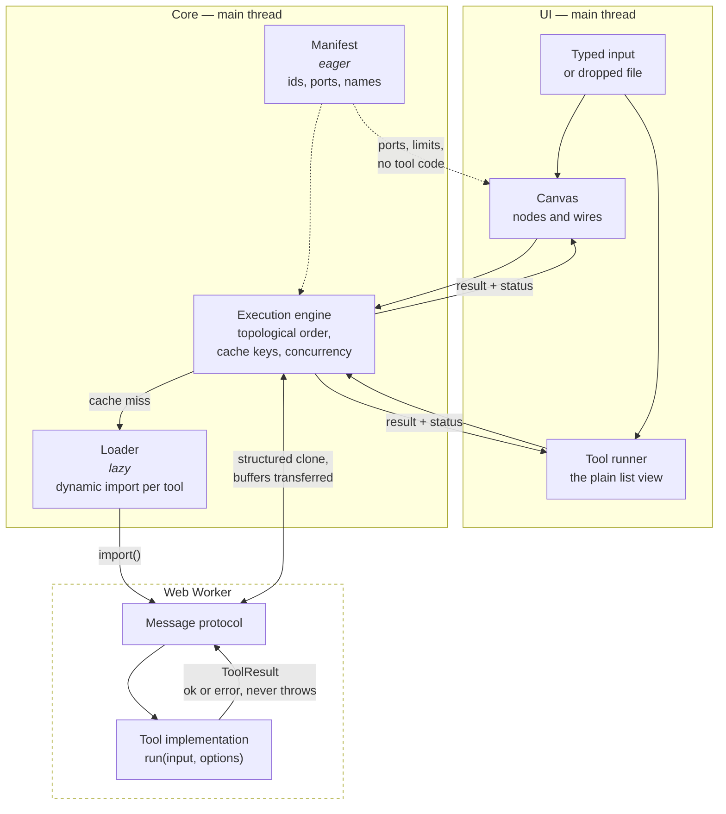
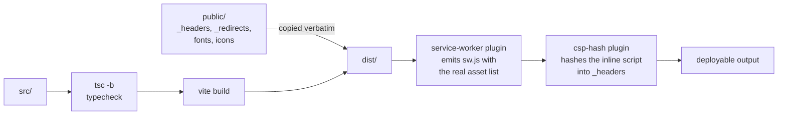

# Architecture

How a value gets from a text box to a result, and why the pieces are split the
way they are.

- [The shape of it](#the-shape-of-it)
- [The registry](#the-registry)
- [The execution engine](#the-execution-engine)
- [The worker boundary](#the-worker-boundary)
- [Incremental caching](#incremental-caching)
- [The canvas](#the-canvas)
- [Between tools](#between-tools)
- [State](#state)
- [Build and deployment](#build-and-deployment)

## The shape of it



Two things are load-bearing in that picture:

1. **The manifest is eager; implementations are not.** The canvas, the search
   box and the port-compatibility checks all need to reason about tools without
   loading a single line of their code.
2. **Nothing crosses the worker boundary as an exception.** A tool returns a
   `ToolResult` describing success or failure. A thrown error is a bug in the
   harness, not a way to report bad input.

## The registry

Two files describe every tool, and a test stops them disagreeing.

[`manifest.ts`](../src/features/registry/manifest.ts) holds the eager half: id,
name, summary, category, keywords, input and output ports, execution strategy,
size limits, and which option keys hold secrets. It is in the initial bundle.

[`loader.ts`](../src/features/registry/loader.ts) maps each id to a dynamic
`import()`. Each tool is therefore its own chunk, fetched when a node is added
or a tool page is opened.

`registry.test.ts` loads every implementation for real and asserts the two
descriptions agree — so a port added to a tool but not to its manifest entry
fails the build rather than producing a node with a missing socket.

### Ports are checked at compile time

A tool's `run` signature is _derived from_ its declared ports:

```ts
// A tool declaring a `bytes` input cannot be implemented with a function
// that expects a string — the type of `run` is computed from `inputs`.
type RunFor<T extends ToolSpec> = (
  input: InputsOf<T>,
  options: OptionsOf<T>,
) => Promise<ToolResult<OutputsOf<T>>>;
```

See [`types.ts`](../src/features/registry/types.ts). The practical effect is
that port compatibility is not a runtime string comparison that someone has to
remember to write — the compiler already refused the mismatch.

## The execution engine

Given a graph, the engine:

1. **Sorts it** into dependency order, rejecting cycles.
2. **Diffs it** against the previous run's cache keys (below).
3. **Runs what changed**, with independent branches executing concurrently up
   to a bound of 4.
4. **Reports per node**, not per graph.

Statuses are deliberately distinct:

| Status            | Means                                                                                                                   |
| ----------------- | ----------------------------------------------------------------------------------------------------------------------- |
| `blocked`         | A required input has neither a wire nor typed text. This is the normal state while you are still wiring, not an error.  |
| `error`           | This node failed. It shows why.                                                                                         |
| `upstream-failed` | Something this node depends on failed. It points back at the node that actually broke, rather than repeating the error. |
| `ok`              | Ran, produced output.                                                                                                   |
| `idle`            | Has not run. Also where a node goes when a run is **cancelled** — see below.                                            |

Runs are bounded at 100 nodes: beyond that the run is refused rather than
wedging the tab.

### What the concurrency bound is actually for

There is **one worker, and one thread behind it**. Four concurrent nodes are
not four cores; they are four messages in one queue. So the bound is not about
parallel CPU at all — raising it would not make a pipeline faster. What it buys
is that the worker's queue is never empty (its next tool's `import()` overlaps
the current tool's work) and that a main-thread tool can run while worker tools
are in flight.

What it costs is memory: every in-flight node's inputs are cloned into the
worker, so a large bound means several multi-megabyte intermediates alive at
once, and a longer wait in the queue for each. Four keeps the pipe full at a
small, bounded footprint. It is a scheduling decision, not a parallelism one,
and the earlier description of it here — "four workers' worth of work" — was
simply wrong.

### A deadline measures a tool's own work

The worker sends `started` between importing a tool and running it, and the
engine restarts that request's deadline when it arrives.

This matters because of the paragraph above: several requests posted together
are a queue, and timing a request from the moment it was _posted_ spent its
deadline on other tools' work. A regex node's 2 second limit, queued behind an
image conversion, reported a timeout for work it had not begun.

The timer armed at post time is not simply cancelled, because a request the
worker never acknowledges at all — the worker wedged before reaching it — still
has to fail rather than hang. The practical guarantee is therefore: **at most
`timeoutMs` waiting, then `timeoutMs` running.**

### One node's timeout, and everything else in flight

A wedged synchronous tool cannot be interrupted from inside. The only remedy is
to destroy the worker and build a new one — and that takes down every _other_
request that happened to be in flight.

Those requests are **replayed onto the fresh worker**, not failed. A tool is a
pure function of its inputs and options, so running it again produces the answer
it would have produced, and reporting a failure on a node the user did nothing
to is the outcome worth avoiding. A base64 node beside a runaway regex used to
sit there for its own full 15 seconds and then report a timeout it never had.

Replay is refused in exactly two cases, both deliberate:

- **The request's buffers were transferred.** They are detached in the sender,
  so a replay would post zero-length views and compute a confident wrong answer
  — worse than the error it was avoiding. In practice nothing in the app
  transfers (see below), so this is a guard rather than a live path.
- **It has already been replayed once.** Otherwise two tools that both wedge
  would loop, rebuilding a worker for the same doomed request forever.

A worker `error` event is treated differently: nothing is replayed. A timeout
tells us exactly which tool misbehaved and that the others were innocent; an
`error` says the worker itself is broken, and a fresh worker built from the same
code would break the same way.

`scripts/cross-browser-check.mjs` drives this in both engines with a real
pattern that really does wedge a real worker. jsdom has no Worker, so the unit
suite can only assert it against a main-thread stand-in.

### Cancellation is not a result

A cancelled node returns to `idle`. It did not fail and it did not run, and
nothing about it is written to the cache.

That last clause is the whole point. A cancellation used to be stored like any
other error, under a key computed from a document that had not changed — so the
next run was a cache **hit**, and the node reported "Cancelled." forever without
ever executing again. Editing the node was the only way out, and nothing on
screen said so.

## The worker boundary

Tools with `strategy: 'worker'` run off the main thread. The protocol is a
small tagged union — request, result, error — and the engine owns a single
shared worker rather than spawning one per run.

Binary payloads are `Uint8Array` or `Blob`, never base64 strings internally.
Base64 is a display format; using it as a transport triples memory and costs a
copy in each direction.

Buffers travel in one direction transferred and in the other copied, and the
asymmetry is the point.

**Outputs are transferred** back from the worker: nothing in there reuses them,
so moving ownership is free. **Inputs are borrowed** — structured cloned — from
every call site in the app, because on a canvas one output feeds several
inputs, and a transferred buffer would be detached by whichever consumer ran
first, leaving the rest with a zero-length view and no error to explain it.
`ownership: 'transfer'` exists for a caller that can prove single consumption;
nothing currently passes it.

A detached buffer produces a zero-length result several steps later, which is a
miserable thing to debug, so the fan-out case is asserted on the actual bytes
rather than on the shape of the result — twelve consumers, past the concurrency
bound, each checked against a known digest.

Where `OffscreenCanvas` is unavailable, image work falls back to the main
thread and produces an identical result. `scripts/cross-browser-check.mjs`
asserts which branch was actually taken, so the fallback cannot rot unnoticed.

## Incremental caching

Each node has a cache key built from:

- its tool id,
- its options,
- its typed input, and
- **for each wire arriving at it: which input port it arrives at, which output
  port it leaves from, and the upstream node's cache key — never its value.**

That last choice is the whole point. Comparing upstream _keys_ is O(1)
whatever the data is, so a 30 MB decoded file never has to be hashed to know
whether it changed. Hashing values would make every run cost a pass over every
intermediate result, which is precisely the work the cache exists to avoid —
the cache would get slower exactly as the data got bigger.

The trade is that a key is an identity, not a fingerprint: two different
routes to the same bytes get different keys and both run. For a graph a person
wired by hand, that is a rounding error.

**The wiring is part of the identity**, and it was not always. The key used to
be the sorted _set_ of upstream keys, which cannot tell apart two graphs that a
person would never confuse:

- Swap the two wires into a `diff` node. The set is unchanged, so the cached
  patch is served for the reversed comparison — a well-formed unified diff with
  its two sides the wrong way round.
- Move a wire from a tool's `output` port to its `data` port. Same upstream
  node, entirely different value; the set is unchanged again, so the previous
  port's answer is served for the new one.

Both produce output that is confident, well formed and stale, which is the
worst failure a cache can have: nobody reports it, because nothing looks wrong.
Order within the key is normalised on the _receiving_ port, so the order edges
happen to sit in the document still cannot change it.

Two things are **not** cached, and both are deliberate:

- **Cancellations.** See the engine section above.
- **Nodes that no longer exist.** The cache is keyed by node id and holds whole
  outputs, so an entry for a deleted node would hold that node's decoded file
  for the life of the tab. Entries are pruned at the start of each run, which is
  the one place that sees both the cache and the graph it belongs to.

Editing one node re-runs that node and its descendants, and nothing else.
Typing is debounced, so a pipeline re-runs once you pause rather than once per
keystroke.

## The canvas

Hand-built — no React Flow — and lazily loaded, so a visitor who only opens
`/tools` never downloads it.

**Coordinates.** The plane is a 0×0 box with a `transform`; the transform _is_
the coordinate system, not a box that contains anything. Two consequences:
`reset.css`'s `svg { max-inline-size: 100% }` collapsed the wire layer to
nothing inside it (100% of zero), and the wire layer needs
`max-inline-size: none` and `overflow: visible` to paint outside its own
viewport.

**Input.** Wheel handling is a single non-passive listener on the canvas root,
batched into `requestAnimationFrame`. It is _not bound at all_ while an overlay
is open — overlays render inside that root, so a bound-and-guarded listener
would still cancel the dialog's own scrolling.

**Undo/redo** is a command history, not a stack of snapshots. Each mutation is
a small object holding just enough to do and to undo it. Memory is proportional
to the change rather than to the graph, a drag coalesces into one step, and
each entry can describe itself for the live region ("Undid move 3 nodes").
The price is that every command needs a correct inverse, which `graph.test.ts`
checks by applying and reverting each kind and asserting deep equality.

**Accessibility** is structural rather than added: the canvas is a
`role="application"` region so single letters reach it, each node is a
focusable `role="group"` whose accessible name states tool, position,
connection count, status and selection, and the tab order is the DOM order,
computed spatially. See the [keyboard map](../README.md#the-canvas) in the
README and [the connect flow](#) below.

### Announcements are a log, not a variable

The canvas has one live region, and several independent things announce into
it: the graph store, the pipeline, the viewport. None of them knows about the
others, and none of them can be asked to take turns.

A live region holds one string, so for a long time whichever message arrived
last was the only one anybody heard. That surfaced four separate times — a
connection refusal swallowed by a re-run, a move overwritten by a run summary,
a fit-to-view assertion that was intermittently red — and was patched four
times as four coincidences. It is one problem with two halves, and both halves
have to be fixed or neither is:

1. **Before the DOM.** React batches, so two `announce` calls in one tick
   produced a single render carrying only the second. The first never existed
   as a rendered value, so nothing downstream could have recovered it. Every
   announcement is now appended to a bounded log in the store
   ([`announce.ts`](../src/lib/announce.ts)), and the log is what the region
   reads.
2. **After the DOM.** Replacing the region's text before an assistive
   technology has observed the previous change loses it just as thoroughly.
   [`LiveRegion`](../src/components/LiveRegion/LiveRegion.tsx) drains the log
   one message at a time, each holding the floor for a 200ms floor — long
   enough to be a separate observable change, short enough that a burst of six
   finishes inside a second.

Two details in the region are load-bearing:

- The message is a **keyed child**, not the region's own text. "Nothing to
  undo." pressed twice writes identical text, and identical text is not a DOM
  change and is therefore silent; replacing the child is an addition, which is
  what `aria-live` reacts to.
- A message may name a **channel**, and a queued message is dropped when a
  later queued message shares it. Holding an arrow key announces per repeat,
  and reading all fifteen would leave someone hearing where the node used to be
  for seconds after it stopped. Only messages still _waiting_ are affected;
  anything already spoken stays spoken, and an unchannelled message is never
  superseded.

The pipeline store keeps its own log and the canvas forwards **every** unread
entry into the canvas's log — not just the newest, which was the same
last-writer-wins bug one layer further out.

### Several failures at once

Each failing node shows its own message, beside the thing it is about. On a
graph larger than the viewport that is a message you cannot see, so the readout
carries a **count** — `2 failed` — and nothing else. It is deliberately not a
second copy of the wording: two places that word the same error is two places
to keep in step.

Only real failures are counted. A node that never ran because something
upstream broke did not fail, and counting it would turn one broken node into
"5 failed" and send someone looking for five bugs. The run summary reports the
two separately (`failed` and `skipped`) for the same reason.

## Between tools

Every tool is sound on its own. This section is about the seams — the places
where composing them behaves differently from either half, and where the
answers below were decided rather than fallen into.

### A port's types are a promise about what _might_ arrive

`canConnect` compares two ports' declared type lists and allows the wire if
they overlap. That is a static check on a union, and a union is not a
guarantee: base64's output really is `text` when encoding and `bytes` when
decoding, so `base64 → regex` is legal to draw and may still deliver bytes to a
port that only takes text.

So the wire is checked twice, and the second check is the real one:
`validateInputs` runs inside `eraseTool` against the value that actually
arrived, and refuses it with `unsupported-type` naming the type it got. The
refusal lands on the node that received the value, which is where the wire's
consequence is visible, and it does not disturb anything else on the same
output port.

The alternative — ports that appear and disappear as options change, so the
graph is always statically sound — was rejected when the port model was
written, and composing the tools has not produced a reason to revisit it. What
it would buy is a wire you cannot draw; what it costs is a node whose shape
changes under you while you are wiring it.

### A run holds the graph it started with

Editing anything schedules a new run, and starting a run aborts the one before
it. A run therefore works on a snapshot, and can finish computing a node the
user has since deleted.

Three rules keep that from leaking:

- A superseded run's per-node updates are dropped (the run token in
  `pipelineStore`), so it cannot paint over the newer run's results.
- The finished run replaces the state map wholesale, so nodes that are gone
  from the graph are gone from the state.
- Cache entries for absent nodes are pruned at the start of every run.

Undo and redo are graph edits like any other and go through exactly that path.
A graph _replaced_ rather than edited — a share link, a saved canvas — also
resets the pipeline store, because node ids are reused across documents (every
canvas starts at `n1`) and the previous pipeline's output on the new
pipeline's nodes is a wrong answer rather than a missing one.

### Ids from outside this session

`nextId` is a counter, and `withNode`/`withEdge` keep it ahead of everything
they insert — for graphs built in this session. A graph that arrives from
outside carries ids issued by a different one, and its counter has to be
rebuilt from the ids present rather than guessed at.

It was guessed. A share link restored with `nodes.length + edges.length + 1`,
which is correct only while ids are dense — and they stop being dense the
moment anyone deletes a node. A pipeline whose survivors were `n3` and `n7`
restored with a counter of 3, so the next node the recipient added was _also_
`n3`: adding a node silently overwrote an existing one, changing its tool while
its wires stayed attached to ports the new tool does not have. The saved
canvas had the same shape of bug via a stored counter that had fallen behind.

### Known limitations

**Two tabs, one canvas.** The saved graph is a single `localStorage` key with
no cross-tab coordination, and nothing listens for `storage`. To reproduce:
open the canvas in two tabs, add a node in each, and reload the first — the
second tab's save has replaced the first's, including its ids. Last write wins,
silently. This is not fixed here because the fix is a product decision (which
tab wins, and what the other is told) rather than a defect to repair, and a
half-measure — a toast saying the canvas changed elsewhere — is more confusing
than the current behaviour rather than less.

**Image conversion blocks its own deadline where `OffscreenCanvas` is absent.**
The engine downgrades `image-convert` to the main thread there (Safari before
16.4, Firefox before 105), which is the documented fallback and produces an
identical result. What it also does is block the main thread for the length of
the conversion — during which no timer fires and no worker message is
processed. A sibling node's deadline can therefore expire while its result is
already sitting in the message queue, and be reported as a timeout. To
reproduce: on a browser without `OffscreenCanvas`, convert a large image beside
a regex node on the same canvas. There is no workaround short of chunking the
conversion across frames, which is a redesign of the tool rather than a fix to
the engine. `scripts/cross-browser-check.mjs` asserts which branch each engine
takes, so the fallback cannot rot unnoticed.

**Progress is not reported through a pipeline.** `runPipeline` passes no
`onProgress`, so a tool that reports progress shows none on the canvas. No
shipped tool declares `reportsProgress: true`, so nothing is currently lost;
adding one would need this wiring first.

**The two engines disagree about catastrophic backtracking**, which matters for
any test that wants to wedge a worker on purpose. SpiderMonkey runs until it
exhausts its stack — about seven seconds — and throws. JavaScriptCore bounds
the backtracking count and gives up quietly, at around 2.4s for the pattern the
cross-browser check uses and under a second for the more familiar `(a+)+$`.
A check that assumes the Firefox behaviour passes in WebKit while proving
nothing.

### What was looked at and found sound

Recording these because knowing where the scrutiny went is worth as much as the
list of things it found:

- **Fan-out and buffer ownership.** Twelve consumers on one binary output, more
  than the concurrency bound, all receive intact bytes — including on a run
  where the source is served from cache. Inputs are borrowed (structured
  cloned), never transferred, from every call site in the app.
- **Every legal pair of tools.** Each output/input pair whose declared types
  overlap was run with real data. Every one either produces a correct value or
  fails with a message about the actual input; none crashes, hangs, or produces
  a plausible wrong answer.
- **Failure propagation down a long chain.** Every node below a failure names
  the node that actually broke, not the one above it, and carries no error text
  of its own.
- **Cache identity across documents.** The cache is keyed by node id, and node
  ids repeat across documents — but every other component of the key is derived
  from content, so a collision can only serve a result that is correct anyway.
  The pipeline store is reset on load regardless, because the _displayed_ state
  would otherwise be stale for the length of the re-run debounce.
- **Dangling edges.** A wire whose source node is missing used to leave its
  target waiting forever and absent from the run's states — neither failed nor
  blocked, just unmentioned. Nothing in the app produces one, and there is now
  a guard for when something does.

## State

Four Zustand stores, split by what invalidates them:

| Store           | Holds                                 | Persisted                                 |
| --------------- | ------------------------------------- | ----------------------------------------- |
| `graphStore`    | nodes, edges, selection, undo history | `patchbay:graph:v2`                       |
| `viewportStore` | pan and zoom                          | no                                        |
| `pipelineStore` | per-node run status and results       | no                                        |
| `themeStore`    | selection, authored themes, draft     | `patchbay:theme:v1`, `patchbay:themes:v1` |

`graphStore` and `pipelineStore` both also hold an announcement log — see
[announcements](#announcements-are-a-log-not-a-variable). It is state rather
than a callback because a message must survive React's batching, and it is
bounded because a tab can stay open for days.

`themeStore` is the one that reads storage at MODULE LOAD rather than in an
effect: the first paint has to already be wearing the right theme, and an
effect running afterwards would show one frame of the wrong one. That is also
why its reader is hand-written rather than Zod — it is in the initial payload.
See [theming.md](theming.md).

Its `draftTheme` is the theme currently being edited. It outranks the selection
on screen and is never persisted, because it is what the page is showing rather
than what the user has chosen.

Execution status lives in `pipelineStore`, not on the node. It is _derived from
a run_, not part of the document — which is what the v1 → v2 migration was
about.

Saves are debounced, so a drag writes once rather than sixty times. Loads are
validated with Zod and cross-checked against the live registry; anything
corrupt, older, or naming a tool that no longer exists yields an empty canvas
and a message, never a crash.

## Build and deployment



Three Vite plugins do work that cannot be done by hand:

- [`service-worker.ts`](../vite/plugins/service-worker.ts) lists the finished
  build and writes `sw.js` with that list plus a build id derived from it. A
  hand-maintained precache list would be wrong the moment anything was edited.
- [`csp-hash.ts`](../vite/plugins/csp-hash.ts) hashes the inline theme
  bootstrap **from the built HTML** and substitutes it into `_headers`. Hashing
  the source would be hashing something the browser never executes.

- [`index-html.ts`](../vite/plugins/index-html.ts) strips HTML comments from
  the shipped document — the source explains itself at length and none of that
  is any use to a browser — and refuses to build if a `%VITE_SITE_URL%`
  placeholder survived or an og:image, og:url or canonical is not absolute.

The `{{INLINE_SCRIPT_HASHES}}` placeholder is not a valid CSP source, so a
build that somehow skipped the plugin produces an obviously broken policy
rather than a quietly permissive one. The same instinct runs through
`index-html.ts`: the failure modes it guards against are all silent ones, and
the build is the last moment anybody is looking.

### The head has two audiences

The complete Open Graph and Twitter set is static markup in index.html, because
crawlers and link-preview bots never run the router. The router's per-route
head — see [`head.ts`](../src/app/head.ts) — is for the tab strip and for
consumers that do execute JavaScript. The static tags are marked `data-default`
and removed on mount, because React hoists its own copies without removing
anything already present.

Deployment is Netlify. `_headers` and `_redirects` live in `public/` rather
than in `netlify.toml` so that the exact bytes deployed are the ones in the
repo, and so `scripts/serve-dist.mjs` can serve the built app under the real
policy — what is tested locally is what ships.
