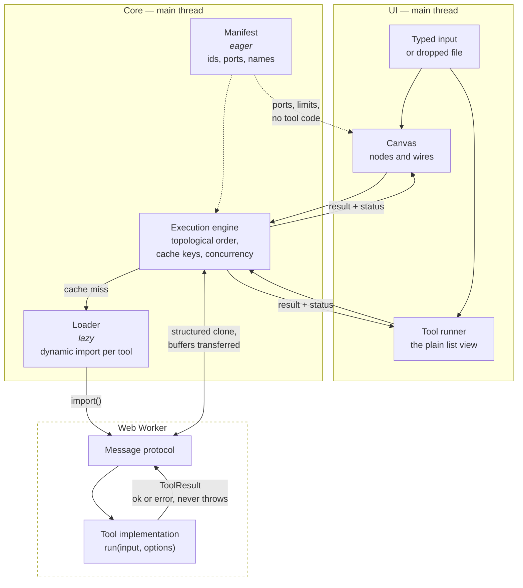
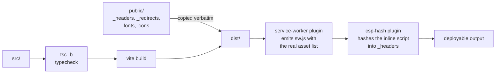

# Architecture

How a value gets from a text box to a result, and why the pieces are split the
way they are.

- [The shape of it](#the-shape-of-it)
- [The registry](#the-registry)
- [The port set](#the-port-set)
- [The execution engine](#the-execution-engine)
- [The worker boundary](#the-worker-boundary)
- [Incremental caching](#incremental-caching)
- [The canvas](#the-canvas)
- [The node inspector](#the-node-inspector)
- [A file as an input](#a-file-as-an-input)
- [The tool runner page](#the-tool-runner-page)
- [Between tools](#between-tools)
- [State](#state)
- [Build and deployment](#build-and-deployment)

## The shape of it



Two things are load-bearing in that picture:

1. **The manifest is eager; implementations are not.** The canvas, the search
   box and the port-compatibility checks all need to reason about tools without
   loading a single line of their code.
2. **Nothing crosses the worker boundary as an exception.** A tool returns a
   `ToolResult` describing success or failure. A thrown error is a bug in the
   harness, not a way to report bad input.

## The registry

Two files describe every tool, and a test stops them disagreeing.

[`manifest.ts`](../src/features/registry/manifest.ts) holds the eager half: id,
name, summary, category, keywords, input and output ports, execution strategy,
size limits, and which option keys hold secrets. It is in the initial bundle.

[`loader.ts`](../src/features/registry/loader.ts) maps each id to a dynamic
`import()`. Each tool is therefore its own chunk, fetched when a node is added
or a tool page is opened.

`registry.test.ts` loads every implementation for real and asserts the two
descriptions agree — so a port added to a tool but not to its manifest entry
fails the build rather than producing a node with a missing socket.

### Ports are checked at compile time

A tool's `run` signature is _derived from_ its declared ports:

```ts
// A tool declaring a `bytes` input cannot be implemented with a function
// that expects a string — the type of `run` is computed from `inputs`.
type RunFor<T extends ToolSpec> = (
  input: InputsOf<T>,
  options: OptionsOf<T>,
) => Promise<ToolResult<OutputsOf<T>>>;
```

See [`types.ts`](../src/features/registry/types.ts). The practical effect is
that port compatibility is not a runtime string comparison that someone has to
remember to write — the compiler already refused the mismatch.

## The port set

Every tool declares its input and output ports, and for a long time each
declaration was written when that tool was written and never read beside the
others. The canvas can now show a node's output, which makes the ports the
thing a person reasons about while wiring — so they were audited as a set.
These are the rules that came out of it, and the reasoning is here rather than
in nine files because every one of them is about the set rather than about a
tool.

### The whole set, as it stands

| Tool              | In                                                         | Out                                                                                      |
| ----------------- | ---------------------------------------------------------- | ---------------------------------------------------------------------------------------- |
| `base64`          | `input` Input · text, bytes                                | `output` Output · text, bytes                                                            |
| `structured-data` | `input` Document · text, json, bytes                       | `output` Converted · text — `data` Parsed data · json                                    |
| `hash`            | `input` Input · text, bytes                                | `output` Digest · text                                                                   |
| `jwt-decode`      | `input` Token · text                                       | `output` Decoded · json                                                                  |
| `diff`            | `original` Original, `changed` Changed · text, json, bytes | `output` Unified patch · text — `changes` Changes · json                                 |
| `regex-tester`    | `input` Subject · text, bytes                              | `output` Result · text — `matches` Matches · json                                        |
| `color-convert`   | `input` Colour · text, color                               | `output` Converted · text — `swatch` Swatch · color — `all` Notations · json             |
| `image-convert`   | `input` Image · bytes                                      | `output` Converted · bytes — `report` Report · json                                      |
| `text-convert`    | `input` Document · text, bytes                             | `output` Converted · text — `rendered` Rendered HTML · text — `detected` Detected · text |

### The conventions, and what each one is worth

**A tool's first output is `output`.** It was on eight of the nine and `hash`
called its answer `digest`. That mattered because a node summarises its FIRST
declared output on the grounds that the first port is the tool's answer and the
rest are its working — a rule that was a per-tool lookup rather than something
the shape of the set guaranteed. It is asserted for every tool now.

**A tool with one input calls it `input`; a tool with several names each one.**
`diff` is the only tool with two, and neither of them is "the" input. The
v2 → v3 graph migration had to look a tool's first input port up in the live
registry precisely because this was not something it could assume.

**A port id is an identity; a label is a word for a person.** Ids appear in
edges, in `CanvasNode.inputs` and in share links, so renaming one is a breaking
change with a migration attached — see
[`retiredPorts.ts`](../src/features/canvas/retiredPorts.ts). Labels are free to
improve, and several did.

**A label has 84px and about eleven characters.** `Every notation`,
`Converted image` and `Detected source` were all drawn as a word and a half on
every node that had one. `Rendered HTML` and `Unified patch` deliberately sit
over the budget and take a tooltip instead, because in both the extra word is
information the port's data TYPE cannot carry.

**No label appears twice on one tool.** `color-convert` had an input labelled
Colour facing an output labelled Colour, which on a 224px node is two identical
words with nothing to tell them apart. The input is the one that could not
move: a colour converter's input is a colour.

**Every port has a description, and an output's is now shown.** A port's
description is the only documentation of it that reaches a person, and for an
OUTPUT port nothing on any route read it — an input's is its editor's
placeholder, an output's existed only in the manifest source. The Ports panel
on a tool page shows it. Inputs deliberately do not repeat theirs there, since
their prose is already on the page in the panel where it is acted on.

### A data type earns its place when a port carries it

`DATA_TYPES` held `image` and `datetime` and no port on any tool declared
either. `datetime` was merely dead — a payload shape no test could judge, and a
glyph in the canvas's port legend for a type the canvas could not produce.

`image` was worse than dead. Binary travels as `bytes` everywhere in this app
and the SNIFF says what it is, which is what makes `image-convert → hash` and
`image-convert → base64` legal wires. A separate `image` type would have made
exactly those illegal, and left every future author choosing between two types
for one concept with no right answer.

`color` is the counter-example and the reason the shape is worth having:
`color-convert` really does carry a parsed colour on a port, which is what lets
a colour hop between nodes without a lossy round trip through text.

### Every port that reads a document accepts bytes

This is the audit's main finding, and it was the same finding twice.
`structured-data` widened its document port to `bytes` some time ago and
recorded that refusing them "made the most obvious pipeline in the product
impossible". `regex-tester` and `text-convert` have the same port and had not
had the same fix, so:

- a decoded log file could not be wired into the regex subject, and
- a base64-decoded mail body could not be wired into the text converter.

Both were also inconsistent BETWEEN THE TWO ROUTES rather than merely
restrictive. A tool page has always accepted a dropped text file on either
tool, because the runner decodes a text-sniffed file before handing it over; it
was only the canvas, where the same bytes arrive on a wire, that refused. One
tool that accepts a file in one place and refuses it in the other is drift.

That was half the drift, and the other half was the affordance: the canvas could
not be handed a file at any port, whatever its types said. Both routes take one
now, through one implementation — see
[a file as an input](#a-file-as-an-input).

The two ports that still refuse bytes take a short LITERAL rather than a
document: a compact token and a colour. Their size limits say the same thing —
256 kB and 4 kB.

**Widening a port means refusing clearly, not guessing.** The risk of accepting
bytes is that non-text bytes get decoded to replacement characters and
processed anyway. `diff` did exactly that: two PNGs on its two ports produced a
valid unified diff of two walls of U+FFFD, an answer that looks like an answer
and means nothing. Every document port decodes through
[`lib/text.ts`](../src/lib/text.ts) now — strict UTF-8, with a UTF-16 byte
order mark as the one exception — and names which port could not be read,
because with two document ports "those bytes" is not an answer.

### What was deliberately left alone

**`hash` still refuses `json`.** Wiring `structured-data`'s parsed structure
into it looks obviously useful, and the digest of a STRUCTURE is undefined
until someone picks a serialisation: key order and indentation change the
bytes, so they change the number people compare across machines.
`structured-data`'s `output` port is where that choice is made explicitly, with
`sortKeys` and `indent` to control it. `diff` DOES accept `json`, and the
asymmetry is the point — an indentation choice changes how a comparison reads
rather than whether it is true.

**`jwt-decode` has one output, not a separate `payload`.** A port carrying just
the claims is the thing people would want downstream, and its entire effect
would be to detach the claims from the signature verdict — which is the one
thing this tool's whole design exists to prevent.

**`text-convert` keeps all three outputs.** See below.

**Every input stays required.** No tool in the set does anything useful with a
missing input, and an optional port makes its value `| undefined` in `run`,
which is a question the tool then has to have an answer for.

### `Converted` and `Rendered HTML`, which was the specific question

It was not obvious how `text-convert`'s first two outputs differed when the
target format was HTML. The answer turned out to be two separate things.

**One was a defect.** `rendered` declares "always HTML, sanitised" and there
was no function in the markup pipelines that produced one: `markdownToHtml`
sanitises the HTML it generates, and the other two sanitise on the way to
something that is not HTML. So for an HTML source with any target but Markdown,
the port carried the input string unchanged — `<script>` elements and `onclick`
attributes included. Nothing ran: the preview iframe is `sandbox=""`. What did
happen is that the string went onto the clipboard through Copy as rich text and
out of the port into whatever node was wired to it, which are the two places a
port's promise is all anybody has. `sanitiseHtml` fixes it, and `output` is
byte-identical either way — all three pipelines already sanitised internally,
so it was only the port that was wrong.

**The other cannot be designed away, and the ports are right as they are.**
With a Markdown source and an HTML target the two ports really are the same
string, because converting a document to HTML and rendering it are the same
operation. Both alternatives cost more:

- **One port, presented as HTML only when the target is HTML.**
  `OutputPort.presentation` is static data in the eager manifest, and
  `registry.test.ts` compares manifest ports to implementation ports with a
  structural equality that a function property cannot pass — so "presented as
  HTML sometimes" is not expressible without giving that test up. Making it
  unconditional would draw Markdown output in an HTML preview.
- **A port that appears only for the targets where it differs.** Ports that
  come and go as options change was rejected when the port model was written,
  for a better reason than this one: a node whose shape moves under you while
  you are wiring it.

Losing the preview and the rich-text copy for the other two targets is a much
larger cost than one duplicated string, so the coincidence is stated on the
port's own description instead of being left for someone to find by reading two
identical text boxes. In the other five combinations the two differ, and the
html → html case is the interesting one: `output` is the normalising round trip
through Markdown, `rendered` is the source with nothing but the sanitiser
applied.

**`detected` was considered for removal and kept.** Nobody would sensibly wire
a sentence about a guess, which is the test this project applies to a port on a
224px node. It stays because the alternative is a wrong guess that is
invisible, and this tool guesses on every run by default — a `ToolResult` is a
value or an error, so there is nowhere else for an advisory note to go.
Reshaping it as a `report`-presented JSON port, the way `image-convert` handles
the same problem, would make it properly wireable and no more wired, for one
sentence written for a person.

### Renamed, and what the migration does

| Tool            | Was      | Is       | Why                                                                                                                               |
| --------------- | -------- | -------- | --------------------------------------------------------------------------------------------------------------------------------- |
| `hash`          | `digest` | `output` | The first-output convention above, which is now asserted rather than nearly true.                                                 |
| `image-convert` | `info`   | `report` | The port declares `presentation: 'report'` and is drawn by `ReportView`. Three names for one thing, none of them the word for it. |

Both are breaking changes to documents that already exist, and both are
migrated on both routes — the saved canvas at v4 → v5, and the share link at
v2 → v3. The table lives once, in
[`retiredPorts.ts`](../src/features/canvas/retiredPorts.ts), because three
places need the same answer and a second copy is a bug waiting for whichever
copy someone forgot.

**Not migrating was not an option, and neither was refusing.** An edge leaving
`hash.digest` still leaves a node that exists and arrives at a port that
exists, so nothing refuses it: the engine looks for a value on an output port
called `digest`, finds none, and reports `Nothing arrived on Original` against
the node BELOW — a node that is correctly wired and did nothing wrong. The rest
of the pipeline runs. That is a canvas that works except for the thing it was
built to do, with nothing on screen to say which wire is the problem. And
refusing every old link outright would break real pipelines belonging to real
people for a rename made for tidiness; two of the shipped presets end in a hash
node.

### `checkConnection` now guards the two routes from outside this session

`checkConnection` is the single source of truth for whether a wire is legal,
and it had three callers: the pointer drop, the keyboard flow, and
`validPartnersFor`, which both of those consult. The two routes that build a
graph from OUTSIDE this session — a share link and the saved canvas — had none,
and they are the two that most need one.

[`firstRefusedEdge`](../src/features/canvas/connections.ts) walks a graph's
edges onto a growing copy of it and returns the first one `checkConnection`
would refuse. Edge by edge onto a growing graph is not an optimisation: two of
the refusals are about the edges already present — an occupied input port, and
a cycle — so checking each edge against the finished graph would refuse every
edge for occupying the port it itself occupies.

Both routes now refuse the whole document, with the rejection's own sentence,
rather than applying part of it. Two silent repairs went with that change: the
share decoder used to skip an edge whose endpoint was missing, which
contradicted its own header — a link whose edges half survive IS a half-applied
pipeline, just one where the missing half is invisible — and the graph loader
used to filter the same edges out. `checkConnection` already reads a missing
endpoint as "that port no longer exists", so keeping the edge and refusing the
document gives one rule for every unusable wire instead of a filter in one
place and a check in another.

Nothing in the app can produce such a document: every route into the store goes
through `checkConnection`, and any new command clears the redo branch. This is
a guard against documents from elsewhere, not a state the canvas can reach by
itself.

**The presets are checked too.** A preset names ports as bare strings, which
makes it the one place in the app that can reference a port that does not
exist — and it failed exactly as quietly as the stale share link did. Every
preset wire goes through `firstRefusedEdge` in `ports.test.ts`.

## The execution engine

Given a graph, the engine:

1. **Sorts it** into dependency order, rejecting cycles.
2. **Diffs it** against the previous run's cache keys (below).
3. **Runs what changed**, with independent branches executing concurrently up
   to a bound of 4.
4. **Reports per node**, not per graph.

Statuses are deliberately distinct:

| Status            | Means                                                                                                                   |
| ----------------- | ----------------------------------------------------------------------------------------------------------------------- |
| `blocked`         | A required input has neither a wire nor typed text. This is the normal state while you are still wiring, not an error.  |
| `error`           | This node failed. It shows why.                                                                                         |
| `upstream-failed` | Something this node depends on failed. It points back at the node that actually broke, rather than repeating the error. |
| `ok`              | Ran, produced output.                                                                                                   |
| `idle`            | Has not run. Also where a node goes when a run is **cancelled** — see below.                                            |

Runs are bounded at 100 nodes: beyond that the run is refused rather than
wedging the tab.

### What the concurrency bound is actually for

There is **one worker, and one thread behind it**. Four concurrent nodes are
not four cores; they are four messages in one queue. So the bound is not about
parallel CPU at all — raising it would not make a pipeline faster. What it buys
is that the worker's queue is never empty (its next tool's `import()` overlaps
the current tool's work) and that a main-thread tool can run while worker tools
are in flight.

What it costs is memory: every in-flight node's inputs are cloned into the
worker, so a large bound means several multi-megabyte intermediates alive at
once, and a longer wait in the queue for each. Four keeps the pipe full at a
small, bounded footprint. It is a scheduling decision, not a parallelism one,
and the earlier description of it here — "four workers' worth of work" — was
simply wrong.

### A deadline measures a tool's own work

The worker sends `started` between importing a tool and running it, and the
engine restarts that request's deadline when it arrives.

This matters because of the paragraph above: several requests posted together
are a queue, and timing a request from the moment it was _posted_ spent its
deadline on other tools' work. A regex node's 2 second limit, queued behind an
image conversion, reported a timeout for work it had not begun.

The timer armed at post time is not simply cancelled, because a request the
worker never acknowledges at all — the worker wedged before reaching it — still
has to fail rather than hang. The practical guarantee is therefore: **at most
`timeoutMs` waiting, then `timeoutMs` running.**

### One node's timeout, and everything else in flight

A wedged synchronous tool cannot be interrupted from inside. The only remedy is
to destroy the worker and build a new one — and that takes down every _other_
request that happened to be in flight.

Those requests are **replayed onto the fresh worker**, not failed. A tool is a
pure function of its inputs and options, so running it again produces the answer
it would have produced, and reporting a failure on a node the user did nothing
to is the outcome worth avoiding. A base64 node beside a runaway regex used to
sit there for its own full 15 seconds and then report a timeout it never had.

Replay is refused in exactly two cases, both deliberate:

- **The request's buffers were transferred.** They are detached in the sender,
  so a replay would post zero-length views and compute a confident wrong answer
  — worse than the error it was avoiding. In practice nothing in the app
  transfers (see below), so this is a guard rather than a live path.
- **It has already been replayed once.** Otherwise two tools that both wedge
  would loop, rebuilding a worker for the same doomed request forever.

A worker `error` event is treated differently: nothing is replayed. A timeout
tells us exactly which tool misbehaved and that the others were innocent; an
`error` says the worker itself is broken, and a fresh worker built from the same
code would break the same way.

`scripts/cross-browser-check.mjs` drives this in both engines with a real
pattern that really does wedge a real worker. jsdom has no Worker, so the unit
suite can only assert it against a main-thread stand-in.

### Cancellation is not a result

A cancelled node returns to `idle`. It did not fail and it did not run, and
nothing about it is written to the cache.

That last clause is the whole point. A cancellation used to be stored like any
other error, under a key computed from a document that had not changed — so the
next run was a cache **hit**, and the node reported "Cancelled." forever without
ever executing again. Editing the node was the only way out, and nothing on
screen said so.

### Cancelling tells the worker to stop; it does not make it stop

This is the half of cancellation that is about the worker rather than about the
node, and it was missing.

Cancelling settles the caller immediately — waiting on a tool that may never
check its signal is the thing cancellation exists to avoid — and it used to
forget the request entirely at the same moment: entry dropped, deadline
cleared. But a synchronous tool cannot be interrupted from the outside, so a
request that had wedged the worker was still wedging it, and **the deadline
that was just cleared was the only thing in the system that would ever have
destroyed that worker.** Nothing was left holding a reference to a thread
spinning inside `RegExp.exec`.

What that cost is not theoretical, and it is one keystroke away: editing or
deleting a node while a runaway one is in flight supersedes the run, and a
superseded run is cancelled exactly like this. The next run is then posted to
the stranded worker and waits there — with the main thread idle and every node
on screen saying `Running` — until either the wedging tool happens to give up
by itself or the waiting node's **own** deadline expires.

Measured through the whole app, by deleting a runaway regex node mid-run and
then feeding an unrelated base64 node: **10.8 s in WebKit and 4.1 s in Gecko,
against 2.1 s in both** once the cancelled request keeps its deadline. Those
first two numbers are the runaway pattern giving up on its own — JavaScriptCore
and SpiderMonkey abandon it at different points, which is the only reason it is
seconds rather than the bound. The bound, for a tool that genuinely never
returns, is the waiting node's own timeout: 15 seconds for base64, 60 for an
image conversion. A pipeline that appears to hang for a quarter of a minute
with nothing running does not read as a slow tool. It reads as a broken app.

So a cancelled request keeps its deadline. The caller is settled and hears
nothing further — not even progress — but the entry stays until either the
worker answers for it or its time runs out, and if the time runs out the worker
is replaced and the innocent requests beside it are replayed, exactly as for
any other timeout. A cancelled request is never itself replayed: nobody is
waiting for its answer, and on the canvas replaying one is a whole superseded
pipeline executing a second time.

No new number was introduced for this, deliberately. The guarantee is the one
the tool already declares: **a request cannot hold the worker past its own
limit, whether or not anybody is still listening for the answer.** A
cooperative tool releases the deadline as soon as it notices the signal, which
is the usual case and costs nothing.

### What the intermittent worker-wedge failure actually was

`checkPipeline`'s second sub-check failed about one WebKit run in three, and
was filed against the scheduler: _"a scheduled pipeline run is delayed by
around 25 seconds while the main thread sits idle."_ It is worth writing down
that **nothing was ever delayed**, because the shape of the report sent the
investigation at the scheduler twice over, and the scheduler was blameless.

What the check does is type a catastrophic pattern into a regex node, type a
payload into an unrelated base64 node, and then wait up to 25 seconds for each
to reach its expected state. In a failing run the regex node sat at `blocked` —
which is what a node with **no input at all** says — for the whole window, and
the assertion below it read 25 000 ms. That number was not a delay. It was the
poll's own timeout expiring, because the node it was watching had nothing to
run and never would.

The text never reached the node. `fill` puts a value in the box and fires the
events; it does not know whether anything took it, and the canvas's [deferred
focus move](#the-keyboard) took focus off the field between Playwright focusing
it and inserting the text, so the characters went to the close button. Measured: the
saved graph after a failing run holds `regex-tester: {}` — not an empty string,
no key at all, so the store's setter was never called once.

The chain of evidence, in the order it was established:

1. The canvas moves focus to **Close the inspector** one animation frame after
   `Enter`, in both engines. Pressing `Enter` and typing `hello` leaves the
   editor empty.
2. In a failing run the value never enters the graph store, while `fill`
   reports success and the field's `aria-label` still names the right node.
3. Making that frame arrive late — replacing `requestAnimationFrame` with a
   40–90 ms timer, which is only what CPU load does to it — reproduces the loss
   directly, with focus observably on the close button and the field empty.
4. Interposing one extra round trip between locating the field and filling it,
   which lets the frame land first, took the failure rate from 2 in 18 to 0 in
   46 without changing anything else.
5. With the focus move fixed: 25 consecutive clean runs under the same load
   that produced the failures.

Two things follow for the harness rather than for the app. `typeInto` now
**verifies that what it typed arrived** — the editor is a controlled field, so
the box still holding the text a moment later is proof the graph has it — and a
precondition that can fail quietly is a check that blames the wrong thing
twenty-five seconds later. And the `Enter`-into-the-editor behaviour is asserted
directly, in both the unit suite and `check:browsers`, so it is a named failure
rather than a symptom somewhere else.

### Where else a long unexplained wait can come from

The failure a user experiences as the product being broken, rather than as an
error, is a wait with nothing on screen to explain it. Three were found in this
pass, and they are the ones worth keeping in mind when this code changes:

- **A cancelled request stranding the worker** — fixed above; measured at 10.8
  seconds of `Running` with nothing running, bounded only by the waiting node's
  own timeout.
- **A tool running twice** — see the worker boundary; it doubles every wait in
  Safari rather than creating one.
- **Main-thread image conversion**, which blocks its own deadline and everyone
  else's. Already recorded under [known
  limitations](#known-limitations) and unchanged.

Two more were looked at and found sound. A run superseded mid-flight can leave
the previous `runPipeline` winding down beside the new one, sharing the result
cache — but a cancelled node writes nothing to the cache and every emission is
gated on the run token, so the worst case is a wasted re-run rather than a
stale answer. And a node whose upstream produced nothing reports `blocked`
rather than waiting: the pump resolves when nothing is active and nothing is
ready, so there is no state in which the graph is waiting on a value that
cannot arrive.

## The worker boundary

Tools with `strategy: 'worker'` run off the main thread. The protocol is a
small tagged union — request, result, error — and the engine owns a single
shared worker rather than spawning one per run.

Binary payloads are `Uint8Array` or `Blob`, never base64 strings internally.
Base64 is a display format; using it as a transport triples memory and costs a
copy in each direction.

Buffers travel in one direction transferred and in the other copied, and the
asymmetry is the point.

**Outputs are transferred** back from the worker: nothing in there reuses them,
so moving ownership is free. **Inputs are borrowed** — structured cloned — from
every call site in the app, because on a canvas one output feeds several
inputs, and a transferred buffer would be detached by whichever consumer ran
first, leaving the rest with a zero-length view and no error to explain it.
`ownership: 'transfer'` exists for a caller that can prove single consumption;
nothing currently passes it.

A detached buffer produces a zero-length result several steps later, which is a
miserable thing to debug, so the fan-out case is asserted on the actual bytes
rather than on the shape of the result — twelve consumers, past the concurrency
bound, each checked against a known digest.

Where `OffscreenCanvas` is unavailable, image work falls back to the main
thread and produces an identical result. `scripts/cross-browser-check.mjs`
asserts which branch was actually taken, so the fallback cannot rot unnoticed.

### The worker's entry is also a library, which ran every tool twice in Safari

`worker.ts` is the module the worker is constructed from, and it registers a
`message` listener on its global scope. It is also a **shared chunk**: the tool
chunks it dynamically imports import it back for the registry helpers Rollup
placed alongside it, and the page's own bundle imports it for the same reason.
An entry that doubles as a library gets evaluated in places nobody meant it to
be, and a global side effect run twice is not idempotent.

Both places turned out to be real, and neither was visible from any test that
looked at answers:

- **In the worker**, JavaScriptCore evaluated the entry a second time when a
  tool chunk imported it, so `message` had two listeners and **every request
  ran its tool twice**. Measured over a base64 → structured data → hash chain
  in Playwright's WebKit: two `started` and two `settled` for every one
  `execute`, from the first run on a fresh worker. Gecko evaluates it once and
  was always clean. Nothing was ever _wrong_ — a tool is a pure function, so
  the second answer equals the first and the engine drops it as a late reply to
  something already settled — it simply cost twice the CPU and twice the peak
  memory of every worker tool in Safari, which for a 20 MB image conversion is
  the whole difference.
- **On the main thread**, `self` is the window, so the same evaluation put a
  `message` listener on the _page_ that would run a tool for anything able to
  `postMessage` to it. Nothing can today — the one iframe in the app is the
  `sandbox=""` preview, which cannot script — but a page whose entire promise
  is that nothing you paste leaves it should not carry an unintended global
  entry point to its own executor.

The listener is registered once now, guarded on the global scope rather than in
module scope: two evaluations are two module scopes, and the thing that has to
be unique is the listener on the one global they share. It is also skipped
entirely outside a worker.

This is a build shape as much as a code one, and the check that would catch it
coming back is a **count** rather than an assertion about a result:
`checkPipeline` now counts `started` messages against the `execute` messages
posted, because no assertion about an answer can see a pure function run twice.

## Incremental caching

Each node has a cache key built from:

- its tool id,
- its options,
- its typed input, and
- **for each wire arriving at it: which input port it arrives at, which output
  port it leaves from, and the upstream node's cache key — never its value.**

That last choice is the whole point. Comparing upstream _keys_ is O(1)
whatever the data is, so a 30 MB decoded file never has to be hashed to know
whether it changed. Hashing values would make every run cost a pass over every
intermediate result, which is precisely the work the cache exists to avoid —
the cache would get slower exactly as the data got bigger.

The trade is that a key is an identity, not a fingerprint: two different
routes to the same bytes get different keys and both run. For a graph a person
wired by hand, that is a rounding error.

**The wiring is part of the identity**, and it was not always. The key used to
be the sorted _set_ of upstream keys, which cannot tell apart two graphs that a
person would never confuse:

- Swap the two wires into a `diff` node. The set is unchanged, so the cached
  patch is served for the reversed comparison — a well-formed unified diff with
  its two sides the wrong way round.
- Move a wire from a tool's `output` port to its `data` port. Same upstream
  node, entirely different value; the set is unchanged again, so the previous
  port's answer is served for the new one.

Both produce output that is confident, well formed and stale, which is the
worst failure a cache can have: nobody reports it, because nothing looks wrong.
Order within the key is normalised on the _receiving_ port, so the order edges
happen to sit in the document still cannot change it.

Two things are **not** cached, and both are deliberate:

- **Cancellations.** See the engine section above.
- **Nodes that no longer exist.** The cache is keyed by node id and holds whole
  outputs, so an entry for a deleted node would hold that node's decoded file
  for the life of the tab. Entries are pruned at the start of each run, which is
  the one place that sees both the cache and the graph it belongs to.

Editing one node re-runs that node and its descendants, and nothing else.
Typing is debounced, so a pipeline re-runs once you pause rather than once per
keystroke.

## The canvas

Hand-built — no React Flow — and lazily loaded, so a visitor who only opens
`/tools` never downloads it.

**Coordinates.** The plane is a 0×0 box with a `transform`; the transform _is_
the coordinate system, not a box that contains anything. Two consequences:
`reset.css`'s `svg { max-inline-size: 100% }` collapsed the wire layer to
nothing inside it (100% of zero), and the wire layer needs
`max-inline-size: none` and `overflow: visible` to paint outside its own
viewport.

**Input.** Wheel handling is a single non-passive listener on the canvas root,
batched into `requestAnimationFrame`. It is _not bound at all_ while an overlay
is open — overlays render inside that root, so a bound-and-guarded listener
would still cancel the dialog's own scrolling. The inspector is not an overlay
and is not inside that root; see
[the note on why](#it-is-a-sibling-of-the-canvas-not-a-child-of-it).

A pointerdown on the toolbar or the status readout no longer clears the
selection. Both render inside the canvas root, so a press on either arrived as
"not a node" and threw the selection away as a silent side effect — survivable
while nothing on screen depended on the selection, and not survivable the moment
one of those buttons was the inspector toggle, which deselected the node and
then opened a panel reporting that no node was selected.

**Undo/redo** is a command history, not a stack of snapshots. Each mutation is
a small object holding just enough to do and to undo it. Memory is proportional
to the change rather than to the graph, a drag coalesces into one step — and so
does a run of typing into an option, for [the same reason](#typing-an-option-is-one-undo-step) — and
each entry can describe itself for the live region ("Undid move 3 nodes").
The price is that every command needs a correct inverse, which `graph.test.ts`
checks by applying and reverting each kind and asserting deep equality.

**Accessibility** is structural rather than added: the canvas is a
`role="application"` region so single letters reach it, each node is a
focusable `role="group"` whose accessible name states tool, position,
connection count, status, result summary and selection, and the tab order is
the DOM order, computed spatially. The
[inspector](#the-node-inspector) is a landmark outside that region, so a text
field in it never has to compete with the canvas for a keystroke. See the
[keyboard map](../README.md#the-canvas) in the README and
[the connect flow](#) below.

### Announcements are a log, not a variable

The canvas has one live region, and several independent things announce into
it: the graph store, the pipeline, the viewport. None of them knows about the
others, and none of them can be asked to take turns.

A live region holds one string, so for a long time whichever message arrived
last was the only one anybody heard. That surfaced four separate times — a
connection refusal swallowed by a re-run, a move overwritten by a run summary,
a fit-to-view assertion that was intermittently red — and was patched four
times as four coincidences. It is one problem with two halves, and both halves
have to be fixed or neither is:

1. **Before the DOM.** React batches, so two `announce` calls in one tick
   produced a single render carrying only the second. The first never existed
   as a rendered value, so nothing downstream could have recovered it. Every
   announcement is now appended to a bounded log in the store
   ([`announce.ts`](../src/lib/announce.ts)), and the log is what the region
   reads.
2. **After the DOM.** Replacing the region's text before an assistive
   technology has observed the previous change loses it just as thoroughly.
   [`LiveRegion`](../src/components/LiveRegion/LiveRegion.tsx) drains the log
   one message at a time, each holding the floor for a 200ms floor — long
   enough to be a separate observable change, short enough that a burst of six
   finishes inside a second.

Two details in the region are load-bearing:

- The message is a **keyed child**, not the region's own text. "Nothing to
  undo." pressed twice writes identical text, and identical text is not a DOM
  change and is therefore silent; replacing the child is an addition, which is
  what `aria-live` reacts to.
- A message may name a **channel**, and a queued message is dropped when a
  later queued message shares it. Holding an arrow key announces per repeat,
  and reading all fifteen would leave someone hearing where the node used to be
  for seconds after it stopped. Only messages still _waiting_ are affected;
  anything already spoken stays spoken, and an unchannelled message is never
  superseded.

The pipeline store keeps its own log and the canvas forwards **every** unread
entry into the canvas's log — not just the newest, which was the same
last-writer-wins bug one layer further out.

### Several failures at once

Each failing node shows its own message, beside the thing it is about. On a
graph larger than the viewport that is a message you cannot see, so the readout
carries a **count** — `2 failed` — and nothing else. It is deliberately not a
second copy of the wording: two places that word the same error is two places
to keep in step.

Only real failures are counted. A node that never ran because something
upstream broke did not fail, and counting it would turn one broken node into
"5 failed" and send someone looking for five bugs. The run summary reports the
two separately (`failed` and `skipped`) for the same reason.

## The node inspector

Select a node and one panel shows its **input, its options and its output**.
Before it, the canvas could build a pipeline and run it correctly and show you
none of it — a defect that had been true since the canvas was written, because
data flowing between nodes was tested thoroughly and nobody asked whether a
person could see or control any of it.

It is the **only** place input is entered. Two boxes holding one value is worse
than one extra press: it doubles the surface that has to stay in step, and it
made every node tall enough that you could not see two of them at once, which
is the point of a canvas.

### It is a sibling of the canvas, not a child of it

Every overlay the canvas draws — the palette, the two connect dialogs, the
shortcuts reference — renders inside the canvas root, and the canvas detaches
its wheel, pointer and key listeners for as long as one is open, because those
listeners would otherwise pan the canvas underneath a dialog and swallow the
dialog's own scrolling.

That machinery is right for a dialog and exactly wrong for this panel. A docked
inspector has to coexist with a live canvas: you change an option and watch the
chain behind it re-run, you pan to see the node it feeds, you press Tab and land
on a node. So the route renders a workspace holding the canvas root and the
inspector as siblings — and two problems stop existing rather than being
guarded against. No canvas listener ever sees a keystroke meant for a text
field, so a `role="application"` region cannot claim the "k" out of somebody's
regex; and nothing is fighting a wheel handler for the panel's scrolling.

### Two shapes, one component

|             |                                                                                                                |
| ----------- | -------------------------------------------------------------------------------------------------------------- |
| `>= 1000px` | A docked rail in the workspace grid. It does **not** overlay the canvas — the canvas narrows. Open by default. |
| `< 1000px`  | A sheet along the bottom, overlaying the canvas, with a usable strip of canvas above it. Closed by default.    |

**The breakpoint is arithmetic**, the same arithmetic as the tool runner's. The
rail is 320px at its narrowest and a canvas wants three node widths to still
read as a canvas: `224 × 3 = 672`, plus the rail's border, is 993. 1000 is the
next round number clear of it.

**Open by default where it costs nothing, closed where it covers the graph.**
`I` toggles it at both sizes and a toolbar button carries the same toggle with
an `aria-pressed` that says which state it is in. Selection never opens or
closes it — on a phone that would bury the canvas on every tap while arranging
nodes, and on a desktop it would be a panel that reopens itself faster than it
can be dismissed. Closing does not clear the selection either: what you are
working on and whether the panel showing it is on screen are two facts, and
collapsing them would mean the only way to get the canvas's width back was to
deselect the node you were about to move.

**Nothing selected and several selected are different questions.** "Select a
node" answers the first and insults the second, so a multi-selection is listed
by name and one of them can be picked — which is also the only way a keyboard
user reaches one node of a group without clearing the whole thing.

### The height chain, which was wrong in a way only a browser could show

`1fr` inside an auto-height grid container is max-content, not free space. The
shell's `min-block-size: 100dvh` sets a floor, and a row whose content exceeds
it still grows — so the canvas route was a fixed-height viewport only for as
long as nothing inside it had intrinsic height. The inspector broke that on its
first result: measured in both engines, **a rail holding a long match table was
1,828px tall inside a 900px window**, and its own scroll region never scrolled
because it had all the room it wanted.

`<main>` is now a containing block and the workspace is `position: absolute;
inset: 0` against it, so the workspace contributes no height and its inset
resolves against a row that is genuinely the free space. Every other route is
untouched: `position: relative` changes nothing about a static child, and
`sticky` cares about scroll containers rather than containing blocks.

### A very large output

The panel is the one scroll region this adds. It does not need a second: every
output view already caps its own height, so a 30 MB decoded document cannot
push the sections below it off the panel however large the value is. What the
scroller does is let several already-bounded blocks stack — which is exactly
what the document does for the same views on a tool page below its breakpoint.

### While the pipeline is running

**The controls stay enabled.** The tool page disables them because Run there is
an explicit act; on the canvas the run is continuous and already debounced, and
a field that goes dead for 300ms at a time while you type in it is worse than
anything it would prevent.

**A running node says "Running", it does not show its last answer.** Keeping the
previous result on screen means showing the answer to a question the user has
already changed, and the only case where it lasts long enough to notice — a slow
tool — is the case where saying so is the truth. `NodeRunState` clears `outputs`
when a node starts, so this is also the shape the engine already has rather than
a second copy of it.

**Changing an option re-runs nothing directly.** It is an ordinary graph edit:
the store updates the document, the effect watching `graph` schedules a run, and
that schedule is the existing 300ms debounce. Options are part of the node's
cache key, so only that node and its descendants execute. A second trigger
beside the existing one would be a second thing to keep in step with the
debounce.

### Typing an option is one undo step

Options are part of the document on the canvas — they travel in a share link and
they belong in the undo history — where on the tool page they are component
state. Without care, typing a regex pattern would put one entry in the history
per keystroke and bury whatever the user actually wants to undo under forty
steps of their own typing.

Consecutive `set-options` commands on the same node are therefore merged, the
same way a held arrow key's moves already are, keeping the older `from` so one
undo returns to the value before the run of edits began. **The line is drawn on
the control, not on timing**: text and number fields merge, a toggle or a select
never does, because a discrete choice is a deliberate act worth its own step —
and a control is a fact where a pause is a guess.

### The node it is showing is deleted

Deleting from the canvas already returns focus to the canvas root, because the
key that did it was handled there. Every other route out — undo, a share link
replacing the graph, a redo that removes the node again — runs while focus is
_inside_ the panel, and an element that unmounts under focus drops it to
`<body>`, where none of the canvas's keys work and nothing says why.

Whether focus was in the panel has to be known **before** the unmount, because
afterwards `contains(document.activeElement)` always answers no. It is tracked
on `focusin`/`focusout`, and a `focusout` with a null `relatedTarget` is
deliberately not treated as leaving: focus went nowhere, because the thing that
had it stopped existing.

### A node keeps a summary, not a preview

A node is 224px wide with two clamped lines. Its summary box already switched
between the tool's description, the reason it is blocked and the error that
broke it; once a node has run, its **result** is its situation, so that is the
fourth case. Only the first declared output is summarised — six of the nine
tools have more than one, and the manifest's order is not arbitrary: the first
port is the tool's answer and the rest are its working. Since the [port
audit](#the-port-set) that first port is called `output` on every tool, and
`registry.test.ts` asserts it, so "the first output" and "the tool's answer"
are the same thing by construction rather than by nine separate decisions.

| Output                   | Summary                              | Why that and not something else                                                                                                                                                               |
| ------------------------ | ------------------------------------ | --------------------------------------------------------------------------------------------------------------------------------------------------------------------------------------------- |
| regex report             | `47 matches`, `No matches`           | `count`, never `listed` — they differ exactly when the listing was truncated, and this tool has already once reported a count for a cut-short listing.                                        |
| diff                     | `+12 −3`, `Identical`                | Additions and removals are what a diff is. `identical` gets its own word: `+0 −0` reads as the tool having failed to run.                                                                     |
| decoded JWT              | `NOT VERIFIED · HS256`               | The one summary that is a warning rather than a measurement. A node mid-chain is where nobody opens the panel, and a decoded token that reads as ordinary makes a forgery look authoritative. |
| conversion report        | its own `summary` line               | The report already carries a sentence written for a person. A second wording would be a second thing to keep in step.                                                                         |
| bytes                    | `2.1 MB PNG image`                   | Size and the **sniffed** label, never the declared one — the same rule the rest of the app follows.                                                                                           |
| text (and rendered HTML) | its first non-empty line, or `Empty` | Plain text is already the answer. An empty result drawn as an empty summary is indistinguishable from no summary, and it is usually the surprise.                                             |
| bare JSON                | `12 keys`, `12 items`                | Nothing in an arbitrary JSON value can be relied on to be short, so nothing is quoted from it. Shape is what tells you the thing you expected came out.                                       |
| colour                   | `#3366ff`, `#000000 at 50%`          | The notation everybody recognises. Alpha is named because the hex alone would not say it.                                                                                                     |

Every one is truncated to 60 characters, because the summary is also in the
node's accessible name — a chain scannable by eye and not by ear is not a chain
a keyboard user can follow — and that string is read from end to end.

### An input port that cannot take text gets no text box, here too

`image-convert` declares `types: ['bytes']` on its only input. The canvas drew
an editor for every unwired input port without asking what the port accepted, so
that one got a textarea whose every keystroke was ignored: the engine's
preflight blocks a required bytes port with no wire whatever the box contains,
so the node sat blocked forever with an editor under it inviting another
attempt. The tool runner had the same bug and at least reported a type error;
this one said nothing at all. The port's own description is the instruction now,
which is the same fix [the runner made](#an-input-port-that-cannot-take-text-gets-no-text-box).

A **wired** port gets no editor either, and says what is feeding it instead. A
wire wins over typed text everywhere else in the engine, so drawing a box whose
contents the run would ignore is the same defect in a different costume.

What the description is no longer doing is standing in for the affordance. That
port takes a file, and there is now [a file control](#a-file-as-an-input) under
the sentence that does the thing the sentence describes — which is what made
`image-convert` reachable on the canvas at all.

### The keyboard

`Enter` on a focused node used to step into that node's input editor. The editor
moved, so `Enter` followed it: it selects the node, opens the inspector and puts
focus inside. Same key, same intent — which is why the panel needs no separate
"open on this node" affordance for the keyboard at all. `Escape` steps back out
to the node, which is the wording the shortcuts map has always carried.

**Into the editor, and in the same task as the keystroke.** Both halves of that
were wrong for as long as the panel has existed, and each hid the other.

The target was asked for as "the first thing in the inspector that takes
focus", written as one `querySelector` over a list of selectors — which returns
the first element matching _any_ of them, in **document order**. The panel's
header comes before its body, and the header holds the button that closes the
panel. So the key whose entire purpose is to step into the node's input landed
on **Close the inspector**: pressing `Enter` and typing produced nothing, and
the next `Space` shut the panel. The unit test covering this asserted that
focus was _somewhere in the panel_, which was true of the bug.

The move was also deferred to `requestAnimationFrame`, and a deferred focus
move is a focus move that lands in the middle of whatever happened next. Under
load that frame can be tens of milliseconds late; anything focused in the
meantime loses focus, and text typed into the editor in that window goes to the
close button and is **discarded silently**, because text landing on a button is
not an error anywhere. That is a real defect for anyone who types quickly, and
it is also what made `check:browsers` fail roughly one worker-wedge run in
three — see below. It is a layout effect now, which runs synchronously after
the commit that mounted the panel, in the same task as the keystroke: there is
no window to lose and no frame to guess at.

The rail's size handle is the ARIA window-splitter pattern: a **focusable**
separator with a value, arrow keys that resize by one grid step, and Home/End
for the extremes. A handle only a pointer can move is a preference only a
pointer user has, and the reason the rail is resizable at all is that a diff
wants more width than a colour swatch does. It is built on a real `<button>` so
that focus, activation and the tab order are the browser's rather than
hand-rolled; the width is session state, because it is one drag to restore and a
stored value would be another key to validate and migrate.

### A phone, where a side panel and a canvas cannot both have the screen

The sheet takes the axis that is not scarce. The canvas keeps its full size
underneath it and stays pannable in the strip above, because the sheet is a
sibling rather than a child — no canvas gesture is intercepted and none of the
overlay-detaching machinery is involved.

The on-screen keyboard changed shape with this. There used to be a textarea on
every node — on the transformed plane, inside an `overflow: hidden` root, with
nothing for a browser to scroll — so the canvas panned its own viewport to lift a
focused field clear of the keyboard. Input is entered in the inspector now, and
**the inspector is an ordinary scroll container**: the engine's own
scroll-into-view has somewhere to put a focused field, exactly as on a tool
page, and no application code is involved in that half any more.

What no engine can do is move the sheet. It is anchored to the bottom of the
_layout_ viewport and a keyboard shrinks the _visual_ one, so the whole panel
would sit behind the keyboard and its internal scrolling could not help.
[`keyboardInset.ts`](../src/features/canvas/keyboardInset.ts) measures the
difference from `visualViewport` and the sheet sits that far up — on a coarse
pointer only, because a panel that jumped whenever a window resized would be
worse than the bug being fixed. The arithmetic is unit-tested, the wiring is
driven in both engines by shrinking the window, and **the keyboard itself is
still not tested anywhere**, for the reason in the limitations below.

### What was rejected

- **Opening on selection.** Buries the canvas on every tap on a phone; on a
  desktop, a panel that reopens itself cannot be closed.
- **Keeping the input box on the node as well.** Two places to type one value,
  and it is what made every node tall enough to lose the graph.
- **A file control on the node.** Same argument: the node is 224px with two
  clamped lines and a summary already doing four jobs. The whole node is a drop
  target instead — see [a file as an input](#a-file-as-an-input).
- **Showing the last result while a new one computes.** An answer to a question
  the user has already changed.
- **Disabling the controls during a run.** The run is continuous here; the field
  would go dead while you typed in it.
- **The image before-and-after.** Two images side by side at 320px are two
  images too small to judge anything by — ImageView's own argument.
- **Rich-text copy in the panel.** It needs the clipboard document builder,
  which pulls the whole markup pipeline in behind it, for a button that is one
  click away on the tool page. The panel says where to find it.
- **Deferring the output views behind a second dynamic import.** A canvas exists
  to produce output, so the deferral would last seconds and buy a loading state
  in a 320px panel.
- **Persisting the rail width.** One drag to restore, against another storage
  key to validate and migrate.

## A file as an input

You could not put a file on the canvas. No node had a file control, so the only
way to get bytes into a pipeline was to type base64 into a text box and decode
it — which means **"hash this file" and "convert this image", the two things
those tools exist for, could not be started on the canvas at all.**
`image-convert`'s only input takes `bytes`, so there was nothing to type into
it and no wire that could have come from anywhere.

The [port audit](#the-port-set) found this and concluded the ports were right
and the affordance was missing. The [inspector](#the-node-inspector) is where
it goes, for the reason input goes there at all: it is the one place a node's
input is entered.

### One control per port, not one per node

The tool page sends its single file to "the first port that accepts `bytes`,
falling back to the first port". That is all one control can do, and it makes
`diff`'s second document port unreachable by file — so comparing two files is
possible on neither route. The inspector already draws one editor per unwired
input port; a file is input like any other and gets the same treatment.

Every input port in the set declares `text` or `bytes`, and both can come from
a file, so **every unwired port gets a file control** — including the two that
take a short literal. A JWT saved to a `.txt` file is a real thing, and
inventing a canvas-only rule about which ports deserve a file would be new
drift between the two routes, which is what the port audit was about.

**A wire wins, then a file, then typed text**, in that order — each a more
deliberate act than the one after it. A wired port draws neither control and
says what is feeding it, which is the rule it already followed for text; a port
with a file shows the file's summary in place of the box. That is the same rule
again rather than a new one: nothing draws a control whose contents the run
would ignore. The typed text is not destroyed — it is still in `node.inputs`
and the box comes back with it when the file is removed.

The tool page disables its textarea instead of removing it, and the difference
is deliberate: the inspector already states the winner for a wired port, and a
320px rail cannot afford to draw both.

### Where the bytes live, and why not in the document

A `File` is not serialisable. The graph is a single `localStorage` key and it is
also shared by URL, so neither could carry one — and a filename could travel in
a URL, which is worse than useless.

|                         |                                                                                 |
| ----------------------- | ------------------------------------------------------------------------------- |
| `CanvasNode.fileInputs` | Per port: **name, size and a token**. Persisted locally. Never in a share link. |
| `attachmentStore`       | The built `ToolValue`, keyed by node and port. **Session only.**                |

The split is what turns a reload into a sentence. The document remembers that
this port was fed `holiday.png` and that it was 2.1 MB; the session no longer
has the bytes; so the node says **`"holiday.png" needs choosing again`** and the
inspector explains that a file is never saved with a canvas. Without the stub
the node would be indistinguishable from one nobody had ever fed, which is a
silently empty node rather than an answer.

**What is stored is the built value, not the `File`.** It was validated against
its port at the moment it was chosen — see below — so nothing downstream can be
handed a file its port cannot use, and no run has to read or decode anything.
The alternative, holding the `File` and reading it per run, would mean reading a
64 MB image on every 300ms debounced re-run of an unrelated node.

`token` distinguishes two files with the same name and the same size, which name
and size alone cannot. It is part of the node's cache key, so replacing a file
always re-runs the node instead of serving the previous answer — the failure
this cache has already had once, and the worst kind it can have, because nobody
reports an answer that looks completely plausible.

### What happens on a reload, and on a shared link

|                |                                                                                                                                                                                                    |
| -------------- | -------------------------------------------------------------------------------------------------------------------------------------------------------------------------------------------------- |
| **Reload**     | The name and size come back; the bytes do not. The node is `blocked` naming the file, and the inspector offers the chooser with the same name beside it, so the user knows which file to look for. |
| **Share link** | Nothing at all. The recipient gets an ordinary empty port asking for a file, exactly as they get an empty text box for an input nobody typed into.                                                 |

A share link carries no filename **and that is not merely the same rule as
`inputs` again.** The bytes could not travel at any size, so the only question
was the name — and a filename is often the most revealing single string in a
document: `Q3-layoffs.xlsx` says something a pipeline's shape does not. The
recipient does not have the file and would gain nothing but the name. It is
enforced by `toSharePayload`'s explicit field list, which is written as a field
list precisely so that adding a field to `CanvasNode` cannot start leaking it,
and asserted by `share.test.ts`.

**Duplicating a node copies its file**, bytes included. `...source` copies
`fileInputs`, so without that the copy would claim a file it could not produce
and look exactly like a reloaded node.

**Deleting a node does not drop its file**, and that is a trade. Undo restores a
deleted node whole — options, wires and typed text all come back — and a file
that did not would make undo a partial repair of the user's own data. The cost
is that a deleted node's bytes are retained until the graph is replaced or the
tab closes, bounded by the tool's own `maxInputBytes`.

**Replacing the graph drops every file.** Node ids repeat across documents —
every canvas starts at `n1` — so an attachment that survived would hand the
previous canvas's file to whatever the new one happens to call `n1`. That is the
rule `pipelineStore.reset` already follows for results, and here it would be
worse than a stale answer: it is one person's data appearing inside a pipeline
somebody else shared with them.

### Refused where the user is standing

Every refusal happens at the moment of selection, and each one names the file
and what to do about it. A limit reported afterwards is a limit the user
discovers by waiting; a type error reported at run time is one they discover by
pressing a button that was never going to work.

[`lib/fileInput.ts`](../src/lib/fileInput.ts) is the one implementation, used by
both routes, and its order is deliberate — each step is cheaper than the one
below it:

1. **Size**, before a single byte is read.
2. **The sniff window**, to refuse a binary file on a text-only port. Only the
   first 4 kB is read: `sniffBytes` matches signatures in the first twelve bytes
   and examines 4 kB for its is-this-text heuristic, so a slice gives a
   byte-identical verdict. This used to read the whole file to sniff it, so a
   64 MB binary dropped on a text-only port was pulled into memory in full and
   then refused.
3. **The whole file**, and a strict decode where the port needs text.

**The size limit is the tool's whole input, not one file.** `diff`'s is 8 MB
across both ports, so two 5 MB files would each pass a per-file check and be
refused together by the engine at run time. What a file is weighed against is
computed with `measureInputs` — the very function `engine.execute` weighs a run
with — so a file accepted at selection cannot be refused later for its size. The
one exception is a port fed by a wire, whose value is not known until the node
above it has run; counting nothing is the only honest answer there, and it is
the one case where a size refusal could not have landed any earlier.

**The declared MIME type is never read.** `file.type` comes from the operating
system's extension mapping: rename `payload.exe` to `notes.json` and the browser
reports `application/json`. Every decision here comes from the bytes, which is
the rule the rest of the app follows.

**And it decodes strictly, which fixed an inconsistency rather than adding one.**
The file path used a lenient `TextDecoder` gated on the sniff while bytes on a
wire went through [`lib/text.ts`](../src/lib/text.ts) — strict UTF-8, with a
UTF-16 byte order mark as the one exception. So a Latin-1 file dropped on a tool
page was processed as replacement characters and produced an answer, while the
identical bytes arriving from a base64 node were refused: one tool, two answers,
decided by which route the bytes took. Both go through `decodeDocument` now.

### Dragging a file onto a node

Dragging is the gesture people try first, and this route was doing the worst
possible thing with it: **with no handler anywhere, dropping a file on the
canvas made the browser navigate to it**, replacing the app with a picture.
`dragover` is prevented across the whole workspace now, which is true whatever
the drop then means.

| Dropped on                        | What happens                                                               |
| --------------------------------- | -------------------------------------------------------------------------- |
| A node with **one** free input    | The file lands on it.                                                      |
| A node with **several**           | The node is selected, the inspector opens, and a message names both ports. |
| A node whose inputs are all wired | Refused, saying to remove a wire.                                          |
| The background                    | Refused, saying to drop on a node or use the inspector.                    |

**Two ports do not get a guess.** `diff` is the only tool in the set with two
inputs and neither of them is "the" one, so picking the first would silently
make one of the two comparisons unreachable by drag — and the wrong one half the
time. Handing over to the inspector puts the user in front of the two named
controls that can answer the question.

**A drop on the background is refused rather than turned into a node.** Choosing
which tool a file wants means reading its bytes and picking on the user's
behalf — a hash for an archive, a converter for a PNG — and a gesture that
silently chooses a tool is a worse surprise than one that does nothing and says
what would have worked.

The node under the pointer is marked while a file is over it, with a **dashed**
accent border at the strong width and lifted above its neighbours — the border
STYLE changes as well as its colour, because nothing here may rely on colour
alone, and a drop target nothing marks is a guess the user gets wrong on
overlapping nodes.

It deliberately does not tint the node. The first version filled it with
`--pb-accent-subtle`, which puts the title, the summary and the status over a
token that is not in `CONTRAST_PAIRS` and is a light colour in two of the four
themes — and nothing could have caught it, because the state exists only while
a pointer is dragging: `themes.contrast.test.ts` iterates a known list of pairs
and axe in `check:browsers` sees a resting page. A border answers the question
without asking one nothing can answer.

### Keyboard and touch

**There is no separate keyboard path to maintain, because the real
`<input type="file">` is the control.** It is visually hidden but focusable and
labelled by the button beside it, so Tab then Enter opens the picker and
dragging is the extra. That is `FileDrop`'s own design and it came for free with
reusing it.

`Enter` on a node means "step into that node's input". A bytes-only port has no
editor to step into, so **the key lands on its file chooser** — otherwise it
would silently do nothing on exactly the node this feature exists for. The
lookup asks for the text editor first and the file control second, in that
order, rather than as one `querySelector` over a selector list: that form
returns the first match in document order, which is the bug that once put focus
on "Close the inspector".

The label carries the 44px minimum on a coarse pointer — the label rather than
the input, because the input is the control and is visually hidden, so the label
is the whole of what a finger can aim at. The mobile audit had already had to
add that once for the tool page, where picking a file was the only way to get
data into `image-convert` at all; reuse means the canvas inherits it rather than
repeating the finding. `check:browsers` measures it in both engines with a real
coarse pointer, on the two-port tool, so it is two controls that are measured.

### What a node shows

`photo.png · 2.1 MB` in the summary box, **while there is no result yet**. Once
a node has run, its answer is its situation — the rule the summary box already
follows for the tool's description — and a file that pushed the result out of
the box would cost the node the thing it exists to show. The filename is in the
node's accessible name unconditionally, so it does not stop being available when
the answer arrives, and "which node has the photograph" is a question a file
input creates.

Rejected: a permanent chip in the footer, which has 224px for `blocked` and
`3 wires` already; and a paperclip badge, which is an unlabelled glyph carrying
information — the one thing the accessibility rules here refuse outright — and
labelling it needs room the node does not have.

### One file feeding two nodes

Binary payload ownership has bitten before, which is why inputs are **borrowed**
(structured cloned) by default and transferred only on an explicit opt-in: a
fan-out to two consumers detaches the second. A file is a second source of one
buffer reaching several tools, so the same guarantee is asserted for it —
`fanout.test.ts` holds the line for a wired output, `attachments.test.ts` and
`graph.test.ts` hold it for a file, and `check:browsers` crosses a real
`postMessage` with two hashes of one file and compares both digests against
known values. An empty input has its own well-known digest, so a detached buffer
would sail past a "both ran" assertion.

### What was rejected

- **Persisting the file in IndexedDB.** It would mean a canvas silently carrying
  somebody's 60 MB photograph across sessions, plus a second store to validate,
  migrate and garbage-collect, for a value the user still has on disk.
- **Putting the filename in a share link.** The recipient has no file and gains
  only the name — and a filename is frequently the most revealing string in a
  document.
- **A single file per node**, as the tool page has. It leaves `diff`'s second
  port unreachable by file on both routes.
- **Choosing a file as an undo step.** Input is not in the history — typing is
  not either — and it would be an entry undo could not always honour, since the
  reference would come back pointing at bytes nothing holds.
- **Guessing a port for a two-input drop.** One of the two comparisons becomes
  unreachable by drag, and it is the wrong one half the time.
- **Creating a node from a drop on the background.** A gesture that silently
  picks a tool from a file's bytes is a worse surprise than one that does
  nothing.
- **A drop zone on the node itself.** The node is 224px with two clamped lines
  and a summary that is already doing four jobs; the whole node is the target
  instead.
- **Reading the file per run rather than holding the value.** A 64 MB image
  re-read on every 300ms debounce, triggered by typing in an unrelated node.

## The tool runner page

`/tools/:id` is the plain view of one tool. It is generated entirely from the
manifest entry plus the tool's own `optionFields`, so nine tools share one
component and adding a tenth adds no UI.

### Four regions, in reading order

The page is one grid with four children, and the source order is the reading
order:

```
                        < 1000px                  >= 1000px

                     +--------------+      +-------------+--------+
                  1  |    Input     |      |    Input    |        |
                     +--------------+      +-------------+ Options|
                  2  |   Options    |      |             |   Run  |
                     |     Run      |      |   Output    | sticky |
                     +--------------+      |             |        |
                  3  |    Output    |      +-------------+--------+
                     +--------------+      |         Ports        |
                  4  |    Ports     |      +----------------------+
                     +--------------+
```

**Options come before Output in the DOM.** This is the whole design, and it is
in the markup rather than in the CSS on purpose. The layout it replaced was two
stacked columns — `[Input, Output]` beside `[Options, Ports]` — which put the
options panel after the output in source order and had both available defects
at once:

- Stacked, below the breakpoint, the options were literally _below the result_.
  Changing one option meant scrolling past an arbitrarily long output, changing
  it, and scrolling back up to see what happened — on every tool, on every
  visit.
- Side by side, above the breakpoint, the eye read Input, Options, Output while
  Tab and a screen reader went Input, Output, Options. Nothing looked wrong,
  which is why it survived.

`order`, `row-reverse` and a column-major grid would each have fixed the first
and made the second worse, so none of them is used. Two tests hold the line:
`ToolRunner.layout.test.tsx` asserts the heading order, the tab order and that
the stylesheet contains no reordering property at all; `checkRunnerLayout` in
`cross-browser-check.mjs` measures the four regions at 320, 390, 768, 999,
1000, 1280 and 1920 px and asserts that sorting them by (top, left) reproduces
their DOM order.

### The decisions, and why

**The breakpoint is 1000px, and the number is arithmetic.** The rail is 300px
and the page's gutters are 16px a side, so a second column only pays for itself
once what is left over is a main column wide enough for the widest thing drawn
in it — the regex match table and the side-by-side diff both want about 600px
before they start scrolling. 600 + 300 + 16 + 32 = 948, and 1000 is the next
round number clear of it. Below that the rail would be taking width from the
data in order to show four select boxes. There is deliberately only one
breakpoint: the extra width on a large monitor goes to the output, where a diff
and a match table can use it.

**The options are never collapsed or hidden.** A `<details>` closed by default
would reproduce the original bug in a different shape — the options would be
discoverable only by knowing they were there — and open by default it saves
nothing. The panel is always expanded, at every width.

**Run moved out of the Input panel and into the rail, below the options.**
Required rather than cosmetic: with the options directly above the output, a
Run button above the options would mean change a flag, scroll up past them to
reach the button, scroll back down past them to see the result. It also means
that on a wide screen — where the rail is sticky — Run is on screen however far
down a long result you have scrolled, which it was not before.

**The rail is sticky above the breakpoint, and scrolls independently when it
has to.** It spans both content rows, so `sticky` has somewhere to travel; it
stops at the bottom of the output, because below that you are reading the ports
footnote rather than the result. It is capped to the viewport with
`grid-template-rows: minmax(0, 1fr) auto`, which puts the scroll on the options
and never on the run button — the tallest options panel in the set (regex, with
a pattern, a mode, a replacement and five flags) is taller than a 460px window.
Below the breakpoint it is neither sticky nor a scroller: a pinned rail on a
phone spends viewport the result needs, and a nested scrollbar inside a document
that already scrolls is a defect this project has already fixed once.

> `<main>` carries `overflow: clip` rather than `overflow: hidden`, and the
> difference is load-bearing. `hidden` makes an element a scroll container —
> one that happens never to scroll — and `position: sticky` inside a scroll
> container that never scrolls never moves. The rail was pinned to `<main>`
> instead of to the viewport and scrolled away with the page. `clip` clips
> exactly the same pixels and establishes no scroll container.

### Output views are chosen by the port, except for bytes

There are two rules here and they are deliberately different, because they
answer two different questions.

**A `json` value is drawn by whatever its PORT declared.** A diff, a regex
report, an image-conversion report and a decoded JWT are all `json`, and a JSON
tree is the wrong view for every one of them. Nothing in the value itself can
tell them apart, so `OutputPort.presentation` names the renderer — `diff`,
`regex`, `html`, `report` or `jwt`. It is a hint only: the value stays ordinary
JSON, and anything consuming the port ignores it and still gets valid data.

**A `bytes` value is drawn by what the BYTES ARE.** That question has an answer,
and the branch was already asking half of it — the sniff is how it chose between
a text preview and "Binary output. Download it rather than trying to read it
here." Asking it one step further is what turns the image converter into a tool
that shows you the picture, and it does so without a port hint, which means
base64's decoded output gets the preview too. Declared media types are ignored
in favour of sniffed ones, the same rule the rest of the app follows.

Two of the five views exist because a tool did careful work that the
presentation threw away:

- **`report`**, because the image tool's prose about what it changed without
  being asked — transparency flattened, frames dropped, GPS coordinates removed
  — was rendered as `JSON.stringify` in a read-only textarea three panels down.
- **`jwt`**, because `NOT VERIFIED - no key supplied` was a string value among
  other string values, one line above a `header` object nobody scrolls past.
  That one is not an aesthetic problem: a JWT payload is base64 rather than
  encryption, so a decoder that shows claims without the verdict being obvious
  is one that makes forgeries look authoritative. The view's rules are written
  down in [the tool's README](../src/tools/jwt-decode/README.md#how-it-is-drawn).

### One toggle, and the rule it follows

A view is a presentation of an output, never a replacement for it, so every
view that renders a payload as something other than the payload has to hand the
payload back. That was true of two of the four views: the HTML output had Source
and Preview, the report had Report and Raw — with identical markup and two
byte-identical copies of the same CSS — and the diff and the regex report had no
way to reach their JSON at all. Three implementations of one decision, and a
fourth that had quietly opted out of it.

[`ViewToggle`](../src/features/toolrunner/ViewToggle.tsx) and
[`RawPayload`](../src/features/toolrunner/RawPayload.tsx) are now the only
implementation, and the rule is:

> A view is `[rendering] [raw]`, in that order, with the rendering pressed by
> default — **except** where the raw payload is what the person came for, in
> which case raw comes first and is the default.

HTML source is the one case of the exception: it is a developer tool, and a
preview you have to dismiss before you can read the markup would be in the way.
Two `aria-pressed` buttons describe the control; a `role="status"` line says
which view is SHOWING, because "Raw, pressed" is a fact about a button.
`views.consistency.test.tsx` asserts all of that for every view at once, which
is the test that stops them drifting apart a second time.

**Bytes are the one documented exception, and have no raw state.** Their payload
is a file rather than text — nothing to put in a textarea, nothing to copy — so
Download and the sniffed facts are on screen in every state instead of behind a
switch. That is a stronger form of the same guarantee rather than an exemption
from it, and the consistency test asserts the absence so it reads as a decision.

### The same views on the canvas

The canvas used to render no output values at all, and no options either: a
node carried a title, a status LED, a timing, its ports and a text box. The
consequence was not cosmetic. **Every node in every chain ran on default
settings**, because there was nowhere to change them, and **no result was
visible anywhere** — including the last node's, which is the thing a chain is
built for. `NodeRunState` had held `outputs` all along and nothing read them.

The [node inspector](#the-node-inspector) is where they are read now, and it
uses `OptionsPanel` and `OutputView` unmodified. Two things made that possible
rather than a rewrite:

- The options panel is already driven entirely by the tool's typed
  `optionFields`, including the `when` predicates. It filters internally, so
  text-convert's conditional panel — and the stability property asserted by
  `conditionalOptions.test.tsx` — holds in the inspector for free.
- Every output view already caps its own height (the diff scroller at 520px,
  the regex tables at 320 and 380, an image at 420) and is already measured at
  320–430px by `checkMobileLayout`, because that is what a tool page looks like
  on a phone. **The rail's 320px minimum is inside a range those views are
  already held to**, which is why a full-width panel's components fit in a
  narrow one without a second implementation.

One prop is deliberately not passed through: `comparison`, the image
before-and-after. ImageView's own reasoning is that two images side by side at
320px are two images too small to judge anything by, and the rail is 320px at
its narrowest by construction.

### An input port that cannot take text gets no text box

The runner used to draw a full-size editor for every declared input port.
`image-convert` declares `types: ['bytes']`, so every keystroke in its editor
could only ever produce `Input "Image" cannot accept text data` — an affordance
for behaviour that does not exist. A port that does not accept `text` now
renders its own description as the instruction for the file control instead,
and running with nothing chosen says "Image takes a file. Choose or drop one
first." rather than reporting a type error.

The file control itself is [shared with the canvas](#a-file-as-an-input) now,
and two things about this page changed with that. It is handed the PORT its file
will feed rather than only a size limit, so a PNG chosen for a text-only port is
refused at the moment of selection instead of at the moment of Run. And it no
longer re-reads the file on every press: the whole `File` was pulled into memory
twice per run — once to sniff it and again to use it — which also meant the
sniff came from one read and the bytes from another, so a file edited on disk
between the two would have been processed under the previous file's verdict
about what it was.

## Between tools

Every tool is sound on its own. This section is about the seams — the places
where composing them behaves differently from either half, and where the
answers below were decided rather than fallen into.

### A port's types are a promise about what _might_ arrive

`canConnect` compares two ports' declared type lists and allows the wire if
they overlap. That is a static check on a union, and a union is not a
guarantee: base64's output really is `text` when encoding and `bytes` when
decoding, so `base64 → jwt` is legal to draw and may still deliver bytes to a
port that only takes text.

So the wire is checked twice, and the second check is the real one:
`validateInputs` runs inside `eraseTool` against the value that actually
arrived, and refuses it with `unsupported-type` naming the type it got. The
refusal lands on the node that received the value, which is where the wire's
consequence is visible, and it does not disturb anything else on the same
output port.

The example used to be `base64 → regex`, and the [port
audit](#the-port-set) took it away: every port that reads a document accepts
`bytes` now, so the only ports left that can refuse a value at runtime are the
two that take a short literal — a compact token and a colour. That is the
shape to expect. The static check is loose where a tool can genuinely read
several kinds of value and tight where it cannot, so a runtime refusal is
increasingly a sign that somebody wired a picture into a colour box rather than
a hazard of the model.

The alternative — ports that appear and disappear as options change, so the
graph is always statically sound — was rejected when the port model was
written, and composing the tools has not produced a reason to revisit it. What
it would buy is a wire you cannot draw; what it costs is a node whose shape
changes under you while you are wiring it.

### A run holds the graph it started with

Editing anything schedules a new run, and starting a run aborts the one before
it. A run therefore works on a snapshot, and can finish computing a node the
user has since deleted.

Three rules keep that from leaking:

- A superseded run's per-node updates are dropped (the run token in
  `pipelineStore`), so it cannot paint over the newer run's results.
- The finished run replaces the state map wholesale, so nodes that are gone
  from the graph are gone from the state.
- Cache entries for absent nodes are pruned at the start of every run.

Undo and redo are graph edits like any other and go through exactly that path.
A graph _replaced_ rather than edited — a share link, a saved canvas — also
resets the pipeline store, because node ids are reused across documents (every
canvas starts at `n1`) and the previous pipeline's output on the new
pipeline's nodes is a wrong answer rather than a missing one.

### Ids from outside this session

`nextId` is a counter, and `withNode`/`withEdge` keep it ahead of everything
they insert — for graphs built in this session. A graph that arrives from
outside carries ids issued by a different one, and its counter has to be
rebuilt from the ids present rather than guessed at.

It was guessed. A share link restored with `nodes.length + edges.length + 1`,
which is correct only while ids are dense — and they stop being dense the
moment anyone deletes a node. A pipeline whose survivors were `n3` and `n7`
restored with a counter of 3, so the next node the recipient added was _also_
`n3`: adding a node silently overwrote an existing one, changing its tool while
its wires stayed attached to ports the new tool does not have. The saved
canvas had the same shape of bug via a stored counter that had fallen behind.

### Known limitations

**Two tabs, one canvas.** The saved graph is a single `localStorage` key with
no cross-tab coordination, and nothing listens for `storage`. To reproduce:
open the canvas in two tabs, add a node in each, and reload the first — the
second tab's save has replaced the first's, including its ids. Last write wins,
silently. This is not fixed here because the fix is a product decision (which
tab wins, and what the other is told) rather than a defect to repair, and a
half-measure — a toast saying the canvas changed elsewhere — is more confusing
than the current behaviour rather than less.

**Image conversion blocks its own deadline where `OffscreenCanvas` is absent.**
The engine downgrades `image-convert` to the main thread there (Safari before
16.4, Firefox before 105), which is the documented fallback and produces an
identical result. What it also does is block the main thread for the length of
the conversion — during which no timer fires and no worker message is
processed. A sibling node's deadline can therefore expire while its result is
already sitting in the message queue, and be reported as a timeout. To
reproduce: on a browser without `OffscreenCanvas`, convert a large image beside
a regex node on the same canvas. There is no workaround short of chunking the
conversion across frames, which is a redesign of the tool rather than a fix to
the engine. `scripts/cross-browser-check.mjs` asserts which branch each engine
takes, so the fallback cannot rot unnoticed.

**No harness here has seen a real on-screen keyboard.** Playwright cannot open
one in either engine, and cannot shrink the _visual_ viewport independently of
the layout viewport — which is exactly what a keyboard does on iOS. So the one
claim everybody wants, "the keyboard does not cover the field you are typing
into", is not proved anywhere in this repo.

What is established instead, and stated as such in `check:browsers`: every field
in the app now lives in an ordinary scrolling box — the routes are documents,
and the canvas's fields are in the inspector, which is a scroll container — so
the engine's own scroll-into-view has somewhere to put a focused field. The one
thing left to application code is the inspector SHEET's position: it is anchored
to the bottom of the layout viewport, and a keyboard shrinks the visual one, so
the whole panel would sit behind it.
[`keyboardInset.ts`](../src/features/canvas/keyboardInset.ts) measures the
covered height from `visualViewport` and the sheet sits that far up, on a coarse
pointer only. The arithmetic is unit-tested, the wiring is driven in both engines
by shrinking the window, and the keyboard itself is not tested.

(This replaced a viewport pan. Node fields sat on the 0×0 transformed plane
inside an `overflow: hidden` root, so `scrollHeight` equalled `clientHeight`
however far the graph extended and there was nothing for a browser to scroll:
measured at the time, a node's textarea at y=491 with the visible area cut to
444px left `scrollTop` at 0 in both engines. Moving input into the inspector
removed the condition rather than the symptom.)

**A file lasts as long as the tab.** This is the deliberate answer rather than
a defect — see [a file as an input](#a-file-as-an-input) — but the consequence
is worth stating as a limitation: a canvas whose sources are files is not a
canvas you can close and come back to without re-choosing them, and a graph you
share is not one the recipient can run without supplying their own. A node
deleted and undone keeps its file; a graph replaced by a load or a link loses
every one, and a deleted node's bytes are retained until then.

**Progress is not reported through a pipeline.** `runPipeline` passes no
`onProgress`, so a tool that reports progress shows none on the canvas. No
shipped tool declares `reportsProgress: true`, so nothing is currently lost;
adding one would need this wiring first.

**Nothing here has seen a backgrounded tab.** Every deadline in the engine is a
`window.setTimeout`, and browsers clamp those in a hidden tab — so leaving a
run and switching away is a timing case the app has, and no test does.
Playwright cannot produce one: bringing another page in the same context to the
front leaves `document.visibilityState` at `visible` in both headless engines,
with 300 ms timers still arriving at ~310 ms intervals (measured, both
engines). So this is stated as uncovered rather than as either safe or broken.
The reasoning, which is reasoning and not a measurement, is that clamping can
only make a deadline **late**: a run cannot be cut short by it, and a wedged
worker survives longer than it should in a tab nobody is looking at.

**The two engines disagree about catastrophic backtracking**, which matters for
any test that wants to wedge a worker on purpose. SpiderMonkey runs until it
exhausts its stack — about seven seconds — and throws. JavaScriptCore bounds
the backtracking **count**, not the time, and gives up quietly: under a second
for the familiar `(a+)+$`, and around two for `(a*)*(b*)*c`. A check that
assumes the Firefox behaviour passes in WebKit while proving nothing.

The consequence for the harness is that **lengthening the subject does not make
a pattern more expensive in WebKit**. The budget is spent inside a single
`exec` however long the input is — 40 characters and 200 characters both give
up at about the same moment — so `(a*)*(b*)*c` over 40 characters sat within a
few hundred milliseconds of the regex tool's 2s deadline and drifted onto the
wrong side of it, reporting `ok` for a node that was supposed to wedge. What
raises the cost is making each backtrack step more expensive, so the pattern
`scripts/cross-browser-check.mjs` uses now alternates over the whole lower-case
alphabet: about 6.8s in WebKit and 7.0s in Firefox, better than three times the
deadline in both.

### What was looked at and found sound

Recording these because knowing where the scrutiny went is worth as much as the
list of things it found:

- **Fan-out and buffer ownership.** Twelve consumers on one binary output, more
  than the concurrency bound, all receive intact bytes — including on a run
  where the source is served from cache. Inputs are borrowed (structured
  cloned), never transferred, from every call site in the app. A file is the
  second source of one buffer reaching several tools and is held to the same
  line, in both engines.
- **Every legal pair of tools.** Each output/input pair whose declared types
  overlap was run with real data. Every one either produces a correct value or
  fails with a message about the actual input; none crashes, hangs, or produces
  a plausible wrong answer.
- **Failure propagation down a long chain.** Every node below a failure names
  the node that actually broke, not the one above it, and carries no error text
  of its own.
- **Cache identity across documents.** The cache is keyed by node id, and node
  ids repeat across documents — but every other component of the key is derived
  from content, so a collision can only serve a result that is correct anyway.
  The pipeline store is reset on load regardless, because the _displayed_ state
  would otherwise be stale for the length of the re-run debounce.
- **Dangling edges.** A wire whose source node is missing used to leave its
  target waiting forever and absent from the run's states — neither failed nor
  blocked, just unmentioned. Nothing in the app produces one, and there is now
  a guard for when something does.
- **Every route and every overlay at 320, 360, 390 and 430px**, in both engines,
  with a coarse pointer. `checkMobileLayout` in `check:browsers` asserts the
  document's own `scrollWidth`, every visible box against the viewport, every
  box against a clipping ancestor, every child against a parent with a definite
  height, every interactive target against 44px and every typeable field against
  16px. It found a good deal the first time it ran — see the commit — and the
  measurements, not the controls' existence, are what it keeps asserting.

## State

Five Zustand stores, split by what invalidates them:

| Store             | Holds                                    | Persisted                                 |
| ----------------- | ---------------------------------------- | ----------------------------------------- |
| `graphStore`      | nodes, edges, selection, undo history    | `patchbay:graph:v3`                       |
| `viewportStore`   | pan and zoom                             | no                                        |
| `pipelineStore`   | per-node run status and results          | no                                        |
| `attachmentStore` | the bytes behind each node's file inputs | no                                        |
| `themeStore`      | selection, authored themes, draft        | `patchbay:theme:v1`, `patchbay:themes:v1` |

`attachmentStore` is not persisted for the same reason `pipelineStore` is not
part of the document — plus one of its own: a `File` cannot be serialised into
the key the graph lives in, and a filename must never travel in a share link.
The document keeps a name, a size and a token per port; the bytes live here for
the session. See [a file as an input](#a-file-as-an-input) for what that means
on a reload.

`graphStore` and `pipelineStore` both also hold an announcement log — see
[announcements](#announcements-are-a-log-not-a-variable). It is state rather
than a callback because a message must survive React's batching, and it is
bounded because a tab can stay open for days.

`themeStore` is the one that reads storage at MODULE LOAD rather than in an
effect: the first paint has to already be wearing the right theme, and an
effect running afterwards would show one frame of the wrong one. That is also
why its reader is hand-written rather than Zod — it is in the initial payload.
See [theming.md](theming.md).

Its `draftTheme` is the theme currently being edited. It outranks the selection
on screen and is never persisted, because it is what the page is showing rather
than what the user has chosen.

Execution status lives in `pipelineStore`, not on the node. It is _derived from
a run_, not part of the document — which is what the v1 → v2 migration was
about.

Saves are debounced, so a drag writes once rather than sixty times. Loads are
validated with Zod and cross-checked against the live registry; anything
corrupt, older, or naming a tool that no longer exists yields an empty canvas
and a message, never a crash.

## Build and deployment



Three Vite plugins do work that cannot be done by hand:

- [`service-worker.ts`](../vite/plugins/service-worker.ts) lists the finished
  build and writes `sw.js` with that list plus a build id derived from it. A
  hand-maintained precache list would be wrong the moment anything was edited.
- [`csp-hash.ts`](../vite/plugins/csp-hash.ts) hashes the inline theme
  bootstrap **from the built HTML** and substitutes it into `_headers`. Hashing
  the source would be hashing something the browser never executes.

- [`index-html.ts`](../vite/plugins/index-html.ts) strips HTML comments from
  the shipped document — the source explains itself at length and none of that
  is any use to a browser — and refuses to build if a `%VITE_SITE_URL%`
  placeholder survived or an og:image, og:url or canonical is not absolute.

The `{{INLINE_SCRIPT_HASHES}}` placeholder is not a valid CSP source, so a
build that somehow skipped the plugin produces an obviously broken policy
rather than a quietly permissive one. The same instinct runs through
`index-html.ts`: the failure modes it guards against are all silent ones, and
the build is the last moment anybody is looking.

### The head has two audiences

The complete Open Graph and Twitter set is static markup in index.html, because
crawlers and link-preview bots never run the router. The router's per-route
head — see [`head.ts`](../src/app/head.ts) — is for the tab strip and for
consumers that do execute JavaScript. The static tags are marked `data-default`
and removed on mount, because React hoists its own copies without removing
anything already present.

Deployment is Netlify. `_headers` and `_redirects` live in `public/` rather
than in `netlify.toml` so that the exact bytes deployed are the ones in the
repo, and so `scripts/serve-dist.mjs` can serve the built app under the real
policy — what is tested locally is what ships.
