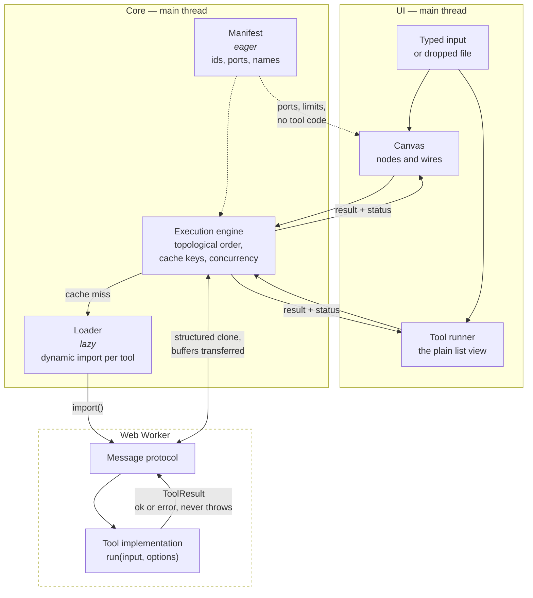
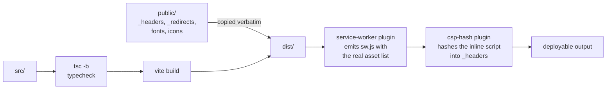

# Architecture

How a value gets from a text box to a result, and why the pieces are split the
way they are.

- [The shape of it](#the-shape-of-it)
- [The registry](#the-registry)
- [The execution engine](#the-execution-engine)
- [The worker boundary](#the-worker-boundary)
- [Incremental caching](#incremental-caching)
- [The canvas](#the-canvas)
- [State](#state)
- [Build and deployment](#build-and-deployment)

## The shape of it



Two things are load-bearing in that picture:

1. **The manifest is eager; implementations are not.** The canvas, the search
   box and the port-compatibility checks all need to reason about tools without
   loading a single line of their code.
2. **Nothing crosses the worker boundary as an exception.** A tool returns a
   `ToolResult` describing success or failure. A thrown error is a bug in the
   harness, not a way to report bad input.

## The registry

Two files describe every tool, and a test stops them disagreeing.

[`manifest.ts`](../src/features/registry/manifest.ts) holds the eager half: id,
name, summary, category, keywords, input and output ports, execution strategy,
size limits, and which option keys hold secrets. It is in the initial bundle.

[`loader.ts`](../src/features/registry/loader.ts) maps each id to a dynamic
`import()`. Each tool is therefore its own chunk, fetched when a node is added
or a tool page is opened.

`registry.test.ts` loads every implementation for real and asserts the two
descriptions agree — so a port added to a tool but not to its manifest entry
fails the build rather than producing a node with a missing socket.

### Ports are checked at compile time

A tool's `run` signature is _derived from_ its declared ports:

```ts
// A tool declaring a `bytes` input cannot be implemented with a function
// that expects a string — the type of `run` is computed from `inputs`.
type RunFor<T extends ToolSpec> = (
  input: InputsOf<T>,
  options: OptionsOf<T>,
) => Promise<ToolResult<OutputsOf<T>>>;
```

See [`types.ts`](../src/features/registry/types.ts). The practical effect is
that port compatibility is not a runtime string comparison that someone has to
remember to write — the compiler already refused the mismatch.

## The execution engine

Given a graph, the engine:

1. **Sorts it** into dependency order, rejecting cycles.
2. **Diffs it** against the previous run's cache keys (below).
3. **Runs what changed**, with independent branches executing concurrently up
   to a bound of 4 — so wiring twenty consumers to one source spawns four
   workers' worth of work rather than twenty.
4. **Reports per node**, not per graph.

Statuses are deliberately distinct:

| Status            | Means                                                                                                                   |
| ----------------- | ----------------------------------------------------------------------------------------------------------------------- |
| `blocked`         | A required input has neither a wire nor typed text. This is the normal state while you are still wiring, not an error.  |
| `error`           | This node failed. It shows why.                                                                                         |
| `upstream-failed` | Something this node depends on failed. It points back at the node that actually broke, rather than repeating the error. |
| `ok`              | Ran, produced output.                                                                                                   |

Runs are bounded at 100 nodes: beyond that the run is refused rather than
wedging the tab.

## The worker boundary

Tools with `strategy: 'worker'` run off the main thread. The protocol is a
small tagged union — request, result, error — and the engine owns a single
shared worker rather than spawning one per run.

Binary payloads are `Uint8Array` or `Blob`, never base64 strings internally.
Base64 is a display format; using it as a transport triples memory and costs a
copy in each direction.

Buffers are **transferred** rather than copied where possible, which is fast
and has one consequence worth knowing: a transferred `ArrayBuffer` is detached
in the sender. The engine copies before transferring anything it still needs,
which is a fix that predates most of the rest of this — a detached buffer
produces a zero-length result several steps later, which is a miserable thing
to debug.

Where `OffscreenCanvas` is unavailable, image work falls back to the main
thread and produces an identical result. `scripts/cross-browser-check.mjs`
asserts which branch was actually taken, so the fallback cannot rot unnoticed.

## Incremental caching

Each node has a cache key built from:

- its tool id,
- its options,
- its typed input, and
- **the cache keys of the nodes feeding it — never their values.**

That last choice is the whole point. Comparing upstream _keys_ is O(1)
whatever the data is, so a 30 MB decoded file never has to be hashed to know
whether it changed. Hashing values would make every run cost a pass over every
intermediate result, which is precisely the work the cache exists to avoid —
the cache would get slower exactly as the data got bigger.

The trade is that a key is an identity, not a fingerprint: two different
routes to the same bytes get different keys and both run. For a graph a person
wired by hand, that is a rounding error.

Editing one node re-runs that node and its descendants, and nothing else.
Typing is debounced, so a pipeline re-runs once you pause rather than once per
keystroke.

## The canvas

Hand-built — no React Flow — and lazily loaded, so a visitor who only opens
`/tools` never downloads it.

**Coordinates.** The plane is a 0×0 box with a `transform`; the transform _is_
the coordinate system, not a box that contains anything. Two consequences:
`reset.css`'s `svg { max-inline-size: 100% }` collapsed the wire layer to
nothing inside it (100% of zero), and the wire layer needs
`max-inline-size: none` and `overflow: visible` to paint outside its own
viewport.

**Input.** Wheel handling is a single non-passive listener on the canvas root,
batched into `requestAnimationFrame`. It is _not bound at all_ while an overlay
is open — overlays render inside that root, so a bound-and-guarded listener
would still cancel the dialog's own scrolling.

**Undo/redo** is a command history, not a stack of snapshots. Each mutation is
a small object holding just enough to do and to undo it. Memory is proportional
to the change rather than to the graph, a drag coalesces into one step, and
each entry can describe itself for the live region ("Undid move 3 nodes").
The price is that every command needs a correct inverse, which `graph.test.ts`
checks by applying and reverting each kind and asserting deep equality.

**Accessibility** is structural rather than added: the canvas is a
`role="application"` region so single letters reach it, each node is a
focusable `role="group"` whose accessible name states tool, position,
connection count, status and selection, and the tab order is the DOM order,
computed spatially. See the [keyboard map](../README.md#the-canvas) in the
README and [the connect flow](#) below.

## State

Three Zustand stores, split by what invalidates them:

| Store           | Holds                                 | Persisted           |
| --------------- | ------------------------------------- | ------------------- |
| `graphStore`    | nodes, edges, selection, undo history | `patchbay:graph:v2` |
| `viewportStore` | pan and zoom                          | no                  |
| `pipelineStore` | per-node run status and results       | no                  |

Execution status lives in `pipelineStore`, not on the node. It is _derived from
a run_, not part of the document — which is what the v1 → v2 migration was
about.

Saves are debounced, so a drag writes once rather than sixty times. Loads are
validated with Zod and cross-checked against the live registry; anything
corrupt, older, or naming a tool that no longer exists yields an empty canvas
and a message, never a crash.

## Build and deployment



Three Vite plugins do work that cannot be done by hand:

- [`service-worker.ts`](../vite/plugins/service-worker.ts) lists the finished
  build and writes `sw.js` with that list plus a build id derived from it. A
  hand-maintained precache list would be wrong the moment anything was edited.
- [`csp-hash.ts`](../vite/plugins/csp-hash.ts) hashes the inline theme
  bootstrap **from the built HTML** and substitutes it into `_headers`. Hashing
  the source would be hashing something the browser never executes.

- [`index-html.ts`](../vite/plugins/index-html.ts) strips HTML comments from
  the shipped document — the source explains itself at length and none of that
  is any use to a browser — and refuses to build if a `%VITE_SITE_URL%`
  placeholder survived or an og:image, og:url or canonical is not absolute.

The `{{INLINE_SCRIPT_HASHES}}` placeholder is not a valid CSP source, so a
build that somehow skipped the plugin produces an obviously broken policy
rather than a quietly permissive one. The same instinct runs through
`index-html.ts`: the failure modes it guards against are all silent ones, and
the build is the last moment anybody is looking.

### The head has two audiences

The complete Open Graph and Twitter set is static markup in index.html, because
crawlers and link-preview bots never run the router. The router's per-route
head — see [`head.ts`](../src/app/head.ts) — is for the tab strip and for
consumers that do execute JavaScript. The static tags are marked `data-default`
and removed on mount, because React hoists its own copies without removing
anything already present.

Deployment is Netlify. `_headers` and `_redirects` live in `public/` rather
than in `netlify.toml` so that the exact bytes deployed are the ones in the
repo, and so `scripts/serve-dist.mjs` can serve the built app under the real
policy — what is tested locally is what ships.
