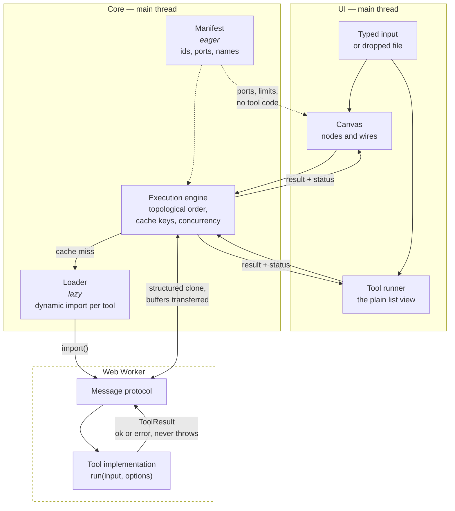
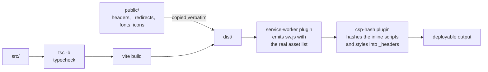

# Architecture

How a value gets from a text box to a result, and why the pieces are split the
way they are.

- [The shape of it](#the-shape-of-it)
- [The registry](#the-registry)
- [The port set](#the-port-set)
- [Where a value's bytes are](#where-a-values-bytes-are)
- [The execution engine](#the-execution-engine)
- [The worker boundary](#the-worker-boundary)
- [Incremental caching](#incremental-caching)
- [The canvas](#the-canvas)
- [The first screen](#the-first-screen)
- [The node inspector](#the-node-inspector)
- [A file as an input](#a-file-as-an-input)
- [The tool runner page](#the-tool-runner-page)
- [Between tools](#between-tools)
- [Notifications](#notifications)
- [Focus, pressing and the browser's own marks](#focus-pressing-and-the-browsers-own-marks)
- [State](#state)
- [Build and deployment](#build-and-deployment)

## The shape of it



Two things are load-bearing in that picture:

1. **The manifest is eager; implementations are not.** The canvas, the search
   box and the port-compatibility checks all need to reason about tools without
   loading a single line of their code.
2. **Nothing crosses the worker boundary as an exception.** A tool returns a
   `ToolResult` describing success or failure. A thrown error is a bug in the
   harness, not a way to report bad input.

## The registry

Two files describe every tool, and a test stops them disagreeing.

[`manifest.ts`](../src/features/registry/manifest.ts) holds the eager half: id,
name, summary, category, keywords, input and output ports, execution strategy,
size limits, and which option keys hold secrets. It is in the initial bundle.

[`loader.ts`](../src/features/registry/loader.ts) maps each id to a dynamic
`import()`. Each tool is therefore its own chunk, fetched when a node is added
or a tool page is opened.

`registry.test.ts` loads every implementation for real and asserts the two
descriptions agree — so a port added to a tool but not to its manifest entry
fails the build rather than producing a node with a missing socket.

### Ports are checked at compile time

A tool's `run` signature is _derived from_ its declared ports:

```ts
// A tool declaring a `bytes` input cannot be implemented with a function
// that expects a string — the type of `run` is computed from `inputs`.
type RunFor<T extends ToolSpec> = (
  input: InputsOf<T>,
  options: OptionsOf<T>,
) => Promise<ToolResult<OutputsOf<T>>>;
```

See [`types.ts`](../src/features/registry/types.ts). The practical effect is
that port compatibility is not a runtime string comparison that someone has to
remember to write — the compiler already refused the mismatch.

## The port set

Every tool declares its input and output ports, and for a long time each
declaration was written when that tool was written and never read beside the
others. The canvas can now show a node's output, which makes the ports the
thing a person reasons about while wiring — so they were audited as a set.
These are the rules that came out of it, and the reasoning is here rather than
in ten files because every one of them is about the set rather than about a
tool.

### The whole set, as it stands

| Tool              | In                                                         | Out                                                                                                               |
| ----------------- | ---------------------------------------------------------- | ----------------------------------------------------------------------------------------------------------------- |
| `base64`          | `input` Input · text, bytes                                | `output` Result · text, bytes — `report` Report · json                                                            |
| `structured-data` | `input` Document · text, json, bytes                       | `output` Converted · text — `data` Parsed data · json — `report` Detected · json                                  |
| `hash`            | `input` Input · text, bytes                                | `output` Digest · text                                                                                            |
| `jwt-decode`      | `input` Token · text                                       | `output` Decoded · json — `report` Report · json                                                                  |
| `diff`            | `original` Original, `changed` Changed · text, json, bytes | `output` Unified patch · text — `changes` Changes · json                                                          |
| `regex-tester`    | `input` Subject · text, bytes                              | `output` Result · text — `matches` Matches · json                                                                 |
| `color-convert`   | `input` Colour · text, color                               | `output` Converted · text — `swatch` Swatch · color — `all` Notations · json — `report` Report · json             |
| `image-convert`   | `input` Image · bytes                                      | `output` Converted · bytes — `report` Report · json                                                               |
| `text-convert`    | `input` Document · text, bytes                             | `output` Converted · text — `rendered` Rendered HTML · text — `detected` Detected · text — `report` Report · json |
| `video-remux`     | `input` Video · bytes                                      | `output` Repackaged · bytes — `report` Report · json                                                              |

Four `report` ports were added in round three and a fifth in round nine, and
they are one idea rather than five: a tool that loses something needs somewhere
to say so, and a `ToolResult` is a value or an error.

**The fifth is the one worth reading about.** `color-convert` was the only
shipped tool that changes values and had no such port at all, so there was
nowhere for "that OKLCH has no sRGB equivalent" to go — and the conversion
matrix carried the cell as `lossy, told` for five rounds regardless, because
its definition of that verdict requires a canvas node to say it and a canvas
node reads `warn` notes off a `report` port. A missing port is not a missing
sentence; it is a claim that cannot be true however the sentence is worded. `image-convert` and `video-remux`
invented the shape; `ReportView` already drew it. See
[docs/conversion-matrix.md](conversion-matrix.md#where-a-loss-is-said) for why
a port on its own is not enough, and
[A node keeps a summary, not a preview](#a-node-keeps-a-summary-not-a-preview)
for what the canvas does with them, and
[One verdict per node](#one-verdict-per-node-and-a-loss-that-follows-a-wire) for
how a loss reaches the nodes DOWNSTREAM of the one that reported it - a
per-note question, because `structured-data`'s `data` port escapes the losses
its `output` port carries.

`base64`'s first output was relabelled `Output` → `Result` at the same time,
and not for taste: the runner prints a port’s label only when a tool has more
than one output, so adding a second made "Output" appear under a panel heading
that says "Output". A label is a word for a person and free to improve; the id
is unchanged, so no share link and no saved canvas moved.

### The conventions, and what each one is worth

**A tool's first output is `output`.** It was on eight of the nine and `hash`
called its answer `digest`. That mattered because a node summarises its FIRST
declared output on the grounds that the first port is the tool's answer and the
rest are its working — a rule that was a per-tool lookup rather than something
the shape of the set guaranteed. It is asserted for every tool now.

**A tool with one input calls it `input`; a tool with several names each one.**
`diff` is the only tool with two, and neither of them is "the" input. The
v2 → v3 graph migration had to look a tool's first input port up in the live
registry precisely because this was not something it could assume.

**A port id is an identity; a label is a word for a person.** Ids appear in
edges, in `CanvasNode.inputs` and in share links, so renaming one is a breaking
change with a migration attached — see
[`retiredPorts.ts`](../src/features/canvas/retiredPorts.ts). Labels are free to
improve, and several did.

**A label has 84px and about eleven characters.** `Every notation`,
`Converted image` and `Detected source` were all drawn as a word and a half on
every node that had one. `Rendered HTML` and `Unified patch` deliberately sit
over the budget and take a tooltip instead, because in both the extra word is
information the port's data TYPE cannot carry.

**No label appears twice on one tool.** `color-convert` had an input labelled
Colour facing an output labelled Colour, which on a 224px node is two identical
words with nothing to tell them apart. The input is the one that could not
move: a colour converter's input is a colour.

**Every port has a description, and an output's is now shown.** A port's
description is the only documentation of it that reaches a person, and for an
OUTPUT port nothing on any route read it — an input's is its editor's
placeholder, an output's existed only in the manifest source. The Ports panel
on a tool page shows it. Inputs deliberately do not repeat theirs there, since
their prose is already on the page in the panel where it is acted on.

### A data type earns its place when a port carries it

`DATA_TYPES` held `image` and `datetime` and no port on any tool declared
either. `datetime` was merely dead — a payload shape no test could judge, and a
glyph in the canvas's port legend for a type the canvas could not produce.

`image` was worse than dead. Binary travels as `bytes` everywhere in this app
and the SNIFF says what it is, which is what makes `image-convert → hash` and
`image-convert → base64` legal wires. A separate `image` type would have made
exactly those illegal, and left every future author choosing between two types
for one concept with no right answer.

`color` is the counter-example and the reason the shape is worth having:
`color-convert` really does carry a parsed colour on a port, which is what lets
a colour hop between nodes without a lossy round trip through text.

### Every port that reads a document accepts bytes

This is the audit's main finding, and it was the same finding twice.
`structured-data` widened its document port to `bytes` some time ago and
recorded that refusing them "made the most obvious pipeline in the product
impossible". `regex-tester` and `text-convert` have the same port and had not
had the same fix, so:

- a decoded log file could not be wired into the regex subject, and
- a base64-decoded mail body could not be wired into the text converter.

Both were also inconsistent BETWEEN THE TWO ROUTES rather than merely
restrictive. A tool page has always accepted a dropped text file on either
tool, because the runner decodes a text-sniffed file before handing it over; it
was only the canvas, where the same bytes arrive on a wire, that refused. One
tool that accepts a file in one place and refuses it in the other is drift.

That was half the drift, and the other half was the affordance: the canvas could
not be handed a file at any port, whatever its types said. Both routes take one
now, through one implementation — see
[a file as an input](#a-file-as-an-input).

The two ports that still refuse bytes take a short LITERAL rather than a
document: a compact token and a colour. Their size limits say the same thing —
256 kB and 4 kB.

**Widening a port means refusing clearly, not guessing.** The risk of accepting
bytes is that non-text bytes get decoded to replacement characters and
processed anyway. `diff` did exactly that: two PNGs on its two ports produced a
valid unified diff of two walls of U+FFFD, an answer that looks like an answer
and means nothing. Every document port decodes through
[`lib/text.ts`](../src/lib/text.ts) now — strict UTF-8, with a UTF-16 byte
order mark as the one exception — and names which port could not be read,
because with two document ports "those bytes" is not an answer.

### What was deliberately left alone

**`hash` still refuses `json`.** Wiring `structured-data`'s parsed structure
into it looks obviously useful, and the digest of a STRUCTURE is undefined
until someone picks a serialisation: key order and indentation change the
bytes, so they change the number people compare across machines.
`structured-data`'s `output` port is where that choice is made explicitly, with
`sortKeys` and `indent` to control it. `diff` DOES accept `json`, and the
asymmetry is the point — an indentation choice changes how a comparison reads
rather than whether it is true.

**`jwt-decode` has one output, not a separate `payload`.** A port carrying just
the claims is the thing people would want downstream, and its entire effect
would be to detach the claims from the signature verdict — which is the one
thing this tool's whole design exists to prevent.

**`text-convert` keeps all three of those outputs**, and gained a fourth in
round three. See below, and [the port set](#the-whole-set-as-it-stands).

**Every input stays required.** No tool in the set does anything useful with a
missing input, and an optional port makes its value `| undefined` in `run`,
which is a question the tool then has to have an answer for.

### `Converted` and `Rendered HTML`, which was the specific question

It was not obvious how `text-convert`'s first two outputs differed when the
target format was HTML. The answer turned out to be two separate things.

**One was a defect.** `rendered` declares "always HTML, sanitised" and there
was no function in the markup pipelines that produced one: `markdownToHtml`
sanitises the HTML it generates, and the other two sanitise on the way to
something that is not HTML. So for an HTML source with any target but Markdown,
the port carried the input string unchanged — `<script>` elements and `onclick`
attributes included. Nothing ran: the preview iframe is `sandbox=""`. What did
happen is that the string went onto the clipboard through Copy as rich text and
out of the port into whatever node was wired to it, which are the two places a
port's promise is all anybody has. `sanitiseHtml` fixes it, and `output` is
byte-identical either way — all three pipelines already sanitised internally,
so it was only the port that was wrong.

**The other cannot be designed away, and the ports are right as they are.**
With a Markdown source and an HTML target the two ports really are the same
string, because converting a document to HTML and rendering it are the same
operation. Both alternatives cost more:

- **One port, presented as HTML only when the target is HTML.**
  `OutputPort.presentation` is static data in the eager manifest, and
  `registry.test.ts` compares manifest ports to implementation ports with a
  structural equality that a function property cannot pass — so "presented as
  HTML sometimes" is not expressible without giving that test up. Making it
  unconditional would draw Markdown output in an HTML preview.
- **A port that appears only for the targets where it differs.** Ports that
  come and go as options change was rejected when the port model was written,
  for a better reason than this one: a node whose shape moves under you while
  you are wiring it.

Losing the preview and the rich-text copy for the other two targets is a much
larger cost than one duplicated string, so the coincidence is stated on the
port's own description instead of being left for someone to find by reading two
identical text boxes. In the other five combinations the two differ, and the
html → html case is the interesting one: `output` is the normalising round trip
through Markdown, `rendered` is the source with nothing but the sanitiser
applied.

**`detected` was considered for removal and kept.** Nobody would sensibly wire
a sentence about a guess, which is the test this project applies to a port on a
224px node. It stays because the alternative is a wrong guess that is
invisible, and this tool guesses on every run by default — a `ToolResult` is a
value or an error, so there is nowhere else for an advisory note to go.
Reshaping it as a `report`-presented JSON port, the way `image-convert` handles
the same problem, would make it properly wireable and no more wired, for one
sentence written for a person.

### Renamed, and what the migration does

| Tool            | Was      | Is       | Why                                                                                                                               |
| --------------- | -------- | -------- | --------------------------------------------------------------------------------------------------------------------------------- |
| `hash`          | `digest` | `output` | The first-output convention above, which is now asserted rather than nearly true.                                                 |
| `image-convert` | `info`   | `report` | The port declares `presentation: 'report'` and is drawn by `ReportView`. Three names for one thing, none of them the word for it. |

Both are breaking changes to documents that already exist, and both are
migrated on both routes — the saved canvas at v4 → v5, and the share link at
v2 → v3. The table lives once, in
[`retiredPorts.ts`](../src/features/canvas/retiredPorts.ts), because three
places need the same answer and a second copy is a bug waiting for whichever
copy someone forgot.

**Not migrating was not an option, and neither was refusing.** An edge leaving
`hash.digest` still leaves a node that exists and arrives at a port that
exists, so nothing refuses it: the engine looks for a value on an output port
called `digest`, finds none, and reports `Nothing arrived on Original` against
the node BELOW — a node that is correctly wired and did nothing wrong. The rest
of the pipeline runs. That is a canvas that works except for the thing it was
built to do, with nothing on screen to say which wire is the problem. And
refusing every old link outright would break real pipelines belonging to real
people for a rename made for tidiness; two of the shipped presets end in a hash
node.

### `checkConnection` now guards the two routes from outside this session

`checkConnection` is the single source of truth for whether a wire is legal,
and it had three callers: the pointer drop, the keyboard flow, and
`validPartnersFor`, which both of those consult. The two routes that build a
graph from OUTSIDE this session — a share link and the saved canvas — had none,
and they are the two that most need one.

[`firstRefusedEdge`](../src/features/canvas/connections.ts) walks a graph's
edges onto a growing copy of it and returns the first one `checkConnection`
would refuse. Edge by edge onto a growing graph is not an optimisation: two of
the refusals are about the edges already present — an occupied input port, and
a cycle — so checking each edge against the finished graph would refuse every
edge for occupying the port it itself occupies.

Both routes now refuse the whole document, with the rejection's own sentence,
rather than applying part of it. Two silent repairs went with that change: the
share decoder used to skip an edge whose endpoint was missing, which
contradicted its own header — a link whose edges half survive IS a half-applied
pipeline, just one where the missing half is invisible — and the graph loader
used to filter the same edges out. `checkConnection` already reads a missing
endpoint as "that port no longer exists", so keeping the edge and refusing the
document gives one rule for every unusable wire instead of a filter in one
place and a check in another.

Nothing in the app can produce such a document: every route into the store goes
through `checkConnection`, and any new command clears the redo branch. This is
a guard against documents from elsewhere, not a state the canvas can reach by
itself.

**The presets are checked too.** A preset names ports as bare strings, which
makes it the one place in the app that can reference a port that does not
exist — and it failed exactly as quietly as the stale share link did. Every
preset wire goes through `firstRefusedEdge` in `ports.test.ts`.

## Where a value's bytes are

A `bytes` value used to be a whole `Uint8Array`, and inside every tool but one
it still is. It carries a **`BinaryData`** now, which says where the bytes are
rather than holding them:

| Kind       | Holds                                  | Where it comes from                     |
| ---------- | -------------------------------------- | --------------------------------------- |
| `resident` | a `Uint8Array`                         | every tool's output that fits in memory |
| `deferred` | a `Blob`, its size, and its first 4 kB | a chosen `File`, or a large tool output |

This exists for one tool and one problem. `video-remux` refused anything over
256 MB, and nearly every file it exists for is larger: a DivX film is 700 MB to
1.4 GB, an hour of tuner recording is 2 to 4 GB, AVCHD clips are split at 2 GB
by the format, and an OpenDML AVI exists _because_ the format cannot address
past 2 GB. What made 256 MB the number was not video. It was that a run held
the input three or four times over.

### Why a blob, and not a stream

The obvious shape for this is a stream, and a stream is the wrong shape, for
two reasons that had both been written down as objections before any of it was
built.

**Inputs are borrowed rather than transferred, deliberately, so one output can
feed several inputs.** A stream that can be consumed once is in direct tension
with that guarantee: the second consumer gets nothing, and on this canvas
twelve consumers on one binary output is a case that is asserted rather than
assumed. A blob is in no tension with it at all — it is immutable and
re-readable, so reading it does not spend it, and a fan-out costs twelve
pointers.

**The result cache holds whole outputs for the life of the tab, and its whole
design is that it never has to look at a value.** A deferred value is a
reference, so that stays exactly as true of a two-gigabyte output as it was of
a two-kilobyte one. Nothing in the cache changed.

And the third property is the one that made it worth doing at all: **a blob
crosses `postMessage` by reference.** Measured in all three engines, handing a
512 MB blob to a worker takes 0.0–6.0 ms, against 294 ms merely to allocate and
fill 64 MB of ordinary memory. The structured clone that used to be the second
copy of the input is not a copy.

### Two classes of tool, and what the other class has to know

The reason this was declined once before is worth keeping: **a streaming value
that some tools handle and others quietly buffer would be worse than an honest
ceiling.** So a tool declares how it reads binary input, and what it is handed
is derived from that — the same mechanism that already derives its `run`
signature from its ports.

| Class      | `run` receives | Tools                      |
| ---------- | -------------- | -------------------------- |
| `resident` | `bytes`        | the other nine             |
| `windowed` | `source`       | `video-remux`, and only it |

A windowed tool's input **has no `bytes` member at all.** That absence is the
whole mechanism: a tool cannot quietly buffer a value it has no way to ask for
whole, and one that declared `windowed` and reached for `input.bytes` would not
compile. The class is a property of the implementation rather than of the
manifest, set by which factory built it — `defineTool` or `defineStreamingTool`
— so the two descriptions cannot drift apart.

**What the resident tools have to know about the windowed one is: nothing.**
That is the design goal rather than a happy accident. A deferred value arriving
at a resident tool is materialised in `eraseTool`, which is the one place in the
app that buffers a whole value on a tool's behalf — and by the time it does, the
engine has already refused anything over that tool's own `maxInputBytes`. So a
resident tool cannot be handed more than the number it wrote down about itself,
however large the value on the wire was. A two-gigabyte video output wired into
`hash` fails as a size refusal naming both numbers, before anything is read.

The places that _describe_ a binary value rather than process it — the sniff,
the node summary, the output panel's preview and its Download button — work on
either kind without knowing which they have. That is what the **head** is for:
the first 4 kB travels beside the reference, which is already this app's idea of
enough to know what something is, since `sniffBytes` never looks further. So
`resultSummary` still runs synchronously during a render against a value whose
bytes are on disk.

### What has a ceiling now, and what does not

Reading no longer has one worth stating. An input arrives as a `File` the
operating system is holding; the tool walks it through a window; nothing
assembles. A 320 MB transport stream is repackaged in 2.4–4.0 s in Gecko
and 3.9–6.0 s in JavaScriptCore, and **the page reads 4096 bytes of it** —
measured in `checkLargeVideo`, by counting `Blob.prototype.slice` and
`.arrayBuffer` on the main thread for `File` receivers. The spread is the
machine's load rather than the file's; a busy laptop took 14.8 s for the same
work, which is still a repackage of a file the tool used to refuse outright.

The **answer** has one, and it is a browser's rather than a choice here. A
download is one blob, and blob storage is not unbounded: assembling 8 MB parts
in a worker and reading the result back after each, Chromium stops at 1.88 GiB
with a `NotReadableError`, while Gecko and JavaScriptCore both went past 4 GiB
without complaint. `MAX_BLOB_BYTES` is Chromium's number because Chromium's is
the one that binds, and the video tool refuses an output over it **before
copying anything**, naming the size and pointing at the audio operation, which
is not affected. A failure at the moment somebody presses Download, after
several minutes of work, is the worst possible place to discover a limit.

Two smaller things follow from the same measurements. A windowed read runs at
868 MB/s in JavaScriptCore, 1149 in Chromium and 4163 in Gecko, through
`FileReaderSync` — the only synchronous way to get bytes out of a blob, and the
reason four container readers did not have to be rewritten as asynchronous
state machines. And it exists **only in a worker**, which is why `ByteSource`
has two implementations and why the unit suite always takes the materialising
one: jsdom has no worker, so nothing in `pnpm test` has ever executed
`FileReaderSync` even once. That is what `checkLargeVideo` is for.

## The execution engine

Given a graph, the engine:

1. **Sorts it** into dependency order, rejecting cycles.
2. **Diffs it** against the previous run's cache keys (below).
3. **Runs what changed**, with independent branches executing concurrently up
   to a bound of 4.
4. **Reports per node**, not per graph.

Statuses are deliberately distinct:

| Status            | Means                                                                                                                   |
| ----------------- | ----------------------------------------------------------------------------------------------------------------------- |
| `blocked`         | A required input has neither a wire nor typed text. This is the normal state while you are still wiring, not an error.  |
| `running`         | In flight: its tool has been started and has not settled yet.                                                           |
| `error`           | This node failed. It shows why.                                                                                         |
| `upstream-failed` | Something this node depends on failed. It points back at the node that actually broke, rather than repeating the error. |
| `ok`              | Ran, produced output.                                                                                                   |
| `idle`            | Has not run. Also where a node goes when a run is **cancelled** — see below.                                            |

Runs are bounded at 100 nodes: beyond that the run is refused rather than
wedging the tab.

### What the concurrency bound is actually for

There is **one worker, and one thread behind it**. Four concurrent nodes are
not four cores; they are four messages in one queue. So the bound is not about
parallel CPU at all — raising it would not make a pipeline faster. What it buys
is that the worker's queue is never empty (its next tool's `import()` overlaps
the current tool's work) and that a main-thread tool can run while worker tools
are in flight.

What it costs is memory: every in-flight node's inputs are cloned into the
worker, so a large bound means several multi-megabyte intermediates alive at
once, and a longer wait in the queue for each. Four keeps the pipe full at a
small, bounded footprint. It is a scheduling decision, not a parallelism one,
and the earlier description of it here — "four workers' worth of work" — was
simply wrong.

### A deadline measures a tool's own work

The worker sends `started` between importing a tool and running it, and the
engine restarts that request's deadline when it arrives.

This matters because of the paragraph above: several requests posted together
are a queue, and timing a request from the moment it was _posted_ spent its
deadline on other tools' work. A regex node's 2 second limit, queued behind an
image conversion, reported a timeout for work it had not begun.

The timer armed at post time is not simply cancelled, because a request the
worker never acknowledges at all — the worker wedged before reaching it — still
has to fail rather than hang. The practical guarantee is therefore: **at most
`timeoutMs` waiting, then `timeoutMs` running.**

**And which of those two ran out is now in the message.** It is two clocks and
it used to be one sentence: a request the worker never reached was reported with
the words for a tool that ran too long — for a tool declaring its own
`timeoutMessage`, a specific and confident wrong diagnosis. On a canvas that is
an image conversion wedging the worker and the base64 node queued behind it
announcing, fifteen seconds later, that base64 is slow; with `regex-tester` in
that position the user is told their pattern is backtracking catastrophically
about a pattern that was never compiled. `starts` is zero in exactly that case
and the engine already had it, so the only thing missing was saying so. The code
stays `timeout`, because the node's status word is the same fact either way and
a new one would be a new word on screen for no gain.

**And `timeoutMs` is now a budget plus a rate**, for the one tool that needed
it to be. A constant was honest while every tool's accepted input was bounded
in the megabytes; `video-remux` now accepts 4 GiB, and a number that fits a
four-minute phone clip strangles an hour of broadcast while a number that fits
the broadcast lets the clip hang for twenty minutes before anybody is told
anything. `timeoutMsPerMiB` is added to the constant from the measured size of
the request's inputs, and the video tool declares 20 — 50 MB/s, an order of
magnitude under the 868–4163 MB/s a windowed blob read was measured at, so the
budget has room for the parsing between the reads. Nothing else changes: the
clock is still restarted when the tool actually begins, so this is still a
budget for the tool's own work rather than for the queue.

### One node's timeout, and everything else in flight

A wedged synchronous tool cannot be interrupted from inside. The only remedy is
to destroy the worker and build a new one — and that takes down every _other_
request that happened to be in flight.

Those requests are **replayed onto the fresh worker**, not failed. A tool is a
pure function of its inputs and options, so running it again produces the answer
it would have produced, and reporting a failure on a node the user did nothing
to is the outcome worth avoiding. A base64 node beside a runaway regex used to
sit there for its own full 15 seconds and then report a timeout it never had.

Replay is refused in one case, deliberately: **its budget is spent.** The
budget counts **starts, not replays**, and that distinction is the whole of it:
a request still queued behind a wedged worker has not executed one instruction,
so it cannot be the poison the cap exists to contain. A request that has never
started keeps its budget however many times a neighbour destroys the worker
underneath it; one that ran and was killed anyway gets a single further attempt
and then reports. There is an absolute ceiling above both, because a worker
death is cheap to cause and a worker boot is not.

There used to be a second case — a request whose buffers had been transferred,
and so detached — which this section described as "a guard rather than a live
path". It went in round fifteen with the transfer option it guarded; see
[the worker boundary](#the-worker-boundary).

**The ceiling is what the starts rule is bought with, and nothing was holding
it.** Raising `MAX_REPLAYS` to infinity failed no test in this repository until
round four, which is the whole shape this round was looking for: the rule's
_benefit_ had two tests and its _bound_ had none. The case that needs the bound
is the one the rule cannot see — a request that kills the worker **before it can
report `started`**, which is indistinguishable from a request merely queued
behind one. Such a request is treated as innocent and gets the full never-started
budget, so a neighbour timing out repeatedly replays the poison; what stops that
being unbounded is the ceiling, and it is now asserted as a number. Nine posts:
one original and eight replays, after which the request reports rather than
booting a ninth worker.

#### Why the budget counts starts

It used to be one replay per request, full stop, and a canvas produces two
worker deaths without anything unusual happening.

Type a catastrophically backtracking pattern into a regex node; pause past the
pipeline's 300 ms debounce; type into a base64 node beside it. The second edit
cancels the first run, and a cancelled run is deliberately **not cached** (see
below), so the new run re-posts the runaway — two copies of it are now queued.
The first copy's deadline destroys worker one and the base64 request is
replayed; the replayed runaway wedges worker two, whose death finds the base64
request out of budget and fails it with _"This run was interrupted before it
could finish."_

Measured on an idle machine with no CPU load, **10 runs out of 10 in both
engines**: the base64 node reported `error` at ~3.6 s, the node downstream of it
reported `upstream`, and the worker had never sent a `started` for the base64
request at all. It is not a slow-machine problem — what decides it is whether
two edits fall more than 300 ms apart, which is what typing into one node and
then another looks like. Load only widens the gap.

`check:browsers` now drives that scenario with the pause in on purpose, in both
engines, because the version that typed as fast as the driver could was passing
for a reason unrelated to the app being right.

A worker `error` event is treated differently: nothing is replayed. A timeout
tells us exactly which tool misbehaved and that the others were innocent; an
`error` says the worker itself is broken, and a fresh worker built from the same
code would break the same way.

`scripts/cross-browser-check.mjs` drives this in both engines with a real
pattern that really does wedge a real worker. jsdom has no Worker, so the unit
suite can only assert it against a main-thread stand-in.

### Cancellation is not a result

A cancelled node returns to `idle`. It did not fail and it did not run, and
nothing about it is written to the cache.

That last clause is the whole point. A cancellation used to be stored like any
other error, under a key computed from a document that had not changed — so the
next run was a cache **hit**, and the node reported "Cancelled." forever without
ever executing again. Editing the node was the only way out, and nothing on
screen said so.

### Cancelling tells the worker to stop; it does not make it stop

This is the half of cancellation that is about the worker rather than about the
node, and it was missing.

Cancelling settles the caller immediately — waiting on a tool that may never
check its signal is the thing cancellation exists to avoid — and it used to
forget the request entirely at the same moment: entry dropped, deadline
cleared. But a synchronous tool cannot be interrupted from the outside, so a
request that had wedged the worker was still wedging it, and **the deadline
that was just cleared was the only thing in the system that would ever have
destroyed that worker.** Nothing was left holding a reference to a thread
spinning inside `RegExp.exec`.

What that cost is not theoretical, and it is one keystroke away: editing or
deleting a node while a runaway one is in flight supersedes the run, and a
superseded run is cancelled exactly like this. The next run is then posted to
the stranded worker and waits there — with the main thread idle and every node
on screen saying `Running` — until either the wedging tool happens to give up
by itself or the waiting node's **own** deadline expires.

Measured through the whole app, by deleting a runaway regex node mid-run and
then feeding an unrelated base64 node: **10.8 s in WebKit and 4.1 s in Gecko,
against 2.1 s in both** once the cancelled request keeps its deadline. Those
first two numbers are the runaway pattern giving up on its own — JavaScriptCore
and SpiderMonkey abandon it at different points, which is the only reason it is
seconds rather than the bound. The bound, for a tool that genuinely never
returns, is the waiting node's own timeout: 15 seconds for base64, 60 for an
image conversion. A pipeline that appears to hang for a quarter of a minute
with nothing running does not read as a slow tool. It reads as a broken app.

So a cancelled request keeps its deadline. The caller is settled and hears
nothing further — when this was written that included progress messages, and
the progress channel has since been removed altogether — but the entry stays until either the
worker answers for it or its time runs out, and if the time runs out the worker
is replaced and the innocent requests beside it are replayed, exactly as for
any other timeout. A cancelled request is never itself replayed: nobody is
waiting for its answer, and on the canvas replaying one is a whole superseded
pipeline executing a second time.

`checkPipeline` holds this by **which worker** the next run starts on: the
runaway's worker has to be among those terminated, and the base64 run after it
has to start on a different one. Until round seventeen it asserted a time
instead — the next run finished inside 10 s — and that could not fail in
either engine: the pattern it drove gave up by itself in about 1.5 s in
JavaScriptCore, and the defect's own Gecko figure, 4.1 s, was under the bound
from the start. The check now drives `WEDGE_PATTERN` (see [the two engines and
catastrophic backtracking](#known-limitations) below), and
against the defect put back it is red in both engines.

No new number was introduced for this, deliberately. The guarantee is the one
the tool already declares: **a request cannot hold the worker past its own
limit, whether or not anybody is still listening for the answer.** A
cooperative tool releases the deadline as soon as it notices the signal, which
is the usual case and costs nothing.

### What the intermittent worker-wedge failure actually was

`checkPipeline`'s second sub-check failed about one WebKit run in three, and
was filed against the scheduler: _"a scheduled pipeline run is delayed by
around 25 seconds while the main thread sits idle."_ It is worth writing down
that **nothing was ever delayed**, because the shape of the report sent the
investigation at the scheduler twice over, and the scheduler was blameless.

What the check does is type a catastrophic pattern into a regex node, type a
payload into an unrelated base64 node, and then wait up to 25 seconds for each
to reach its expected state. In a failing run the regex node sat at `blocked` —
which is what a node with **no input at all** says — for the whole window, and
the assertion below it read 25 000 ms. That number was not a delay. It was the
poll's own timeout expiring, because the node it was watching had nothing to
run and never would.

The text never reached the node. `fill` puts a value in the box and fires the
events; it does not know whether anything took it, and the canvas's [deferred
focus move](#the-keyboard) took focus off the field between Playwright focusing
it and inserting the text, so the characters went to the close button. Measured: the
saved graph after a failing run holds `regex-tester: {}` — not an empty string,
no key at all, so the store's setter was never called once.

The chain of evidence, in the order it was established:

1. The canvas moves focus to **Close the inspector** one animation frame after
   `Enter`, in both engines. Pressing `Enter` and typing `hello` leaves the
   editor empty.
2. In a failing run the value never enters the graph store, while `fill`
   reports success and the field's `aria-label` still names the right node.
3. Making that frame arrive late — replacing `requestAnimationFrame` with a
   40–90 ms timer, which is only what CPU load does to it — reproduces the loss
   directly, with focus observably on the close button and the field empty.
4. Interposing one extra round trip between locating the field and filling it,
   which lets the frame land first, took the failure rate from 2 in 18 to 0 in
   46 without changing anything else.
5. With the focus move fixed: 25 consecutive clean runs under the same load
   that produced the failures.

Two things follow for the harness rather than for the app. `typeInto` now
**verifies that what it typed arrived** — the editor is a controlled field, so
the box still holding the text a moment later is proof the graph has it — and a
precondition that can fail quietly is a check that blames the wrong thing
twenty-five seconds later. And the `Enter`-into-the-editor behaviour is asserted
directly, in both the unit suite and `check:browsers`, so it is a named failure
rather than a symptom somewhere else.

### Where else a long unexplained wait can come from

The failure a user experiences as the product being broken, rather than as an
error, is a wait with nothing on screen to explain it. Three were found in this
pass, and they are the ones worth keeping in mind when this code changes:

- **A cancelled request stranding the worker** — fixed above; measured at 10.8
  seconds of `Running` with nothing running, bounded only by the waiting node's
  own timeout.
- **A tool running twice** — see the worker boundary; it doubles every wait in
  Safari rather than creating one.
- **Main-thread image conversion**, which blocks its own deadline and everyone
  else's. Already recorded under [known
  limitations](#known-limitations) and unchanged.

Two more were looked at and found sound. A run superseded mid-flight can leave
the previous `runPipeline` winding down beside the new one, sharing the result
cache — but a cancelled node writes nothing to the cache and every emission is
gated on the run token, so the worst case is a wasted re-run rather than a
stale answer. And a node whose upstream produced nothing reports `blocked`
rather than waiting: the pump resolves when nothing is active and nothing is
ready, so there is no state in which the graph is waiting on a value that
cannot arrive.

## The worker boundary

Tools with `strategy: 'worker'` run off the main thread. The protocol is a
small pair of tagged unions — `execute`, `cancel`, `ping` and `preload` in,
`started`, `settled` and `ready` out — and the engine owns a single
shared worker rather than spawning one per run.

Binary payloads are `Uint8Array` or `Blob`, never base64 strings internally.
Base64 is a display format; using it as a transport triples memory and costs a
copy in each direction.

Buffers travel in one direction transferred and in the other copied, and the
asymmetry is the point.

**Outputs are transferred** back from the worker: nothing in there reuses them,
so moving ownership is free. **Inputs are borrowed** — structured cloned — from
every call site in the app, because on a canvas one output feeds several
inputs, and a transferred buffer would be detached by whichever consumer ran
first, leaving the rest with a zero-length view and no error to explain it.
There used to be an `ownership: 'transfer'` option for a caller that could
prove single consumption. Nothing ever passed it: its one prospective caller was
the ffmpeg-based transcoder that
[the feasibility study](video-convert-feasibility.md) proposed, which would have
handed MEMFS's copy of a large output across without cloning it. The transcoder
was never built, the remuxer that was built reads a blob — which crosses by
reference, with nothing to transfer — and the option went in round fifteen,
with the replay refusal only it could reach.

A detached buffer produces a zero-length result several steps later, which is a
miserable thing to debug, so the fan-out case is asserted on the actual bytes
rather than on the shape of the result — twelve consumers, past the concurrency
bound, each checked against a known digest.

**None of that applies to a deferred value, and it needed no exception to be
carved for it.** A blob crosses `postMessage` by reference, so there is no copy
for a transfer to save and no buffer for one to detach; `collectTransferables`
simply finds nothing to collect. The list of transferables is about the
resident values, which are the small ones. See [where a value's bytes
are](#where-a-values-bytes-are).

Where `OffscreenCanvas` is unavailable, image work falls back to the main
thread and produces an identical result. `scripts/cross-browser-check.mjs`
asserts which branch was actually taken, so the fallback cannot rot unnoticed.

### The worker's entry is also a library, which ran every tool twice in Safari

`worker.ts` is the module the worker is constructed from, and it registers a
`message` listener on its global scope. It is also a **shared chunk**: the tool
chunks it dynamically imports import it back for the registry helpers Rollup
placed alongside it, and the page's own bundle imports it for the same reason.
An entry that doubles as a library gets evaluated in places nobody meant it to
be, and a global side effect run twice is not idempotent.

Both places turned out to be real, and neither was visible from any test that
looked at answers:

- **In the worker**, JavaScriptCore evaluated the entry a second time when a
  tool chunk imported it, so `message` had two listeners and **every request
  ran its tool twice**. Measured over a base64 → structured data → hash chain
  in Playwright's WebKit: two `started` and two `settled` for every one
  `execute`, from the first run on a fresh worker. Gecko evaluates it once and
  was always clean. Nothing was ever _wrong_ — a tool is a pure function, so
  the second answer equals the first and the engine drops it as a late reply to
  something already settled — it simply cost twice the CPU and twice the peak
  memory of every worker tool in Safari, which for a 20 MB image conversion is
  the whole difference.
- **On the main thread**, `self` is the window, so the same evaluation put a
  `message` listener on the _page_ that would run a tool for anything able to
  `postMessage` to it. Nothing can today — the one iframe in the app is the
  `sandbox=""` preview, which cannot script — but a page whose entire promise
  is that nothing you paste leaves it should not carry an unintended global
  entry point to its own executor.

The listener is registered once now, guarded on the global scope rather than in
module scope: two evaluations are two module scopes, and the thing that has to
be unique is the listener on the one global they share. It is also skipped
entirely outside a worker.

This is a build shape as much as a code one, and the check that would catch it
coming back is a **count** rather than an assertion about a result:
`checkPipeline` now counts `started` messages against the `execute` messages
posted, because no assertion about an answer can see a pure function run twice.

## Incremental caching

Each node has a cache key built from:

- its tool id,
- its options,
- its typed input,
- its file inputs — per port a name, a size and a token, never the bytes — and
- **for each wire arriving at it: which input port it arrives at, which output
  port it leaves from, and the upstream node's cache key — never its value.**

That last choice is the whole point. Comparing upstream _keys_ is O(1)
whatever the data is, so a 30 MB decoded file never has to be hashed to know
whether it changed. Hashing values would make every run cost a pass over every
intermediate result, which is precisely the work the cache exists to avoid —
the cache would get slower exactly as the data got bigger.

The trade is that a key is an identity, not a fingerprint: two different
routes to the same bytes get different keys and both run. For a graph a person
wired by hand, that is a rounding error.

**The wiring is part of the identity**, and it was not always. The key used to
be the sorted _set_ of upstream keys, which cannot tell apart two graphs that a
person would never confuse:

- Swap the two wires into a `diff` node. The set is unchanged, so the cached
  patch is served for the reversed comparison — a well-formed unified diff with
  its two sides the wrong way round.
- Move a wire from a tool's `output` port to its `data` port. Same upstream
  node, entirely different value; the set is unchanged again, so the previous
  port's answer is served for the new one.

Both produce output that is confident, well formed and stale, which is the
worst failure a cache can have: nobody reports it, because nothing looks wrong.
Order within the key is normalised on the _receiving_ port, so the order edges
happen to sit in the document still cannot change it.

Two things are **not** cached, and both are deliberate:

- **Cancellations.** See the engine section above.
- **Nodes that no longer exist.** The cache is keyed by node id and holds whole
  outputs, so an entry for a deleted node would hold that node's decoded file
  for the life of the tab. Entries are pruned at the start of each run, which is
  the one place that sees both the cache and the graph it belongs to.

**A deferred value in the cache is a reference and not a file.** The cache's
design rationale — that it never has to look at a value — is what made this
survive the change to the value model untouched: an entry holding a
two-gigabyte repackage holds a blob handle, and the bytes behind it are the
browser's problem rather than the tab's. The pruning above still matters for
exactly the same reason it did, because a handle nobody drops is a file nobody
frees.

Editing one node re-runs that node and its descendants, and nothing else.
Typing is debounced, so a pipeline re-runs once you pause rather than once per
keystroke.

## The canvas

Hand-built — no React Flow — and lazily loaded, so a visitor who only opens
`/tools` never downloads it.

**Coordinates.** The plane is a 0×0 box with a `transform`; the transform _is_
the coordinate system, not a box that contains anything. Two consequences:
`reset.css`'s `svg { max-inline-size: 100% }` collapsed the wire layer to
nothing inside it (100% of zero), and the wire layer needs
`max-inline-size: none` and `overflow: visible` to paint outside its own
viewport.

**Input.** Wheel handling is a single non-passive listener on the canvas root,
batched into `requestAnimationFrame`. It is _not bound at all_ while an overlay
is open — overlays render inside that root, so a bound-and-guarded listener
would still cancel the dialog's own scrolling. The inspector is not an overlay
and is not inside that root; see
[the note on why](#it-is-a-sibling-of-the-canvas-not-a-child-of-it).

### One listener, three pointing devices

A mouse wheel, a trackpad two-finger scroll and a trackpad pinch all arrive at
that one listener, and the numbers they arrive in differ by about fifty times.
The arithmetic that reconciles them is in
[`wheel.ts`](../src/features/canvas/wheel.ts), DOM-free and unit-tested, for the
reason `pinch.ts` is.

| Gesture                      | What the engine reports                                                                                                      |
| ---------------------------- | ---------------------------------------------------------------------------------------------------------------------------- |
| Mouse wheel, Chromium/WebKit | pixels; conventionally 100 per detent, but scaled by the OS "lines to scroll" setting, so 33, 40, 53⅓, 120 and 400 all occur |
| Mouse wheel, Firefox         | **lines** — `deltaMode` 1, three of them per detent                                                                          |
| Trackpad pinch               | pixels, synthesised as ctrl+wheel: a stream of one- and two-pixel events, several per frame                                  |

This used to be one expression, `exp(-deltaY * 0.01)`, and that coefficient is
correct — for a trackpad. It is the convention Chromium and WebKit scale their
synthesised pinch deltas against, so a two-pixel event moved the zoom by 2%.
Handed a mouse detent's hundred pixels it returns **e**: one notch of the wheel
multiplied the zoom by 2.72, the reachable scales were 33%, 90% and 250%, and
three notches spanned the whole range. In Firefox the same detent arrived as
`deltaY: 3` and moved the zoom by 3%, and the pan — which used `deltaY` raw —
moved the canvas three pixels where Chrome moved it a hundred.

Two steps fix all of it, and neither of them sniffs the device:

1. **Normalise to pixels once.** `deltaMode` says which unit, and one detent is
   100 pixels or 3 lines, so the conversion between them is fixed by the
   requirement that a detent pan the same distance in every engine. Pan uses the
   result directly.
2. **Convert pixels to notches, then cap at one notch per event.** The rate is
   the trackpad's — 12 pixels per notch, from `100 · ln 2 / 6` — and the cap is
   the mouse's. Every detent, in every engine and at every OS setting, is over
   the cap, so every detent is exactly one notch. Every trackpad event is a
   fiftieth of a notch and never reaches it, so a pinch stays continuous. The
   magnitude separates the devices on its own.

A notch is `2^(1/6)`, about 1.12. Six notches double the zoom, twenty cross the
whole 0.25–2.5 range, and the ladder passes exactly through 200%, 50% and 25% —
so the round scales are reachable rather than lucky. `+` and `-` walk the same
ladder two notches at a time, which is three presses per doubling; before them
there was no way to zoom from the keyboard at all, only `0` to reset and `F` to
fit.

**With Ctrl or Cmd held, all three belong to the browser**, because they are
its page zoom and taking them would be worse than not having these. `+` and `-`
always stood down for that reason; `0` did not, and took `Ctrl+0`, the
browser's zoom reset, until round seventeen. So did Ctrl with `K`, `?`, Space,
Enter, Escape and the arrows. The canvas now takes only four chords — `Ctrl+A`,
`Ctrl+D`, `Ctrl+Z` and `Ctrl+Y` (`CHORD_KEYS`) — and `shortcuts.bindings.test.tsx`
presses every key bare and with Shift, Ctrl and Ctrl+Shift on a real canvas and compares what it
took with `SHORTCUTS`, both ways, which is how the `0` case, and two bindings
the list did not name, `Ctrl+Y` and `Backspace`, were found.

**Notches accumulate; the pointer does not.** The pending buffer used to hold a
factor and be _assigned_ on every event, so of the several events that arrive
between two frames only the last one's zoom survived. Notches are additive —
summing them and exponentiating once is the same answer as multiplying the
factors, and only one of the two can be written as `+=` — so a trackpad firing
three times a frame now contributes all three. The pointer is the last one seen.

### The grid is drawn, not composited

**A CSS gradient cannot put a one-pixel rule on a device pixel**, and every
remaining defect in the grid followed from that one fact.

The grid was eight `linear-gradient` layers tiled at the major square, with the
subdivisions at percentages of it. That structure was right — it is what fixed
the phase-lock bug (two tiles, rounded to device pixels independently, losing
agreement about where the eighth line falls) — and it could not fix this. The tile is
`GRID × 8 × zoom`, so at any zoom that is not a clean fraction the rules sit at
fractional positions. A 1px rule at x = 7.0 rasterises as one pixel of full ink;
the same rule at x = 7.5 rasterises as two pixels of half ink. Both carry the
same ink and they do not look the same — and because the subpixel offset marches
steadily across the tile and across tiles, **the difference between them
aliases**: crisp rules and split rules group into runs, and the runs read as
bands at a period of roughly `pitch / frac(pitch)`, which has no relation to the
grid's own spacing.

It is worse than a wash. Two half-ink pixels are composited in **sRGB**, which
is not linear, so a split rule reads _lighter_ than a crisp one carrying
identical ink. The smaller the pitch the larger the share of the grid that is
split, so the whole surface drifted lighter as you zoomed out.

Both were measured on the gradient build, over a bare strip of canvas at a
sweep of zooms. The third column is the same strip once the heavy rule cascaded
too — [below](#the-heavy-rule-cascades-and-that-is-what-makes-the-picture-the-same):

| Measure                                                              | Gradients             | Drawn             | Screen-anchored         |
| -------------------------------------------------------------------- | --------------------- | ----------------- | ----------------------- |
| Pixels away from the backdrop, at 100%                               | 44%                   | **23.4%**         | 23.5%                   |
| …against the geometry's own answer for one-pixel rules at that pitch | 23.4%                 | 23.4%             | 23.4%                   |
| Distinct shades covering a bare strip                                | a continuum           | **3–6**           | 3–8                     |
| Mean ink, over the whole zoom range                                  | 4.8 → 18.8 (**3.9×**) | 8.3 → 14.2 (1.7×) | 10.6 → 10.9 (**1.03×**) |
| …between 40% and 200%                                                | 2.6×                  | 1.23×             | not carved out          |
| Two zooms one octave apart                                           | —                     | —                 | **within 1.8%**         |

The working range stopped being worth stating separately. It was there because
the ends of the range were genuinely worse than the middle, and the reason they
were is the row above them: the whole-range figure is now inside what used to be
the exemption, so the harness asserts one bound over every zoom it samples.

The extra shades in the third column are the crossfade: mid-octave a rank is
part of the way from the minor ink to the major, and the rank fading in crosses
both of the heavy ones. Seven is the accounting, and the check is really looking
for the hundreds that antialiasing produces.

Twice the geometry's own coverage is the signature: every rule was two pixels
wide. Now every rule is rounded to a whole device pixel, so every rule is
exactly one device pixel of full ink — identical weight, no antialiasing, and no
aliasing of the antialiasing. `GridLayer` owns the bitmap and the ink;
[`grid.ts`](../src/features/canvas/grid.ts) owns where the rules go and is
tested without a DOM.

**The price, stated plainly.** Each rule is rounded _independently_, so it sits
within half a device pixel of where the world says it should and the error never
accumulates. What that costs is that the gaps are not all equal: each one is
within a device pixel of the true pitch, so at a pitch of 7.1 they run
7, 7, 7, 7, 8, 7, 7. A ripple of one part in seven in **spacing** replaced one
of one part in two in **ink** — and spacing is the axis the eye reads least in a
fine grid, where luminance is the one it reads most.

#### What was rejected, and why

|                                            | Fixes the rasterising | Cost                                                                                                                                                                                                                   |
| ------------------------------------------ | --------------------- | ---------------------------------------------------------------------------------------------------------------------------------------------------------------------------------------------------------------------- |
| Snap the **tile** to a device pixel        | yes                   | scales the whole grid by up to 3% at the bottom of the range — tens of pixels of drift between the grid and the nodes on it, sliding as you pan                                                                        |
| Snap the **zoom** so the pitch is integral | yes                   | zoom steps of up to 25%, undoing [the notch ladder](#one-listener-three-pointing-devices); and the quantum depends on the display's density, so the reachable scales differ per monitor and change when a window moves |
| Soften the rules to 2px                    | partly                | a blurry grid, and the variation is reduced rather than removed                                                                                                                                                        |
| **Draw it**                                | completely            | one bitmap repaint per viewport change, and ±1 device pixel of gap jitter                                                                                                                                              |

### What changes about the grid with scale

A grid at a fixed world pitch cannot read the same at every zoom: `GRID` world
units is 2px apart at the minimum zoom and 20px at the maximum, and a hairline
every 2px is a tone rather than a grid. **Something has to change with scale,
and what changes is which world level is drawn** — never the ink and never the
weight. A square just means more world when you are further away.

- **The ladder is anchored to the screen, not to the world.** Five ranks, every
  one a power of two times `GRID` world units, and which power is read off the
  zoom so that the finest fully-inked rank is always between eight and sixteen
  pixels apart. The whole ladder steps by an octave every time the zoom crosses
  a power of two.
- **The heavy rule steps with it.** It used to be pinned at `GRID × 8` world
  units so that a major square always meant eight snap steps; now it is eight
  _fully drawn squares_, which is the same sentence said about the picture
  rather than about the document. See [the heavy rule
  cascades](#the-heavy-rule-cascades-and-that-is-what-makes-the-picture-the-same)
  for what that bought and what it cost.
- **A level is fully inked once its on-screen pitch reaches `GRID` pixels** —
  the pitch the grid is authored at, which is what one square looks like at 100%
  zoom — and absent below half that, where the ink doubles to 25% coverage and
  the rules stop resolving as lines.

Both ends of that band are derived, and the factor of two between them does the
real work: the levels are themselves an octave apart, so a one-octave transition
band can hold only one of them. **At most one level is ever part-drawn.**

What falls out is stronger than "reads the same at every zoom". The picture is a
function of `log2(zoom) mod 1` and of nothing else, so **the view at any zoom is
the view at twice that zoom, rule for rule and shade for shade.** Measured off
the bitmap in a real engine, a row of canvas at 25%, 50%, 100% and 200% is the
same 50 rules at the same 8px pitch with the same 7 of them heavy; at 63% and
126% it is the same 80 rules at 5 and 6 px with the same four shades in the same
proportions.

**The finest rank is below the snap step, and it is deliberate.** The ladder used
to stop at `GRID`, on the argument that a rule finer than the snap step is a line
nothing can land on. The argument is true and it was the wrong conclusion:
because the ladder stopped, so did the cascade, and from 100% to 250% the finest
rules simply spread from 8px apart to 20px — three fifths of the grid's ink,
gone, over the top third of the range. A ruler's finest marks are not places you
put things either.

Once the ladder cascades the argument stops being coherent as well as wrong: no
rank has a fixed relationship to the snap step any more, and the finest one runs
from two snap steps at 25% to a quarter of one at 250%.

**And the fade is linear, because that is the shape that conserves ink.** It was
smoothstep, chosen so a level would arrive without a corner. Writing the ink out
shows why that was wrong:

```
ink(z) = 1/(64z) + Σ  sⱼ / (2 · pⱼ · z)
```

While one level is fading every coarser level is at full ink, and their sum
telescopes — so the total is `(1 + s) / (2ᵏz)`, and holding it constant gives
`s = (pitch − GRID_PITCH_MIN) / GRID_PITCH_MIN`, the plain linear ramp across
the octave. Smoothstep sits above that line through the middle of every octave,
so the surface ran up to 5% denser than it is authored at, peaking around 45%
zoom. A linear ramp holds the ink **exactly** constant across the whole range,
and it is gentler per notch than smoothstep was — a sixth rather than a quarter,
over the six notches an octave takes.

`grid.test.ts` asserts each of these as a property over a sweep of the range,
including that one notch of the wheel cannot switch a level on or off: the fade
exists because a pop would undo the point of having made the zoom continuous.

### The heavy rule cascades, and that is what makes the picture the same

It did not, and that was the last thing about the grid that changed with the
zoom. `GRID × 8` world units at every scale is a major square 16px across at 25%
— every second rule on screen a heavy one — and 160px at 250%, where one rule in
sixteen is. Same ink, wholly different picture, and it read as the surface
getting heavier as you zoomed out: **1.72× of mean ink across the range, 1.23×
between 40% and 200%**, measured over a bare strip in both engines. It is
**1.03×** now, over the whole range with no working-range exemption, and the
five octave pairs the harness samples agree to within 1.8% — which is the claim
the density bound is a consequence of rather than the other way round.

The property it was defended with is that a major square always means the same
number of snap steps. That property is real and **nothing reads it**: there is no
ruler, no readout in squares, and `snap` is `GRID` whatever the grid happens to
be drawing. So the trade went the other way. A major square is now 32 snap steps
at the bottom of the range and 4 at the top, and the backdrop is the same
backdrop at every zoom — which is the thing a person does read. `grid.test.ts`
asserts the price as well as the gain, so it cannot be rediscovered as a bug.

**The crossfade is forced rather than chosen**, which is the part worth writing
down. Once an octave, a rank has to travel from the minor ink to the major one.
Write the weighted ink out with `M` for the heavy rule's ink per pixel and `m`
for the minor's, over an octave parameterised by `t = zoom × octave` in [1, 2),
multiplied through by the heavy rank's screen pitch of `64t`:

```
64t · ink = M + [m + (M − m)·g] + 2m + 4m + 8m(t − 1)
```

— the heavy rank, the rank taking the weight over at `g`, the two ranks between
them, and the rank fading in. Holding the ink per pixel still gives
`(M − m)·g = (M − m)(t − 1)`, so **`g = t − 1` whatever the two inks are**: the
same linear ramp as the fade, and a theme cannot break the density by picking a
heavier major. It is one line in the code — a rank is heavy to the degree that
the rank eight times finer than it is itself drawn — and that line is the
conserving answer rather than a curve somebody liked.

At most one rank is part-inked and at most one is part-heavy, and they are never
the same rank: the two ramps sit three octaves apart on a five-rank ladder. That
is what lets `GridLayer` paint the crossfade as the minor ink with the major over
it at the weight, rather than having to interpolate two tokens it only holds as
strings.

#### What is left

Three things, and none of them is the picture changing between one octave and
the next.

- **Gap jitter, which varies _within_ an octave.** Each rule is rounded to its
  own device pixel, so at the bottom of an octave the pitch is a whole 8px and
  every gap is equal, while at `t = 1.26` it is 5.04px and the gaps run
  5, 5, 5, 5, 6. That is octave-periodic like everything else — 63% and 126%
  jitter identically — but it is not flat across the octave, and it is the one
  residue of the drawn grid that a person could in principle see. It is bounded
  per gap in `grid.test.ts` and it is what the scale-invariance pairs measure at
  1.8% rather than 0%.
- **A major square is no longer a fixed amount of world.** Stated above; it is
  the thing that was traded away.
- **Forced colours still pops once an octave.** There is one ink there and no
  faded rule is available, so the crossfade is rounded to its nearer end. A grid
  with a single weight that is also the same at every zoom has to change rank
  somewhere, and a pop at the octave boundary is the smallest place to put it.

Above 200% is no longer on that list. The ladder used to run out — nothing left
to fade in, so the grid could only spread, to 10px at 250% against the 8px it is
authored at — and a screen-anchored ladder does not run out, because there is
always another power of two below the one it is standing on.

### The screen is the bitmap: placed, and redrawn in the frame it is resized

Round twenty was a report from a phone at 50%, 59% and 71%: the coarse lines
denser on one half of the screen than the other, and a band a third of the way
down where the spacing changed. The guess was fractional zoom putting lines on
fractional pixels; the other suspect was the grid's draw-in, which had just
landed. **It was neither**, measured rather than argued:

- **Not the zoom.** At 390px, at 1x in both engines and at 3x in WebKit — a
  390px phone's density — every rule reached the screen at exactly the pixel
  and width the bitmap drew it, at all three zooms. Per-rule rounding puts every
  rule on a whole device pixel whatever the zoom; the only thing the zoom
  changes is the one-pixel gap jitter above, which is the same in every part of
  the viewport.
- **Not the draw-in.** Both mechanisms below date from `d787c85` (2026-09-11),
  the commit that made the grid a bitmap, two weeks before the motion round; and
  the screen matched the bitmap in every measurement taken after the draw-in
  had run.

What the measurements did find is that **the bitmap was not always the box it
was painted into**, and a bitmap that is not its box is scaled by the engine to
fit — which is the report's shape exactly: crisp where the scaling's phase is
whole and smeared where it is not, and a seam where it slips a pixel.

- **Every frame of the inspector's slide.** The grid redrew on a resize through
  a React state update, which renders after the frame paints, so each frame of
  the rail's width animation painted the previous frame's bitmap stretched into
  the new box: 12 of 13 frames in Gecko and 5 of 7 in WebKit, and at the fastest
  point a 1364px bitmap in a 1220px box, which moves a rule near the right edge
  by about a hundred pixels for one frame. That was item two of the same report,
  "the inspector shifts the grid". The layer now draws in its `ResizeObserver`
  callback, which runs after layout and before paint: 0 of 27 and 0 of 17.
- **Wherever the host is not a whole number of CSS pixels.** The bitmap was
  `Math.round(clientWidth × dpr)`, and `clientWidth` is an integer. On a phone
  at 2.625x — most Android phones — the CSS viewport itself is fractional: 1080
  device pixels is 411.43 CSS px, so the bitmap was 1079 pixels for a 1080-pixel
  box. `layerPlacement` in `grid.ts` covers the host's box outward in whole
  pixels and sizes the bitmap to exactly that.

**What round twenty could not reproduce, and round twenty-one did.** This
paragraph used to say that neither gate engine could render a fractional
density, so the case existed only as arithmetic, and that if the phone had been
a 3x iPhone the cause was not found. Both halves were wrong. The screenshots
came from **Chrome on Windows in its phone emulation**, which is Chromium at a
fractional density such as 2.625x; and WebKit's Playwright build renders a
fractional `deviceScaleFactor` too - nobody had asked it for one. Asked, both
failed every comparison at 1.25x, 1.5x, 1.75x, 2.625x and 2.75x: 80 of 80 in
WebKit, and every fractional case in Chromium, with every 3px rule 4px and
smeared on screen. The cause is the paragraph below. Whether it is all of what
the screenshots showed cannot be said from here: a smear across the whole layer
is not by itself a band a third of the way down, and the device-toolbar zoom
further down is a second candidate that would add one.
<!-- asserted: cross-browser-check.mjs › the page renders at the density it asked for -->

**The step is a whole CSS pixel at a whole-number density**, and that was
found by the check rather than designed. The first version placed the layer on
whole device pixels at every density, which at 3x can mean a layer 793.67 CSS px
tall — a length WebKit, which lays out in sixty-fourths of a CSS pixel, cannot
state. It then scales the bitmap by a hair and filters it: every horizontal rule
4px where it was drawn 3. At 1x, 2x and 3x a whole CSS pixel is a whole number of
device pixels and exact in every engine.

**At a fractional density the step was one device pixel, on a belief that was
false**: that the engines shipping those densities lay out in device pixels.
Chromium lays out in sixty-fourths of a CSS pixel, as WebKit does, and Gecko in
sixtieths. At 2.625x the layer's top of -0.095238px was laid out at
-0.09375px - a quarter of a device pixel off - and its width of 412.19px at
412.1875px, a scale of 0.99999, and the bitmap was filtered into that box. So
`layerStep` places the layer on the smallest multiple of a quarter CSS pixel -
a length all three engines state exactly - that is also a whole number of device
pixels: 8 CSS px (21 device) at 2.625x, 4 at 1.25x, 1.75x and 2.75x, 2 at 1.5x.
The layer overhangs its host by less than a step on each side, and the host
clips it. The last round's fix for a bitmap one pixel short of its box was
right and not enough: the box itself also has to be one an engine can state.

`image-rendering: pixelated` was tried first and rejected. It stopped the smear

- a mapping that is 1:1 to a hundredth of a pixel stays 1:1 when sampled nearest
- but left a seam where one row slipped, and it treats the resampling rather
  than removing the reason for it.

**Not reproduced, and outside the app:** Chrome's device toolbar scales the
emulated page to fit the window whenever its zoom is not 100%, and a pinch-zoom
does the same on a real phone. Either resamples the whole page, bitmap
included, by a factor the app is never told. If a screenshot was taken at a
device-toolbar zoom other than 100%, some of what it shows is that.

`checkCanvasGrid` holds it at 390px: along three rows and three columns, one in
each third of the viewport, every rule the bitmap drew at more than half ink is
on screen at the same pixel and width, nothing on screen is outside one, and the
full-ink rules are one width and spaced at no more than two neighbouring whole
numbers of device pixels — at 50%, 59%, 71% and 100%, as the page comes and with
the host made fractional, at 1x in both engines and at 3x in WebKit, and at
1.25x, 1.5x, 1.75x, 2.625x and 2.75x at 412px in WebKit (and in Chromium, which
is opt-in: `pnpm check:browsers --only=canvasgrid --engine=chromium`). The
comparison covers only pixels the host covers entirely, now on all four sides,
since the layer overhangs the near edges too.
`checkInspectorMotion` holds the slide frame by frame, and at 390px that the
sheet opening and closing leaves every pixel of grid above it the same bytes.
Against a bitmap one device pixel short of its box every grid assertion fails in
both engines, and against the old redraw so does the slide.
<!-- asserted: cross-browser-check.mjs › every rule reaches the screen where the bitmap drew it -->
<!-- asserted: cross-browser-check.mjs › every frame of the slide paints a grid drawn for that frame -->

### The ink is its own pair of tokens

The minor rules were `--pb-border-subtle`, a token specified against
`--pb-surface-raised` — a decorative rule inside a panel. Against
`--pb-surface-sunken`, which is what the canvas is, it measures 1.26:1 in
graphite and **exactly 1.00:1 in vellum**, where the two tokens resolve to the
same paper shade. A rule at 1.00:1 is not a faint rule, it is no rule; what hid
that is that at 90% the rules were 7.2px apart, and a field of invisible
hairlines that dense sums into a perceptible tint. So the grid appeared to work
at the zoom people looked at, vanished when the rules spread out, and washed out
when they closed up — one cause, three symptoms, none of them looking like a
colour problem.

`--pb-canvas-grid-minor` and `--pb-canvas-grid-major` are held to a _range_
against the backdrop by `grid.contrast.test.ts`: a grid rule can fail by being
too loud as easily as by being too quiet, which is the one contrast assertion in
this repo that is not "at least". `GridLayer` reads them back out of the cascade
rather than hard-coding them, so the stylesheets stay the only place a grid
colour is written — `semantic.css` for the default theme, `themes.css` for the
other three.

A pointerdown on the toolbar or the status readout no longer clears the
selection. Both render inside the canvas root, so a press on either arrived as
"not a node" and threw the selection away as a silent side effect — survivable
while nothing on screen depended on the selection, and not survivable the moment
one of those buttons was the inspector toggle, which deselected the node and
then opened a panel reporting that no node was selected.

**Undo/redo** is a command history, not a stack of snapshots. Each mutation is
a small object holding just enough to do and to undo it. Memory is proportional
to the change rather than to the graph, a drag coalesces into one step — and so
does a run of typing into an option, for [the same reason](#typing-an-option-is-one-undo-step) — and
each entry can describe itself for the live region ("Undid move 3 nodes").
The price is that every command needs a correct inverse, which `graph.test.ts`
checks by applying and reverting each kind and asserting deep equality. All
seven, since round seventeen, and keyed by `Command['kind']` so a new kind
without a case is a type error; until then the cases were an array and two of
the seven — `add-subgraph` and `remove-edges` — were missing.

**Accessibility** is structural rather than added: the canvas is a
`role="application"` region so single letters reach it, each node is a
focusable `role="group"` whose accessible name states tool, position,
connection count, status, result summary and selection, and the tab order is
the DOM order, computed spatially. The
[inspector](#the-node-inspector) is a landmark outside that region, so a text
field in it never has to compete with the canvas for a keystroke. See the
[keyboard map](../README.md#accessibility) and
[the connect flow](../README.md#connecting-two-tools-without-a-pointer) in the
README; the flow has two entrances - `C` on a focused node, and the node's own
Connect button - and they are the same flow, not two.

### One flow, two entrances

The connect flow had a pointer route — drag a port — and a keyboard route,
`C` on a focused node. `C` is also the **documented way to read a port label
the node has truncated**, because a node is 224px wide, a port label is capped
at 84px of it, and the chooser lists every port by its full name. The port
tooltip is deliberately not that fallback: it opens on hover and on focus, and
[`PortButton`](../src/features/canvas/PortButton.tsx) explains why it does not
open on tap — a port's primary gesture is dragging a wire out of it, and a card
appearing under the finger that starts the drag is in the way.

Which left the fallback unreachable on the device where labels truncate most.
Nothing was blocked: a finger can drag a wire, fiddly but workable, and pinch
makes it easy. The escape hatch was simply fiction.

A node that is the sole selection now draws a **`Connect` button**, and it is
handed `beginConnectFrom` — the identical function the `C` branch of the key
handler calls. Not a second implementation of "which port, then which
partner": `nodeActions.test.tsx` walks both entrances over one graph and
compares the wire each produces, for the reason
[`firstRefusedEdge`](#checkconnection-now-guards-the-two-routes-from-outside-this-session)
exists — two routes to one graph that agree today are two routes that disagree
later.

**Below the node, not in it.** Every shared control grows to 44px on a coarse
pointer, and a node has no band that can absorb that: the header is 24px, the
footer is 24px, and both are numbers `nodeHeight` adds up in `geometry.ts` to
place the wire anchors. A finger-sized button in either would repeat the Panel
title-bar defect the mobile audit already found — a button drawing through its
own container's border — and move every wire landing on the node besides. It is
absolutely positioned outside the node's box, so it is not in the node's layout
at all and its height is nobody else's business.

The cost of that is honest and small: the canvas root clips, so a node whose
bottom edge is off screen has its button off screen too. That is the same
condition under which the node's own footer is already unreadable, so it is not
a new class of unreachable — if you can see the whole node you can see its
button, and `checkTouch` measures exactly that after a Fit.

**Only when it is the sole selection.** Not `selected`: three selected nodes
would draw three buttons each offering to connect "from" one node while Delete
and the arrow keys acted on all three. And not _always_, because 224px of node
is not somewhere to put permanent chrome — scoping it to the selection is what
paid for hanging it outside the box, since at most one is ever on the plane.
Tapping a node already selects it, so this is the second tap of a two-tap
gesture rather than a mode to discover.

**At every pointer type, not only a coarse one.** `pointer: coarse` is not "no
keyboard" — it is true of a tablet with a keyboard folded onto it and false of a
mouse user who has never opened the shortcut list, and connecting was
undiscoverable for the second group too. Scoping to the selection had already
paid for the space, so a media query would only have hidden the fix from half
the people it is for, and put a JavaScript copy of a breakpoint beside a CSS
one — see [the note on `railFits`](#a-phone-where-a-side-panel-and-a-canvas-cannot-both-have-the-screen)
for what that costs.

**Straight into the flow, not into a menu of node actions.** A menu was the
obvious alternative, because it would have closed three gaps rather than one:
Delete and Duplicate are still keyboard-only. It was rejected on the geometry.
A popup anchored to a node lives inside the pan-and-zoom plane, so it scales
with the plane, and the root clips it — and the toolbar's own overflow menu
carries a written note about being anchored to the _bar_ rather than to its
trigger precisely because a panel hung off a small control escaped the viewport
on both sides. A node is smaller than that trigger and can be anywhere. Delete
and Duplicate need a home that is not inside a transformed plane, and picking
one is a separate decision from making the connect flow reachable.

**Called `Connect`, with a word and not only a glyph.** An unlabelled icon
carrying information is the one thing the rules here refuse outright — it is why
a paperclip badge was rejected for the file summary on a node. The accessible
name is `Connect from <tool>`, because "Connect" read out of a list of controls
does not say connect _what_; the visible text stays `Connect`, which is what
keeps 2.5.3 Label in Name satisfied.

**Two things had to be fixed for the tap to work at all**, and neither was
visible to jsdom:

- A pointerdown inside a node begins a move and **captures the pointer on the
  canvas root**, and a captured pointer retargets its own `pointerup` and its
  `click` to the capture element — so the button's click would never have been
  dispatched. The root already had this escape hatch for the toolbar
  (`data-canvas-chrome`); the node's own control has its own
  (`data-node-action`), because the two want different things afterwards: a
  press on the toolbar must not disturb the selection, while this control only
  exists on a node that is already the sole selection.
- `pointerdown` on a chooser row was cancelled unconditionally, to keep focus
  in the search field. **WebKit routes a cancelled `pointerdown` down the same
  path as a cancelled `touchstart` and suppresses the synthesised click**, so
  every tap on a tool in the palette or a port in the connect flow did nothing
  at all. It survived because the harness pressed those rows with
  `locator.click()`, which is a mouse even in a context built with `hasTouch`;
  `checkTouch` now taps one with the real touchscreen, where the engine decides
  whether a click follows.

And one that was not about the tap at all. The canvas is a
`role="application"` region, so it claims every single letter — and that claim
reached controls rendered inside it. `Enter` would have taken the Connect
button away and opened the inspector instead, and `Space` had **already** been
cancelling on the way to every button in the toolbar: a `<button>` is activated
by `Space` on keyup only if the keydown's default action survived, so "Add
tool", "Fit", "Undo", "Redo", "Share" and "Shortcuts" could each be focused and
none could be pressed with it. Those two keys now belong to whatever control
has focus. Only those two: an arrow key still nudges the node whose button has
focus, because a button does nothing with an arrow key. Ports are excluded by
name — they are `<button>`s with `tabIndex={-1}` that a click still focuses,
and yielding `Enter` to one would mean `Enter` did nothing there.

**What a touch user could not reach, when this was written.** The keyboard map
covers undo, redo, fit, the palette, delete, duplicate, select-all and the
reference overlay. Undo, redo, fit, the palette and the overlay all have
visible controls. Delete, Duplicate and Select-all did not — on a phone you
could add nodes to a canvas and never remove one, which was a larger hole than
the connect flow had been. It was left deliberately, on the grounds that Delete
needed somewhere to live that is not a popup inside a transformed plane, and
that a destructive control needs its undo more visible than the third item of
an overflow menu. Both points stood, and both are answered in
[the section below](#deleting-things-without-a-keyboard).

### Deleting things without a keyboard

The gap above got worse the moment connecting became tappable, and the
combination is what made it blocking rather than merely incomplete:
`checkConnection` refuses a second wire into an occupied input and says to
remove the existing one first, and removing a wire needed `Delete`. So a finger
could wire two tools together in three taps and then be permanently unable to
rewire them.

**Wires were worse than that, and not only on touch.** Nothing on the keyboard
has ever put an edge in the selection — `Ctrl+A` selects nodes, `Shift+Enter`
toggles a node, and the wire layer's own `pointerdown` is the only thing in the
application that writes `selection.edges`. So `Delete` could only ever remove a
wire a POINTER had selected by hitting a 1.5px curve. Wire removal was
pointer-only at every input type, and that had not been noticed because the
touch audit was looking for missing buttons rather than for missing selections.

#### Where the affordance lives: a selection bar in the canvas chrome

Whatever is selected draws a bar of controls — the count, `Select all`,
`Duplicate`, `Delete` — under the toolbar, outside the pan-and-zoom plane. It
is present at every pointer type, for the same reason the node's `Connect`
button is: `pointer: coarse` is not "no keyboard", and Delete was
undiscoverable for a mouse user who has never opened the shortcut list either.

**Not on the node.** The node's own action strip was the obvious place, and it
cannot work: a wire has no box to hang a control off at all, so half the
problem would be left exactly where it was. The node strip also already carries
`Connect`, and a destructive control one tap from the thing people tap to
select is the wrong neighbour.

**Not a popup anchored to either.** This is the constraint the previous section
recorded and it has not changed: a panel hung off a node lives inside the
plane, scales with it, and is clipped by the root — the reason the toolbar's own
overflow menu is anchored to the _bar_ rather than to its trigger. A node is
smaller than that trigger and can be anywhere.

**Not the overflow menu.** Geometrically fine, since it is anchored to the bar.
Rejected twice over: that menu only exists below 640px, so anything put in it
is a control that does not exist on a desktop — the note above `overflowItems`
is explicit that the two layouts must run the same actions — and a destructive
action behind a tap on a control labelled `More` is precisely the undo-hiding
the earlier note refused.

**Not a long-press.** No discoverable affordance, and it collides with the
gesture a one-finger press already starts, which is a pan.

**At the top, under the toolbar, and it was measured there rather than
assumed.** The bar was built at the bottom first, above the readout, which is
better for a thumb. On a phone the inspector is a **sheet** covering up to the bottom
65% of the canvas root, and the root spans the whole workspace behind it — so
the bar and the readout both sat underneath it, present in the DOM, 300px below
the sheet's top edge, invisible and unpressable. For the readout that is an old
and survivable cost. For the only control that can delete anything it is the
whole feature gone in the state a phone user is most likely to be in, since the
inspector's open/closed state is remembered across sessions. `checkTouch` now
measures the bar against the sheet's top edge.

The top has a second argument once you are there. The bar appears and
disappears with the selection, and at the bottom it materialises next to the
thumb that is panning — a destructive control arriving under a moving finger. Up
here it appears inside the band already reserved for chrome.

Both bars are children of one absolutely positioned column rather than
positioning themselves, because "below the toolbar" is a relationship the
layout should hold: the toolbar is about 40px tall on a desktop and about 52px
on a coarse pointer, where every control grows to 44px, so any `calc()` would
be right at one pointer type and wrong at the other. The column declines
pointer events and each bar takes them back, so a full-width transparent box
across the top does not eat every pan that starts there.

**Only while something is selected.** Permanent chrome for an action that is
meaningless most of the time is chrome everybody pays for and nobody reads —
and a Delete button that is usually disabled is worse, because a disabled
destructive control still has to be understood before it can be ignored.

#### How a wire is selected by a finger

Three things had to be true, and only the first was.

1. **Something has to receive the press.** Every wire already had an invisible
   companion path with a fat stroke, which is what a pointer actually hits.

2. **That band has to be finger-sized on screen, at every zoom.** It was
   `stroke-width: 14` in plane units, so it was 14px at 100%, 3.5px at the
   minimum zoom and 35px at the maximum — a target whose size is a function of
   the zoom is the wrong size almost always, and it was smallest exactly when a
   wire is hardest to aim at: zoomed out, looking at a whole graph. It is now
   24px on a fine pointer and 44px on a coarse one (2.5.8 and 2.5.5), with the
   zoom divided back out.

   **`vector-effect: non-scaling-stroke` is the property for this and it does
   not work.** It is exactly what the property is for, it computes, and it
   governs painting only: hit-testing walks the untransformed stroke geometry.
   Measured rather than assumed — toggling the property off left the hit region
   byte-identical at 0.5× and at 1×. It would have shipped looking correct,
   because the one thing it does change is invisible on a transparent stroke.
   So `--canvas-zoom` is written on the plane beside its transform and the
   stylesheet divides by it. The pointer rule stays in CSS and the zoom comes
   from JavaScript, which is the one split where neither side keeps a copy of
   the other's number.

   **And the width needs its unit.** `stroke-width` takes a bare number as a
   presentation attribute, so `24` and `24px` read as interchangeable — but the
   division happens in `calc()`, and `calc(24 / 0.36)` is a unitless number in
   a length context. Chromium accepts that and resolves it to pixels. Gecko and
   WebKit reject the declaration outright and fall back to the initial
   `stroke-width: 1`, which is a **one-pixel** grab band on a wire. Both
   engines reported the hit region as 0px wide at 36% zoom on a build that was
   correct in Chromium, and the visible symptom would have been "tapping wires
   doesn't work on my phone" from the two engines every phone actually runs.

3. **The right wire has to win.** A 44px band immediately creates the problem
   it solved: bands that wide overlap wherever wires converge, and they
   converge hardest at a node's inputs, which sit on a 24px pitch. Hit-testing
   hands such a press to whichever band paints last — document order, which is
   to say an arbitrary wire that changes when an unrelated one is added. The
   band now decides only WHETHER a press is a wire press; `nearestEdge` decides
   which, by flattening each wire's cubic and taking the closest. That is the
   rule a person is applying when they aim, it is a total order so the same tap
   always selects the same wire, and it is pure arithmetic, so
   `wireHit.test.ts` can hold it to a graph with the edge order reversed.

   The sample count is measured rather than guessed. A chord always cuts inside
   the curve, so the error is one-sided and a wire can only ever measure as
   slightly further away than it is. A property test walking points off the
   drawn path across the whole addressable plane failed at 24 segments with a
   worst case of 1.0px, which is small but is not the "well under a pixel" the
   first version of the comment claimed. It went to 48, and then to 96, when a
   denser sweep put 48's worst case at 0.62px against the half-pixel the test
   asserted — so the property failed on about one run in six, whenever the
   random walk reached that corner. Ninety-six measures 0.084px, and this runs
   once per press rather than once per frame.

   **And the press has to be converted to a world point by the one converter
   that already exists.** The first version did it inside the wire layer,
   measuring against that layer's own `getBoundingClientRect()` — reasoning
   that a 1×1 SVG pinned to the plane's origin with `overflow: visible` _is_
   world (0, 0). Chromium reports it that way. Gecko and WebKit return the
   union with the overflowing children, so the "origin" was wherever the
   leftmost wire happened to start, and every resolved point was out by however
   wide the graph was — with the visible symptom being that a tap aimed at a
   wire selected a node.

   `check:browsers` caught it in both engines, which is the whole argument for
   that gate: jsdom returns zeros for every rect, so the unit suite could not
   have told the two approaches apart, and on the machine it was written on it
   worked. The resolver is now supplied by the canvas, through the same
   `screenToWorld` a node drag and a wire drop have always used. A second
   coordinate conversion had no reason to exist.

**What is still only a hairline** is the wire itself. `.wire` is 1.5px in plane
units and `.wireSelected` 2.5px, so at the minimum zoom a selected wire is
under a pixel wide. The selection bar appearing and saying `1 wire selected` is
the feedback that carries the state; making the visible stroke screen-constant
too would change the weight of every wire at every zoom, which is a visual
decision and not this one.

#### How a deletion is reversed

Undo already existed, has a command history behind it, and has a visible
button — on a wide screen. Below 640px the toolbar collapses and Undo moves
into the overflow menu, so on the device where the only way to delete is a tap,
the only way to take it back was three taps behind a control whose label says
nothing about deletion.

**The notification that reports the deletion carries the Undo.** `Deleted
Base64` with an `Undo` beside it, which is why `ToastInput` grew an optional
action. A destructive action reachable by finger needs its reversal offered at
the moment it happens rather than discoverable later, and a toast is the one
surface that is already about "this just happened".

Three details are load-bearing:

- **A single node is named by its tool.** `Deleted 1 item` is true and useless:
  on a canvas of six nodes the question after a tap that deleted something is
  which one, and the answer has to be beside the offer for the offer to mean
  anything. Everything else is counted, because six tool names is a paragraph.
- **A toast with a control stays up for twenty seconds, not six.** Six is fine
  for a message — it is read or it is not. An offer has to be noticed,
  understood as reversible, and reached, and on a phone reaching it means
  moving a thumb to a control that was not there a moment ago; on a keyboard it
  means noticing and then remembering that `F8` exists, because the viewport is
  last in the tab order. A toast that expires mid-reach teaches that the escape
  hatch is unreliable. Twenty is [WCAG 2.2.1](https://www.w3.org/WAI/WCAG22/Understanding/timing-adjustable)'s
  own threshold rather than a number that felt right, and it is enough rather
  than merely generous because **the countdown stops the moment the viewport is
  reached** — hovering it or focusing anything inside it freezes every toast on
  screen, so the twenty seconds has to cover arriving and nothing else. See
  [Notifications](#notifications) for the whole table, and for the bug that
  meant none of these numbers were being applied at all.
- **The number of history steps to undo is measured, not assumed.**
  `deleteSelection` pushes one command for wires and one for nodes, so a
  selection holding both is two entries and a single `undo()` would restore
  half of it and call that recovery. No gesture can currently select both at
  once — selecting a wire clears the nodes — which is exactly why it is worth
  handling: the guarantee lives in another file's selection rules, and "the
  undo button silently under-restores" is not a defect worth leaving armed
  behind one.

**No confirmation dialog.** A modal per deletion on a canvas people rearrange
constantly is a tax on the common case to protect the rare one, and it does not
even protect it well: a confirmation is dismissed reflexively, whereas an undo
is used deliberately. The [tool runner's own note on destructive
controls](#the-decisions-and-why) takes the same line.

#### Duplicate, Select all, and add-to-selection

**Duplicate falls out.** It acts on the node selection, which is what the bar
is about, and it is not destructive, so it needs nothing beyond the toolbar's
Undo.

**Select all is in the bar, not the toolbar.** It is the one action there that
is not strictly about the current selection, and the alternatives are worse:
the overflow menu does not exist above 640px, and a seventh permanent toolbar
button is what pushed that bar off a 320px screen once already. The
precondition — something must be selected before the bar exists — costs one tap
and is not a real barrier, since nobody wants "select every node" before
touching a node. What it buys is the only way a finger can clear a canvas that
is not N nodes × two taps. It is offered only when it would change something:
hidden once everything is selected, and hidden while a wire is selected, where
it would silently replace the selection with something unrelated.

**Add-to-selection is deliberately still keyboard-only.** `Shift`+tap has no
touch equivalent that is not a mode, and a mode on a canvas whose primary
gesture is a pan is a gesture that will be entered by accident. The actions
that matter are reachable per-node and, for "everything", through Select all,
so the marginal value is low against the cost. This is the one gap in this
section left open on purpose.

#### The route with no aiming in it

A wired input port in the inspector printed `Wired from Base64 · Output.` and
stopped there. It now carries a **`Disconnect`** button, whose accessible name
names both ends, because "Disconnect" read out of a list of controls on a node
with two occupied inputs does not say which.

This is the answer to the specific sentence that made the gap blocking: the
refusal says to remove the existing wire first, and this is that removal, at
the one place in the application that already knows which wire is in the way,
with no curve to hit. It is also the only route to removing a wire that a
keyboard can reach at all.

It does **not** go through `deleteSelection`. Doing so would mean selecting the
wire first, which clears the node selection — and the node selection is what
the panel is showing, so the panel would empty itself as a side effect of a
button inside it. `removeEdges` pushes exactly one command, so its undo offer
is one step by construction.

#### One function, three entrances

`Delete`/`Backspace` on the canvas, the bar's `Delete`, and the inspector's
`Disconnect` all end in the same place, and `Ctrl+D`/`Ctrl+A` share a function
with their buttons. `deletion.test.tsx` drives the key and the button over one
graph and compares the document each leaves behind, and the same for duplicate
and select-all. That is the shape [`firstRefusedEdge`](#checkconnection-now-guards-the-two-routes-from-outside-this-session)
and the connect flow's two entrances already have, for the reason this
repository keeps rediscovering: two routes to one graph that agree today are
two routes that disagree later.

Focus after a deletion moves to the canvas root **synchronously inside the
handler**, and needs no layout effect: the store write is batched, so the bar is
still mounted and the root still exists to aim at, and the button is unmounted
from under a focus that has already left it. That is different from the three
focus moves in `Canvas.tsx` that have to wait for a node or a panel to be
RENDERED before they can aim at it — and those are why the deferral is worth
naming rather than doing quietly.

#### What a first-time phone user still cannot do

Recorded rather than implied, because this is the second pass over the same
question and the first one's honest list is what made this one possible.

- **Add-to-selection**, as above.
- **Read a node's full title.** A node is 224px and its title truncates with an
  ellipsis; `C` opens a chooser that lists PORT labels in full, and the
  inspector's header shows the tool name, so the information exists — but there
  is no tooltip on tap, by the same reasoning `PortButton` records.
- **Nudge a node by a precise amount.** Arrow keys move by 8px or 64px on the
  grid; a finger drag snaps to the grid but cannot be told "one step left".
- **Reach the wire layer at all from the keyboard.** `Disconnect` covers
  removal, but there is still no keystroke that SELECTS a wire, so a keyboard
  user cannot ask "what is this wire" the way a pointer user can.
- **See a node whose bottom edge is off screen along with its action strip.**
  The root clips, so the `Connect` button below a node near the bottom edge is
  cut off. Unchanged, and `checkTouch` measures it after a Fit, which is where
  a graph actually sits.
- **Escape the on-screen keyboard's effect on the sheet** beyond what
  `keyboardInset` already does.

### The travelling dash that had never been drawn

Found while adding the reverse half of `cssModules.test.ts`, and worth writing
down because of what kind of bug it is.

`.wireActive` — a single dash travelling along a wire while data moves through
it, with a reduced-motion variant and a forced-colors variant — had its class
written, its condition computed in `Canvas.tsx` on every render, and the set of
active edges passed to `Wires` as a declared, typed prop. `Wires` never
destructured it. The animation had therefore never once been on an element.

Nothing failed. The prop was supplied and type-checked, `activeEdges` was
derived correctly from the live run states, and a class nobody names produces
no error and no visible difference from the same wire not moving. This is the
inverse of the rule this repository already enforces — styling that implies
behaviour the application does not have — and it is harder to notice, because
the thing that is missing was never seen working.

`cssModules.test.ts` has asked since the `.tokens` incident whether every class
a component NAMES is declared. It now also asks whether every class a
stylesheet DECLARES is named, which is the question that found this. Adding it
turned up four dead blocks in the canvas alone and dead rules in four more
stylesheets, including a `.placeholder` meant to hold an image panel open while
its object URL is created — so `ImageView` really did jump by 420px on the frame
after a run finishes, which was a known defect rather than a comment describing
behaviour that does not exist.

**It is fixed now, and not by reviving the placeholder.** A reserved box of a
fixed height only moves the jump: a favicon would open a 420px hole and then
collapse it. The box has to be the right size on the first frame, which means
knowing the aspect ratio before the decode — and every format this view will
preview states its own dimensions in its header, in the first few dozen bytes.
`inspectImage` already reads exactly those four formats for the image tool's own
size guard, so `previewAspectRatio` reuses it and the element carries an
`aspect-ratio` from the moment it is rendered. A header it cannot read returns
null and the element is left exactly as it was, because a wrong ratio is worse
than none: none is the old jump, and a wrong one is a box that resizes to
something else once the picture arrives. The comparison image is measured in
`comparisonFor`, where the bytes still exist — the preview is handed the `File`
itself rather than a copy of its bytes, so it has nothing of its own to
measure.

The reverse check cannot be asked of a stylesheet whose importers use a
computed key (`styles[variant]`, deliberate in four components), so those are
exempt by construction rather than by a list somebody has to maintain. The
reader was also generalised to any binding name: `Canvas.tsx` imports the
inspector's stylesheet as `inspectorStyles`, and a checker that only knew the
name `styles` had been blind to nine references in both directions.

### Motion, and the one rule all of it follows

Five things move on the canvas, and each of them acknowledges something
somebody just did:

| What                             | Length             | Curve              | Started by                                                           |
| -------------------------------- | ------------------ | ------------------ | -------------------------------------------------------------------- |
| A new wire draws in              | `--pb-motion-base` | `--pb-ease-out`    | a connection, by any route                                           |
| A new node settles from 96%      | `--pb-motion-fast` | `--pb-ease-out`    | the palette, a preset, a duplicate                                   |
| Both ports of a new wire flick   | 33ms, a literal    | none, a held value | a connection                                                         |
| The timing figure counts up      | `--pb-motion-fast` | linear             | the first figure a node gets after it arrived or a wire landed on it |
| The grid assembles, coarse first | 400ms, literals    | linear, per rank   | the first moment the grid can be seen in this page load              |

**Every one is started by an event and runs for a fixed length.** Nodes here
run in 1-8ms, which is under a frame, so motion paced by how long something
took is motion nobody sees. The count is the clearest case: it lasts 120ms
whether the run took 1ms or 800, and what it acknowledges is that a number
arrived, not how long the number took.

**One trigger for four of them.** `Arrivals` in the canvas store records what
the last structural action created - nodes, and whole edges so their ports are
known without a lookup - and is written only by the four actions that create
something. Undo, redo and a loaded document retire it instead: they restore
things rather than make them, and forty nodes settling at once on every reload
is exactly the register this is not. The canvas remembers the arrival it found
when it mounted and treats that one as history, which is what makes coming back
from `/tools` free of motion - see `freshArrivals`. The grid's once per page load
is a module-level flag in `GridLayer`, because the lifetime it describes is the
document's, and it waits for the cold open to come down: the panel covers the
whole viewport, and a first visit is exactly the page load the grid draws in on.
**Once per page load is the intended lifetime, not a stand-in for once per
session** - confirmed in round eighteen. A reload draws the grid in again, and
it is not to be moved into `sessionStorage`.

**Nothing counts while somebody types.** `countArmed` is emptied by any change
to a value anywhere on the canvas - typed input, an option, a file - so a node
added blocked and then fed from the keyboard does not count up on its first
keystroke's run, and neither does anything downstream of the field being typed
in. It is its own store field rather than part of the arrival, so disarming it
does not hand the wire layer a new arrival and restart a draw.

**Nothing moves anything else.** A transform, a dash offset, a colour and a
clip - the four properties that change no box but their own. The count is the
one that needed work: `0ms` is narrower than `12ms` and the node's title is the
flexible item beside it, so the figure's box is sized by its final text, in a
hidden pseudo-element, from the first frame. A run keeps that box too, empty:
`settle` clears the figure while a node runs, and until round eighteen the box
left with it, so every keystroke that re-ran a node widened its title for the
running frames and narrowed it again when the figure landed - 28px on a hash
node in both engines. `checkCanvasMotion` compares the title across each run
that starts from a shown figure.<!-- asserted: cross-browser-check.mjs › a run that re-starts on a keystroke leaves the title where it was -->

**Reduced motion removes all five rather than shortening them**, and not
through the shared override. `global.css` collapses animations to 1ms, on
purpose, so the inspector's `animationend` still fires - and a 1ms animation
still has a from-state a frame can land in: one frame of a wire that is not
there, or a node at 96%. Nothing here waits for an end event, so each has its
own `animation: none`, and under the preference the canvas resolves no arrival
at all, so the arrival classes are never written in the first place.
`checkCanvasMotion` asserts that they do not exist - no class, `animation-name:
none` - rather than that they were not seen, which would be a claim about a
sampler.<!-- asserted: cross-browser-check.mjs › a new wire is simply there, whole, from its first frame -->

**The two literals.** The motion scale is for UI transitions and runs
120-180ms. A flick held for 120ms is a glow, so the port holds the brightest
ink for 33ms, two frames at 60Hz; an animation's clock starts on the first frame
that draws it, so that frame is always the bright one and a late second frame
only shortens the flick. The grid is the whole backdrop, once, at a moment
nobody is aiming at anything, and at 180ms five ranks arriving in turn is one
blink. Both are written at the line with this reasoning. Neither is a token,
because a token is a promise that other things will use the value.

#### The grid assembles; it does not sweep

Until round twenty-one the grid drew in top to bottom: a clip travelling down
the layer. It was reported as reading like a page loading - a backdrop
arriving slowly from the top is exactly what a slow page looks like - where the
wanted feeling was an instrument powering on, structure before detail.

**What it does now.** The ranks of the ladder arrive in the order the ladder is
built: the heavy rule first, then each finer rank `GRID_DRAW_IN_STAGGER_MS`
(60ms) after the one above it, each fading from nothing to its resting ink over
`GRID_DRAW_IN_RAMP_MS` (160ms). The finest of five is whole at 4 × 60 + 160 =
**400ms, the length the sweep had**, so it did not need to be longer. Every
rule is in its final place on every frame; only its ink moves, so the picture
converges on the grid at rest instead of travelling across the screen.
`gridDrawInInk` in `motion.ts` is the whole shape, and `motion.test.tsx` holds
its properties: empty at 0, exactly at rest at 400ms, no finer rank ever ahead
of a coarser one, and no ink ever taken back. `checkCanvasMotion` holds the
same of the real bitmap in both engines, frame by frame, with every rule on the
row it reads sorted into its rank by where it falls between two heavy rules.
<!-- asserted: cross-browser-check.mjs › the grid assembles coarse to fine: heavy rules first, no finer rank ever ahead of a coarser one -->

**Three readings were built and compared frame by frame** off the bitmap in
Gecko, cropped to the same patch every 40ms:

| Reading                                                     | Kept    | Why                                                                                                                                                                                                   |
| ----------------------------------------------------------- | ------- | ----------------------------------------------------------------------------------------------------------------------------------------------------------------------------------------------------- |
| Rank cascade: each rank 60ms after the one above            | **yes** | Reads as subdivision - heavy squares, then halves, then quarters - which is how the grid is actually built. Overlapping ramps, so it is one motion rather than five pops                              |
| Two stages: heavy rules, then every finer rank together     | no      | Right order, but one step of structure then a wash of detail; the subdivision itself, which is the part that reads as assembling, is lost                                                             |
| Converging: finer rules grow out of the heavy rules to meet | no      | The most literal "converging", and the busiest: mid-way it is a field of ticks and crosses, a picture that exists at no zoom, and it paints a rect per rule per heavy line where the others paint one |

A fourth, the cascade with each rank stepping on rather than fading, was
rejected without building: a pop every 80ms is a stutter, and a pop is what the
grid's own fade exists to remove.

**The placement fix is untouched by it, by construction and by measurement.**
It is one bitmap, redrawn once a frame for the 400ms, and every one of those
frames goes through `draw` and so through `layerPlacement` - the same path as a
frame at rest and as a resize, with nothing on the element. There is no second
bitmap to keep in register and no CSS between the bitmap and the screen. The
cost is one full repaint a frame for 400ms, which is what a pan already costs
every frame. `checkCanvasMotion` reads the bitmap each frame and holds that no
frame is a bitmap other than its box, none carries an animation or a clip, and
no pixel is inked that the grid at rest leaves bare; `checkCanvasGrid` and
`checkInspectorMotion`, last round's placement assertions, pass unchanged in both
engines with the draw-in in place.<!-- asserted: cross-browser-check.mjs › every frame of the grid arriving is a bitmap its own box, with every rule already in its place -->

**Frame zero is painted in the revealing commit**, and that was found by
looking at frames rather than designed. Behind the cold open the bitmap already
holds the finished grid, and the commit that reveals it changes none of the draw
effect's inputs - so the first build left frame zero to the first animation
tick, and the first frame anybody saw was the whole grid, then nothing, then the
draw-in. The harness now reads the first frame after the click for exactly
that.<!-- asserted: cross-browser-check.mjs › the first frame after the cold open comes down is not the finished grid -->

**Reduced motion never starts it.** The draw-in is paced in JavaScript now, so
global.css's 1ms override does not reach it at all - there is no animation for
it to shorten. Under the preference the draw-in is spent without running, and
the harness asserts that every frame after the click is, on the row it reads,
byte for byte the grid at rest - rather than that no partial frame happened to
be sampled.<!-- asserted: cross-browser-check.mjs › the grid is simply there, with no draw-in at all -->

#### What it costs on a large canvas

A 48-node, 47-wire share link at 1440×900, six alternated passes per variant in
each engine, against the build before this change and against this build under
reduced motion. The worst frame interval per pass, median of the six; raw frame
timings are not comparable between the engines, for the reason the inspector's
table above gives.

| Scenario                          | Gecko: before / after / reduced | JavaScriptCore: before / after / reduced |
| --------------------------------- | ------------------------------- | ---------------------------------------- |
| Dragging a node with two wires    | 41.4 / 39.3 / 41.9 ms           | 47.1 / 45.7 / 45.7 ms                    |
| 400ms after a wire lands          | 65.2 / 64.4 / 63.5 ms           | 61.7 / 61.9 / 48.8 ms                    |
| 400ms after a node is added       | 64.4 / 64.2 / 68.8 ms           | 29.6 / 30.0 / 31.7 ms                    |
| 600ms from the grid's first frame | 82.8 / 75.5 / 92.5 ms           | 70.4 / 83.7 / 84.7 ms                    |

**A drag is unchanged**, which is the case that matters: nothing here runs
during one. The classes land on the one element an arrival is about, and once
its animation has run it does nothing - not held, no transform left behind, no
dash left on a stroke whose path is recomputed every frame. No pass left an
animation running a second after the action.

**The worst frame after an action is the action's** - the React commit of the
new node or wire - and it is the same with the animation and without it. What
the worst frame hides is one real cost: in JavaScriptCore the second-worst
frame after a wire lands rose from 17-20ms to 29-31ms in three passes of six.
The wire layer is one SVG, and sweeping a dash along one path repaints that
layer for the 150ms of the draw. It is bounded - once per connection, never per
drag frame - and it did not cost a frame: 21 were painted in both builds. It is
recorded rather than rounded away.

#### What was rejected

- **Scaling the count by the run.** The obvious first build, and invisible for
  nearly every node here.
- **Settling nodes that a document or a redo brought back.** Restoring is not
  arriving; a whole canvas settling on load is an app being friendly.
- **Easing the grid and the count.** The count is a sweep across a set of
  equal things - digits - and a decelerating sweep spends its last third on the
  last few. The grid's ramps are linear for the neighbouring reason: an eased
  ramp spends its tail on ink nobody can tell from full. Linear is the absence
  of a curve, not an invented one.
- **Sweeping the grid in from the top.** Built, shipped, and replaced in round
  twenty-one: it read as a page loading. See [the grid
  assembles](#the-grid-assembles-it-does-not-sweep).
- **The accent for the flick.** An armed port already is the accent while a
  drag is over it, so at the moment of release the flick would change nothing.
- **Drawing the grid in behind the cold open.** It would spend the page load's
  one draw-in where nobody can see it.

#### The travelling dash tracks a real duration, on purpose

`.wireActive` - a dash travelling along a wire while data moves through it - is
on only while the node the wire feeds is `running`, so its length is the run's.
Measured while building the above: a 10ms hash showed it for one frame in Gecko,
a 39ms one for two in JavaScriptCore, and a 1-8ms node for none.

**It is the exception to the rule above, and it is meant to be.** Everything
else here acknowledges an event; the dash says "still working", which is a
statement about a duration and has to be paced by one. That it never appears
for a normal 1-8ms node is the point, not a gap: a run too short to wait for
has nothing to say it is still going. Converting it into one fixed sweep on a
run's start would draw it on every run, including the ones it exists to stay out
of. Decided in round eighteen, and written at the rule in `canvas.module.css`
so nobody makes it consistent later. While a wire is drawing in, the draw wins
and the dash waits: they animate the same two properties, and the first run
after a connection often lands inside the draw.

#### The typing window that measured Gecko

Round twenty's first full run failed one check, and not one it had touched:
typing into the node upstream has to re-run the node the wire landed on and land
a new figure, which is the partner for "nothing counts while somebody types".
It failed two runs in three in Gecko at `e9ec507` as well, so it was not new.
Measured with a thirty-second window: **each keystroke into a four-megabyte
controlled field holds Gecko's main thread for one to three seconds**, so four
keys typed at 350ms took 7.6-9.9s and the figure landed at 9-12s, where the
check had looked for six. WebKit lands it in about three. The window ends on a
state now - the node has run since the last `input` event and is `ok` again -
with thirty seconds as a ceiling; against a count armed on every keystroke it
fails in both engines, which the six-second window could only do in Gecko when
Gecko happened to be quick.

**Round twenty-one measured where it goes, and fixed the half that was ours.**
Every piece of work the app does over the value, timed on its own in Gecko at
the check's sizes, is small: the cache key's hash over 4.2M characters 17ms,
the summary's whitespace pass over the 5.6 MB result 7ms, a localStorage write
5ms, `JSON.stringify` 3ms. The stall was two things, and both were the engines'
own textareas:

| Per keystroke, main thread held                 | Gecko | WebKit |
| ----------------------------------------------- | ----- | ------ |
| Bare page, no app: a key into a 4 MB textarea   | 225ms | 630ms  |
| The app: the key, to the next frame             | 265ms | 870ms  |
| Bare page: mounting a read-only 5.6 MB textarea | 575ms | 6.3s   |
| The app: after the debounced run lands          | 620ms | 1.3s   |
| The app, output box capped at 64 Ki characters  | **0** | **0**  |

The second row is the engine: a textarea holding four megabytes costs that much
to type into with nothing else on the page, and the app adds about 40ms in
Gecko on top of it. **That is a known limitation**, not something a debounce
can reach - the cost is inside the keystroke's own default action.

The fourth row was the app's. A running node says "Running" rather than showing
a stale answer, so the inspector re-mounts its output box after every run, and
that box held the whole 5.6 MB base64 result - about the cost of the third row,
once per keystroke upstream, landing just in time to block the next one. A box a
few hundred pixels tall now holds at most `TEXT_PREVIEW_CHARS` and says so
beside Copy and Download, which still take the whole value; the post-run stall
is gone in both engines. The same cap applies to the HTML source view, and to
both on the tool page, which mounts the same components.
<!-- asserted: cross-browser-check.mjs › a multi-megabyte result is previewed in its box, not laid out whole, and says so -->

The harness's thirty-second window stays: it ends on a state, and the typing
itself is still slow in both engines for the reason in the second row. The line
this replaced said WebKit paid "a fraction" of Gecko's cost; measured on a quiet
machine it pays more per keystroke, and Gecko's seconds were the check's figure
under a full parallel run.

### Announcements are a log, not a variable

The canvas has one live region, and several independent things announce into
it: the graph store, the pipeline, the viewport. None of them knows about the
others, and none of them can be asked to take turns.

A live region holds one string, so for a long time whichever message arrived
last was the only one anybody heard. That surfaced four separate times — a
connection refusal swallowed by a re-run, a move overwritten by a run summary,
a fit-to-view assertion that was intermittently red — and was patched four
times as four coincidences. It is one problem with two halves, and both halves
have to be fixed or neither is:

1. **Before the DOM.** React batches, so two `announce` calls in one tick
   produced a single render carrying only the second. The first never existed
   as a rendered value, so nothing downstream could have recovered it. Every
   announcement is now appended to a bounded log in the store
   ([`announce.ts`](../src/lib/announce.ts)), and the log is what the region
   reads.
2. **After the DOM.** Replacing the region's text before an assistive
   technology has observed the previous change loses it just as thoroughly.
   [`LiveRegion`](../src/components/LiveRegion/LiveRegion.tsx) drains the log
   one message at a time, each holding the floor for a 200ms floor — long
   enough to be a separate observable change, short enough that a burst of six
   finishes inside a second.

Two details in the region are load-bearing:

- The message is a **keyed child**, not the region's own text. "Nothing to
  undo." pressed twice writes identical text, and identical text is not a DOM
  change and is therefore silent; replacing the child is an addition, which is
  what `aria-live` reacts to.
- A message may name a **channel**, and a queued message is dropped when a
  later queued message shares it. Holding an arrow key announces per repeat,
  and reading all fifteen would leave someone hearing where the node used to be
  for seconds after it stopped. Only messages still _waiting_ are affected;
  anything already spoken stays spoken, and an unchannelled message is never
  superseded.

The pipeline store keeps its own log and the canvas forwards **every** unread
entry into the canvas's log — not just the newest, which was the same
last-writer-wins bug one layer further out.

### Several failures at once

Each failing node shows its own message, beside the thing it is about. On a
graph larger than the viewport that is a message you cannot see, so the readout
carries a **count** — `2 failed` — and nothing else. It is deliberately not a
second copy of the wording: two places that word the same error is two places
to keep in step.

Only real failures are counted. A node that never ran because something
upstream broke did not fail, and counting it would turn one broken node into
"5 failed" and send someone looking for five bugs. The run summary reports the
two separately (`failed` and `skipped`) for the same reason.

## The first screen

The canvas is the homepage, and for a long time the homepage was an empty grid
and a line about pressing `K`. The fix is not a route, and the reason it is not
is worth writing down, because a landing page at `/` is the obvious shape and
it is wrong.

**`/?p=...` is a share link.** It is the one URL in this application that other
people paste into chat and issue trackers, and the whole point of it is that it
opens the pipeline it describes. Moving the canvas to `/canvas` to make room
for an introduction means either breaking every link already in the world, or
answering one with a redirect through a page about the product. Both are worse
than the problem.

So the state that was actually missing content is narrower than a route:

| `/` with…     | Shows                       |
| ------------- | --------------------------- |
| `?p=...`      | the pipeline in the link    |
| a saved graph | your canvas, as you left it |
| neither       | **the cold open**           |

That third row is the only one that was ever empty, and it is by definition a
visitor who has never been here.

### Why it is in index.html

The panel is hand-written markup in `index.html`, styled by
`src/styles/cold-open.css`, and the app does not render it. Three things follow
from that, and none of them is available to a component:

1. **It exists without JavaScript.** Everything else on this site is behind a
   dynamic import, so a crawler or a link-preview bot that does not execute the
   router sees an empty `<div id="root">`. This is the one page where that
   matters, and it is the one page that no longer has the problem.
2. **It paints early.** The document's stylesheet is a render-blocking `<link>`
   in the built output, so the panel is on screen with its real type and
   colours before the canvas chunk has been requested.
3. **It costs nothing in JavaScript.** The initial payload is byte-for-byte
   what it was. The price is 2.3 kB gzipped of markup and CSS, in a document
   served `no-cache`.

The price of that is that nothing in the type system holds the two halves
together — so `coldOpen.test.ts` reads `index.html` with Vite's `?raw` and
asserts the joins: that each example link decodes against the live registry,
that the `localStorage` keys the inline script names as literals are the ones
the app writes, and that the element ids `coldOpen.ts` looks up are the ones
the markup carries.

### The decision is made in the parse, not in React

An inline script sits immediately after the markup it governs and before the
module script. It either removes the panel outright or marks `#root` inert, and
it does so in the same parse that produced the element.

That placement is the whole mechanism. A React effect could not promise it,
because by the time an effect runs a frame has already been painted — and the
failure being avoided is precisely a **flash of the wrong first screen**, not a
leftover element.

So that is what `checkColdOpen` reads: the **first frames**, through a frame
recorder installed as an init script, not the document at `domcontentloaded`.
A share link never paints the panel, not even for a frame; a first visit
paints it, and the recorder has to see it do so, which is the partner that
stops the first assertion passing on a recorder that saw nothing. Until round
seventeen the check read the document at `domcontentloaded` on the stated
grounds that the module script had not run yet — which was never so, because a
module script is deferred and deferred scripts run before `DOMContentLoaded` —
and the only share-link assertion looked after boot. Against a broken inline
script the old checks stayed green and the new one is red in both engines.

Removing rather than hiding is a different argument: a hidden panel is state,
and the app would have to know about it, agree with it, and keep agreeing. A
removed one cannot come back on a later render.

### The document owns its stylesheet

The style layer is a `<link>` in `index.html`, not an `import` in `main.tsx`,
and the difference is invisible in production and load-bearing in dev.

Vite extracts CSS out of the module graph at build time and writes exactly that
`<link>` into the head itself, so a production build looked identical either
way — which is why every gate passed. `pnpm dev` does no extraction: an
imported stylesheet arrives as a JavaScript module that injects a `<style>`
when it runs. So the one screen whose entire claim is that it exists before any
module has been fetched was served, in dev, as raw unstyled markup on a white
page for as long as the first chunk took.

The rule the fix generalises to is the same one the theme bootstrap already
followed: **whatever has to be true before the module runs is the document's to
declare.** The markup, the theme attribute, the decision about who sees the
panel, and now the stylesheet.

Both halves are asserted in `src/app/index.head.test.ts` — that the tag is
there, and that no module imports the stylesheet as well, because a second
owner is a silent route back to the dev behaviour rather than a duplicate in
the build. `check:browsers` adds the other end: it loads `/` with every
`assets/*.js` request aborted — scripting on, inline bootstrap running, the app
simply never arriving — and asserts the panel is still fully painted.

### Inert, and where focus goes

While the panel is up, `#root` is `inert`. The canvas mounts behind it a moment
later with a full toolbar, and an invisible-but-tabbable toolbar is the oldest
overlay bug there is. Nothing in `#root` is focusable before the app boots, so
setting the flag in the inline script has no ordering hazard.

`dismissColdOpen` clears it, and does three things rather than one — remove the
element, clear the flag, record that it happened — because a caller that did
two of the three would break in a way that only shows up for the next visit.
The focus move is the fourth, and it lives at the call site rather than in the
helper: focus was on the panel's own button, which has just left the document,
and focus on a removed element falls to `<body>` where the canvas's keyboard
model is unreachable and the next `Tab` restarts from the top of the page. A
panel that came down because a share link brought a graph with it never had
focus, so that path does not take it.

### A share link is fitted; a saved graph is not

The three example links are the first pipelines most people will ever open, and
the first version of them put every graph at the world origin. They decoded
perfectly, and both nodes landed in the top-left corner with half the first one
under the toolbar and the whole rest of the canvas empty. It read as a broken
page.

There were two causes and they needed two fixes, because either alone would
have hidden the other.

**The coordinates were wrong.** Nothing this application creates has ever put a
node at `(0, 0)` — `addPreset` drops a preset at `centre − (NODE_WIDTH, 80)` in
world space, which on any real canvas is a comfortable positive coordinate.
`(0, 0)` was a hand-encoded number and nothing else. The links now carry what
the app itself would have produced, and `coldOpen.test.ts` checks both the
place and the shape: every node at a positive coordinate, and the layout equal
to the `PIPELINE_PRESETS` entry of the same name, snapped the way the decoder
snaps.

**And nothing framed an arriving link.** This is the general case and it is not
about these three at all: a share link's coordinates belong to whoever sent it,
chosen against their viewport on their screen, and the person opening it has no
relationship with them. Dropped into the default viewport they land wherever
they land. So the canvas now fits on arrival — the same argument `addPreset`
already makes, that the point of loading a several-node graph is to see the
shape, and the case where it is most true, because the reader has never seen
the thing before.

**A restored save is deliberately left alone.** Those coordinates are the
reader's own, chosen against this viewport, and nodes are created in view — so
a save comes back where it was built. Fitting it would be the app overruling a
layout its own user made, on every reload, to solve a problem that case does
not have. `F` is one key away. The harness asserts both directions: an example
link lands with every node inside the canvas and clear of the toolbar, and a
restored save leaves the plane on the identity transform.

### Two empty states, deliberately

The canvas keeps its own `Empty canvas` — "Choose Add tool to place a module,
or press K. Shortcuts lists every key and every gesture." — and does not draw
it while the panel is up. They are not duplicates: one is an
introduction for somebody who does not yet know there is a canvas, and the other
is operational, for somebody who has one and has just cleared it.

**The element is the state.** The canvas reads it through
`useSyncExternalStore` rather than copying it into a `useState` on mount, and
the difference is not stylistic. A copy has to be maintained, and what
maintains it is `nodeOrder.length === 0` — which is true again the moment
somebody selects everything and presses Delete. That flips a copied boolean
back to "the introduction is up" on a canvas whose panel went in the bin ten
minutes ago: nothing renders, because the element was removed, and the canvas's
own empty state is suppressed on the one screen that needed a message. Asking
the document cannot get that wrong. There is one panel, it is removed exactly
once, and removal is the only event there is to publish.

## The node inspector

Select a node and one panel shows its **input, its options and its output**.
Before it, the canvas could build a pipeline and run it correctly and show you
none of it — a defect that had been true since the canvas was written, because
data flowing between nodes was tested thoroughly and nobody asked whether a
person could see or control any of it.

It is the **only** place input is entered. Two boxes holding one value is worse
than one extra press: it doubles the surface that has to stay in step, and it
made every node tall enough that you could not see two of them at once, which
is the point of a canvas.

### It is a sibling of the canvas, not a child of it

Every overlay the canvas draws — the palette, the two connect dialogs, the
shortcuts reference — renders inside the canvas root, and the canvas detaches
its wheel, pointer and key listeners for as long as one is open, because those
listeners would otherwise pan the canvas underneath a dialog and swallow the
dialog's own scrolling.

That machinery is right for a dialog and exactly wrong for this panel. A docked
inspector has to coexist with a live canvas: you change an option and watch the
chain behind it re-run, you pan to see the node it feeds, you press Tab and land
on a node. So the route renders a workspace holding the canvas root and the
inspector as siblings — and two problems stop existing rather than being
guarded against. No canvas listener ever sees a keystroke meant for a text
field, so a `role="application"` region cannot claim the "k" out of somebody's
regex; and nothing is fighting a wheel handler for the panel's scrolling.

### Two shapes, one component

|             |                                                                                               |
| ----------- | --------------------------------------------------------------------------------------------- |
| `>= 1000px` | A docked rail in the workspace grid. It does **not** overlay the canvas — the canvas narrows. |
| `< 1000px`  | A sheet along the bottom, overlaying the canvas, with a usable strip of canvas above it.      |

Both shapes start **closed** on a first visit — see below — and a share link is
the one arrival that overrides that.

**The breakpoint is arithmetic**, the same arithmetic as the tool runner's. The
rail is 320px at its narrowest and a canvas wants three node widths to still
read as a canvas: `224 × 3 = 672`, plus the divider between them, is 993. 1000
is the next round number clear of it.

**Closed on a first visit, and wherever the user last left it after that.**

**Except when a share link arrives**, which is the one case the panel opens
itself, and it is not the exception it looks like. A link's graph lands
correctly framed and completely inert: a share link carries no data — that is
the whole privacy claim — so every node reads BLOCKED, and since input moved
into the inspector there is nothing on the canvas that says where a value goes.
Closed, the first thing a link showed you was a picture of a pipeline and no way
into it. The default exists for a first-time visitor on an EMPTY canvas, where
an open panel's entire message was that there was nothing to inspect; a pipeline
somebody deliberately sent you is the opposite case in the one respect that
matters, because it is nothing but something to inspect. So the panel opens on
the first node that will actually show a text box — spatially first, skipping
any whose every input is already wired — and **focus does not move**, because
this runs in a promise callback rather than from a keystroke and a deferred
focus move is the [most-repeated defect in this
repository](../CONTRIBUTING.md#moving-focus). A restored save is not touched:
its reader has already answered the question and the answer is remembered.

`I` toggles it at both sizes and a toolbar button carries the same toggle with
an `aria-pressed` that says which state it is in — and, since round twenty,
shows it: until then it was the one control on that bar whose look did not say
whether the thing it opens was showing, and the options panel's `Notes` had the
same gap. Pressed is the theme switcher's checked chip — an accent border —
with the palette's accent bar under it, so the state does not rest on colour
alone, on Button's ghost variant and IconButton alike. It is held on under the
pointer by a rule of its own, because the hover rule is the more specific one and
a state that vanished when the pointer arrived is exactly how the rich copy
button lost its border. `checkInspectorMotion` asserts both at 1440px and 390px.
<!-- asserted: cross-browser-check.mjs › and still shows it under the pointer -->

Selection never opens or
closes it — on a phone that would bury the canvas on every tap while arranging
nodes, and on a desktop it would be a panel that reopens itself faster than it
can be dismissed. Closing does not clear the selection either: what you are
working on and whether the panel showing it is on screen are two facts, and
collapsing them would mean the only way to get the canvas's width back was to
deselect the node you were about to move.

It used to default to open wherever the rail fitted, on the grounds that the
canvas merely narrowed and so it cost nothing. What it cost was the first
screen: a first-time visitor on a desktop arrived at an empty canvas beside an
empty panel whose entire message was that there was nothing to inspect — the
application explaining its own furniture before the user had done anything. The
reasoning about open/closed being the USER's state and selection deciding only
the contents is untouched; the starting point is the only thing that moved.

**And it is remembered, where the rail's width is not.** The two look like the
same kind of preference and are not. A width is a preference inside an open
panel and one drag restores it, which is why it stays in session state; open
against closed is the difference between seeing the thing you were working on
and not, and since this panel became the only place a node's input is entered
and its output read, closing it on every reload would charge that to exactly the
people who use the canvas most, on a page load they did not ask for.

That buys a second storage key, `patchbay:inspector:v1`, and it is affordable
because it needs neither a schema nor a migration: it is one boolean, and the
only thing an unreadable value can mean is closed — which is also the
first-visit default. A value from a future build, a hand-edited one, a blocked
`localStorage` and a first visit all land on the same answer, and it is the
conservative one. Compare `graphStore`, where the same question needed Zod and
five versions of migration chain.

**Discoverability needed nothing new, and that is a conclusion rather than an
omission.** The panel is where a node's input is set, so a closed panel had to
be findable from a standing start — and the node itself already does it: a
freshly added tool is blocked for want of an input, and what it says about that
is `Type or add a file in the inspector, or wire Input.` The toolbar's toggle
sits beside Add tool with an `aria-pressed`, and the canvas's own
`aria-describedby` names `Enter or I to open the inspector`. Three routes, all
of which predate this change, and the first of them appears in the state a new
user is guaranteed to reach on their first action. A fourth affordance
advertising the panel would be furniture explaining furniture again.

**Nothing selected and several selected are different questions.** "Select a
node" answers the first and insults the second, so a multi-selection is listed
by name and one of them can be picked — which is also the only way a keyboard
user reaches one node of a group without clearing the whole thing.

### The height chain, which was wrong in a way only a browser could show

`1fr` inside an auto-height grid container is max-content, not free space. The
shell's `min-block-size: 100dvh` sets a floor, and a row whose content exceeds
it still grows — so the canvas route was a fixed-height viewport only for as
long as nothing inside it had intrinsic height. The inspector broke that on its
first result: measured in both engines, **a rail holding a long match table was
1,828px tall inside a 900px window**, and its own scroll region never scrolled
because it had all the room it wanted.

`<main>` is now a containing block and the workspace is `position: absolute;
inset: 0` against it, so the workspace contributes no height and its inset
resolves against a row that is genuinely the free space. Every other route is
untouched: `position: relative` changes nothing about a static child, and
`sticky` cares about scroll containers rather than containing blocks.

### A very large output

The panel is the one scroll region this adds. It does not need a second: every
output view already caps its own height, so a 30 MB decoded document cannot
push the sections below it off the panel however large the value is. What the
scroller does is let several already-bounded blocks stack — which is exactly
what the document does for the same views on a tool page below its breakpoint.

### While the pipeline is running

**The controls stay enabled.** The tool page disables them because Run there is
an explicit act; on the canvas the run is continuous and already debounced, and
a field that goes dead for 300ms at a time while you type in it is worse than
anything it would prevent.

**A running node says "Running", it does not show its last answer.** Keeping the
previous result on screen means showing the answer to a question the user has
already changed, and the only case where it lasts long enough to notice — a slow
tool — is the case where saying so is the truth. `NodeRunState` clears `outputs`
when a node starts, so this is also the shape the engine already has rather than
a second copy of it.

**Changing an option re-runs nothing directly.** It is an ordinary graph edit:
the store updates the document, the effect watching `graph` schedules a run, and
that schedule is the existing 300ms debounce. Options are part of the node's
cache key, so only that node and its descendants execute. A second trigger
beside the existing one would be a second thing to keep in step with the
debounce.

### Typing an option is one undo step

Options are part of the document on the canvas — they travel in a share link and
they belong in the undo history — where on the tool page they are component
state. Without care, typing a regex pattern would put one entry in the history
per keystroke and bury whatever the user actually wants to undo under forty
steps of their own typing.

Consecutive `set-options` commands on the same node are therefore merged, the
same way a held arrow key's moves already are, keeping the older `from` so one
undo returns to the value before the run of edits began. **The line is drawn on
the control, not on timing**: text and number fields merge, a toggle or a select
never does, because a discrete choice is a deliberate act worth its own step —
and a control is a fact where a pause is a guess.

### The node it is showing is deleted

Deleting from the canvas already returns focus to the canvas root, because the
key that did it was handled there. Every other route out — undo, a share link
replacing the graph, a redo that removes the node again — runs while focus is
_inside_ the panel, and an element that unmounts under focus drops it to
`<body>`, where none of the canvas's keys work and nothing says why.

Whether focus was in the panel has to be known **before** the unmount, because
afterwards `contains(document.activeElement)` always answers no. It is tracked
on `focusin`/`focusout`, and a `focusout` with a null `relatedTarget` is
deliberately not treated as leaving: focus went nowhere, because the thing that
had it stopped existing.

### A node keeps a summary, not a preview

A node is 224px wide with two clamped lines. Its summary box already switched
between the tool's description, the reason it is blocked and the error that
broke it; once a node has run, its **result** is its situation, so that is the
fourth case. Only the first declared output is summarised — nine of the ten
tools have more than one, and the manifest's order is not arbitrary: the first
port is the tool's answer and the rest are its working. Since the [port
audit](#the-port-set) that first port is called `output` on every tool, and
`ports.test.ts` asserts it, so "the first output" and "the tool's answer"
are the same thing by construction rather than by ten separate decisions.

For three tools the answer is a document written out as text, and those nodes
print the **measurement** of the document rather than the first line of the
serialisation — see [A summary that could not tell two results
apart](#a-summary-that-could-not-tell-two-results-apart) below.

| Output                       | Summary                               | Why that and not something else                                                                                                                                                               |
| ---------------------------- | ------------------------------------- | --------------------------------------------------------------------------------------------------------------------------------------------------------------------------------------------- |
| regex report                 | `47 matches`, `No matches`            | `count`, never `listed` — they differ exactly when the listing was truncated, and this tool has already once reported a count for a cut-short listing.                                        |
| diff                         | `+12 −3`, `Identical`                 | Additions and removals are what a diff is. `identical` gets its own word: `+0 −0` reads as the tool having failed to run.                                                                     |
| decoded JWT                  | `NOT VERIFIED · HS256`                | The one summary that is a warning rather than a measurement. A node mid-chain is where nobody opens the panel, and a decoded token that reads as ordinary makes a forgery look authoritative. |
| conversion report            | its own `summary` line                | The report already carries a sentence written for a person. A second wording would be a second thing to keep in step.                                                                         |
| bytes                        | `2.1 MB PNG image`                    | Size and the **sniffed** label, never the declared one — the same rule the rest of the app follows.                                                                                           |
| text (prose)                 | its first non-empty line, or `Empty`  | Plain text is already the answer. An empty result drawn as an empty summary is indistinguishable from no summary, and it is usually the surprise.                                             |
| text (a serialised document) | the measurement of what it serialises | `text` is the data type of a string, not a promise a person wrote it. See [A summary that could not tell two results apart](#a-summary-that-could-not-tell-two-results-apart).                |
| bare JSON                    | `12 keys`, `12 items`                 | Nothing in an arbitrary JSON value can be relied on to be short, so nothing is quoted from it. Shape is what tells you the thing you expected came out.                                       |
| colour                       | `#3366ff`, `#000000 at 50%`           | The notation everybody recognises. Alpha is named because the hex alone would not say it.                                                                                                     |

Every one is truncated to 60 characters, because the summary is also in the
node's accessible name — a chain scannable by eye and not by ear is not a chain
a keyboard user can follow — and that string is read from end to end.

**And one thing that outranks all of them: what the run could not carry.**

The rule above is right for an ANSWER and wrong for a caveat. Round three gave
four more tools a `report` output carrying what a conversion lost, and every one
of those is a second or third port — so "the nested values went into the cells as
JSON" was a sentence the product really produced, on a port nobody has to wire,
and nowhere a person standing in front of the canvas would ever see it.

So `lossSummary` reads the `warn`-level notes off any `report`-presented output
and the box prints the first, prefixed `Lossy ·`, with `+N more` when there are
others. The result summary is not lost: it is listed separately in the accessible
name, which already carried it.

This is the same argument the JWT verdict won, applied where it bites hardest. A
node in the middle of a chain is exactly where nobody opens the panel.

**`warn`, and only from a `report` port.** Both halves matter. The level is a
promise about what a note means — `info` is "here is what happened", `warn` is
"this went in and did not come out" — and the presentation separates a loss from
a diagnostic: `regex-tester` carries `warn` notes about the PATTERN on a
`regex`-presented port, and "your pattern has slashes around it" is advice. On a
node's face it would be the note that cries wolf.

#### The box that reserved two lines for a one-line answer

The box reserves two lines because two lines is what the tool's description, the
blocked guidance and an error message each need. Most **results** are one line —
`aGk=`, `47 matches`, `2.1 MB PNG image` — and with the text at the top of the
box the second line's worth of reserved height collected underneath it, above
the first port row. Measured on the shipped build, on a base64 node showing
`aGk=`:

|                                                          | Before | After |
| -------------------------------------------------------- | ------ | ----- |
| Node height                                              | 186px  | 178px |
| Summary box                                              | 40px   | 32px  |
| Clear space under a 1-line result, to the first port row | 32px   | 19px  |
| Clear space under a 2-line summary                       | 19px   | 12px  |

Two changes, and neither is the obvious one. The box is 32px rather than 40 —
the clamp means no third line can exist, so it needs the two lines and no margin
for a fourth, which is what made 32 wrong the last time it was tried — and it
centres its content, so what is left reads as the box's own padding rather than
as something missing.

**What is deliberately NOT done is sizing the box to its content**, which is the
obvious fix and is wrong here for two independent reasons.

`SUMMARY_HEIGHT` is a term in `portOffsetY`, which is the single place a port's
position and the wire that lands on it are agreed. A box that grew and shrank
would move every wire attached to the node.

And it would move them _while somebody types_. `NodeRunState` clears `outputs`
the moment a node starts, so a node with a result falls back to its tool's
two-line description for the frame it spends `running` — and every keystroke
that reaches the pipeline's 300 ms debounce is one of those frames. One line,
two lines, one line, per keypress, on the node being edited and on every node
downstream of it. There is no content-driven rule available that does not do
this: the run status flips on every edit, and so does the text.

So the property `checkNodeSummaryBox` holds is the one that matters: a node is
the same height blocked, with a one-line result and with a longer one. Driven
against a deliberately content-sized box it reads 174/161/161.

### A summary that could not tell two results apart

The rule above has one exception — text, summarised as its first non-empty
line, "because plain text is already the answer". That is true of prose and
false of every format with a syntax, and `text` is the data type of a string
rather than a promise that a person wrote it. Three of the ten tools put a
**serialised document** on that port, and each of them drew the same string for
every document of its kind:

| Node                              | Drew                              | For                                                  |
| --------------------------------- | --------------------------------- | ---------------------------------------------------- |
| Structured data → JSON            | `[` or `{`                        | every pretty-printed document                        |
| Structured data → YAML (a stream) | `---`                             | every stream                                         |
| Structured data → CSV or TSV      | its column names                  | every table with that schema, whatever the row count |
| Diff                              | `--- original`                    | every patch there is                                 |
| Diff, on two identical documents  | `Empty`                           | the most definite answer the tool has                |
| Regex, replacing                  | the subject, handed straight back | every replacement that matched nothing               |

**A summary that cannot tell two different results apart is carrying no
information about the result.** That is the line between these and the ones
left alone: a truncated digest and a base64 prefix are slices too, but they
vary with the input, and they are the tool's whole answer on one line.

The last row is the one that was not merely uninformative. A replacement that
matches nothing returns the subject unchanged, so the node drew the first line
of the text that went **in**, under the word `ok`, and a replacement that did
nothing and one that worked were the same node.

#### How it is fixed, and why not by sniffing

A tool that serialises something still **has** the something. `structured-data`
writes its document from the value on `data`; `diff` renders its patch from the
rows on `changes`; `regex-tester` prints a listing of what is on `matches`. Each
of those siblings already has a summary that is a measurement — `2 items`,
`+12 −3`, `47 matches` — so the port names it:

```ts
{
  id: 'output',
  label: 'Converted',
  types: ['text'],
  measuredBy: 'data',
}
```

`summariseOutputs` resolves that once and summarises what it lands on. **The
answer does not move** — `output` is still the tool's answer, still the port a
wire leaves from, still what the inspector shows first. Only what the node
_prints_ changes.

**The port declares it rather than this code guessing the format**, for two
reasons. The format is an _option_ on two of the three tools, so nothing static
could name it. And sniffing would be wrong the first time somebody converts a
Markdown file with front matter, which opens `---` without being YAML — a
summary that describes the result wrongly is worse than a bracket.

`ports.test.ts` holds the field to the set: it may only name a port the same
tool has, never itself, never one that is itself measured by a third, only a
port carrying `text` alone (a `bytes` value already measures itself, and
pointing one at a sibling would replace `2.1 MB PNG image` with something
worse), and only on a first output, since that is the only one a node draws.

#### What was left with its first line, and why

- **`hash` and `color-convert`** produce one line and it _is_ the answer. A
  digest clipped at 60 characters with an ellipsis is a slice, but of the
  answer, and it differs for every input.
- **`base64`** encoding is the same shape. Decoding puts `bytes` on the same
  port, which measures itself.
- **`text-convert`** serves Markdown, HTML and plain text from one port, so no
  static declaration could separate them, and it has no parsed sibling to point
  at. For Markdown and plain text the first line is the document's own title or
  opening sentence, which is exactly what the rule was written for. For HTML it
  is a real element — `<h1 id="…">Title</h1>` — except when the document opens
  with a list, table or blockquote, where it is `<ul>` and says nothing. That
  residue is a minority of documents rather than all of them, which is the
  difference from the rows above, and every fix available costs the majority
  case more than it gains.

#### And two the count itself needed

Promoting `regex-tester`'s count onto a node's face raised the stakes on what
that number means, so two distinctions that had only ever been drawn in a panel
are now drawn in three characters:

- **`47 replaced`, not `47 matches`, when it was replacing.** The tool does two
  things and only one of them is a search.
- **`5000+ matches` when the scan did not finish.** `count` is a total when the
  scan ran to the end and a **lower bound** when the one-second budget cut it
  off. `truncated` is a different claim — the listing was shortened and the
  count is still exact — and conflating the two is the shape of mistake this
  summary was already fixed for once.

### One verdict per node, and a loss that follows a wire

The paragraph above is about the summary BOX. The node's footer is a separate
row with a separate job, and for as long as both have existed they could
disagree: a node whose conversion lost something drew `Lossy · The nested value
at $[0].user…` on its face and **`ok`** in its footer. Both are true of the run —
it succeeded, and it lost something — but they are not the same question, and
the footer is the row a canvas of ten nodes is actually scanned by.

So `NodeRunStatus` — which is what the executor knows — is refined into a
`NodeVerdict` for display, and `ok` splits into three:

| Verdict      | Means                                                                   |
| ------------ | ----------------------------------------------------------------------- |
| `ok`         | It ran, it lost nothing, **and nothing it descends from did either**.   |
| `lossy`      | This node lost something. Its face says what.                           |
| `after loss` | It ran cleanly; the value it worked from descends from a loss upstream. |

**They replace one another rather than stacking**, and that is what keeps them
legible at a glance. A canvas where half the nodes descend from a loss is a
canvas where the other half say `ok`, so the contrast a reader scans for
survives — where a second badge added on top of `ok` would be noise on every
node in the chain. A node's own loss outranks an inherited one, so no node ever
carries two verdicts, which is the defect being fixed rather than a new instance
of it.

Not an engine status. `NodeRunStatus` answers "did this node run" and belongs to
the executor, and adding a case to it would make every consumer — the cache, the
summary counts, `data-status` — carry a display distinction they have no use for.

#### What travels, and what cannot

`traceLosses` walks the wires once per render and answers one question per node:
does the value here descend from a conversion that lost something? Nothing else.
Whether the damage is still IN this node's output is not knowable from a graph —
a regex over a flattened cell may never touch it, a hash of it is a hash of a
document that is not the original — so the claim made is **provenance** and the
wording says so. The warning itself stays on the node that lost it, which is the
node a reader should be looking at, and the accessible name of every node
downstream names that node and its loss.

**It travels per PORT, not per node**, and that is the part that decides whether
the feature is worth having rather than a detail of it. `structured-data`'s
`data` port carries the parsed SOURCE structure, so a loss in the write half —
flattening a nested object into a CSV cell — is in `output` and not in `data`.
That port's whole description is "for wiring into another tool": wiring it
onward is the way AROUND the loss. A rule that marked every wire leaving a lossy
node would put a warning on the workaround, which is the same defect as styling
that implies behaviour which does not exist.

So a `warn` note declares which output ports its loss is in (`ToolNote.reaches`)
and only wires leaving one of those carry it. Past the first hop the narrowing
stops: a tool declares where ITS losses went and cannot know its input was
already damaged, so everything an inheriting node produces descends from
everything it was given — every port except its `report`, which holds the
account of a run rather than its document.

The field is required rather than optional, because a default would have to be
either "every port" or "no port" and both are silent when a new tool forgets.
`notePorts.test.ts` is the positive partner: it runs each reporting tool on an
input that really loses something and holds every note to a non-empty subset of
that tool's own non-report ports.

#### The LED

Three states that all mean "it ran" have to be distinguishable with every colour
discarded. `ok` is a filled square; `lossy` and `after loss` share a bite out of
the bottom edge, and are told apart the way `idle` and `ok` already are — filled
is about THIS node, hollow is about somewhere else. Neither carries the fact
alone in any case: the footer says it in words and the accessible name says
which node and what. `check:browsers` asserts the shapes in both engines,
because `clip-path` resolves to the empty string in jsdom.

### An input port that cannot take text gets no text box, here too

`image-convert` declares `types: ['bytes']` on its only input. The canvas drew
an editor for every unwired input port without asking what the port accepted, so
that one got a textarea whose every keystroke was ignored: the engine's
preflight blocks a required bytes port with no wire whatever the box contains,
so the node sat blocked forever with an editor under it inviting another
attempt. The tool runner had the same bug and at least reported a type error;
this one said nothing at all. The port's own description is the instruction now,
which is the same fix [the runner made](#an-input-port-that-cannot-take-text-gets-no-text-box).

A **wired** port gets no editor either, and says what is feeding it instead. A
wire wins over typed text everywhere else in the engine, so drawing a box whose
contents the run would ignore is the same defect in a different costume.

What the description is no longer doing is standing in for the affordance. That
port takes a file, and there is now [a file control](#a-file-as-an-input) under
the sentence that does the thing the sentence describes — which is what made
`image-convert` reachable on the canvas at all.

### The keyboard

`Enter` on a focused node used to step into that node's input editor. The editor
moved, so `Enter` followed it: it selects the node, opens the inspector and puts
focus inside. Same key, same intent — which is why the panel needs no separate
"open on this node" affordance for the keyboard at all. `Escape` steps back out
to the node, which is the wording the shortcuts map has always carried.

**Into the editor, and in the same task as the keystroke.** Both halves of that
were wrong for as long as the panel has existed, and each hid the other.

The target was asked for as "the first thing in the inspector that takes
focus", written as one `querySelector` over a list of selectors — which returns
the first element matching _any_ of them, in **document order**. The panel's
header comes before its body, and the header holds the button that closes the
panel. So the key whose entire purpose is to step into the node's input landed
on **Close the inspector**: pressing `Enter` and typing produced nothing, and
the next `Space` shut the panel. The unit test covering this asserted that
focus was _somewhere in the panel_, which was true of the bug.

The move was also deferred to `requestAnimationFrame`, and a deferred focus
move is a focus move that lands in the middle of whatever happened next. Under
load that frame can be tens of milliseconds late; anything focused in the
meantime loses focus, and text typed into the editor in that window goes to the
close button and is **discarded silently**, because text landing on a button is
not an error anywhere. That is a real defect for anyone who types quickly, and
it is also what made `check:browsers` fail roughly one worker-wedge run in
three — see below. It is a layout effect now, which runs synchronously after
the commit that mounted the panel, in the same task as the keystroke: there is
no window to lose and no frame to guess at.

**And three more places had the same defect, which is why this section says the
rule rather than the case.** Choosing a tool moved focus onto the new node one
animation frame later, for the same defensible reason — the node is added to
the store, so it is not in the DOM when the handler returns — and with the same
consequence: add a tool, move to another node, and the late frame takes that
node away from you, so the next keystroke acts on the one the palette added.
`C` connects from it, an arrow key moves it, `Delete` deletes it, and none of
those is an error anywhere.

It surfaced as a unit test building a keyboard three-node chain **backwards**,
failing fifteen seconds later against the executor, which had run the graph it
was given correctly. Reproduced by making that frame 18 ms late — which is only
what CPU load does to it — and reproduced exactly: the same wiring, the same
`blocked, Waiting upstream` on the head of the chain, the same
`Pipeline finished. 3 blocked.`

The correction is the one above. `addTool` records a request in state and a
layout effect performs the move, so React commits the new node and the effect in
one pass and the focus lands after the node exists and before the task ends. The
request carries a sequence number as well as the id, because adding the same
tool again after an undo would otherwise be a changed nothing and no effect at
all.

**The remaining two were the dialogs' own focus-on-mount**, which had not been
looked at because they are one line each and obviously correct: `CommandDialog`
focuses its search field and `ShortcutsOverlay` focuses its close button, both
from a passive `useEffect`. Same defect, and the palette's is the one that
bites. It is opened by `K`, and `K` is followed immediately by what the user
came to type — so every character struck before the browser paints goes to
whatever had focus, which is the canvas root: a `role="application"` region
that swallows single letters and shows nothing for them. The search box then
opens already missing the front of the word, with no error anywhere, because
text landing on a region that claims it is not an error. Both are layout
effects now. That makes five corrections of one shape in this feature, and the
rule is worth stating plainly: **a focus move that answers a keystroke belongs
in the task the keystroke started.** The only reason any of them needs to wait
at all is a target that does not exist yet, and a layout effect is exactly the
"after the commit that created it, before the task ends" the deferral was
reaching for. A `requestAnimationFrame` is never that.

Where each half is asserted follows from what each half is. That focus lands on
the right element, and lands **before anything else can run**, is a scheduling
question and is asserted in the unit suite, driven with `fireEvent` so there is
no `await` for a late move to catch up inside. That the element is really
mounted by the time the effect looks for it is a question about React's commit
in an engine, and `check:browsers` asks it — a miss there would leave focus on
the canvas root with nothing on screen to say so.

A wired input port carries a **`Disconnect`** button, which is the only route
to removing a wire that a keyboard can reach: nothing on the keyboard puts an
edge in the selection, so `Delete` could only ever remove a wire a pointer had
selected off the plane. See
[the deletion section](#the-route-with-no-aiming-in-it) for the rest of that,
including why it does not go through the selection.

The rail's size handle is the ARIA window-splitter pattern: a **focusable**
separator with a value, arrow keys that resize by two grid steps (16px), and Home/End
for the extremes. A handle only a pointer can move is a preference only a
pointer user has, and the reason the rail is resizable at all is that a diff
wants more width than a colour swatch does. It is built on a real `<button>` so
that focus, activation and the tab order are the browser's rather than
hand-rolled; the width is session state, because it is one drag to restore and a
stored value would be another key to validate and migrate.

**What it draws is a hairline; what it can be grabbed by is not.** The two are
separate concerns and were one box: a 4px sunken column with a border down each
side, which is three visible edges where an instrument wants one, and heavier
than any other divider in the app. The visible rule is a `::before` at
`--pb-border-width` — one pixel, the same as every other boundary — and the grab
area is an `::after` that overhangs it and paints nothing.

A pseudo-element rather than a wider button, because width here is width taken
from the graph: the handle is a grid track, so every pixel it occupies is a
pixel the canvas does not get. An absolutely positioned overhang costs no
layout at all, and a pseudo-element is hit tested as part of the element that
originated it — so the target grows and the column does not.

|                | Rule | Target                                  |
| -------------- | ---- | --------------------------------------- |
| Fine pointer   | 1px  | ~16px, an 8px column plus 4px each side |
| Coarse pointer | 1px  | 44px, WCAG 2.5.5                        |

Only the reach changes between them. `checkMobileLayout` measures every target
against 44px at 320–430px and never sees this one, because below the breakpoint
the panel is a sheet and there is nothing to resize — so a touchscreen at 1000px
or more is the one place this control exists under a finger, and it was 4px
there.

**Painting the rule as a background has one cost, and it is paid back
explicitly.** In forced-colors mode the OS replaces every author background with
its own Canvas, so a one-pixel strip of `--pb-border-hairline` becomes a
one-pixel strip of the surface behind it and the divider vanishes. The version
this replaced used `border-inline`, which the UA repaints in `CanvasText` for
free — so the regression would have been silent, and silent for exactly the
users who need a boundary most. One media query using system colour keywords
answers it, the same escape hatch `canvas.module.css` uses for the selected
node's border, and `check:browsers` asserts it because the failure is invisible
in every other mode. On hover and on focus the **rule** responds rather than a box appearing:
it thickens to `--pb-border-width-strong` and takes the accent, and the focus
ring goes on the rule rather than around the whole grab column, where it would
have drawn a box four times the width of the thing it was describing.

**And the panel drew a second one, four pixels away.** The rail nulled three of
the panel's four borders and kept `border-inline-start`, so the boundary was two
1px rules in the same `--pb-border-hairline` with a gap down the middle —
measured at 1400px in both engines, the handle's rule at x1056 and the panel's
border at x1060, identical colour. Only one of them was the drag handle.

Everything written above stayed true throughout, and that is the point: each
assertion describes the **handle**, and the handle was never wrong. `the divider
paints a one-pixel rule and nothing else`, `no background and no border of its
own`, `easier to grab than a one-pixel line` — all three passed while the
boundary was visibly doubled, because not one of them asked _how many lines
there are_. They asked about the one they already knew the name of.

The handle's `::before` is the half that had to survive, because it is the only
half that behaves like a boundary: it thickens and accents on hover and focus,
it carries the focus ring, and it is repainted in `CanvasText` under forced
colours. A static border on the panel can do none of that, so keeping it would
have meant the live half and the dead half of one line side by side. The rail
declares `border: none` on the panel now — the whole shorthand, so a side added
to the base rule later cannot quietly reappear here — and the handle owns the
edge outright.

`check:browsers` counts **painted ink** rather than declarations now: a strip one
pixel tall is taken across the boundary and the runs matching the rule's own
colour are counted, which is exactly one. Verified to fail against the previous
build — 2 runs, panel borders `0px/0px/0px/1px`, in both engines.

The strip is the handle's track plus the panel's first two columns, and that
bound is load-bearing rather than tidy. The first version overhung the handle by
6px on the canvas side and caught the **grid's heavy rule**, which is drawn in
the same ink as the hairline — so it reported two boundaries on a build that had
one, and failed for a reason that had nothing to do with the panel. Measured at
1440px: canvas rule at x1088, the handle's rule at x1096, the panel's edge at
x1100. A check that counts ink has to be told exactly which ink is the subject.

The sheet was checked for the same doubling and does not have it: below the
breakpoint the handle is not rendered at all, and the panel keeps only
`border-block-start`. Measured at 390px, one 1px hairline at the sheet's top
edge in both engines.

### Opening and closing is a slide

`--pb-motion-base` and `--pb-ease` — 150ms on the sharp curve, the same pair
every other transition in the app uses. Reduced motion needs no media query
here: `global.css` collapses every animation and transition duration to 1ms
wholesale, and its own comment says 1ms rather than 0 precisely so that
`transitionend` still fires and no state machine stalls. The same holds for
`animationend`, which is the event this panel waits for, because the animation
duration is collapsed to 1ms too. This is that state machine.

**The panel has four states, of which two are the animation.** `closed` and
`open` are the resting pair; `entering` and `closing` exist because the element
has to be on screen while it moves — a panel that unmounts the moment it is
closed has nothing left to slide, and one that mounts already in place has
nowhere to slide from. `animationend` on the panel retires each of them, with a
deadline behind it that is a guard against a signal that never arrives rather
than a second opinion about the duration. A `closing` panel is `inert`, which is
both halves of what a panel on its way out needs: out of the tab order and out
of the accessibility tree, where `aria-hidden` alone would have left a focusable
close button inside a subtree screen readers had been told to ignore.

**The rail animates its WIDTH and the sheet animates a TRANSLATE**, because the
rail is a grid track the canvas is meant to narrow with, and the sheet is
absolutely positioned over a canvas that nothing has to move out of the way for.

#### Animating the width does not stutter, and the reason is structural

The obvious objection is that the rail narrows the canvas rather than covering
it, so animating its width relays out the canvas sixty times a second. Measured
on a 48-node, 47-wire canvas with a real match table in the panel, against an
idle baseline sampled in the same page — because the raw frame timings are not
comparable between variants, headless Gecko ticking `requestAnimationFrame` at
about 160Hz while a main-thread animation is pending and headless JavaScriptCore
sitting near 33Hz throughout:

| Variant                       | Gecko, worst frame | JavaScriptCore, worst frame |
| ----------------------------- | ------------------ | --------------------------- |
| Idle, nothing happening       | 16.5ms             | 32–46ms                     |
| **Width, content pinned**     | **30ms**           | **36–68ms**                 |
| Transform instead of width    | 30.3ms             | 48–52ms                     |
| No animation at all           | 30–31.5ms          | 45–47ms                     |
| Width, content **not** pinned | 31.8–32.6ms        | 72–75ms                     |

The first thing those numbers say is that **the toggle costs about 14ms of worst
frame whatever it animates**, including when it animates nothing — that is React
mounting and unmounting the panel, not the slide. Against that, the shipped
width animation is within about 2ms of no animation at all in Gecko and
indistinguishable from it in JavaScriptCore.

It is cheap because nothing inside the canvas depends on the root's width. The
nodes and the wire layer sit on a 0×0 absolutely positioned transformed plane, so
narrowing the root changes three boxes and does not reflow or re-render a single
node.

**The drawn grid added one thing to that accounting**, and it turns out not to
change the answer. `GridLayer` observes its host's size, so a slide repaints the
grid's bitmap once per frame, and the table above was measured when nothing did.
(When the table below was measured the repaint went through React, which woke
once a frame and painted each frame's bitmap one frame late — the grid visibly
squeezing during the slide. Since round twenty the observer draws directly, which
is the same repaint without the render; the frame costs below were not measured
again. See [the screen is the bitmap](#the-screen-is-the-bitmap-placed-and-redrawn-in-the-frame-it-is-resized).) Measured again on the same canvas,
against a control that keeps the layer in the paint tree at a fixed size so that
nothing wakes React — which isolates the repaint from the mere existence of a
full-viewport canvas — over six alternated passes per variant:

| Variant, worst frame over the slide | Gecko       | JavaScriptCore |
| ----------------------------------- | ----------- | -------------- |
| Grid repainting every frame         | 22.2–33.3ms | 45.1–48.2ms    |
| Grid pinned, so React is not woken  | 22.2–27.8ms | 46.9–47.1ms    |
| No grid layer at all                | 22.2–27.8ms | 35.5–40.0ms    |

**The repaint is below the noise floor.** The first two rows differ by less than
a frame's slack and the sign of the difference flips between runs; what is
consistent is the third row, and that is the cost of compositing a
viewport-sized canvas rather than of repainting it. The repaint itself is a few
hundred rectangles in at most six path fills into a bitmap the compositor is
re-rastering anyway, because it just changed size.

So the figures above stand as written, with one word corrected: React does not
sleep through the animation any more, and it does not need to.

**What is not free is letting the panel's contents re-wrap.** The last row is
the naive version of the same animation, and it is the one that stutters: every
label, select and table row re-laying out at every intermediate width doubled
the worst frame in JavaScriptCore, 72ms against 36ms, and halved the number of
frames actually painted — 5 or 6 against 10, which is a visible judder. So the
panel's content column is pinned at its resting width with
`grid-template-columns`, the subtree is laid out once, and while the box is
narrower the content overhangs to the right and the workspace clips it. The
panel's left edge and the canvas's right edge move together while its contents
sit still relative to that edge, which is what a slide is. `check:browsers`
asserts the pin as a computed style rather than asserting a frame timing, which
in that harness would be flaky.

The workspace carries `overflow: clip` for that clipping — `clip` rather than
`hidden`, for the reason the tool runner has a paragraph about: `hidden` makes
an element a scroll container, and a sticky element inside a scroller that never
scrolls never moves.

### A phone, where a side panel and a canvas cannot both have the screen

The sheet takes the axis that is not scarce. The canvas keeps its full size
underneath it and stays pannable in the strip above, because the sheet is a
sibling rather than a child — no canvas gesture is intercepted and none of the
overlay-detaching machinery is involved.

The on-screen keyboard changed shape with this. There used to be a textarea on
every node — on the transformed plane, inside an `overflow: hidden` root, with
nothing for a browser to scroll — so the canvas panned its own viewport to lift a
focused field clear of the keyboard. Input is entered in the inspector now, and
**the inspector is an ordinary scroll container**: the engine's own
scroll-into-view has somewhere to put a focused field, exactly as on a tool
page, and no application code is involved in that half any more.

What no engine can do is move the sheet. It is anchored to the bottom of the
_layout_ viewport and a keyboard shrinks the _visual_ one, so the whole panel
would sit behind the keyboard and its internal scrolling could not help.
[`keyboardInset.ts`](../src/features/canvas/keyboardInset.ts) measures the
difference from `visualViewport` and the sheet sits that far up — on a coarse
pointer only, because a panel that jumped whenever a window resized would be
worse than the bug being fixed. The arithmetic is unit-tested, the wiring is
driven in both engines by shadowing `visualViewport`'s height and firing its
real `resize` event — it used to be driven by shrinking the window, which moves
both viewports and so left the inset at zero whatever the size — and **the keyboard itself is
still not tested anywhere**, for the reason in the limitations below.

### What was rejected

- **Opening on selection.** Buries the canvas on every tap on a phone; on a
  desktop, a panel that reopens itself cannot be closed.
- **Keeping the input box on the node as well.** Two places to type one value,
  and it is what made every node tall enough to lose the graph.
- **A file control on the node.** Same argument: the node is 224px with two
  clamped lines and a summary already doing four jobs. The whole node is a drop
  target instead — see [a file as an input](#a-file-as-an-input).
- **Showing the last result while a new one computes.** An answer to a question
  the user has already changed.
- **Disabling the controls during a run.** The run is continuous here; the field
  would go dead while you typed in it.
- **The image before-and-after.** Two images side by side at 320px are two
  images too small to judge anything by — ImageView's own argument.
- **Rich-text copy in the panel.** It needs the clipboard document builder,
  which pulls the whole markup pipeline in behind it, for a button that is one
  click away on the tool page. The panel says where to find it.
- **Deferring the output views behind a second dynamic import.** A canvas exists
  to produce output, so the deferral would last seconds and buy a loading state
  in a 320px panel.
- **Persisting the rail width.** One drag to restore, against another storage
  key to validate and migrate. Whether the panel is OPEN is persisted, and the
  difference is argued above.
- **A transform for the rail instead of its width.** Cheaper by nothing
  measurable, and it slides the panel over a canvas that has already snapped to
  its new size — the narrowing is the half of the animation that says where the
  space came from.
- **Animating the width without pinning the content column.** The same animation
  and the naive version of it: the panel's contents re-wrap at every
  intermediate width, which doubled the worst frame in one engine and halved the
  frames painted.
- **A `transitionend` on the grid track as the completion signal.** It would
  have made the unmount depend on an engine interpolating
  `grid-template-columns`, and on being able to tell that transition apart from
  every hover inside the panel that bubbles one.
- **A fourth affordance advertising the panel now it starts closed.** The node's
  own blocked guidance already names the inspector in the state a new user
  reaches on their first action, which is earlier than anything a banner could
  manage.

## A file as an input

You could not put a file on the canvas. No node had a file control, so the only
way to get bytes into a pipeline was to type base64 into a text box and decode
it — which means **"hash this file" and "convert this image", the two things
those tools exist for, could not be started on the canvas at all.**
`image-convert`'s only input takes `bytes`, so there was nothing to type into
it and no wire that could have come from anywhere.

The [port audit](#the-port-set) found this and concluded the ports were right
and the affordance was missing. The [inspector](#the-node-inspector) is where
it goes, for the reason input goes there at all: it is the one place a node's
input is entered.

### One control per port, not one per node

The tool page sends its single file to "the first port that accepts `bytes`,
falling back to the first port". That is all one control can do, and it makes
`diff`'s second document port unreachable by file — so comparing two files is
possible on neither route. The inspector already draws one editor per unwired
input port; a file is input like any other and gets the same treatment.

Every input port in the set declares `text` or `bytes`, and both can come from
a file, so **every unwired port gets a file control** — including the two that
take a short literal. A JWT saved to a `.txt` file is a real thing, and
inventing a canvas-only rule about which ports deserve a file would be new
drift between the two routes, which is what the port audit was about.

**A wire wins, then a file, then typed text**, in that order — each a more
deliberate act than the one after it. A wired port draws neither control and
says what is feeding it, which is the rule it already followed for text; a port
with a file shows the file's summary in place of the box. That is the same rule
again rather than a new one: nothing draws a control whose contents the run
would ignore. The typed text is not destroyed — it is still in `node.inputs`
and the box comes back with it when the file is removed.

The tool page disables its textarea instead of removing it, and the difference
is deliberate: the inspector already states the winner for a wired port, and a
320px rail cannot afford to draw both.

### Where the bytes live, and why not in the document

A `File` is not serialisable. The graph is a single `localStorage` key and it is
also shared by URL, so neither could carry one — and a filename could travel in
a URL, which is worse than useless.

|                         |                                                                                 |
| ----------------------- | ------------------------------------------------------------------------------- |
| `CanvasNode.fileInputs` | Per port: **name, size and a token**. Persisted locally. Never in a share link. |
| `attachmentStore`       | The built `ToolValue`, keyed by node and port. **Session only.**                |

The split is what turns a reload into a sentence. The document remembers that
this port was fed `holiday.png` and that it was 2.1 MB; the session no longer
has the bytes; so the node says **`"holiday.png" needs choosing again`** and the
inspector explains that a file is never saved with a canvas. Without the stub
the node would be indistinguishable from one nobody had ever fed, which is a
silently empty node rather than an answer.

**What is stored is the built value, not the `File`** — and for a `bytes` port
that value now _is_ a reference to the `File`, which is the one thing in this
section the streaming change moved. It is still validated against its port at
the moment it is chosen, so nothing downstream can be handed a file its port
cannot use; what no longer happens is the read. Choosing a 320 MB video used to
put 320 MB in the tab before anything had decided to do anything with it, and
that copy then lived for the whole session. It now costs the 4 kB the sniff
already looked at — measured, in both engines, in `checkLargeVideo`.

A port that needs **text** still reads the whole file, and that asymmetry is
the honest shape of the two cases rather than an optimisation: a text port has
to decode, decoding is a pass over the whole thing, and every tool with a
text-only document port declares a limit in the kilobytes or low megabytes.
Nothing reads a file it has not already agreed to hold.

The cost of the change, stated plainly: a resident tool fed a 64 MB file reads
it from disk on each run rather than from memory. That only happens on a cache
miss — which means the node's own work is about to be redone anyway — and a
disk read is a fraction of the work that follows it.

`token` distinguishes two files with the same name and the same size, which name
and size alone cannot. It is part of the node's cache key, so replacing a file
always re-runs the node instead of serving the previous answer — the failure
this cache has already had once, and the worst kind it can have, because nobody
reports an answer that looks completely plausible.

### What happens on a reload, and on a shared link

|                |                                                                                                                                                                                                    |
| -------------- | -------------------------------------------------------------------------------------------------------------------------------------------------------------------------------------------------- |
| **Reload**     | The name and size come back; the bytes do not. The node is `blocked` naming the file, and the inspector offers the chooser with the same name beside it, so the user knows which file to look for. |
| **Share link** | Nothing at all. The recipient gets an ordinary empty port asking for a file, exactly as they get an empty text box for an input nobody typed into.                                                 |

A share link carries no filename **and that is not merely the same rule as
`inputs` again.** The bytes could not travel at any size, so the only question
was the name — and a filename is often the most revealing single string in a
document: `Q3-layoffs.xlsx` says something a pipeline's shape does not. The
recipient does not have the file and would gain nothing but the name. It is
enforced by `toSharePayload`'s explicit field list, which is written as a field
list precisely so that adding a field to `CanvasNode` cannot start leaking it,
and asserted by `share.test.ts`.

**Duplicating a node copies its file**, bytes included. `...source` copies
`fileInputs`, so without that the copy would claim a file it could not produce
and look exactly like a reloaded node.

**Deleting a node does not drop its file**, and that is a trade. Undo restores a
deleted node whole — options, wires and typed text all come back — and a file
that did not would make undo a partial repair of the user's own data. The cost
is that a deleted node's bytes are retained until the graph is replaced or the
tab closes, bounded by the tool's own `maxInputBytes`.

**Replacing the graph drops every file.** Node ids repeat across documents —
every canvas starts at `n1` — so an attachment that survived would hand the
previous canvas's file to whatever the new one happens to call `n1`. That is the
rule `pipelineStore.reset` already follows for results, and here it would be
worse than a stale answer: it is one person's data appearing inside a pipeline
somebody else shared with them.

### Refused where the user is standing

Every refusal happens at the moment of selection, and each one names the file
and what to do about it. A limit reported afterwards is a limit the user
discovers by waiting; a type error reported at run time is one they discover by
pressing a button that was never going to work.

[`lib/fileInput.ts`](../src/lib/fileInput.ts) is the one implementation, used by
both routes, and its order is deliberate — each step is cheaper than the one
below it:

1. **Size**, before a single byte is read.
2. **The sniff window**, to refuse a binary file on a text-only port. Only the
   first 4 kB is read: `sniffBytes` matches signatures in the first twelve bytes
   and examines 4 kB for its is-this-text heuristic, so a slice gives a
   byte-identical verdict. This used to read the whole file to sniff it, so a
   64 MB binary dropped on a text-only port was pulled into memory in full and
   then refused.
3. **The whole file**, and a strict decode where the port needs text.

**The size limit is the tool's whole input, not one file.** `diff`'s is 8 MB
across both ports, so two 5 MB files would each pass a per-file check and be
refused together by the engine at run time. What a file is weighed against is
computed with `measureInputs` — the very function `engine.execute` weighs a run
with — so a file accepted at selection cannot be refused later for its size. The
one exception is a port fed by a wire, whose value is not known until the node
above it has run; counting nothing is the only honest answer there, and it is
the one case where a size refusal could not have landed any earlier.

**The declared MIME type is never read.** `file.type` comes from the operating
system's extension mapping: rename `payload.exe` to `notes.json` and the browser
reports `application/json`. Every decision here comes from the bytes, which is
the rule the rest of the app follows.

**And it decodes strictly, which fixed an inconsistency rather than adding one.**
The file path used a lenient `TextDecoder` gated on the sniff while bytes on a
wire went through [`lib/text.ts`](../src/lib/text.ts) — strict UTF-8, with a
UTF-16 byte order mark as the one exception. So a Latin-1 file dropped on a tool
page was processed as replacement characters and produced an answer, while the
identical bytes arriving from a base64 node were refused: one tool, two answers,
decided by which route the bytes took. Both go through `decodeDocument` now.

### Dragging a file onto a node

Dragging is the gesture people try first, and this route was doing the worst
possible thing with it: **with no handler anywhere, dropping a file on the
canvas made the browser navigate to it**, replacing the app with a picture.
`dragover` is prevented across the whole workspace now, which is true whatever
the drop then means.

| Dropped on                        | What happens                                                               |
| --------------------------------- | -------------------------------------------------------------------------- |
| A node with **one** free input    | The file lands on it.                                                      |
| A node with **several**           | The node is selected, the inspector opens, and a message names both ports. |
| A node whose inputs are all wired | Refused, saying to remove a wire.                                          |
| The background                    | Refused, saying to drop on a node or use the inspector.                    |

**Two ports do not get a guess.** `diff` is the only tool in the set with two
inputs and neither of them is "the" one, so picking the first would silently
make one of the two comparisons unreachable by drag — and the wrong one half the
time. Handing over to the inspector puts the user in front of the two named
controls that can answer the question.

**A drop on the background is refused rather than turned into a node.** Choosing
which tool a file wants means reading its bytes and picking on the user's
behalf — a hash for an archive, a converter for a PNG — and a gesture that
silently chooses a tool is a worse surprise than one that does nothing and says
what would have worked.

The node under the pointer is marked while a file is over it, with a **dashed**
accent border at the strong width and lifted above its neighbours — the border
STYLE changes as well as its colour, because nothing here may rely on colour
alone, and a drop target nothing marks is a guess the user gets wrong on
overlapping nodes.

It deliberately does not tint the node. The first version filled it with
`--pb-accent-subtle`, which puts the title, the summary and the status over a
token that is not in `CONTRAST_PAIRS` and is a light colour in two of the four
themes — and nothing could have caught it, because the state exists only while
a pointer is dragging: `themes.contrast.test.ts` iterates a known list of pairs
and axe in `check:browsers` sees a resting page. A border answers the question
without asking one nothing can answer.

### Keyboard and touch

**There is no separate keyboard path to maintain, because the real
`<input type="file">` is the control.** It is visually hidden but focusable and
labelled by the button beside it, so Tab then Enter opens the picker and
dragging is the extra. That is `FileDrop`'s own design and it came for free with
reusing it.

`Enter` on a node means "step into that node's input". A bytes-only port has no
editor to step into, so **the key lands on its file chooser** — otherwise it
would silently do nothing on exactly the node this feature exists for. The
lookup asks for the text editor first and the file control second, in that
order, rather than as one `querySelector` over a selector list: that form
returns the first match in document order, which is the bug that once put focus
on "Close the inspector".

The label carries the 44px minimum on a coarse pointer — the label rather than
the input, because the input is the control and is visually hidden, so the label
is the whole of what a finger can aim at. The mobile audit had already had to
add that once for the tool page, where picking a file was the only way to get
data into `image-convert` at all; reuse means the canvas inherits it rather than
repeating the finding. `check:browsers` measures it in both engines with a real
coarse pointer, on the two-port tool, so it is two controls that are measured.

### What a node shows

`photo.png · 2.1 MB` in the summary box, **while there is no result yet**. Once
a node has run, its answer is its situation — the rule the summary box already
follows for the tool's description — and a file that pushed the result out of
the box would cost the node the thing it exists to show. The filename is in the
node's accessible name unconditionally, so it does not stop being available when
the answer arrives, and "which node has the photograph" is a question a file
input creates.

Rejected: a permanent chip in the footer, which has 224px for `blocked` and
`3 wires` already; and a paperclip badge, which is an unlabelled glyph carrying
information — the one thing the accessibility rules here refuse outright — and
labelling it needs room the node does not have.

### One file feeding two nodes

Binary payload ownership has bitten before, which is why inputs are **borrowed**
(structured cloned), always: a transfer to two consumers would detach the
second. A file is a second source of one
buffer reaching several tools, so the same guarantee is asserted for it —
`fanout.test.ts` holds the line for a wired output, `attachments.test.tsx` and
`graph.test.ts` hold it for a file, and `check:browsers` crosses a real
`postMessage` with two hashes of one file and compares both digests against
known values. An empty input has its own well-known digest, so a detached buffer
would sail past a "both ran" assertion.

### What was rejected

- **Persisting the file in IndexedDB.** It would mean a canvas silently carrying
  somebody's 60 MB photograph across sessions, plus a second store to validate,
  migrate and garbage-collect, for a value the user still has on disk.
- **Putting the filename in a share link.** The recipient has no file and gains
  only the name — and a filename is frequently the most revealing string in a
  document.
- **A single file per node**, as the tool page has. It leaves `diff`'s second
  port unreachable by file on both routes.
- **Choosing a file as an undo step.** Input is not in the history — typing is
  not either — and it would be an entry undo could not always honour, since the
  reference would come back pointing at bytes nothing holds.
- **Guessing a port for a two-input drop.** One of the two comparisons becomes
  unreachable by drag, and it is the wrong one half the time.
- **Creating a node from a drop on the background.** A gesture that silently
  picks a tool from a file's bytes is a worse surprise than one that does
  nothing.
- **A drop zone on the node itself.** The node is 224px with two clamped lines
  and a summary that is already doing four jobs; the whole node is the target
  instead.
- **Reading the file per run rather than holding the value.** A 64 MB image
  re-read on every 300ms debounce, triggered by typing in an unrelated node.

## The tool runner page

`/tools/:id` is the plain view of one tool. It is generated entirely from the
manifest entry plus the tool's own `optionFields`, so ten tools share one
component and adding an eleventh adds no UI.

### Four regions, in reading order

The source order is the reading order. Three of the four are in a grid; the
fourth is deliberately not, for reasons the next section is about:

```
         < 1000px          1000..1439px                 >= 1440px

     +--------------+  +----------+--------+   +-------+-------+--------+
  1  |    Input     |  |  Input   | Options|   | Input |Options| Output |
     +--------------+  +----------+  ....  |   | 440px |  300  |  rest  |
  2  |   Options    |  |          | scroll |   +-------+ ....  |        |
     |     Run      |  |  Output  |  ....  |   | Ports |  Run  |        |
     +--------------+  |          |  Run   |   +-------+-------+--------+
  3  |    Output    |  +----------+        |
     +--------------+  |  Ports   |        |
  4  |    Ports     |  +----------+--------+
     +--------------+

  Every box above is inside `.layout`. The rail is the middle column at every
  width it has one, and NOTHING ELSE IS EVER IN THAT COLUMN - see below.
```

**Options come before Output in the DOM.** This is the whole design, and it is
in the markup rather than in the CSS on purpose. The layout it replaced was two
stacked columns — `[Input, Output]` beside `[Options, Ports]` — which put the
options panel after the output in source order and had both available defects
at once:

- Stacked, below the breakpoint, the options were literally _below the result_.
  Changing one option meant scrolling past an arbitrarily long output, changing
  it, and scrolling back up to see what happened — on every tool, on every
  visit.
- Side by side, above the breakpoint, the eye read Input, Options, Output while
  Tab and a screen reader went Input, Output, Options. Nothing looked wrong,
  which is why it survived.

`order`, `row-reverse` and a column-major grid would each have fixed the first
and made the second worse, so none of them is used. Two tests hold the line:
`ToolRunner.layout.test.tsx` asserts the heading order, the tab order and that
the stylesheet contains no reordering property at all; `checkRunnerLayout` in
`cross-browser-check.mjs` measures the four regions at 320, 390, 768, 999,
1000, 1280, 1439, 1440 and 1920 px and asserts that sorting them by (top, left) reproduces
their DOM order.

### The decisions, and why

**The breakpoint is 1000px, and the number is arithmetic.** The rail is 300px
and the page's gutters are 16px a side, so a second column only pays for itself
once what is left over is a main column wide enough for the widest thing drawn
in it — the regex match table and the side-by-side diff both want about 600px
before they start scrolling. 600 + 300 + 16 + 32 = 948, and 1000 is the next
round number clear of it. Below that the rail would be taking width from the
data in order to show four select boxes. There is deliberately only one
breakpoint: the extra width on a large monitor goes to the output, where a diff
and a match table can use it.

**The options are never collapsed or hidden.** A `<details>` closed by default
would reproduce the original bug in a different shape — the options would be
discoverable only by knowing they were there — and open by default it saves
nothing. The panel is always expanded, at every width.

**Run moved out of the Input panel and into the rail, below the options.**
Required rather than cosmetic: with the options directly above the output, a
Run button above the options would mean change a flag, scroll up past them to
reach the button, scroll back down past them to see the result. It also means
that on a wide screen — where the rail is sticky — Run is on screen however far
down a long result you have scrolled, which it was not before.

**It sits in a card.** It used to be the rail's bare tail: a button, a cancel
button and a progress bar directly on the page background, on a surface where
every other region is a bordered module. It is a `Panel` now, untitled — `Panel`
claims a named region only when it has a title, and a fifth unnamed region in
the landmark list would be noise while "Run" as a heading above a button
labelled Run is worse than no heading at all.

**And it travels with the options**, which is a decision rather than a leftover
— see [the height the page does not
reserve](#the-height-the-page-does-not-reserve).

**The rail is sticky above the breakpoint, and scrolls independently when it
has to.** It spans both content rows, so `sticky` has somewhere to travel; it
stops at the bottom of the output, because below that you are reading the ports
footnote rather than the result. `grid-template-rows: minmax(0, 1fr) auto` puts
the scroll on the options and never on the run button — the tallest options
panel in the set (regex, with a pattern, a mode, a replacement and six flags)
is taller than a 460px window. Below the breakpoint it is neither sticky nor a
scroller: a pinned rail on a phone spends viewport the result needs, and a
nested scrollbar inside a document that already scrolls is a defect this
project has already fixed once.

### The third column, and the input that had no measure

Above 1000px the page was a main column and a rail, and the main column was
whatever was left of the window. That is right up to a point and wrong past it.
Measured in the production build on `/tools/base64`:

| Window | Input editor | Output editor | The result's top |
| ------ | ------------ | ------------- | ---------------- |
| 1280   | 906px        | 906px         | 608              |
| 1920   | 1546px       | 1546px        | 608              |

A paste target sized by the monitor is not a measure — 1,546px is about 200
monospace characters of a base64 string — and because the result was a row
below the input rather than beside it, the two halves of the one loop the page
exists for were never on screen together at any width.

`diff` is where that bites hardest, because its Input panel holds two editors.
At 1280×800 its Input panel ran 191..795 and its Output panel started at **811**
— eleven pixels below the fold, on the tool whose whole job is a comparison.

**So the third column is the result, and the input is capped rather than the
output starved.** Above 1440px the page is Input, the rail, then Output: left to
right in the order they are written in, which is the same rule the stacked and
two-column layouts already follow and the reason this is a column change rather
than an `order` one. Sorting the three by (top, left) still reproduces their DOM
order, because they now share a top and differ only in left.

**The number is arithmetic, like the 1000 above it.** The input column is 440px,
the rail is 300, and the widest thing the output draws — the regex match table,
the side-by-side diff — wants about 600. 440 + 300 + 600 + 32 for the two gaps +
32 for the page's gutters = 1404, and 1440 is the next round number clear of it.

| Window | Input | Rail | Output | Page height |
| ------ | ----- | ---- | ------ | ----------- |
| 1439   | 1091  | 300  | 1091   | 1196        |
| 1440   | 440   | 300  | 636    | 926         |
| 1920   | 440   | 300  | 1116   | 926         |

Everything above 1440 goes to the output, which is the same decision the single
breakpoint made and the same place it sent it — this page now has somewhere to
send it to. On `diff` at 1440×800 the Output panel's top is 191 rather than 811.

### The footnote that was the tallest thing in the column

Filling the content column with Ports and the Privacy panel closed one gap and
opened another: at 922px the left column was now taller than a 302px options
rail, so the rail looked stunted instead of the input looking stranded. Moving
content between columns cannot fix that, because a three-column page only looks
composed when the columns are of comparable length — what fixes it is having
less to lay out.

So the Ports footnote is a `<details>`, closed, and the Privacy panel is gone
from tool pages. Measured on text-convert at 1920 with a result on screen:

|                | Before | After |
| -------------- | ------ | ----- |
| Ports panel    | 389px  | 92px  |
| Content column | 922px  | 444px |
| Options rail   | 302px  | 302px |
| Output column  | 621px  | 621px |
| Page           | 1176px | 985px |

**`<details>` rather than a button and a piece of state**, because the keyboard
path, the screen-reader path and the open/closed semantics are all native — and
this file has already learned once that a control rebuilt by hand is a control
whose accessibility has to be rebuilt by hand too. The summary reads
`1 INPUT · 4 OUTPUTS` rather than "Ports", because the panel's title bar already
says that and this page fixed the same duplication on its output port labels.

**The Privacy panel was identical boilerplate on all ten tool pages**, and the
claim it makes is on the home page, in the README and in SECURITY.md. What it
added to a tool page was 165px of prose that says the same thing every time.

**Two things this cost, and both are asserted rather than assumed.** A closed
disclosure measures zero, so every assertion about where a port's sentence sits
relative to its name became `0 >= 0` — true of a correct layout and equally true
of a broken one. `checkRunnerLayout` opens it before measuring and asserts the
cells have real width first. And a disclosure is only a disclosure if the text
is really there while it is shut: that is asserted on the sentences
specifically, because the table's `textContent` survives `hidden` and
`display: none` and would have counted the port names as proof about the
descriptions.

**And the footnotes fill the space the rail leaves.** A three-column layout
whose middle column is the tall one reads worse than the two-column layout it
replaced: measured on text-convert at 1920 with its notes shown, an 848px rail
left 512px of nothing under a 336px Input panel and 782px under an empty Output,
while 380px of Ports and Privacy sat below the whole grid. They are the same
380px. Moving them into the content column takes it to 922px against that 848px
rail — no gap on the left at all — and the page from 1531px to 1176.

The grid detail that makes it work is the rail's row span. A grid row is shared
across every column, so a rail confined to row one would set row one's height for
the input as well and put the footnotes _below_ an 848px rail rather than beside
it. Spanning both rows, its height is distributed across rows the content column
sizes itself, and the left column is as tall as its own contents and no taller.

What is left is one void, under an empty Output, at the edge of the page — and
that one closes itself the moment there is a result.

**The Output panel stops stretching, and the two breakpoints want opposite
things for a structural reason.** At 1000px the panel is row two of a grid the
rail spans, so any surplus the rail creates is ENCLOSED - it sits between the
result and the ports footnote, and without `align-self: stretch` it is a hole in
the middle of the page. In three columns nothing encloses it: the Output panel
has its column to itself, spanning both rows, and the surplus is simply the end
of a shorter column. Ports is not below all three, as it was when this was
first written; it sits under Input in the first column.

So stretching buys nothing there and costs the rule the reserved viewport height
was deleted for - the result panel would be sized by how many option fields are
on screen. Measured at 1920, idle, with the same sentence "No output yet" in it
both times: on `text-convert` set to HTML the rail is 302px and the panel was
302; set to Markdown the rail is 624 and the panel was 624. One page, one empty
result, two heights, neither of them a fact about a result.

It is `align-self: start` above 1440 now, and 66px on every tool. The check that
holds it switches one tool between two targets rather than comparing two tools,
because that holds every other variable still; the control is that the rail
really did move.

**What did not change.** The rail is still sticky, still capped at the viewport,
still the only thing on the page that pins, and its containing block is still
the grid it was already in — two rows instead of three, and it spans them all,
so its travel is unchanged. Ports is inside that grid, in the first column
only: it was a sibling of the grid for a while, and came back into the content
column so that the rail shares no horizontal band with it (see below). At
1000px `.output` keeps `align-self: stretch`, so a short result fills the row
rather than leaving a gap inside the grid under it.

`checkRunnerLayout` measures nine widths now — 320, 390, 768, 999, 1000, 1280,
1439, 1440 and 1920 — and the two new sides of the breakpoint assert the three
columns, the 440px cap and, on `diff` at 1440×800, that the result is beside the
input rather than under it. That last one carries a control: the input has to
end within one gap of the fold, or "the result is above the fold" would be a
fact about there being little on the page rather than about the arrangement.

### The ports footnote is a table

A port entry is a direction, a name, a type and a sentence — four fields, which
is a row — and it was drawn as a name line with a paragraph under it running the
full width of the page. At 1920 that is a twelve-word sentence set across
1,888px: neither readable as prose nor scannable as data, and every line in the
panel starting at the same x whatever kind of line it was.

The identity is one column now and the sentence the other, with the sentence on
a measure. Below 720px there is no room for two columns and it falls back to the
stacked pair it always was.

**The columns are declared rather than auto-placed, and that is load-bearing.**
An input deliberately carries no sentence here — its prose is already on the
page, in the panel where it is acted on — so an input contributes one cell and
an output contributes two. Under auto-placement the next port's _name_ would
flow into the empty second column and every row below it would be off by one.
The cells are therefore siblings rather than a wrapper per port: a `<div>` per
port would make each port one grid item and put its two lines back under each
other, and `display: contents` would do it at the cost of something to reason
about.

Measured on `/tools/base64` at 1920, the Ports panel went from 189px to 145px,
and the sentence column from 1,859px wide to 490.

### An option's sentence is a preference

Every option field may declare a `description`, and until now every one of them
was painted under its label on every visit. Measured: on `/tools/regex-tester`
at 1280 the two descriptions are 32px and 64px of a 490px Options panel — a
fifth of it — and in the canvas inspector, where the rail is 320px at its
narrowest, the same sentences wrap further and push the Output section that far
down.

The problem is not that they are useless, it is that they are permanent. A
sentence explaining what the `v` flag does is worth reading once and is noise on
every visit after that. So it is a preference, remembered, **off by default**,
with one control — `Notes`, `aria-pressed` — in the panel's own title bar.

**Nothing is hidden from a screen reader in either state, and that is what makes
hiding them acceptable at all.** The `<p>` stays in the DOM and stays the target
of the control's `aria-describedby`, clipped by the same recipe `VisuallyHidden`
uses — so the description is announced when the control takes focus whether the
preference is on or off, which is both the right moment and better than reading
it off the page. What the preference decides is whether it is _painted_.

Three decisions worth stating:

- **One control for the whole panel, not a disclosure per field.** Forty fields
  would otherwise be forty extra tab stops for a density setting, and the
  tall-panel fixture in `ToolRunner.layout.test.tsx` declares exactly forty.
- **In the title bar, because a row of its own costs more than it saves.** A
  24px control and a 12px gap on every tool is more than the descriptions it
  hides on a tool that declares one short one. The title bar is 24px tall
  whether or not anything sits in it.
- **Off by default rather than on-and-remembered.** On-and-remembered would mean
  nothing changes until somebody presses it, which is the behaviour being
  complained about. A screen reader loses nothing either way.

The state is a module rather than a prop, because the toggle and the fields it
governs are rendered by two different hosts — the tool page's `Panel` title bar
and the inspector's own heading row — and threading a boolean and a setter
through both is two copies of the same wiring, the first of which to be
forgotten is a toggle that moves nothing.

**Hiding it cost one defect, and the check that caught it was already there.**
Out of the flow means `position: absolute`, which invites a
`position: relative` on the field around it so the box is clipped by its own
field rather than measured against the document. That puts the whole field in
the positioned paint layer, and the inspector's resize divider is an in-flow
element whose 44px grab area is a `::after` deliberately overhanging the panel
by 18px - so a positioned field inside the panel paints over the overhang.
Measured in both engines: a field's `<label>` took 6px, and
`checkInspectorTouch` reported 38px against WCAG 2.5.5's 44. Nothing new is
positioned now. The hidden box has no insets, so it renders at its static
position; it is 1px square and `clip-path`-clipped, so it takes no hits of its
own; and the one place it could land inside a scroller is `.optionsScroll`,
which has been `position: relative` for this since its comment predicted it.

The half jsdom can see is asserted in `optionNotes.test.tsx`: the element
survives, the association survives, one press reaches every control kind, the
answer is remembered, and a `localStorage` that throws lands on the default. The
half it cannot — that the hidden element occupies no height and the panel is
therefore 104px shorter — is `checkOptionNotes`, in two engines, with the toggle
driven from the keyboard.

### The rail's containing block, and the thing it was allowed to paint over

A sticky box's travel is bounded by its **containing block**, and for a grid
item that containing block is the grid **container** — not the grid area it was
placed in. That is the opposite of the intuitive reading, and getting it wrong
cost this page a defect that was visible on every tool.

Ports used to be a third row of `.layout`, spanning both columns. The rail
spans rows one and two, so the natural assumption is that it can only travel
across those two rows. It cannot: it travels until its bottom edge reaches the
bottom of the **grid**, and the grid's bottom edge is below Ports. Measured on
`/tools/jwt-decode` at 1280×800 — scrolled to the foot of the page, the rail's
bottom sat 52px below the top of the Ports panel, and from the moment it came
unstuck its bottom edge tracked the grid's bottom edge to the pixel. The JWT
page failed soonest only because its options panel is the second tallest in the
set; nothing about the failure was specific to it.

**`/styleguide` runs the same pattern and has never had the problem**, which is
the clue that made the cause findable. Its grid has exactly two children: one
`.content` column holding every section, and the sticky `.sidebar`. So the
sidebar's containing block bottom _is_ the content column's bottom, and there is
nothing inside the grid below it to reach. The tool page's grid had a third row,
and that row was full-bleed, so it lay across the rail's whole travel range.

**The first fix was that `.layout` held only the three regions the rail travels
beside**, with Ports a sibling in the page's own flow. Nothing about z-index,
margins or padding was involved, and none of them could have been: the rail was
not escaping its bounds, it was inside them.

**That fix worked by removing the horizontal half of the overlap as a side
effect, and the rule has since been narrowed to the half that does the work:
nothing may occupy the rail's COLUMN.** Two boxes that never share a horizontal
band cannot overlap however far either one travels, whatever their containing
blocks are. Stated that way it costs nothing to keep the footnotes inside the
grid — which is where the space is, because a tall options rail leaves several
hundred pixels of nothing beside a short input.

So Ports is in the content column now — with the route's Privacy panel beneath
it when this was written, until that panel [left tool
pages](#the-footnote-that-was-the-tallest-thing-in-the-column) — and the rule
is asserted from both ends: `ToolRunner.layout.test.tsx` checks the stack is
declared into column 1 and never into the rail's or across it, and
`checkRunnerLayout` measures that the rail overlaps no section at rest, **with
the page scrolled to its foot** — the state the 52px overlap appeared in and the
one "at rest" cannot see — and beside a 2400px options panel at six scroll
positions. Driven against a deliberately full-bleed stack, those report `Ports by
6px` and `Ports by 145px`.

One more thing fell out of the same span. **Two `auto` rows split the rail's
surplus height between them**, which put 80px of nothing between the Input and
Output panels on a JWT page and moved the Output panel's top whenever an option
appeared. The rows are `min-content minmax(0, 1fr)` now: row one is exactly the
input's height, so an option appearing or going cannot shift where the result
starts, and row two absorbs whatever surplus there is, where it is invisible
because the Output panel stretches into it.

**`.optionsScroll` being a scroll container is load-bearing, not hygiene.** A
scroll container's min-content contribution in the scrolling axis is zero, so it
is what stops a tall options panel sizing the grid's rows by its own height —
without it a tool declaring forty fields would inflate row two and hand the
Output panel several thousand pixels of empty card. What such a panel can do is
push the rail up to its viewport cap and no further: measured, a 2400px options
panel and a 4800px one draw the identical page, and the first takes a JWT page
from 1077px to 1353px and stops. That bound used to be zero rather than a
viewport, because a page already forced to `100dvh` could not be made taller by
anything — bounded rather than free is the honest shape of a two-column layout
whose second column is the tall one. It has to be
that box rather than the rail: `overflow: hidden` on the rail would make the
rail itself a scrollport, and a rail that scrolls is one whose options and whose
run button can be scrolled apart from each other inside a page that already
scrolls.

And **the `z-index` is gone**. It was on the rail, and it was never the fix — it
decided which of two boxes painted on top of a collision rather than preventing
one. A rail that cannot reach any other content does not need to be told what it
paints over.

> **The canvas selection bar is the same family and not the same primitive**, so
> it was checked and left alone. It is `position: absolute` inside the canvas
> root, which is explicitly `position: relative` with `overflow: hidden` — an
> out-of-flow box whose containing block is declared rather than implied, and
> which clips. The canvas route does not scroll at all, so there is no
> scrollport for a travel range to exist in. The tool page's bug was that its
> containing block was _implied_ by the grid and happened to include a third
> row; nothing on the canvas can acquire one by accident.

> `<main>` carries `overflow: clip` rather than `overflow: hidden`, and the
> difference is load-bearing. `hidden` makes an element a scroll container —
> one that happens never to scroll — and `position: sticky` inside a scroll
> container that never scrolls never moves. The rail was pinned to `<main>`
> instead of to the viewport and scrolled away with the page. `clip` clips
> exactly the same pixels and establishes no scroll container.

### The height the page does not reserve

`.layout` carried `min-block-size: calc(100dvh - var(--pb-space-lg) * 2)` and
the rail carried `block-size: 100%`. Between them they held every tool page open
to a full screen, and the reason was Run: a region that is never shorter than a
full-height rail is a region whose last row is always in the same place, so no
option appearing above the button could move it.

It worked. Here is what it cost, measured in the production build at 1280×800
with nothing run yet:

| Tool  | Grid  | Options scroller | Options inside it | Output panel |
| ----- | ----- | ---------------- | ----------------- | ------------ |
| Hash  | 768px | 694px            | 302px             | 416px        |
| Regex | 768px | 694px            | 490px             | 416px        |
| JWT   | 768px | 694px            | 418px             | 416px        |
| Image | 768px | 694px            | 302px             | 600px        |

Three things follow from that table, and all three are what the page looked
like. Every tool page was the same height whatever was on it. The Output panel
was several hundred pixels of bordered nothing around the sentence "No output
yet", and on the tools whose result is one short string it stayed that way after
a run. And the rail carried 200–400px of bare page background between the last
option and the run card, so the primary action was a box attached to nothing —
which then needed `position: sticky` on its block end to rescue it from a fold
the reserved height had put it below. Two mechanisms, the second compensating
for the first.

**Both are gone. The grid is as tall as its tallest column and no taller**, and
`checkRunnerLayout` asserts exactly that at nine widths, along with the options
scroller being exactly its content whenever the options fit.

**The consequence is that Run moves again, and that is the trade.** The rail is
one sticky unit — the options, then the card — so the card is one gap below the
last option and travels when the options change height. One tool changes it:
`text-convert` reveals and hides fields as its target format changes, which puts
the button at 536 for HTML, 669 for plain text and 914 for Markdown.

**And the run card's `position: sticky` went with it, which fixed a defect
rather than causing one.** Its job was to push the card up to the fold when the
reserved height had put its resting place below one — which was every tool page.
But the card is opaque, and the box it was pushed up over is `.optionsScroll`.
Measured on the shipped build at 1280×800 with text-convert set to Markdown: the
scroller ran to 885, the card sat at 726..784, and the last 159px of a
_scrolling_ options list was underneath it — three fields you could scroll to
and not see. On the other tools the reserved height left the scroller mostly
empty, so the card was floating over nothing and nobody saw it.

Nothing replaces it. A rail is only taller than the space below the page heading
if its options genuinely are, which at 1280×800 is text-convert's Markdown
layout and nothing else; there the button rests at 914 in an 800px window, about
120px of scrolling away. A button one small scroll away is a smaller cost than a
button that hides the settings it applies, and `checkRunnerLayout` now asserts
that the gap between the options and the button is positive in all three
layouts.

In that one state the rail does not stick either, and the reason is worth
knowing rather than fixing: `sticky` needs slack between the box and its
containing block, and a rail that is the tallest thing in the grid is exactly as
tall as the block bounding it. That can only happen while there is no result —
which is also when there is nothing for the rail to stay beside. As soon as a
result gives the content column height, the rail has travel again and pins,
which is the case `checkRunnerLayout` measures on a 600-row diff.

The arithmetic is not close. The reserved height charged every page of every
tool a screen of dead space in order to hold one button still on one tool when
one control is changed — and what it bought was a button pinned to the far side
of a gap, which is not the same thing as a button you can find. What is asserted
in its place is the property that actually matters, for all three of
text-convert's layouts: **Run is one gap below the options, never on top of
them, and never more than a screen from the fold.** A control that travels with
the panel it belongs to is legible when it moves.

Two things that did _not_ depend on the reserved height, and are unchanged: row
one is `min-content`, so the Output panel's top is the input's height alone, and
`.optionsScroll` is a scroll container, so a tall options panel cannot size the
grid's rows.

### The first run that paid for the worker's import

Converting `test` to JSON reported **2113ms** on a tool page and 7ms on the
canvas. There is no debounce, no minimum display time and no artificial delay in
that path - measured by grepping for all four and by running the same conversion
three times in a row.

|                   | Run 1 | Run 2 | Run 3 |
| ----------------- | ----- | ----- | ----- |
| Tool page, before | 63ms  | 7ms   | 6ms   |
| Canvas            | 7ms   | 7ms   | 7ms   |
| Tool page, after  | 8ms   | 9ms   | 5ms   |

A worker has its own module registry. `ToolRunner` imports a tool into the PAGE
for its option field descriptors, which does nothing for the thread the tool
runs on, so the first press of Run paid for the worker's import of the tool
chunk. The canvas never had the problem because `Canvas.tsx` calls
`engine.prefetch` when a node is added; this page never called it at all. The
2113ms is that same import under `pnpm dev`, where Vite serves an unbundled
module graph - the same mechanism, thirty times larger.

`engine.prefetch(toolId)` now sits in the effect that already loads the options.
Two things about it are asserted rather than assumed:

- **It warms nothing where nothing will run.** `/tools` lists ten tools and runs
  none, and warming all ten from an index would be the hover-prefetch the
  engine's own comment rules out. `checkWorkerWarmth` replaces `window.Worker`
  before any application code runs and counts: **0 on the index, 1 on a tool
  page**, before Run is ever pressed.
- **It does not change what a run reports.** `durationMs` is measured in
  `useToolExecution` around `execute` and that arithmetic is untouched. The
  number got smaller because the work is smaller, not because something stopped
  being counted.

The cost is one worker and one chunk when somebody opens a tool page and leaves
without running anything, which is the trade the canvas already makes on a node
add - and opening `/tools/:id` is the same kind of deliberate act.

### The input editor that was 200px in the build and 87px in dev

Reported as "the editor sits at about three lines, where it used to be ten", and
reproduced by refreshing the page. It is neither a regression nor a refresh: it
is `pnpm dev` and the production build disagreeing about the cascade.

`.editor` (200px, an input you paste into) and `.result` (48px, an output sized
to its content) both have to beat `.textarea`'s own 80px floor. A CSS module is
one class deep, so a bare `.editor` TIES with `.textarea` and the winner is
whichever stylesheet the bundler put last. The build links the runner's chunk
after the one holding TextInput and these won; the dev server injects them the
other way round and they lost. Measured on `/tools/structured-data` at 1440:

|                    | Fresh | After reload | After a second reload |
| ------------------ | ----- | ------------ | --------------------- |
| Production build   | 200px | 200px        | 200px                 |
| `pnpm dev`, before | 87px  | 87px         | 87px                  |
| `pnpm dev`, after  | 200px | 200px        | 200px                 |

**Both selectors carry a `textarea` qualifier now**, which makes them (0,1,1)
against (0,1,0) and takes stylesheet order out of it. `.source` in the HTML view
got the same treatment for the same reason.

This had already cost one wrong conclusion before it cost a bug report: read in
the dev server alone, both rules look like dead code, and the note that used to
sit here said so. A development environment that disagrees with the product
about the size of its main input makes every judgement taken in it suspect —
which is exactly what happened, twice, to two different people looking at the
same page.

### The progress bar that could not move

Pressing Run shows a label and a 120x6 track, and the track renders correctly.
The marker inside it never has.

`.progressBar` is a `<span>` and nothing gave it a `display`, so it is a
non-replaced inline box — and `inline-size`, `block-size` and `transform` do not
apply to one. Its 33% width did nothing, its 100% height did nothing, and the
indeterminate sweep animated a transform the box could not have. Measured on the
shipped build over 40 frames of a real run:

```
40 frames, 1 distinct state:
  track block 120x6 | bar inline 0x0 transform=matrix(1, 0, 0, 1, 0, 0)
```

`display: block` is the whole fix. The same 40 frames then give 40 distinct
states, a 39x4 marker sweeping from -39 to +96.

**The determinate path was dead in the same way**, and nobody could have noticed:
`ToolRunner` wrote `inlineSize` onto the marker's `style` when a fraction was
known, which is a length on an inline box. No tool ever reported a fraction, so
the branch never ran — `reportProgress` was plumbed through the protocol, the
worker, the engine and the hook, and the only callers in the repository were
test stubs. Round fifteen removed the branch and the plumbing; see
[known limitations](#known-limitations).

**The shape it settled on, after three tries.** A block sweeping across left the
track entirely for most of its cycle and read as a pulse. A looping fill fixed
the containment and the direction and was still wrong: pressing Run once and
watching the bar fill three times says three things happened. It fills **once**,
from the left, and stops at 92% — the element is mounted only while the run is,
so a fresh press mounts a fresh element and starts from zero by construction.

**And it arrives.** Stopping short is right while the work continues and wrong
the moment it ends, which is the one thing the bar genuinely knows. On success
the row stays on screen with the marker at full width, beside the timing.

That exposed the real problem with a fast tool: the fill is paced for slow runs,
so on a 63ms one it reaches **three pixels** and then snaps to full — measured,
frame 10 is 3px and frame 11 is 118. Nothing to watch. So a run shorter than the
sweep plays the whole 0-to-100 on completion instead, over 260ms, _after_ the
answer is on screen. `ToolRunner` chooses between arriving and sweeping on the
run's own reported duration, because CSS cannot ask how long something took.

**A failed run does not get a full bar**, and that is asserted rather than left
to fall out of the success branch - restoring "the bar should always complete"
would look like fixing a bug rather than causing one. A full bar means the work
finished, and a run that failed did not. Driven against a build that fills it
anyway, the check reports `118 of 118`.

**And the bar starts where the button does.** `.actions` wraps in a 300px rail,
so a long duration puts the readout on its own line under Run - and `.busy` is
itself a flex row with a gap, so an empty label span was still a flex item and
still took its gap, setting the finished bar 8px inside the edge every other
control in the rail shares. The label is absent rather than empty now: `bar at
485, button at 485`, against `493` with the span restored. The wrap itself is
asserted first, because on a fast run the readout sits beside the button where
being 64px to the right is correct and the comparison would mean nothing.

**It delays nothing.** The Output panel renders off `state.status` and is drawn
the instant the run settles. This is a minimum display time for the progress bar
and for nothing else — the distinction that makes it acceptable at all. A long
run never uses it: there the fill really did climb, and replaying it from zero
would be the restart the single fill exists to avoid.

**So a run is honestly indeterminate**, and the sweep is the right idiom for it:
it says "working, duration unknown" rather than inventing a number. What it must
not do is say nothing at all, which is what it did.

**Why nothing else could catch it.** jsdom has no layout, so the marker is 0x0
there whatever the CSS says. axe does not ask whether a `progressbar` moves. And
every other geometric check in the harness measures boxes that are supposed to
be a certain size — none of them asked whether this one had any size. The check
now samples 40 frames of a deliberately long run and asserts two things: the
marker has a size, and more than one transform appears across the run. The
second is a movement test rather than a timing one — a slow machine takes fewer
samples and each still has to differ — and the first is its positive partner,
because a 0x0 box has exactly one transform too.

### A result is drawn the size of the result

The output textarea shared `.editor` with the input editors, so it inherited a
200px floor. That floor is right for an input — an input is a place to put
something that is not there yet, and a box sized to its emptiness is one you
have to grow before you can use it. It is exactly wrong for an output, which
already knows how much of it there is. Colour's `#3366cc`, seven characters, was
drawn in a box 200px tall and 560px wide, and hash's sixty-four-character digest
in the same one. On the two tools whose entire result is one short string, the
box around the result was the largest thing on the page.

`.result` is its own class now and asks for `field-sizing: content`, clamped to
a floor of one and a half controls and to the 520px cap the diff scroller
already uses. Past that cap a result is something you copy or download rather
than read through a window.

**`rows` is the fallback and not the mechanism**, and the order matters.
`field-sizing` measures the _wrapped_ height, which is the accurate answer; a
`rows` count can only count newlines, so a 40 kB base64 string is one line to it
and forty screens to the browser. Where `field-sizing` is unavailable the box
asks for the floor and gets a scrollbar, which is the correct failure rather
than a wrong height. Both paths are clamped by the same stylesheet, so the two
agree about the floor and the cap. `OutputPanel.test.tsx` holds the `rows`
arithmetic, because jsdom can see an attribute and cannot see a height;
`checkRunnerLayout` holds the height.

**An output port is named only where the name distinguishes something.** Base64
declared its single output as "Output", under a panel heading that says
"Output" — two labels for one value, and when this was written the same
duplication sat on five of the nine tools. The input editors already followed
this rule. Since then every tool but `hash` has come to declare more than
one output, a `report` on most of them, so the rule now drops one label on one of ten: hash's
"Digest". A tool with two or more outputs keeps their labels, because there
the name is the only thing telling the swatch from the converted string. Nothing is lost by
dropping the rest: the Ports footnote names every port on the page, and the
accessible name of the output box is built from the port label whether or not it
is drawn above it.

### Output views are chosen by the port, except for bytes

There are two rules here and they are deliberately different, because they
answer two different questions.

**A `json` value is drawn by whatever its PORT declared.** A diff, a regex
report, an image-conversion report and a decoded JWT are all `json`, and a JSON
tree is the wrong view for every one of them. Nothing in the value itself can
tell them apart, so `OutputPort.presentation` names the renderer — `diff`,
`regex`, `html`, `report` or `jwt`. It is a hint only: the value stays ordinary
JSON, and anything consuming the port ignores it and still gets valid data.

**A `bytes` value is drawn by what the BYTES ARE.** That question has an answer,
and the branch was already asking half of it — the sniff is how it chose between
a text preview and "Binary output. Download it rather than trying to read it
here." Asking it one step further is what turns the image converter into a tool
that shows you the picture, and it does so without a port hint, which means
base64's decoded output gets the preview too. Declared media types are ignored
in favour of sniffed ones, the same rule the rest of the app follows.

Two of the five views exist because a tool did careful work that the
presentation threw away:

- **`report`**, because the image tool's prose about what it changed without
  being asked — transparency flattened, frames dropped, GPS coordinates removed
  — was rendered as `JSON.stringify` in a read-only textarea three panels down.
- **`jwt`**, because `NOT VERIFIED - no key supplied` was a string value among
  other string values, one line above a `header` object nobody scrolls past.
  That one is not an aesthetic problem: a JWT payload is base64 rather than
  encryption, so a decoder that shows claims without the verdict being obvious
  is one that makes forgeries look authoritative. The view's rules are written
  down in [the tool's README](../src/tools/jwt-decode/README.md#how-it-is-drawn).

### One toggle, and the rule it follows

A view is a presentation of an output, never a replacement for it, so every
view that renders a payload as something other than the payload has to hand the
payload back. That was true of two of the four views: the HTML output had Source
and Preview, the report had Report and Raw — with identical markup and two
byte-identical copies of the same CSS — and the diff and the regex report had no
way to reach their JSON at all. Three implementations of one decision, and a
fourth that had quietly opted out of it.

[`ViewToggle`](../src/features/toolrunner/ViewToggle.tsx) and
[`RawPayload`](../src/features/toolrunner/RawPayload.tsx) are now the only
implementation, and the rule is:

> A view is `[rendering] [raw]`, in that order, with the rendering pressed by
> default — **except** where the raw payload is what the person came for, in
> which case raw comes first and is the default.

HTML source is the one case of the exception: it is a developer tool, and a
preview you have to dismiss before you can read the markup would be in the way.
Two `aria-pressed` buttons describe the control; a `role="status"` line says
which view is SHOWING, because "Raw, pressed" is a fact about a button.
`views.consistency.test.tsx` asserts all of that for every view at once, which
is the test that stops them drifting apart a second time.

**Bytes are the one documented exception, and have no raw state.** Their payload
is a file rather than text — nothing to put in a textarea, nothing to copy — so
Download and the sniffed facts are on screen in every state instead of behind a
switch. That is a stronger form of the same guarantee rather than an exemption
from it, and the consistency test asserts the absence so it reads as a decision.

### The same views on the canvas

The canvas used to render no output values at all, and no options either: a
node carried a title, a status LED, a timing, its ports and a text box. The
consequence was not cosmetic. **Every node in every chain ran on default
settings**, because there was nowhere to change them, and **no result was
visible anywhere** — including the last node's, which is the thing a chain is
built for. `NodeRunState` had held `outputs` all along and nothing read them.

The [node inspector](#the-node-inspector) is where they are read now, and it
uses `OptionsPanel` and `OutputView` unmodified. Two things made that possible
rather than a rewrite:

- The options panel is already driven entirely by the tool's typed
  `optionFields`, including the `when` predicates. It filters internally, so
  text-convert's conditional panel — and the stability property asserted by
  `conditionalOptions.test.tsx` — holds in the inspector for free.
- Every output view already caps its own height (the diff scroller at 520px,
  the regex tables at 320 and 380, an image at 420) and is already measured at
  320–430px by `checkMobileLayout`, because that is what a tool page looks like
  on a phone. **The rail's 320px minimum is inside a range those views are
  already held to**, which is why a full-width panel's components fit in a
  narrow one without a second implementation.

One prop is deliberately not passed through: `comparison`, the image
before-and-after. ImageView's own reasoning is that two images side by side at
320px are two images too small to judge anything by, and the rail is 320px at
its narrowest by construction.

### An input port that cannot take text gets no text box

The runner used to draw a full-size editor for every declared input port.
`image-convert` declares `types: ['bytes']`, so every keystroke in its editor
could only ever produce `Input "Image" cannot accept text data` — an affordance
for behaviour that does not exist. A port that does not accept `text` now
renders its own description as the instruction for the file control instead,
and running with nothing chosen says "Image takes a file. Choose or drop one
first." rather than reporting a type error.

The file control itself is [shared with the canvas](#a-file-as-an-input) now,
and two things about this page changed with that. It is handed the PORT its file
will feed rather than only a size limit, so a PNG chosen for a text-only port is
refused at the moment of selection instead of at the moment of Run. And it no
longer re-reads the file on every press: the whole `File` was pulled into memory
twice per run — once to sniff it and again to use it — which also meant the
sniff came from one read and the bytes from another, so a file edited on disk
between the two would have been processed under the previous file's verdict
about what it was.

## Between tools

Every tool is sound on its own. This section is about the seams — the places
where composing them behaves differently from either half, and where the
answers below were decided rather than fallen into.

### A port's types are a promise about what _might_ arrive

`canConnect` compares two ports' declared type lists and allows the wire if
they overlap. That is a static check on a union, and a union is not a
guarantee: base64's output really is `text` when encoding and `bytes` when
decoding, so `base64 → jwt` is legal to draw and may still deliver bytes to a
port that only takes text.

So the wire is checked twice, and the second check is the real one:
`validateInputs` runs inside `eraseTool` against the value that actually
arrived, and refuses it with `unsupported-type` naming the type it got. The
refusal lands on the node that received the value, which is where the wire's
consequence is visible, and it does not disturb anything else on the same
output port.

The example used to be `base64 → regex`, and the [port
audit](#the-port-set) took it away: every port that reads a document accepts
`bytes` now, so the only ports left that can refuse a value at runtime are the
two that take a short literal — a compact token and a colour — and the two that
take only a media file, image and video, which refuse the `text` half of a
union like base64's. That is the shape to expect. The static check is loose where a tool can genuinely read
several kinds of value and tight where it cannot, so a runtime refusal is
increasingly a sign that somebody wired a picture into a colour box rather than
a hazard of the model.

The alternative — ports that appear and disappear as options change, so the
graph is always statically sound — was rejected when the port model was
written, and composing the tools has not produced a reason to revisit it. What
it would buy is a wire you cannot draw; what it costs is a node whose shape
changes under you while you are wiring it.

### A run holds the graph it started with

Editing anything schedules a new run, and starting a run aborts the one before
it. A run therefore works on a snapshot, and can finish computing a node the
user has since deleted.

Three rules keep that from leaking:

- A superseded run's per-node updates are dropped (the run token in
  `pipelineStore`), so it cannot paint over the newer run's results.
- The finished run replaces the state map wholesale, so nodes that are gone
  from the graph are gone from the state.
- Cache entries for absent nodes are pruned at the start of every run.

Undo and redo are graph edits like any other and go through exactly that path.
A graph _replaced_ rather than edited — a share link, a saved canvas — also
resets the pipeline store, because node ids are reused across documents (every
canvas starts at `n1`) and the previous pipeline's output on the new
pipeline's nodes is a wrong answer rather than a missing one.

### Ids from outside this session

`nextId` is a counter, and `withNode`/`withEdge` keep it ahead of everything
they insert — for graphs built in this session. A graph that arrives from
outside carries ids issued by a different one, and its counter has to be
rebuilt from the ids present rather than guessed at.

It was guessed. A share link restored with `nodes.length + edges.length + 1`,
which is correct only while ids are dense — and they stop being dense the
moment anyone deletes a node. A pipeline whose survivors were `n3` and `n7`
restored with a counter of 3, so the next node the recipient added was _also_
`n3`: adding a node silently overwrote an existing one, changing its tool while
its wires stayed attached to ports the new tool does not have. The saved
canvas had the same shape of bug via a stored counter that had fallen behind.

### Known limitations

**Two tabs, one canvas.** The saved graph is a single `localStorage` key with
no cross-tab coordination, and nothing listens for `storage`. Open the canvas in
two tabs, add a node in each, and reload the first: the second tab's save has
replaced the first's, including its ids. Last write wins, silently. This is not
fixed here because the fix is a product decision (which tab wins, and what the
other is told) rather than a defect to repair, and a half-measure — a toast
saying the canvas changed elsewhere — is more confusing than the current
behaviour rather than less.

What has changed is that it is now **reproduced rather than described**.
`checkTwoTabs` in `check:browsers` opens two pages in one browser context —
which is exactly the scope `localStorage` has, so it is a second tab in every
sense — adds a different tool in each, and asserts the behaviour in three
parts: both tabs stay right about themselves while they are open, the saved key
holds only the last writer, and reloading the first silently gives it the second
one's canvas with no message at all. It was reachable all along, and appears to
have gone unreached because it was filed under _decided_ rather than under
_untested_. Asserting the current behaviour is what stops the paragraph above
drifting away from the app: if somebody adds a `storage` listener, that check
goes red and the change is deliberate.

**Image conversion blocks its own deadline where `OffscreenCanvas` is absent.**
The engine downgrades `image-convert` to the main thread there (Safari before
16.4, Firefox before 105), which is the documented fallback and produces an
identical result. What it also does is block the main thread for the length of
the conversion — during which no timer fires and no worker message is
processed. A sibling node's deadline can therefore expire while its result is
already sitting in the message queue, and be reported as a timeout. To
reproduce: on a browser without `OffscreenCanvas`, convert a large image beside
a regex node on the same canvas. There is no workaround short of chunking the
conversion across frames, which is a redesign of the tool rather than a fix to
the engine. `scripts/cross-browser-check.mjs` asserts which branch each engine
takes, so the fallback cannot rot unnoticed.

**No harness here has seen a real on-screen keyboard.** Playwright cannot open
one in either engine. What it _can_ now be made to produce is the geometry, and
that turned out to matter more than it looked.

The check used to drive this by shrinking the window with `setViewportSize`,
described as "the same arithmetic on a different event". It was not the same
arithmetic. A window resize moves the layout viewport **and** the visual one
together, so `innerHeight - visualViewport.bottom` is zero and
[`keyboardInset`](../src/features/canvas/keyboardInset.ts) computed **0 px**
however small the window got. The sheet stayed on screen because the bottom of
the layout viewport had moved up with it — which is equally true of a sheet with
no keyboard handling at all. The check was passing on an app that had never had
the feature.

`visualViewport.height` is an accessor on the prototype, so an own property
defined on the instance shadows it, and the app reads the instance. Defining one
and dispatching the real `resize` event on the real `visualViewport` object puts
the page into the state a keyboard puts it in: a visual viewport genuinely
shorter than a layout viewport that has not moved. `checkSoftKeyboard` does that
now, and asserts four things it could not before — that a window resize yields a
zero inset (logged as a number, so the paragraph above is a measurement rather
than a claim), that a visual-viewport shrink lifts the sheet by exactly the
covered height, that the sheet and its focused field both end up above the
keyboard line, and that the inset returns to zero when the keyboard closes. The
dialog check and the fine-pointer check are driven the same way, so the chain
from `visualViewport` through `useKeyboardInset` to the custom property to the
geometry is exercised as one thing rather than in halves.

**It found a defect on its first run**, which is the strongest argument that the
window resize had been proving nothing. The inset MOVED the sheet and never
RESIZED it. Its height cap was `max-block-size: 65%`, measured against the
layout viewport that a keyboard does not shrink — so at 390×780 with a 336 px
keyboard, a 474 px sheet lifted to sit on top of the keyboard had its top at
**−30 px**. The body scrolls, so nothing in it was lost; the head does not, so
what went off the top was the node's name and the only control that closes the
panel. The cap is `min(65%, calc(100% - var(--keyboard-inset, 0px)))` now: the
second term is exactly the visible band, and with a keyboard open the canvas
behind the sheet is not what anybody is looking at, so filling that band is
right rather than merely safe. This is the same defect the inset itself was
written to fix, one step further along.

This is a simulation and is labelled as one in the run. The geometry is real,
the event is real and the code path is real; the keyboard is not. What it proves
that nothing here could before is that the sheet moves for the **visual**
viewport specifically — an implementation reading `window.innerHeight`, which is
the obvious wrong answer, passes a window resize and fails this. Whether iOS
fires that event when the keyboard opens, and whether what you end up looking at
is usable, still needs a phone: see
[manual-checks.md](manual-checks.md#2-a-real-on-screen-keyboard).

The rest is unchanged, and is why there is only one number to compute: every
field in the app lives in an ordinary scrolling box — the routes are documents,
and the canvas's fields are in the inspector, which is a scroll container — so
the engine's own scroll-into-view has somewhere to put a focused field. The one
thing left to application code is the inspector SHEET's position, anchored to
the bottom of the layout viewport that a keyboard does not shrink.

(This replaced a viewport pan. Node fields sat on the 0×0 transformed plane
inside an `overflow: hidden` root, so `scrollHeight` equalled `clientHeight`
however far the graph extended and there was nothing for a browser to scroll:
measured at the time, a node's textarea at y=491 with the visible area cut to
444px left `scrollTop` at 0 in both engines. Moving input into the inspector
removed the condition rather than the symptom.)

**A file lasts as long as the tab.** This is the deliberate answer rather than
a defect — see [a file as an input](#a-file-as-an-input) — but the consequence
is worth stating as a limitation: a canvas whose sources are files is not a
canvas you can close and come back to without re-choosing them, and a graph you
share is not one the recipient can run without supplying their own. A node
deleted and undone keeps its file; a graph replaced by a load or a link loses
every one, and a deleted node's bytes are retained until then.

**A repackaged video cannot be larger than about 1.9 GB, and that is a
browser's limit rather than this app's.** This paragraph used to say something
much worse — that nothing over 256 MB could be repackaged at all, and that
almost every file the tool exists for is larger than that. What changed is
[the value model](#where-a-values-bytes-are), and what is left is the half of
the problem a tab genuinely cannot solve.

The input side has no limit worth stating any more. A chosen file stays on
disk, crosses into the worker as a reference, and is read through a window;
`maxInputBytes` is 4 GiB and is a statement about what the tool will agree to
walk rather than about what fits in memory. The old number was three or four
copies of the input, and none of those copies exists.

The **output** is the part that cannot be streamed away. It has to become one
blob for a download, and blob storage is bounded: assembling 8 MB parts in a
worker and reading the result back after each, Chromium stops at 1.88 GiB with
a `NotReadableError`, while Gecko and JavaScriptCore both went past 4 GiB. So
`MAX_BLOB_BYTES` is 1.875 GiB — the largest size measured readable in every
engine — and a repackage that would exceed it is refused **before anything is
copied**, naming the size and pointing at the audio operation, which produces a
few tens of megabytes out of the same file and is unaffected.

What that means in practice: a DivX film and a feature-length MKV now go
through, an AVCHD clip split at 2 GB is at the line, and a four-gigabyte tuner
recording can have its audio extracted but not its container changed. The
output is usually a little smaller than the input - the extra audio dubs are
left behind and nothing but `moov` and `mdat` is written - so a file a shade
over the ceiling often produces an answer a shade under it. The remaining fix is not a larger number either
— it is writing the output somewhere other than a blob, which means the File
System Access API in Chromium or OPFS in all three, and both are a save flow
rather than a value. Neither is paid for by anything this version does.

**The fourth copy a transport stream cost is gone too, and it is worth saying
where it went.** Its frames are not contiguous in the file — one picture is
spread across dozens of 188-byte packets, each with a header in the middle of
it — so the samples that get written still have to be gathered before they can
be indexed. They are gathered into a `ByteSink` rather than into a buffer: a
small stream stays in memory exactly as it did, and a large one goes to blob
storage as it fills, and what the writer indexes afterwards is a source over
it. The measuring pass survives, not to size an allocation but as the bound on
how much a hostile file may cause to be gathered.

**No tool reports progress, on either route.** There was a channel for it —
`reportProgress` on a tool's run context, a `progress` message, an `onProgress`
on the engine and a fraction on the runner's state — and a test that failed the
build if a tool declared `reportsProgress: true`, because `runPipeline` never
passed the callback and the canvas would have dropped it. No tool ever called
it. Round fifteen removed the channel, the flag and the tripwire together. The
one tool whose runs are long enough to want a fraction is `video-remux`, on a
multi-gigabyte file; putting one back is a message kind, a callback on the run
context and the determinate branch in `ToolRunner`, and it should arrive with
the tool that uses it.

**Nothing here has seen a backgrounded tab, but the thing a backgrounded tab
does is now measured.** Playwright cannot produce one: bringing another page in
the same context to the front leaves `document.visibilityState` at `visible` in
both headless engines, with 300 ms timers still arriving at ~310 ms intervals
(measured, both engines).

What the app is exposed to, though, is not hiddenness. It is **late timers** —
every deadline in the engine is a `window.setTimeout`, and a hidden tab clamps
those to a 1 s floor and later to something far coarser. A late timer can be
produced exactly, in a real engine, against the real worker: replace
`setTimeout` with one that will not fire before a floor, which is what the
browser does and all that it does. `checkBackgroundedTab` installs a 3 s floor
and a shadowed `visibilityState` before the bundle loads, then runs a wedging
regex node beside a healthy base64 node.

The reasoning used to be that clamping can only make a deadline **late**, and
that a late deadline is a no-op because a settled request has already been
removed from `pending` with its timer cleared. That is reasoning about code, and
it is now three assertions: the wedged node still fails rather than hanging, the
healthy node beside it keeps its own result rather than being blamed by a
deadline that arrived after the answer, and nothing throws while the clock is
stretched. The base64 node is the one that matters — it finishes in single-digit
milliseconds and its own 15 s deadline is never reached, so a late deadline able
to settle an already-answered request would show up there as an `error` on a
node that plainly succeeded.

Timers under 100 ms are left alone so Playwright's own injected polling keeps
working; every deadline this is about is far above that — 2 s for regex, 15 s
for base64, 300 ms for the re-run debounce (`RERUN_DEBOUNCE_MS`). A genuinely hidden tab is two
minutes of manual work: see
[manual-checks.md](manual-checks.md#3-a-backgrounded-tab).

**The two engines disagree about catastrophic backtracking**, which matters for
any test that wants to wedge a worker on purpose. SpiderMonkey runs until it
exhausts its stack — about seven seconds when first measured, about five on the
wide pattern below — and throws. JavaScriptCore bounds
the backtracking **count**, not the time, and gives up quietly: under a second
for the familiar `(a+)+$`, and around two for `(a*)*(b*)*c`. A check that
assumes the Firefox behaviour passes in WebKit while proving nothing.

The consequence for the harness is that **lengthening the subject does not make
a pattern more expensive in WebKit**. The budget is spent inside a single
`exec` however long the input is — 40 characters and 200 characters both give
up at about the same moment — so `(a*)*(b*)*c` over 40 characters sat within a
few hundred milliseconds of the regex tool's 2s deadline and drifted onto the
wrong side of it, reporting `ok` for a node that was supposed to wedge. What
raises the cost is making each backtrack step more expensive, so the pattern
`scripts/cross-browser-check.mjs` uses alternates over a wide set of branches.
It first alternated over the lower-case alphabet, 26 branches, measured at
about 6.8s in WebKit and 7.0s in Firefox. That did not last: the same 26
branches were down to 1.5s in JavaScriptCore by the time it was measured again,
under the deadline, so the node meant to wedge reported `ok`. The width is the
dial, and in JavaScriptCore the cost is close to linear in it. `WEDGE_BRANCHES`
is 138 now — both cases of the alphabet, the digits, sixteen punctuation marks
and sixty two-character branches — for about 9.0s in JavaScriptCore, 4.5 times
the deadline. SpiderMonkey throws on stack exhaustion at about 5s at every
width past 52, so it is the tighter margin, at 2.5 times, and widening does
nothing for it. A faster engine is what breaks this, and the number to raise
when it does is the width.

### What was looked at and found sound

Recording these because knowing where the scrutiny went is worth as much as the
list of things it found:

- **Fan-out and buffer ownership.** Twelve consumers on one binary output, more
  than the concurrency bound, all receive intact bytes — including on a run
  where the source is served from cache. Inputs are borrowed (structured
  cloned), never transferred, from every call site in the app. A file is the
  second source of one buffer reaching several tools and is held to the same
  line, in both engines. **A deferred value is held to it a third way**: a blob
  is immutable and re-readable, so twelve consumers reading one get twelve
  intact copies, and the test reads every one of them rather than the first —
  a value that read back correctly only once is the failure that shape could
  have.
- **Every legal pair of tools.** Each output/input pair whose declared types
  overlap was run with real data. Every one either produces a correct value or
  fails with a message about the actual input; none crashes, hangs, or produces
  a plausible wrong answer.
- **Failure propagation down a long chain.** Every node below a failure names
  the node that actually broke, not the one above it, and carries no error text
  of its own.
- **Cache identity across documents.** The cache is keyed by node id, and node
  ids repeat across documents — but every other component of the key is derived
  from content, so a collision can only serve a result that is correct anyway.
  The pipeline store is reset on load regardless, because the _displayed_ state
  would otherwise be stale for the length of the re-run debounce.
- **Dangling edges.** A wire whose source node is missing used to leave its
  target waiting forever and absent from the run's states — neither failed nor
  blocked, just unmentioned. Nothing in the app produces one, and there is now
  a guard for when something does.
- **Every route and every overlay at 320, 360, 390 and 430px**, in both engines,
  with a coarse pointer. `checkMobileLayout` in `check:browsers` asserts the
  document's own `scrollWidth`, every visible box against the viewport, every
  box against a clipping ancestor, every child against a parent with a definite
  height, every interactive target against 44px and every typeable field against
  16px. It found a good deal the first time it ran — see the commit — and the
  measurements, not the controls' existence, are what it keeps asserting.

## Notifications

One provider, mounted at the root, because a result has to be announceable
from anywhere: [`src/components/Toast`](../src/components/Toast/Toast.tsx).
Radix Toast owns the live region, the `F8` hotkey that moves focus to the
viewport, the focus loop inside it and the swipe-to-dismiss. What it does not
own is the clock — see [How long one lives](#how-long-one-lives).

A toast is **not** the announcement. The canvas has its own polite live region,
shared with the pipeline, and a refusal announced there can be replaced by
"Pipeline finished" a few hundred milliseconds later. The toast is the durable
copy: the thing that is still on screen when the announcement has gone, and the
only copy a sighted user ever had. That is why a refusal is usually both.

### How long one lives

The split is by **what the reader has to do with the message** before it is
safe to take away, which is not the same as how bad the news is.

| Kind                            | Lives | Because                                                                                                                                         |
| ------------------------------- | ----: | ----------------------------------------------------------------------------------------------------------------------------------------------- |
| Receipt — `info`, `ok`          |    6s | `Copied`, `Downloaded`, `Theme applied`. The effect is visible elsewhere, so the toast confirms rather than informs. Missing one costs nothing. |
| Refusal — `warn`, `error`       |   12s | `Connection refused`, `File rejected`, `Nothing to drop that on`. Carries the reason something did not happen, and is the durable copy of it.   |
| Offer — anything with an action |   20s | `Deleted Base64` with an `Undo`. Has to be **reached**, not merely read.                                                                        |

Two of those rows moved, and the last one is the one that matters.

**`warn` was six seconds and is now twelve**, which is the only change here that
is not about the bug below. `File rejected` is an error and `Nothing to drop
that on` is a warning; they are the same sentence to the person reading them,
and there was no defending one lasting half as long as the other. The tone
still decides the icon, the colour and whether the announcement interrupts —
it just no longer decides how long there is to read it.

**An offer gets twenty seconds**, borrowed from
[WCAG 2.2.1](https://www.w3.org/WAI/WCAG22/Understanding/timing-adjustable),
which draws its line at twenty. It is the smallest figure this repo can point
at and say the reader was not being raced — and reaching one is a genuinely
longer trip for some people than for others: a thumb has to travel to a control
that was not there a moment ago, and a keyboard user has to notice, then
remember that `F8` exists, because the viewport is last in the tab order.

Twenty is enough rather than merely generous **because the countdown stops the
moment the viewport is reached**. Hovering it, or focusing anything inside it,
freezes every toast on screen; reading, deciding and pressing `Undo` all happen
with the clock stopped. So the twenty seconds has to cover _arriving_ and
nothing else, which is what makes a bounded lifetime defensible against a
permanent one — and permanent is the wrong answer, because a toast that never
leaves turns four deletions into four notifications closed by hand.

Three things stop the clock, and none of them is remembered any longer than it
is true:

- **the pointer resting on the viewport**, cleared on `pointerleave` and, as a
  backstop, whenever the viewport empties — an empty viewport is not something
  anybody can be hovering;
- **focus inside the viewport**, read from `document.activeElement` at the
  moment it is needed rather than tracked;
- **a hidden tab**, read from `document.hidden`. A background tab throttles its
  timers rather than stopping them, so without this a message spends its life on
  a screen nobody is looking at. A merely _blurred_ window is deliberately not
  on this list: the toast is still on screen next to whatever took focus.

### At most three on screen

The viewport is 320px wide, pinned bottom-right, and stacks upwards over the
canvas. Unbounded, five deletions in a row is a column tall enough to cover the
node the sixth one is about — the feedback for what you are doing now hidden by
the feedback for what you did a moment ago.

Three, oldest evicted. An offer somebody has walked past while performing three
more actions has been declined in every sense that matters, and `Ctrl`+`Z` is
still there for the one who changes their mind.

### At narrow widths: a band above the readout, two at most

Below 640px (`NARROW_TOASTS`, the canvas's own `COMPACT_TOOLBAR` figure) the
corner column did not fit beside the canvas readout, and nothing had ever
measured it. On the production build at 390px and at 448px, in both engines,
**one** notification already sat over the readout - bottom 828 against a readout
top of 810 - and each was 66px tall: a line of text, a button left-aligned under
it, and an empty middle. Three were 214px of a 794px canvas. It was asked for in
round sixteen and not done; round eighteen found no trace of an attempt.

Below that width a notification now:

- **sits inside the canvas's `--pb-space-md` margins**, the inset the readout and
  the toolbar column already use, **on the right one and as wide as what it
  says** — since round twenty; it used to span the whole band. A deletion with
  its `Undo` is 223px under a mouse and 243px under a finger of a 366px band at
  390px, and a notification carrying a sentence wraps it at the full band and so
  still spans it;
- **sits above the readout wherever the readout is.** The canvas measures the
  readout's top edge and writes it to `--toast-clearance` (`useToastClearance`),
  because the readout is 22px tall under a mouse and 50px under a finger - a
  number here would be right at one pointer type only. A page with no readout
  keeps the ordinary margin;
- **is one line**: icon, title, `Undo`, close, with a description on a second line
  when there is one. 34px under a mouse, 54px under a finger, where both controls
  are 44px targets;
- **is one of at most two**, oldest evicted as on a desktop. Two are 72px of that
  794px canvas under a mouse and 112px under a finger.

The layout is decided by the stylesheet alone; the provider reads the same
breakpoint only for how many to keep, where a moment's stale answer lays nothing
out wrong. A desktop is unchanged - the 320px column, bottom right, three.
`checkNotifications` asserts all of it at 390px under a mouse and under a finger,
and the desktop column at 1280px.<!-- asserted: cross-browser-check.mjs › no notification ${where} covers the canvas readout -->

Not done, and recorded: with the phone's inspector sheet open the readout is
behind the sheet, so a notification sits over the sheet's lower edge instead -
measured at 390px, two of them at 734-806 over a sheet from 328 to the bottom,
in both engines. It was as true of the corner column before this. Docking above
the sheet would put notifications at mid-screen over the canvas, and inside it
would be a second layout for one state; neither is obviously better.

### Beside the readout: measured, and declined

Round nineteen asked for the narrow notifications to sit beside the readout,
bottom right, rather than span the canvas. Measured on the production build at
390px, in both engines, under a mouse and under a finger, it does not fit - and
the reason is not close.

- **The room.** The readout starts `--pb-space-md` (12px) from the left edge and
  its right edge is not fixed: 215px for `5 nodes 0 wires idle 54%`, 229px for
  a graph of twelve nodes and eleven wires, 249px once a run makes that
  `running`, and 317px with `3 failed` beside it. With the same 12px
  margin and gap on the right, that leaves 151px beside it at rest, 117px while
  anything runs, and 49px with a failure count - and it changes on every run,
  so a notification laid out beside it would reflow every time a keystroke
  re-ran the pipeline.
- **The fixed cost.** Before any text, one line of notification is its accent
  border, padding, icon, close button and the gaps between them: 73px under a
  mouse and 93px under a finger, where the close button is a 44px target; an
  `Undo` adds 54px more.
- **The text.** That leaves 78px for words at rest under a mouse, 58px under a
  finger, and 4px under a finger with an `Undo`. The shortest title the canvas
  raises is `File rejected` at 90px; `Connection refused` is 125px, and the
  longest single word in any of them is 87px - so even wrapping one word to a
  line does not fit under a finger. The shortest whole notification, `Deleted
Base64` with its `Undo`, is 224px.

So of the three ways to handle text that does not fit, none leaves a layout:
wrapping cannot fit one word, truncating leaves about seven characters of a
title and none of its sentence, and falling back to the full band for anything
too long falls back for every notification the canvas can raise, at every phone
width measured (320, 360, 390 and 430px). The band stays.

What would fit, and was not built because it was not asked for: the same band,
right-aligned and as wide as its content up to the full width. A receipt with
an `Undo` would then take 224-244px at the right rather than the whole row; a
refusal with a sentence would still span it.

**Round twenty built it**, and the measurement held: 223px and 243px, against
the 224-244 estimated. It costs one thing the band did not have, which is a
ragged left edge when a deletion and a refusal are on screen together — two
notifications of two widths, both on the right margin. `checkNotifications`
asserts, at 390px under both pointers, that the four deletions sit on the right
margin clear of the left one and that a refused share link, which carries its
reason, spans both.
<!-- asserted: cross-browser-check.mjs › that carries a sentence spans the band between both margins -->

### Why the clock is ours and not Radix's

This is a fixed bug rather than a preference, and it is worth writing down
because the shape of it is easy to reintroduce.

Radix keeps **one pause flag for the whole provider**. It goes up on the first
`pointermove` or `focusin` over the viewport and comes down on the matching
`pointerleave` or `focusout` — but the listeners that would lower it are
attached only while at least one toast exists. Press the dismiss button and the
pointer is, necessarily, over the toast: the flag goes up, the last toast
leaves, the listeners come down in the same commit, and the `pointerleave` that
would have lowered it arrives at nothing. From then on every toast mounts into
a provider that believes it is paused and **starts no timer at all**.

It sustains itself, which is why it presented as permanent rather than
intermittent: the only way to clear a toast with no timer is to press dismiss,
and pressing dismiss is what re-arms it. The only thing that lowers the flag
again is a `pointerleave` or a window refocus arriving _while some toast
exists_ — so on a desktop it reads as "the notification sits there until I
happen to sweep the mouse across it", and on a phone or from the keyboard,
where no pointer ever crosses the viewport, it reads as "notifications stopped
timing out". Because the durations were still right there in the source, the
obvious first guess was that they were simply too long.

So `duration={Infinity}` switches Radix's timer off and the countdown lives in
our provider, where the pause condition is **derived rather than latched**. Two
of the three conditions above are read from the DOM when they are needed and
cannot go stale; the third — where the pointer is — is the only thing nothing
can be asked, so it is the only thing remembered, and it is cleared whenever
the viewport empties.

The unit suite now asserts each lifetime, each thing that stops the clock, and
that a hand dismissal does not strand the notification after it. What it cannot
assert is that a real pointer reaches the viewport element at all — jsdom has
no layout, so its `pointermove` is an event a test dispatched rather than one a
mouse produced, and that distinction is the entire bug. `checkNotifications` in
`check:browsers` drives all of it with the mouse in both engines.

**It drives the clock too, from round sixteen, and waits out no lifetime.** The
countdown is one `window.setTimeout` per notification and `Date.now()`, both
looked up when called, which is exactly what Playwright's `page.clock`
replaces - so the check advances the page past a twenty-second deadline with
`runFor` while every pointer event stays a real one. The lifetime is not
shortened; the app's own twenty seconds is what the clock is driven past, and
a provider that starts no timer leaves the notification on screen however far
it goes. It took 55 s per engine and takes under 3. Shown against three breaks

- the pause ignored, no timer started (the bug above), and a notification that
  leaves the moment the pointer does - each red in both engines; the first was
  green in WebKit until a count taken the instant the clock stopped was replaced
  by one that must hold, because WebKit commits the dismissal a turn later.

## Focus, pressing and the browser's own marks

Four indicators belong to the application and one to the browser, and round
nineteen found the browser's where nobody had asked for it and the keyboard's
where it had not been earned. The toggle row is round twenty's.

| Indicator                 | Whose       | Shown for                                                      |
| ------------------------- | ----------- | -------------------------------------------------------------- |
| The focus ring            | ours        | `:focus-visible` - the keyboard, never a pointer click         |
| A control's pressed state | ours        | `:active`, on the shared Button and IconButton                 |
| A toggle that is on       | ours        | `aria-pressed="true"`: an accent border and an accent bar      |
| Selection                 | ours        | a selected wire's accent stroke, and the selection bar's count |
| The tap highlight         | the browser | nothing - switched off                                         |

### The tap highlight

Tapping a wire on a phone flashed a blue box round it. A mobile browser paints a
translucent box over whatever it decides was tapped, in its own colour -
Chromium's computes to `rgba(51, 181, 229, 0.4)` on a mobile page - and Chromium
decides by the pointer cursor, so it landed on the wire's grab band and drew
that path's bounding box, which is why it was a box and not a curve. The same
went for every element with `cursor: pointer`: buttons, links, the readout's
zoom reset, the tool cards. A node (`grab`) and a port (`crosshair`) were
spared.

It was not the focus ring - that is amber in graphite, `reset.css` removes the
browser's default ring, and nothing in the wire layer takes focus - and it was
not the blueprint theme's accent, which is a similar cyan but only ever draws a
wire as a stroke along the curve. `global.css` sets the property transparent on
`:root`, and it is inherited, so that one declaration reaches the whole
document; nothing re-declares it.

**What is asserted, and what cannot be.** Neither engine `check:browsers`
drives has a tap highlight at all: Gecko does not implement the property, and
Playwright's WebKit has it on iOS only, so `CSS.supports` is false in both and
there is no element whose value can be read. Chromium computes it, and could not
be made to paint one - headless or headed, for a link, which a phone always
highlights - so the paint itself has never been seen here. `checkTapHighlight`
therefore holds the served stylesheets at 390px in both engines: the reset on
`:root`, and no rule anywhere setting it back. It also reads every element's
computed value wherever an engine supports the property, and records a skip
naming why where one does not. And in both engines it checks the half that must
survive: a finger still selects the wire and the wire still draws its selection.
<!-- asserted: cross-browser-check.mjs › the served stylesheets set no tap highlight: transparent on :root, and nothing sets it back -->

**A recorded limitation, since round twenty, rather than an open question.**
What is verified is the stylesheet and not the effect, and the one route not yet
tried was the obvious one: a real tap gesture in a headed browser.
`Input.synthesizeTapGesture`, which hangs in headless Chromium, completes in
headed Chromium with a mobile, touch-enabled context — and on a neutral page, a
link at the default highlight beside one set transparent, it paints nothing on
either: Chromium computes its default, `rgba(0, 0, 0, 0.18)`, and six samples
over 900ms of a 1.5s press are the page's own white. The highlight is drawn by
a mobile browser's own gesture handling, and nothing on this machine is one.
Seeing it would take a real mobile browser: an iPhone, or an Android emulator
running Chrome, captured with its own screen recording. That is several
gigabytes of emulator and a boot per run, and cannot be put in this gate; so the
effect is a step in the Safari-on-iPhone checklist in
[manual-checks.md](manual-checks.md#1-safari-itself), and the gate holds the
cause.

### A focus ring is for the keyboard

Reported as **Copy as rich text keeping an orange outline after a click** that
Copy HTML and Download beside it did not. It was never a focus ring: measured in
both engines, the button had no outline after the click and `:focus-visible`
was false. It carries an accent border on purpose - the copy most people want,
said in the border rather than with a second primary button - and that border
was losing to the Button's own hover rule. `.richCopy` was one class against
the ghost variant's three-class hover selector, so the accent vanished while the
pointer was on the button and came back when it left, which straight after a
click is exactly how a leftover ring looks. At rest it was a one-class tie that
this chunk's stylesheet won only by loading after the Button's - the same
footgun as the 87px editor. Round twenty made it outrank both.

**Round twenty-one took the accent out.** Holding steady under the pointer did
not stop it reading as the one control in a plain row that something had been
left on, and the report came back in those words. The rich copy is now drawn
exactly like Copy HTML and Download; the copy icon and the note under the row
say what it does.<!-- asserted: cross-browser-check.mjs › the rich-text copy is drawn like Copy HTML beside it, at rest, under the pointer and after a click -->

Looking for the real pattern across the app - every control on five routes
clicked with the mouse, in both engines, and `:focus-visible` read afterwards -
found two:

- **Every Select trigger, after an option chosen with the pointer.** Radix hands
  focus back with a plain `focus()`, and both engines' heuristics called that
  visible: `All categories` on `/tools`, and a tool's format or mode on its page
  and in the inspector. The trigger's return is ours now, and says which it is -
  `focusVisible` false after a pointer, true after a key. Taking over only the
  pointer's return was the first version, and it broke the keyboard in Gecko,
  which carried the "not visible" into the next keyboard pick; the check drives
  exactly that sequence.
- **The Share note**, on `:focus-within`, which a click on Share satisfies in
  Gecko and a tap does on a phone, so it stayed open over the canvas after every
  share. It shows on hover and on keyboard focus now (`:has(:focus-visible)`).
  WebKit does not focus a clicked button, so this one was Gecko's only and its
  control fails there alone.

After both fixes the same sweep - now scrolling every control into view and
closing any dialog it opened with the pointer too - found nothing on any of the
five routes. A text field still shows the ring when clicked into; that is the
browser's rule for a control you are about to type into, and is left alone.

`checkPointerFocus` holds all of it, with each "no ring" paired with proof that
the click landed and that the keyboard route to the same control does show one.
<!-- asserted: cross-browser-check.mjs › a Select given its value by the pointer takes focus back without a ring -->
<!-- asserted: cross-browser-check.mjs › the keyboard still gets the ring on both copies -->

## State

Five Zustand stores, split by what invalidates them:

| Store             | Holds                                    | Persisted                                 |
| ----------------- | ---------------------------------------- | ----------------------------------------- |
| `graphStore`      | nodes, edges, selection, undo history    | `patchbay:graph:v3`                       |
| `viewportStore`   | pan and zoom                             | no                                        |
| `pipelineStore`   | per-node run status and results          | no                                        |
| `attachmentStore` | the bytes behind each node's file inputs | no                                        |
| `useThemeStore`   | selection, authored themes, draft        | `patchbay:theme:v1`, `patchbay:themes:v1` |

Three more keys belong to no store:

- `patchbay:inspector:v1`, a single boolean for whether the inspector is
  showing. `Canvas.tsx` reads it through `loadInspectorOpen` in a `useState`
  initialiser rather than through a store because it is needed for the first
  render — an effect would paint one frame of the wrong state, and here that
  frame would also start the enter animation on a panel that was supposed to be
  simply present. See [the node inspector](#the-node-inspector) for why it
  persists at all.
- `patchbay:option-notes:v1`, whether an option's description is painted under
  its label. `optionNotes.ts` reads it on first use and serves it through
  `useSyncExternalStore` to `OptionsPanel`, on a tool page and in the inspector
  alike. One boolean, like the inspector's, and for the same reason no schema:
  anything unreadable means the default, which is off.
- `patchbay:cold-open:v1`, that the introduction has been read. `coldOpen.ts`
  writes it when the panel comes down; what reads it is the inline script in
  `index.html`, in the parse, before any module exists — which is why
  `coldOpen.test.ts` holds that script's literal to the constant.

`attachmentStore` is not persisted for the same reason `pipelineStore` is not
part of the document — plus one of its own: a `File` cannot be serialised into
the key the graph lives in, and a filename must never travel in a share link.
The document keeps a name, a size and a token per port; the bytes live here for
the session. See [a file as an input](#a-file-as-an-input) for what that means
on a reload.

`graphStore` and `pipelineStore` both also hold an announcement log — see
[announcements](#announcements-are-a-log-not-a-variable). It is state rather
than a callback because a message must survive React's batching, and it is
bounded because a tab can stay open for days.

`useThemeStore` is the one that reads storage at MODULE LOAD rather than in an
effect: the first paint has to already be wearing the right theme, and an
effect running afterwards would show one frame of the wrong one. That is also
why its reader is hand-written rather than Zod — it is in the initial payload.
See [theming.md](theming.md).

The frame before the module is the theme bootstrap's, the inline script in
`index.html`: it puts the stored theme on the document before first paint — a
preset by its name, a custom theme by its base (`data-theme`) **and** its
`--pb-*` overrides, behind the same hex gate `applyTheme` uses. A custom theme
is looked up in `patchbay:themes:v1` and then in the legacy place beside the
selection. Until round seventeen only the legacy place was read, although the
theme editor had moved the library to its own key, so every custom theme's
first frame was the system preset and it flashed to itself when the app
loaded. `checkColdOpen` now reads the first frame for a custom theme, base and
overrides, and was red against the old script in both engines.

Its `draftTheme` is the theme currently being edited. It outranks the selection
on screen and is never persisted, because it is what the page is showing rather
than what the user has chosen.

Execution status lives in `pipelineStore`, not on the node. It is _derived from
a run_, not part of the document — which is what the v1 → v2 migration was
about.

Saves are debounced, so a drag writes once rather than sixty times. Loads are
validated with Zod and cross-checked against the live registry; anything
corrupt, older, or naming a tool that no longer exists yields an empty canvas
and a message, never a crash.

## The cross-browser harness, held to its own standard

`scripts/cross-browser-check.mjs` is the only thing in this repository that
asserts against a real layout engine, which makes it the only thing whose
mistakes nothing else can catch. Two of them had been standing for a while.

### The run has to say which code it ran against

Everything about this script's relationship to the tree is a **process rule**:
build first, run it before committing, do not change code while it is running,
run it again if anything changed. A process rule is not a check, and round four
was asked to confirm that round three's run had covered round three's final
tree. It could not, and neither can anybody else — nothing anywhere records the
two facts together. No log is committed, the summary names no commit, and a
build from an hour ago drives exactly as green as a build from a second ago.

So the rule is an assertion now. A source file newer than the newest file in
`dist/` means the build under test does not contain it, which is equally true
when somebody forgot to rebuild and when somebody edited a file while the run
was in flight. It is checked **before the browsers start**, so a stale run fails
in a second rather than after twenty minutes of driving the wrong bytes, and
**again at the end**, which is the half that catches the edit made during the
run. The comparison is against `dist`'s _newest_ file rather than its oldest,
because Vite writes the directory in one pass and a half-written build is a
different failure that every other check here would report anyway.

### A tie in the cascade fails the run

Three times a style here was decided by which stylesheet loaded last: the input
editor that was 200px in the build and 87px in dev, its own hover rule, and the
rich-text copy button's accent border (removed since). Each was fixed where it was found, by
out-specifying the rule it tied with, and each was found by somebody looking at
a screen. Round twenty asked whether the CLASS could be stopped.

**What makes it a class.** Two CSS modules' rules with the same specificity,
matching the same element, setting the same property to different values. The
order between them is never stated: the build links chunk stylesheets in
whatever order the chunks come out, and the dev server injects one `<style>` per
module in the order modules run. A lint rule cannot see it, because a tie needs
an element that carries both classes and that only exists at runtime — a
component's own class and the `className` a consumer handed it. A build check
cannot either, for the same reason. The DOM can.

**`checkCascadeTies`** walks every stylesheet the page has, matches every rule
against the DOM, and for each element and property asks whether the most
specific declarations come from two different modules with two different
values. The module, not the stylesheet, is the origin compared: a CSS module's
class names carry the hash of the file they came from, between the local name and a line number, and
two modules in one built chunk are still two orders in dev. The document's own
stylesheet is not a party, because the document links it before anything a
module can add, in dev and in the build alike. State pseudo-classes are matched
as though they held, so a tie between two hover rules counts; rules on
pseudo-elements and under media queries that do not currently apply are not
seen. It runs over every route, the canvas with a pipeline and its inspector, the
palette and the shortcuts, and a rendered text-convert result, at 1440px and
390px, in both engines, and takes about thirty seconds.

**It carries its own control.** Two made-up modules that tie on purpose are
installed through `adoptedStyleSheets` — the CSSOM, which `style-src` does not
govern — and the detector has to report that tie before its silence about the
app counts for anything. It was also run against the 87px editor's tie put back,
and named it: `._textarea` against `._editor`, both one class, one in the Panel
chunk and one in the tool runner's.

**And its first run found a fourth.** The inspector's input editor declares a
120px floor at one class, and TextArea's own `.textarea` declares one too. The
inspector's happened to be later in the build and in dev alike, so it read
120px in both — decided by an order nothing states, which is precisely how the
tool page's editor came out 87px. It is `textarea.editor` now, like the tool
page's.

What it cannot do is see a DOM the run never builds: a tie on a component no
visited state renders passes. The states are the ones the three known ties lived
in and the ones with the most components on screen, and a component added later
is covered when a route renders it, not before.
<!-- asserted: cross-browser-check.mjs › no two CSS modules tie for a property and leave the winner to load order -->

### The worker boundary, with text no encoder would produce

`wireFidelity.integration.test.ts` answers what a wire does to a value exactly —
sixteen payloads, compared by the diff tool against the same string typed in by
hand, with six negative controls — and it answers it **on the main thread**,
because jsdom has no Worker. So the structured clone that every
`strategy: 'worker'` tool actually crosses was outside it, and the matrix has
listed that gap since round two.

It also cannot carry the payload that matters most. Every payload there arrives
as base64 decoded to UTF-8, and a **lone surrogate has no UTF-8 encoding at
all** — `TextDecoder` replaces it with U+FFFD before any tool sees it. A
JavaScript string can hold one, structured clone is specified to carry one, and
any hand-rolled serialisation between the two is where it would be lost, which
is precisely the case a round trip cannot reach and a clone can.

`checkWireFidelity` builds fourteen payloads **from code units, in the page** —
lone high and low surrogates, a reversed pair, a high surrogate at the very end
of a string, NUL, an astral character, a zero-width joiner sequence, a combining
sequence, a BOM mid-string, control characters, CRLF and a lone CR. Nothing
crosses the Playwright protocol as a string in either direction: the page seeds
the graph itself through `localStorage`, and only numbers and booleans come
back. The carrier is `regex-tester` in replace mode with `(?!)`, a pattern that
is valid and can never match, so the tool's output is its subject unchanged —
which makes the assertion the whole path rather than a tool's behaviour: the
store, the clone in, the tool, and the clone back.

Three things are asserted rather than one, and the extra two are the reason the
first means anything: that every node was really seeded (a rejected save loads
nothing, and nothing posts nothing), that each payload reached `postMessage` as
the string the node held, and that the comparison can tell one payload from
another.

### What the nine "known flaky" clipboard failures actually were

Nine checks in `checkRichTextClipboard` failed roughly one run in three, in
both engines, and had been written off as environmental by three separate
sessions — each of which re-ran on an idle machine, saw green, and moved on.
The failing lines always included `nothing reached navigator.clipboard.write`,
which reads like a statement about the app. It was a statement about the
harness.

**The wrapper records asynchronously; the reader read synchronously.**
`checkRichTextClipboard` replaces `navigator.clipboard.write` with a wrapper
that forwards to the engine and captures the payload on the way past. That
design is deliberate and right — a stub would hide whether the engine accepts a
two-flavour `ClipboardItem`, which is one of the four things the check exists to
answer. But capturing the payload means reading two `Blob`s, and reading a
`Blob` is asynchronous by construction:

```
click dispatched
  └─ app handler (synchronous) ──> navigator.clipboard.write(items)
        └─ wrapper entered
             └─ await item.getType('text/html').text()   ─┐  the gap the
             └─ await item.getType('text/plain').text()  ─┤  harness read
             └─ window.__clipboard = captured            ─┘  into
```

The check did `await richCopy.click()` and then `await page.evaluate(() =>
window.__clipboard)` with nothing in between. `click()` resolves when the click
has been dispatched, not when what it started has finished — so the read was
landing inside the harness's own wrapper, before the wrapper had anything to
publish.

**Measured, with the wrapper marking its entry synchronously** so that "the app
never called write" and "the wrapper has not recorded it yet" could be told
apart — the two states the old code could not distinguish, and the reason the
failure text blamed the app:

| Engine / condition         | Read before payload recorded | `entered` | Engine verdict |
| -------------------------- | ---------------------------- | --------- | -------------- |
| Gecko, idle                | 2 of 5                       | always    | accepted       |
| Gecko, page under CPU load | 11 of 12, 40–60 ms early     | always    | accepted       |
| JavaScriptCore, under load | 0 of 8                       | always    | **refused**    |

`entered` was true in all twenty runs. The app calls `navigator.clipboard.write`
synchronously inside the click handler — `onCopyRich` builds the document with
`richTextDocument(html)` and `copyRichText` reaches `write` before its first
`await`, so the user gesture is never spent — and the engine's verdict never
varied within an engine. **There was no intermittency in the app to find.**

**The second race, which had been green the whole time.** The wrapper published
`captured` first and overwrote it with `{...captured, refusal}` when the forward
settled, so `window.__clipboard` meant three different things at three different
times: not yet recorded, recorded but undecided, and settled. The acceptance
check read it as two:

```js
if (written?.refusal) skip(...);
else check(label, 'the engine accepts a two-flavour ClipboardItem', written !== null, '');
```

In JavaScriptCore the refusal arrives about 18 ms after the payload, and the
harness read the record in between — `refusal` still undefined, so the `else`
branch ran and the check reported that the engine **accepts** a two-flavour
`ClipboardItem`. It does not: 8 runs out of 8 refused it with
`NotAllowedError: The request is not allowed by the user agent`. The skip branch
that exists precisely for that outcome was effectively unreachable under load.

**And the tenth assertion passed in the failure mode**, which is why the count
everyone reported was nine. `no <style> element, which Google Docs discards` is
two negatives over `html`, which is `''` whenever nothing reached the wrapper:

```js
!/<style[\s>]/i.test('') && !/<link[^>]*stylesheet/i.test(''); // true
```

A check that cannot fail while everything around it fails is worse than one
that is absent, because it makes the block read as "nine of ten" and sends the
reader looking for what was special about the ten.

**The fix is shape, not cleverness.** The wrapper assigns `window.__clipboard`
exactly once and only when the outcome is known, so a non-null read is always a
settled read and `refusal` can never mean "not yet". The harness waits for it
with `waitForFunction` — which is what the image-jump check some two thousand lines
further down the same file already did — instead of reading on the way past. The wait has a
timeout rather than being unbounded, because "the copy button never reaches the
clipboard API" is a real defect this check must still be able to fail on; it now
fails as one named line instead of as eight assertions about an empty string.
`html !== ''` guards the tenth.

Verified against the same CPU load that produced 11 failures in 12: **12 of 12
clean in Gecko**, and JavaScriptCore now records an honest skip naming
`NotAllowedError` where it used to record a false pass.

The harness's own comment about not passing `permissions: ['clipboard-write']`
was checked at the same time and is **accurate, not stale**: Gecko throws
`Unknown permission: clipboard-write` from `newContext`, and WebKit accepts it
there and throws the same message from `newPage`. Neither engine's Playwright
build knows the name, so the write has to stand on being a trusted gesture over
a secure origin — which in Gecko it does.

### The negative assertions whose subject might not be there

Looking for the same shape on purpose, rather than one at a time by accident,
found four more. The common form is worth stating because it caught five
people: **`!x.includes(s)`, `xs.length === 0` and `!/re/.test(s)` are each
satisfied by the subject being absent exactly as well as by the subject being
correct** — and absence is what a broken harness produces.

- **The share-link privacy check could not fail, twice over.** It clicked Share
  and asserted `holiday` was not in `window.location.href`. `onShare` never
  touches `window.location` — it hands the URL to
  `navigator.clipboard.writeText`, which the check had replaced with a stub
  that discarded its argument — so the subject was the canvas URL, which has no
  filenames in it by construction. And the payload is `deflate-raw` then
  base64url, so a filename could not appear as the literal bytes `holiday` even
  in a correctly captured link. The absence being asserted was one the encoding
  guarantees, not one the app does; it would have passed against a build that
  put the whole file in the link. It now wraps `writeText` rather than stubbing
  it, asserts the link really carries a `p=` payload, inflates it, and looks for
  the filename in the decoded graph — the only place it could ever have been.
  This sits directly below a comment, added when the node-summary check was
  fixed, saying that a negative assertion cannot tell a result from a different
  failure.
- **`skip()` never reached the summary.** Its docstring is explicit that a check
  which silently disappears is worse than one that fails, "because the summary
  then reads as full coverage" — and the last line of the run said `OK —
Firefox and WebKit both pass` regardless of how many checks had stood down
  several hundred lines earlier. Skips are counted and listed at the end now.
- **`a fast navigation shows nothing at all` passed when nothing navigated.**
  The click was `document.querySelector('a[href="/tools"]')?.click()`; a
  selector that stopped matching navigates nowhere, sees no progress bar, and
  reports a clean run. It asserts the link existed and the route actually
  changed before asserting nothing flashed.
- **`no request left the origin` did not check the instrument was looking.** It
  filtered `performance.getEntriesByType('resource')` and asserted the result
  was empty, which an empty buffer satisfies. The count of requests actually
  recorded is asserted beside the count that left.
- **A blank page has no axe violations.** Six scans assert
  `violations.length === 0`, which a route that rendered nothing satisfies —
  `networkidle` does not mean the app drew anything. The guard lives inside
  `scan` rather than at the six call sites so a seventh cannot forget it.
- **`choosing a 320 MB video reads 4 kB of it and no more` passed at zero.**
  The interesting half is the ceiling, but a ceiling alone is satisfied by an
  instrument that recorded nothing: a `slice`/`arrayBuffer` wrapper that failed
  to install reads 0, and 0 is `<= 8192`. The sniff genuinely needs 4 kB —
  measured at exactly 4096 in both engines — so a run that read none of the
  file did not measure it. Both reads of that counter assert `> 0` now.

And one skip was retired rather than reworded: `the connect dialog at {width}px`
skipped with the reason "it did not open from the C key", which is an
observation and not a mechanism. The dialog opens at all four widths in both
engines on every run, so that branch was dead code whose only remaining function
was to absorb a regression in the C binding — silently, since a skip carries no
failure and, until this pass, reached no summary either. It is a `check` now.
What a phone genuinely cannot do is press C; the harness has a keyboard.

### The nine skips, audited one at a time

Two skips in this project have turned out to be harness misconfiguration
hiding real coverage, which makes a standing skip worth re-asking rather than
re-reading. Every one of the nine is a claim about the HARNESS — "this build
has no X" — and a harness claim goes stale silently: the browser gains the
feature, the skip keeps printing, and nothing restores the coverage it was
standing in for.

The nine were the skip lines a full run printed, not call sites: six `skip(`
calls, three of them reached in both engines and three in WebKit only. The
first six rows below are those six, and were audited. The harness has eight
`skip(` call sites now; the last two rows were added after the audit and were
not put to it. A full run on an idle machine prints ten — the three
both-engine skips twice, and four in WebKit only — and one more in either
engine when the machine is too loaded to sample the inspector's slide.

So each of the six was put to the engines directly rather than taken from the
text beside it. Playwright 1.63, Firefox 155 and WebKit 26.6:

| Skip                                           | Engines | Claim                                                | Measured                                                                                                                                                                                                                                                     |
| ---------------------------------------------- | ------- | ---------------------------------------------------- | ------------------------------------------------------------------------------------------------------------------------------------------------------------------------------------------------------------------------------------------------------------ |
| Reloading with the network off                 | WebKit  | the driver cannot navigate offline                   | Confirmed: `page.reload` throws "WebKit encountered an internal error". Firefox does it, and does not skip.                                                                                                                                                  |
| A real on-screen keyboard                      | both    | neither engine can open one                          | Confirmed by construction. The geometry is produced instead, by shadowing `visualViewport`.                                                                                                                                                                  |
| A genuinely hidden tab                         | both    | `visibilityState` stays `visible`                    | Confirmed: with a second page fronted, both engines still report `visible` on the first.                                                                                                                                                                     |
| Pasting into Word, Docs and Outlook            | both    | no harness can open them                             | Confirmed by construction.                                                                                                                                                                                                                                   |
| A two-flavour `ClipboardItem`                  | WebKit  | this build refuses the write                         | Confirmed: `NotAllowedError`, from a real click on a secure origin. **And the suggested way out is not available** — Playwright's `grantPermissions` does not know `clipboard-write` for either engine and throws on the context. Firefox accepts the write. |
| The worker path for image conversion           | WebKit  | this build has no `OffscreenCanvas`                  | Confirmed: `typeof OffscreenCanvas` is `undefined`, in the page and in a worker. **Converted, in part** — see below.                                                                                                                                         |
| A real decoder playing the video tool's file   | WebKit  | this engine will not play the source clip either     | Added after the audit, not measured in it. It skips only when the engine refuses the source clip, so it cannot judge ours; Gecko plays it.                                                                                                                   |
| The inspector caught part way across its slide | either  | the machine was too loaded to sample the 150ms slide | Added after the audit. Not an engine claim: it skips only when the first frame lands more than 150ms after the keystroke.                                                                                                                                    |

**Eight of the nine are genuinely unavoidable**, and what each leaves untested
is now stated in the skip's own text rather than left to be inferred.

The clipboard one is the narrowest of them, which is worth saying because it is
the rich-text copy path and the only other check on it is a person with Word
open. What WebKit refuses is the WRITE. The item is still constructed, and the
wrapper still captures both flavours on the way past — so the bytes the
application hands to the clipboard are asserted in both engines, in full. The
only thing not proved in a JavaScriptCore is that the engine would accept a
two-flavour item, and Safari's own behaviour there differs from this headless
build's in any case.

**The ninth was converted.** `image-convert` declares
`requiresOffscreenCanvas`, and `resolveExecutionMeta` downgrades it to the main
thread where the API is missing — so Gecko was proving the worker branch and
WebKit the fallback, each in isolation. That leaves a hole neither green line
shows: real Safari has had `OffscreenCanvas` since 16.4, so the branch a Safari
user takes is the one WebKit here never reaches, and the branch WebKit does
reach is one almost nobody is on. **Nothing asked whether the two produce the
same file.**

Naming the mechanism rather than the situation — the rule from CONTRIBUTING.md
— "a browser without `OffscreenCanvas`" cannot be obtained, but the absence of
the global can: `checkOffscreenFallback` deletes it with `addInitScript` before
the bundle loads, in the engine that has it, and runs the same PNG down both
branches. It compares every decoded sample, and it reads the performance
timeline to confirm the downgrade actually happened, so a fallback that quietly
failed to engage cannot pass as agreement.

### The JWT verdict that never arrived, found and fixed

**Settled in round twelve. It was the harness typing into a button.**

`checkOutputViews` drives the JWT tool through four published JWS examples,
asserting a verdict for each. In WebKit, deep inside a full run, one of those
runs produced no verdict: the harness waited 30 seconds for `[data-trust]` and
gave up. Three occurrences, varying depth through the RSA block, zero check
failures in those runs, never reproduced in isolation. It was written down here
for four rounds as open, with the cheapest next step recorded rather than taken:
wait for an occurrence that names its own state.

#### The occurrence, and what it named

Round eleven's first full run came back two failed, both in WebKit, both in the
JWT sweep, both reading:

```
no verdict after 30s - the tool reported: Paste a JWT to decode.
Code: invalid-input
```

That is the third of the three states the instrumented wait was built to tell
apart, and it is the one nobody had guessed: **the run happened, on an empty
box**. Dumping the page at the failure showed the key field holding its 451
characters and the token field holding **zero**, with `fill` having reported
success for both.

What sits between the two fills is the `Secret encoding` listbox. Radix returns
focus to the select trigger **after** the listbox is removed, and a `fill`
landing inside that window types into the element focus is leaving. The tool was
right about the document it was given; the harness had given it nothing, and the
failure presented as the tool reaching the wrong verdict about a signature.

The fix is an ordering, not a wait: the key and the token are filled **before**
the listbox is opened at all, and the box is read back before Run is clicked, so
a run driven on input the harness failed to type says that rather than being
reported as a signature problem. Waiting for the listbox to detach first takes
it from 22 in 64 to 1 in 64 and would be a harness that depends on a library's
internals; not typing after it reproduced 0 in 96.

#### Why this is the same fault, measured rather than argued

Round eleven filed it as new because the detail was new. Round twelve asked
whether new detail was simply what the instrument was built to produce, and
traced `jwtVerdict` across every commit that has touched
`scripts/cross-browser-check.mjs`:

| Commit                | Round      | The `jwtVerdict` sequence                                             | Can the fault occur? |
| --------------------- | ---------- | --------------------------------------------------------------------- | -------------------- |
| …–`7eeb2f8`           | one–four   | the helper does not exist                                             | **no**               |
| `825d50a`             | five       | goto, fill Key, fill Token, Run — **no listbox anywhere**             | **no**               |
| `326a057` … `17349a3` | six–eleven | goto, fill Key, **open listbox, pick option**, fill Token, Run        | **yes**              |
| `00d3352`             | eleven     | goto, fill Key, fill Token, open listbox, pick option, read back, Run | **no**               |

**The mechanism has a first commit, and it is `326a057`.** Every recorded
occurrence is after it and none before it. That is the discriminating fact,
because the competing explanation predicts otherwise: round eight attributed the
step at `326a057` to exposure — UI-driven RSA verifications went from 2 to 6 at
the same commit — and a per-verification failure probability gives a threefold
rise **from a nonzero base**. Round five should then have had occurrences at a
third the rate, and it had none. Nor would they have been quiet: at `825d50a`
the wait was a bare `waitFor`, so an occurrence would have thrown and taken the
run with it, which is a failure mode nobody misses.

Round eight's arithmetic is right and its mechanism is not. The commit it names
is the right commit for a different reason: `326a057` did not only add two more
RSA examples, it inserted the listbox click **between the two fills**.

Everything else the old record holds fits without adjustment:

| The old record said                 | Under a lost fill                                                                              |
| ----------------------------------- | ---------------------------------------------------------------------------------------------- |
| WebKit only                         | Measured only in WebKit; the window is an engine's focus scheduling                            |
| Varying depth through the RSA block | Predicted: the race is per call, so position carries no information                            |
| 0 check failures in those runs      | The wait was bare then, so a lost fill was an uncaught `TimeoutError`, not a verdict           |
| Never reproduced in isolation       | A fresh context per call removes the reused page the race needs — measured at 0 failures in 12 |
| Reproduces on `867f42a`             | True of every commit from `326a057` on                                                         |

#### The hypothesis that was carried for four rounds, refuted

**The tool's own 10 s worker deadline is not it.** That story fitted the shape —
an RSA verification overrunning the deadline would produce an error, no
`JwtView` and no verdict — and it is now positively excluded rather than merely
unmeasured. Every verdict takes about 200 ms on a fresh context in the same
engine, and a deadline overrun would leave the run in flight or produce an error
about the signature. What the instrumented occurrence captured is
`invalid-input` on a box with nothing in it. The verification never started.

The brief's original mechanism — accumulated browser state over a long run —
goes the same way. What the fault needs is a reused page, which is a much
smaller claim, and it is why a fresh context per call makes it vanish.

#### What is NOT settled: the rate

Written down as unsettled rather than rounded off, because three measurements of
the same ordering disagree:

| Round  | Conditions                                                | Lost fills   |
| ------ | --------------------------------------------------------- | ------------ |
| eight  | `checkOutputViews` alone, 6 passes, 16 busy processes     | 0 in ~96     |
| eleven | the real sequence, one reused page, 4 × 16 calls          | **22 in 64** |
| twelve | the same sequence against the current build, machine idle | 0 in 64      |
| twelve | the same, under 16 busy processes on 16 cores             | 0 in 64      |
| twelve | the same, with focus instrumentation                      | 0 in 192     |

So "roughly one run in three" is not a number this document can stand behind,
and it is no longer claimed.

**What round twelve did measure is better than a rate.** The old ordering puts
essentially every call inside the window the mechanism needs: at the moment the
token fill began, the listbox was already detached and `document.activeElement`
was `body` on **177 of 192** calls and the select trigger on the other **15**.
Focus is in transit, or has only just landed, on every single call. That is the
argument for the fix that was taken — do not type after the listbox — rather
than for a longer wait, which would be tuning against a machine.

One tension is recorded rather than smoothed over: all three historical
occurrences were on RSA examples, and a per-call race predicts about half of
them, since 8 of the block's 16 calls are RS256 or PS256. Three of three has
probability about one in eight under that model. It is not enough to separate
the two faults and it is not nothing.

**And the honest limit.** The three historical occurrences were not
instrumented, so no measurement can show what they were. What can be shown is
that the mechanism existed at those commits, that it produces exactly the
recorded symptom, that it cannot have existed before the first commit with an
occurrence, and that the one occurrence anybody did instrument was this. If a
verdict goes missing again after `00d3352`, that is a new finding and this
section is wrong.

### What the console noise was

The verification skill kept a list of console errors it tolerated, and it had
one entry: every "Applying inline style violates" line, logged about six times
whenever the Category filter on `/tools` opened. Its note said the refused
styles were the Select popover's collision avoidance — verified harmless at
1440×900, and likely to put the list off screen wherever it needed moving.
That is the shape of a skip with a standing excuse, which has hidden real
coverage here twice, so the symptom was measured before anything was chosen.

**Where the list lands.** Three engines; 1440×900, 390×844, 320×568 and 568×320;
at rest and with the window cut to leave the trigger 40px above the bottom
edge. **On screen in all 24**, opening upwards in every arrangement with no room
below, and the filter worked in every one. Floating UI positions the list
through React's `style` prop — `element.style`, the CSSOM — and `style-src`
does not govern the CSSOM, which `public/_headers` already said about the
`style` prop in general.

**What was refused**, traced to source through the build's own source maps
rather than inferred from the wording:

| Refused                                                                                                  | Inserted by                                                      | What it would have done                                                         | What refusing it cost                                                                                                                                                          |
| -------------------------------------------------------------------------------------------------------- | ---------------------------------------------------------------- | ------------------------------------------------------------------------------- | ------------------------------------------------------------------------------------------------------------------------------------------------------------------------------ |
| `body[data-scroll-locked] { overflow: hidden !important; … margin-right: <scrollbar>px }`, and four more | react-remove-scroll-bar, through react-style-singleton           | hide the page's scrollbar while a list is open, with a margin so nothing shifts | nothing a person would see: the lock's JavaScript half cancels wheel and touch outside the list, and it held in every engine. The page's own scrollbar stayed drawn on desktop |
| `[data-radix-select-viewport]{scrollbar-width:none} …::-webkit-scrollbar{display:none}`                  | Radix Select's viewport, as a `<style>` rendered beside the list | hide the list's scrollbar, which Radix's scroll buttons stand in for            | nothing in headless engines (overlay scrollbars); a native scrollbar on a list that overflows on a desktop with classic ones                                                   |

The three engines word the refusal three ways — "Applying inline style
violates", "The page's settings blocked an inline style", "Refused to apply a
stylesheet" — and the entry matched only the first, so in Gecko and WebKit the
"known" noise had never been matched at all. It was also a pattern for a
category rather than a message: the next refusal of something that did matter
would have been tolerated under it.

**One measurement that nearly misled.** At 568×320 the page appeared to scroll
190px behind the open list. It was Playwright scrolling the trigger into view
to click it, read before rather than after the click; measured properly, the
wheel moved the page 0px in all three engines. Recorded because it is exactly
the mistake the original entry made in the other direction.

#### The options, and what each costs

The privacy claim rests on `connect-src 'none'` and nothing below touches it.
The question was only how to stop the refusals.

| Option                                                               | What a person sees                                                                                                             | What it opens                                                                                                                                                                                                                                                                                                                                                                                                              | Build and upkeep                                                                                                                                                                                      | Every Radix component?                                  |
| -------------------------------------------------------------------- | ------------------------------------------------------------------------------------------------------------------------------ | -------------------------------------------------------------------------------------------------------------------------------------------------------------------------------------------------------------------------------------------------------------------------------------------------------------------------------------------------------------------------------------------------------------------------- | ----------------------------------------------------------------------------------------------------------------------------------------------------------------------------------------------------- | ------------------------------------------------------- |
| `'unsafe-inline'` in `style-src`                                     | the library behaviour as designed                                                                                              | any `<style>` or `style=""` that reaches the markup applies. `img-src` and `font-src` keep CSS from fetching off-origin, so it is not an exfiltration channel to a third party; it IS a way for injected markup to restyle the page — hide `NOT VERIFIED` on a forged token, lay a fake field over a real one. It also has to replace the preview hash, because a hash in the list makes browsers ignore `'unsafe-inline'` | one token, and the reason in a comment                                                                                                                                                                | yes, and every future library                           |
| `'unsafe-inline'` in `style-src-elem` only                           | the same                                                                                                                       | the same for `<style>` elements; `style=""` attributes stay refused                                                                                                                                                                                                                                                                                                                                                        | two tokens                                                                                                                                                                                            | yes                                                     |
| Nonces                                                               | the same                                                                                                                       | nothing, if the nonce is per response                                                                                                                                                                                                                                                                                                                                                                                      | a per-request edge function on a site with no server, and a nonce that has to agree with a document the service worker caches. A fixed nonce is `'unsafe-inline'` with a password printed in the page | yes                                                     |
| Hashes only                                                          | —                                                                                                                              | exact byte sequences                                                                                                                                                                                                                                                                                                                                                                                                       | cannot work for the scroll lock: its text carries the measured scrollbar width (0 on overlay scrollbars, 15 or 17 on Windows, other values under zoom) and the body's margins                         | the scrollbar rule only                                 |
| Style the popover so it needs no inline positioning                  | —                                                                                                                              | —                                                                                                                                                                                                                                                                                                                                                                                                                          | the premise is false: positioning was never refused                                                                                                                                                   | —                                                       |
| Replace the component — a native `<select>`                          | the OS's list instead of the instrument panel's, on every desktop; the native picker on phones, which is arguably better there | nothing                                                                                                                                                                                                                                                                                                                                                                                                                    | five call sites in four files, the open-list design, and typeahead and keyboard behaviour handed to the platform                                                                                      | Select only; Tooltip and Toast are untouched either way |
| **Hash the fixed rule; build the scroll lock on the CSSOM** (chosen) | the library behaviour as designed, plus scroll buttons on a list that does not fit                                             | two more byte sequences: one fixed rule, and the empty string, which styles nothing                                                                                                                                                                                                                                                                                                                                        | an alias to a small module with the package's three exports, and a build step that reads the rule out of the installed package                                                                        | every Radix component in the app — measured, below      |

**Why the chosen one, and not the one-token one.** The trade stated for this
decision was: keep the stricter policy if it costs little; loosen it if keeping
it costs something visible while the privacy difference is negligible. Keeping
it cost nothing visible at all — the refusals were measured as harmless before
anything changed — so the only question was whether clearing them could be
done without loosening. It could, and what `'unsafe-inline'` would have given
up is small but real: this app's integrity against injected markup, in a tool
whose job includes telling you a signature did not verify. Neither half is
fragile in the way that matters, because each fails loudly: a Radix upgrade
that changes the rule changes the hash with it or fails the build, a change to
how react-remove-scroll imports its singleton fails
`vite/styleSingletonAlias.test.ts`, and anything that brings a refusal back
fails `checkPopovers`.

**Why the constructable stylesheet is not a way round the policy.** `style-src`
exists to stop styles arriving through markup that script did not write. Only
running script can call `replaceSync`, and `script-src` already decides what
runs — the same reason React's `style` prop needs no exception.
[`styleSingleton.ts`](../src/lib/styleSingleton.ts) does nothing where
`adoptedStyleSheets` does not exist (Safari before 16.4), which is exactly what
the original achieved under this policy.

**And the scroll buttons, which the hash made necessary.** Once Radix's rule
applies, the list's native scrollbar is hidden, and the component had never
rendered the scroll buttons Radix draws in its place. A list that does not fit
— the Category filter on a phone held sideways is 312px of options in 123px —
would then have ended at its last visible row with nothing to say it goes on.

#### What looking at every Radix component found

Select in the three places a reader meets it (the index, a tool page's options,
the canvas inspector's bottom sheet) and on the styleguide — not in the theme
editor, which holds the other two of its five call sites and which
`checkPopovers` does not open — Tabs, Tooltip and Toast, at phone widths,
with a refusal recorder on for the page's whole life. Only Select refused
anything. But the Tooltip was **off screen**: `side="right"` on a 320px screen
drew a 240px box at x = −40 in both engines. Floating UI shifts a side-placed
popover along its cross axis only, so a box too wide for either side of its
trigger has nowhere to go. It is capped at
`--radix-tooltip-content-available-width` now and wraps into the room it has.
Every canvas port's tooltip is side-placed; that is the case it matters for.

`checkPopovers` asserts all of it in Gecko and WebKit, and every assertion was
run against a break first: the unfixed build, collision avoidance off with the
height clamp removed (the list off screen, "Hashing" unclickable), a scroll-lock
sheet that is never removed, the empty hash removed (two refusals per open in
WebKit), a toast viewport too wide for the screen, a filter that ignores its
select, a tab that will not switch, and the refusal recorder not installed. Two
of its first assertions did not fail under their breaks and were rewritten
because of it: "the list is on screen" survived collision avoidance being off,
because the list is also clamped to the height Radix reports as available, and "closing releases the lock"
survived a leaked stylesheet, because the leaked rules are scoped to an
attribute that had already gone. It counts adopted stylesheets now.

**One occurrence nobody has explained, recorded as that.** Round twenty's second
full run ended inside this check, in Gecko, at the phone-on-its-side scene: the
Category list was still open ten seconds after "Hashing" was picked, and the
wait for it to close threw, which ended the run with nothing saying what state
the page was in. It passed in the full run before, and in eleven isolated passes
after. The wait is a named check now - `the list closes after the pick` - which
says whether the pick's click landed, where focus was, and whether a second
Escape closes the list, so the next occurrence is a reading rather than a crash.
<!-- unverified: the cause of one Gecko run where the Category list stayed open after a pick has not been found -->

## Build and deployment



Three Vite plugins do work that cannot be done by hand:

- [`service-worker.ts`](../vite/plugins/service-worker.ts) lists the finished
  build and writes `sw.js` with that list plus a build id derived from it. A
  hand-maintained precache list would be wrong the moment anything was edited.
- [`csp-hash.ts`](../vite/plugins/csp-hash.ts) hashes the two inline scripts
  **from the built HTML** and substitutes them into `_headers`. Hashing the
  source would be hashing something the browser never executes. It does the
  same for `style-src`: the preview frame's stylesheet, Radix Select's
  scrollbar rule read out of the installed package and confirmed present in the
  built JavaScript, and the empty stylesheet — see
  [what the console noise was](#what-the-console-noise-was).

- [`index-html.ts`](../vite/plugins/index-html.ts) strips HTML comments from
  the shipped document — the source explains itself at length and none of that
  is any use to a browser — and refuses to build if a `%VITE_SITE_URL%`
  placeholder survived or an og:image, og:url or canonical is not absolute.

The `{{INLINE_SCRIPT_HASHES}}` placeholder is not a valid CSP source, so a
build that somehow skipped the plugin produces an obviously broken policy
rather than a quietly permissive one. The same instinct runs through
`index-html.ts`: the failure modes it guards against are all silent ones, and
the build is the last moment anybody is looking.

### Source maps are built, and nothing points at them

`build.sourcemap` was `true` from the scaffold, which was never a decision: it
writes a `//# sourceMappingURL=` comment into every chunk. With devtools open the
browser fetches each chunk's map, and `connect-src 'none'` refuses every one —
17 scripts on the canvas and 20 on a tool page, so about twenty violations a
page, every one of them the policy working. That is harmless by itself and
costly in what it trains: a console that always carries twenty refusals nobody
reads is where the twenty-first, the real one, goes unread, and the
radix-inline-style entry that once hid a real fault in the verification skill's
list of known noise began exactly that way. And the maps could never load
there, so production was not debuggable through them anyway.

**`sourcemap: 'hidden'`**: the maps are still built and deployed, and no chunk
names them. They are kept because a stack trace from the live site is worth
resolving — its chunk's map is one navigation away, a navigation is not a
connection, and the repository is public, so they publish nothing that is not
already. `connect-src` is untouched. `checkDeployment` asserts that no built
script or stylesheet carries the comment, beside a count of the maps that still
exist, so a build that stopped making maps cannot pass for one that stopped
pointing at them; against `sourcemap: true` it reports 51 of 61 files pointing.
A real violation stays visible because nothing is left to be noise:
`KNOWN_CONSOLE_NOISE` is empty, and `checkPopovers` records every
`securitypolicyviolation` while each Radix component is in use and fails on one.
<!-- asserted: cross-browser-check.mjs › no built script or stylesheet points the browser at a source map -->

### The head has two audiences

The complete Open Graph and Twitter set is static markup in index.html, because
crawlers and link-preview bots never run the router. The router's per-route
head — see [`head.ts`](../src/app/head.ts) — is for the tab strip and for
consumers that do execute JavaScript. The static tags are marked `data-default`
and removed on mount, because React hoists its own copies without removing
anything already present.

Deployment is Netlify. `_headers` and `_redirects` live in `public/` rather
than in `netlify.toml` so that the exact bytes deployed are the ones in the
repo, and so `scripts/serve-dist.mjs` can serve the built app under the real
policy — what is tested locally is what ships.
